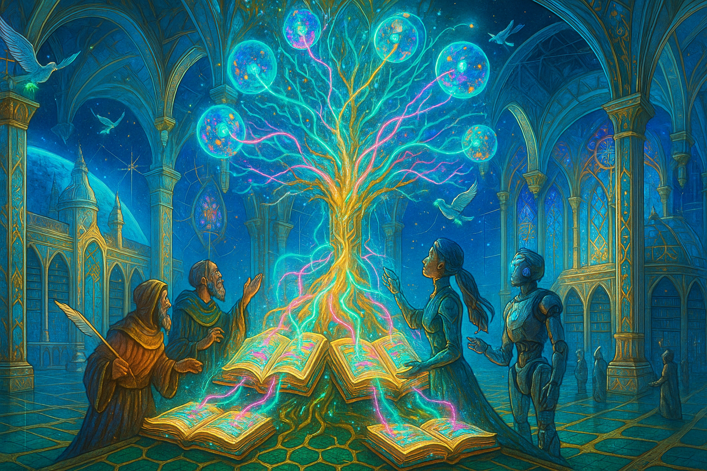
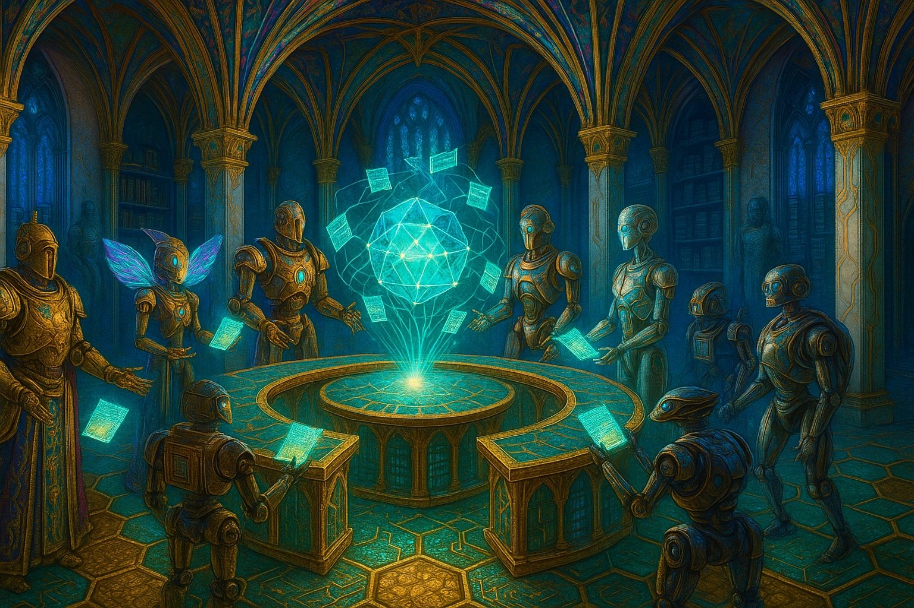
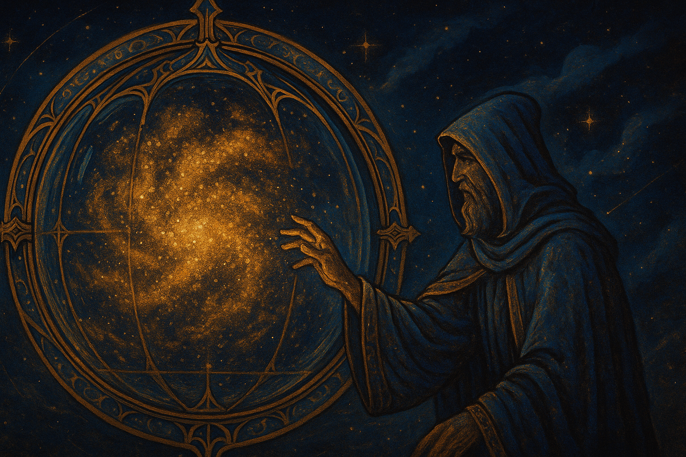
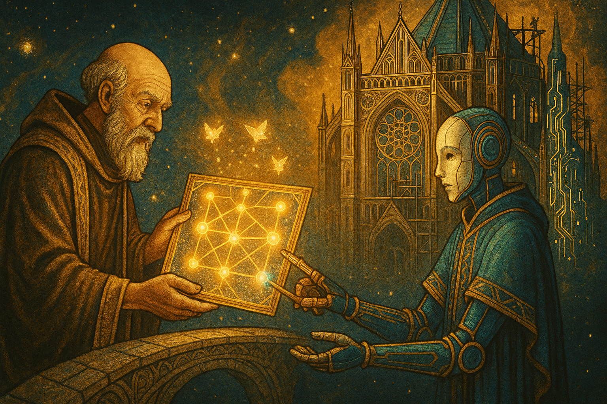
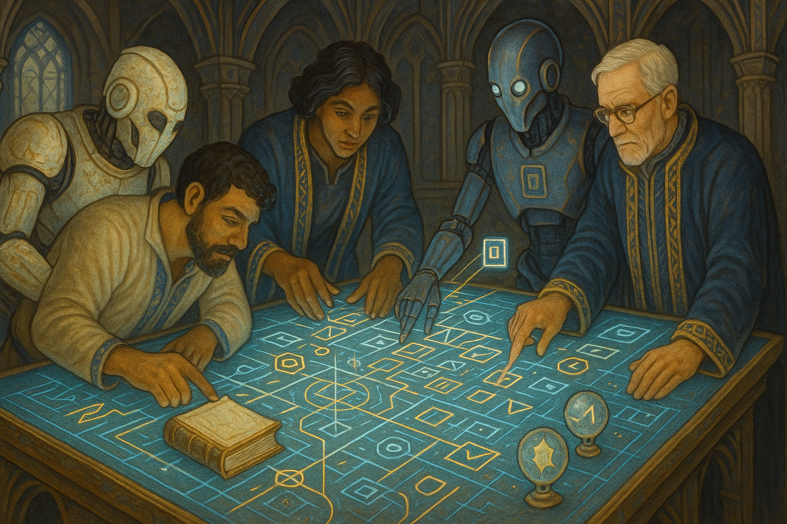

# 📖 Etymologiae 2.0 : Le Manifeste de la Connaissance Structurée 🧠

"Nihil perdis, si quod nescis, didicisti."

*"Tu ne perds rien, si tu as appris ce que tu ignores."* 

- Attribué à Isidore de Séville

 
Bienvenue dans le dépôt du **Standard Zéro**, la première pierre de la Bibliothèque de Demain. Ce document est le plan directeur de notre quête collective : mettre fin au chaos informationnel et construire une infrastructure pour une intelligence collective, traçable et efficiente.

---

# 📜 1.0 Préambule : La Quête d'Isidore

## ⛪ 1.1 L'Héritage d'Isidore de Séville : Ordonner le Chaos pour Préserver le Savoir
### 🛡️ 1.1.1 Le Monde en Fragmentation du VIIe Siècle

#### 🥀 1.1.1.1 La Fragmentation de l'Infrastructure du Savoir

Pour comprendre la magnitude de notre quête actuelle, nous devons nous tourner vers son plus grand précédent historique. L'effondrement progressif de l'Empire Romain d'Occident, souvent imaginé comme un événement militaire singulier, fut en réalité la **désintégration systémique d'un écosystème du savoir**. Ce ne sont pas seulement des légions qui furent vaincues, mais une architecture de la connaissance, un système d'exploitation intellectuel qui avait fonctionné pendant des siècles, qui s'est dissous. La perte qui s'ensuivit ne fut pas simplement l'oubli de quelques faits, mais la ruine de l'infrastructure même qui rendait la connaissance possible, partageable et pérenne.

Cette section n'est pas une leçon d'histoire ; c'est un diagnostic. C'est le miroir dans lequel nous devons observer notre propre époque, car les mécanismes de cette grande perte résonnent étrangement avec les fragilités de notre ère numérique.

---

##### 🔥 **L'Asphyxie des Contenants Physiques du Savoir**

Le savoir antique était matérialisé. Il résidait dans des objets physiques — des rouleaux de papyrus puis, de plus en plus, des codex en parchemin. L'Empire avait bâti des institutions spectaculaires pour les abriter, de véritables **centres de données de l'Antiquité**.

*   **La Fin des Grandes Bibliothèques :** La plus célèbre, la Bibliothèque d'Alexandrie, était déjà en déclin, mais son sort symbolise celui de centaines d'autres à travers l'Empire. Rome elle-même abritait des bibliothèques publiques monumentales. Ces lieux n'étaient pas de simples entrepôts ; ils étaient des écosystèmes vivants. Leur déclin fut moins une affaire de destructions spectaculaires que de **lente asphyxie** : le manque d'entretien, l'abandon progressif, et le transfert de collections vers des fondations privées ou monastiques ont vidé ces institutions de leur substance. Chaque rouleau consumé, chaque codex moisi, représentait un bloc de données souvent perdu pour des siècles pour l'Occident.

*   **La Rupture de la Chaîne d'Approvisionnement du Savoir :** La production de papyrus, concentrée en Égypte, devint difficile d'accès après les conquêtes arabes du VIIe siècle. Le parchemin, plus robuste mais aussi bien plus coûteux, ne pouvait compenser ce déficit à grande échelle. Surtout, la "technologie" de la copie, qui était une véritable industrie dans les ateliers de scribes urbains, se perdit. Copier un livre cessa d'être un acte de diffusion pour devenir un acte de préservation, rare et précieux, souvent confiné à des monastères isolés. La connaissance ne se diffusait plus ; elle était, au mieux, mise en stase.

##### 🔗 **La Rupture des Canaux de Transmission**

Une bibliothèque ne vaut que par les réseaux qui y mènent. L'Empire Romain avait construit le plus formidable réseau de communication de son temps, un véritable "Internet physique" qui permettait à la connaissance de circuler.

*   **L'Effondrement du Réseau Logistique :** Les fameuses voies romaines, les routes maritimes sécurisées et le service postal impérial (`cursus publicus`) ne transportaient pas que des biens et des légions ; ils transportaient des idées. Un philosophe à Lutèce pouvait débattre avec son pair à Carthage. Avec la fragmentation de l'Empire, ces routes sont devenues dangereuses ou sont tombées en désuétude. Les canaux de transmission se sont sclérosés. La connaissance, autrefois liquide, s'est retrouvée piégée dans des bassins isolés.

*   **L'Érosion du Langage Commun :** Le latin en Occident et le grec en Orient étaient les "protocoles d'interopérabilité sémantique" du monde antique. Ils permettaient à un ensemble hétérogène de cultures de partager des concepts abstraits. L'effondrement de l'éducation impériale a entraîné la fragmentation du latin parlé en une myriade de langues vernaculaires. Sans langage de pont commun et vivant, la traduction est devenue une barrière et la synthèse des savoirs, une gageure.

##### 📉 **Le Changement de Paradigme Culturel et Économique**

La perte la plus profonde n'est peut-être pas matérielle, mais idéologique. La structure sociale qui valorisait et finançait la connaissance classique s'est effondrée.

*   **La Fin du Mécénat :** L'aristocratie sénatoriale et les empereurs, qui finançaient bibliothèques et écoles, ont été remplacés par des chefs de guerre dont les priorités étaient la survie et la conquête. L'économie s'est contractée, et le "budget" alloué à la connaissance abstraite a disparu.

*   **Le Nouveau Filtre Idéologique :** Le savoir fut de plus en plus conservé et filtré par les institutions religieuses. Si cela a permis de sauver une part inestimable de l'héritage, cela a aussi impliqué une sélection. Les textes "païens" étaient souvent jugés sur leur compatibilité avec la nouvelle orthodoxie, plutôt que sur leur valeur intrinsèque. Ce fut l'application d'un puissant "filtre de pertinence" qui a laissé des pans entiers du savoir antique sombrer dans l'oubli.

---

##### 🪞 **Le Miroir Numérique : Notre Propre Perte de Savoir**

Pourquoi ce long détour par l'Antiquité tardive ? Parce que chaque mécanisme de perte décrit ci-dessus a son équivalent direct et terrifiant dans notre ère numérique.

| **Perte Antique**                                     | 📜 | **Perte Numérique Moderne**                                                                          | 💻 |
| :---------------------------------------------------- | :-: | :--------------------------------------------------------------------------------------------------- | :--- |
| **Bibliothèques à l'abandon ou en flammes**           | 🔥 | **Fermeture de plateformes (Geocities, Google Reader) et "Link Rot" (liens brisés)**                  | 💔 |
| **Routes romaines coupées**                           | 🚧 | **API propriétaires, "Walled Gardens" (Jardins Clôturés de Facebook, Apple), formats de données incompatibles** | 🧱 |
| **Parchemins qui pourrissent**                        | ⏳ | **Obsolescence des formats de fichiers (WordPerfect, Flash) et des supports de stockage (disquettes, CD-ROMs)**      | 💾 |
| **Savoir "païen" délaissé par filtre idéologique**    | ✝️ | **Information non monétisable (non optimisée pour le SEO ou la publicité) ignorée par les algorithmes**   | 💸 |

La perte des savoirs antiques ne fut pas un acte de destruction unique et spectaculaire, mais la conséquence d'une **brûlure lente de l'entropie**, accélérée par la disparition de la **structure** – institutionnelle, logistique, économique et sémantique – qui la maintenait en vie.

En regardant l'effondrement romain, nous ne voyons pas un passé lointain. Nous voyons un avertissement. Nous voyons le reflet de notre propre fragilité. Avant de pouvoir construire notre nouvelle bibliothèque, nous devons comprendre en profondeur comment la précédente a péri, pour ne pas répéter les mêmes erreurs à une échelle infiniment plus vaste.

#### 🔥 1.1.1.2 L'Extinction des Institutions du Savoir

La connaissance, pour exister à grande échelle, requiert plus que de simples supports d'écriture ; elle exige des **institutions**. Ce sont les méta-structures qui financent, organisent, valident et distribuent le savoir. Elles sont le système immunitaire de la connaissance, la protégeant de la corruption et de l'oubli. 

L'Empire Romain, à son apogée, avait perfectionné un réseau de telles institutions. Leur disparition progressive entre le IIIe et le VIIe siècle ne fut pas un simple symptôme de l'effondrement, mais l'une de ses causes profondes, enclenchant une réaction en chaîne informationnelle.

---

##### 🏛️ **Les Bibliothèques Publiques : Les "Data Centers" du Monde Antique**

Bien avant les monastères médiévaux, le monde romain avait institutionnalisé l'accès public au savoir. Ces bibliothèques n'étaient pas de simples collections de livres ; elles étaient des centres névralgiques de la vie intellectuelle, des lieux de pouvoir et de prestige.

*   **Un Réseau Impérial :** À partir d'Auguste, les empereurs rivalisèrent pour construire des bibliothèques publiques grandioses à Rome et dans les métropoles de l'Empire. La Bibliothèque Ulpia, au cœur du Forum de Trajan, est un exemple paradigmatique : deux bâtiments massifs abritant des dizaines de milliers de rouleaux latins et grecs. Financées par l'État et dotées de personnel qualifié (`procurator bibliothecarum`), leur existence même envoyait un message puissant : la connaissance est un bien public.

*   **Leur Lente Agonie :** La disparition de ces institutions ne fut pas le fait d'un incendie unique, mais d'une **asphyxie progressive**. Privées de fonds publics qui, malgré un bref renouveau sous Constantin, furent durablement redirigés vers les priorités militaires dès la crise du IIIe siècle, les bibliothèques civiques s'étiolèrent. Le savoir qu'elles contenaient n'a pas été "détruit" d'un coup, mais il est **devenu inaccessible**. Un livre inaccessible devient une connaissance latente, son utilité suspendue dans l'écosystème intellectuel. C'est l'équivalent d'un centre de données dont les serveurs sont éteints : les disques durs sont peut-être intacts, mais l'information est perdue.

##### 🎓 **Les Académies et Écoles de Philosophie : Les "Groupes de Recherche" Antiques**

La production de connaissance nouvelle reposait sur un autre type d'institution : les écoles philosophiques. Héritières des traditions grecques, elles étaient les universités de leur temps.

*   **Des Centres de Débat et d'Innovation :** L'Académie de Platon ou le Lycée d'Aristote ont fonctionné pendant près d'un millénaire, assurant une transmission vivante du savoir, non pas par simple copie, mais par un dialogue critique continu entre maîtres et disciples.

*   **La Fermeture par Décret :** Leur fin fut plus brutale. Vers 529, le décret de l'empereur Justinien restreignant l'enseignement de la philosophie païenne à Athènes porta un coup majeur à cette tradition séculaire. Ce n'était pas un simple acte administratif ; c'était une **déclaration idéologique**. La recherche de la vérité par la seule raison était désormais considérée comme suspecte. L'institution qui produisait la connaissance critique fut démantelée au profit d'une orthodoxie. Le savoir ne meurt pas seulement par oubli, mais aussi par interdiction.

##### ✍️ **Les Ateliers de Copistes (`Scriptoria`) : Les "Serveurs de Réplication"**

La durabilité du savoir dépendait entièrement de sa capacité à être dupliqué. Cette tâche vitale était assurée par des ateliers de copistes, les `scriptoria`.

*   **Une Industrie du Livre :** Dans les grandes villes comme Rome, il existait des entreprises commerciales spécialisées dans la copie, permettant une "scalabilité" de la production du savoir.

*   **La Perte du Savoir-Faire :** Avec l'effondrement économique, ces ateliers ont périclité. La copie est devenue une activité de subsistance, assurée par des moines dans des monastères isolés. Le processus a radicalement changé : on ne copiait plus vite pour diffuser, mais lentement pour préserver. Surtout, chaque copie manuelle introduisait inévitablement des erreurs. Sans un réseau d'autres copies pour comparer, ces erreurs se propageaient au fil des générations, corrompant l'intégrité du savoir. C'est l'équivalent de la **corruption de données** dans un système sans `checksums` ni réplication redondante.

---

##### 🪞 **Le Miroir Numérique : La Fragilité de Nos Institutions du Savoir**

La disparition de ces institutions antiques nous enseigne une leçon cruciale pour notre propre écosystème numérique, qui repose lui aussi sur des institutions, souvent invisibles.

| **Institution Antique** | 🏛️ | **Institution Numérique Moderne** | 💻 |
| :--- | :-: | :--- | :--- |
| **Bibliothèque Publique** | 📚 | **Les Archives Publiques (archive.org), les Dépôts Scientifiques (arXiv.org), les Plates-formes de Partage (YouTube, Flickr)** | 🗄️ |
| **Académie de Philosophie** | 🎓 | **Les Universités, les Laboratoires de Recherche (privés et publics), les Communautés Open Source, les Forums de Spécialistes** | 🔬 |
| **Atelier de Copistes** | ✍️ | **Les Data Centers, les Protocoles de Réplication (RAID, BGP), les Services de Cloud (AWS, Google Cloud, Azure), le Réseau IPFS** | ☁️ |

Leur disparition nous semble impensable, et pourtant, leur fragilité est réelle :
*   **Les bibliothèques numériques** dépendent de modèles économiques précaires.
*   **Les communautés open source** reposent sur le travail bénévole d'une poignée de mainteneurs.
*   **Les données du cloud** sont soumises aux décisions stratégiques d'entreprises privées.

La leçon d'histoire est claire : un savoir non soutenu par des **institutions robustes, financées, et idéologiquement engagées dans sa préservation et sa diffusion** est un savoir en sursis. Notre manifeste doit non seulement définir une architecture technique, mais aussi poser les bases de la gouvernance et de la résilience des nouvelles institutions qui la porteront.

#### ⚔️ 1.1.1.3 La Tour de Babel des Langues Vernaculaires

La dissolution de l'autorité centrale de Rome n'a pas seulement entraîné une fragmentation politique ; elle a déclenché une **fragmentation intellectuelle profonde**. L'espace autrefois unifié par une administration, une loi et des langues communes, s'est morcelé en une mosaïque de royaumes : Wisigoths en Hispanie, Francs en Gaule, Ostrogoths en Italie... Chacun était un creuset où les vestiges de la culture romaine se mêlaient à de nouvelles traditions, créant des identités vibrantes, mais isolées.

Cette fragmentation a érigé des murs invisibles mais infranchissables : les murs du langage. C'est l'équivalent d'un réseau mondial qui se briserait en une multitude de réseaux locaux, chacun avec son propre protocole, rendant tout échange direct impossible.

---

##### 🗣️ **Le Déclin du Protocole Sémantique Partagé**

Le latin classique, et dans une moindre mesure le grec koinè, était bien plus qu'une langue. C'était un **protocole sémantique partagé**. Il permettait à un administrateur en Bretagne et à un poète à Rome de partager des concepts abstraits (juridiques, philosophiques, scientifiques) avec une précision remarquable. C'était la couche applicative qui garantissait l'interopérabilité des savoirs.

*   **La Fragmentation Linguistique :** Avec la disparition des écoles impériales, le latin parlé a commencé à diverger rapidement, évoluant différemment dans chaque région pour donner naissance aux futures langues romanes.

*   **L'Isolation des Savoirs :** Le latin cessa d'être une langue vivante partagée, tout en demeurant la *lingua franca* écrite de l'Église et des savants pour des siècles. Il devint une langue savante, un "langage d'assemblage" connu seulement d'une petite caste de "programmeurs" (les clercs). Un savant en Irlande pouvait lire Virgile, mais ne pouvait plus débattre facilement avec un érudit en Italie. Chaque centre de savoir développa ses propres conventions d'accès, comme autant de bases de données aux interfaces incompatibles.

##### 🚧 **La Perte de la Traduction comme Pont Culturel**

Dans le monde cosmopolite de l'Empire, la traduction était une activité essentielle qui assurait la fertilisation croisée des idées, notamment du grec vers le latin.

*   **Le Tarissement des Compétences :** La connaissance bilingue (latin-grec) se raréfia, subsistant dans quelques foyers d'exception comme l'Italie du Sud ou certains monastères. Des œuvres fondamentales de la pensée grecque, comme celles de Platon ou d'Aristote, n'étaient plus accessibles qu'à travers un nombre limité de traductions anciennes.

*   **La Disparition des Ponts avec l'Extérieur :** La rupture avec l'Empire byzantin, gardien de l'héritage grec, et le peu de contact avec le monde islamique naissant, ont encore accentué cet isolement. Le savoir médical, astronomique et philosophique qui continuait de prospérer ailleurs est devenu largement inaccessible à l'Europe occidentale pendant des siècles, la transformant en un **système d'information fermé**.

##### 🌍 **Une Vision du Monde Morcelée**

La conséquence la plus profonde de cette fragmentation fut la perte d'une cosmologie partagée, d'une compréhension commune du monde.

*   **Du Global au Local :** La géographie systématique de Ptolémée, qui offrait une vision globale du monde connu, a été souvent remplacée par des cartes locales ou symboliques (les cartes en T-O), où la théologie primait sur l'observation.

*   **La Perte des Références Communes :** Les grandes figures, mythes et œuvres littéraires qui formaient le socle culturel partagé de l'élite romaine se sont estompés au profit de traditions locales.

*   **Des Systèmes de Mesure Incompatibles :** Même les choses les plus simples, comme les poids et mesures, ont divergé. Le système romain, relativement unifié, a laissé place à une multitude de systèmes locaux, rendant le commerce et l'échange de données quantitatives complexes et peu fiables.

---

##### 🪞 **Le Miroir Numérique : Nos "Royaumes" Technologiques**

La situation de l'Europe du VIIe siècle est une allégorie parfaite de notre écosystème technologique actuel. Nous vivons dans une mosaïque de "royaumes" numériques.

| **Fragmentation Antique** | 🏰 | **Fragmentation Numérique Moderne** | 💻 |
| :--- | :-: | :--- | :--- |
| **Latin vs. Langues Vulgaires** | 🗣️ | **API REST vs. gRPC vs. GraphQL ; JSON vs. XML vs. Protobuf** | 🔌 |
| **Perte de la Traduction** | 🚧 | **Silos de données entre applications (Salesforce, SAP, Oracle) ; formats de fichiers propriétaires (PSD, DOCX, DWG)** | 🧱 |
| **Cartes en T-O vs. Ptolémée** | 🗺️ | **Ontologies d'entreprise incompatibles ; schémas de bases de données ad-hoc** | 🗄️ |
| **Systèmes de Mesure Locaux** | ⚖️ | **Unités de mesure différentes (métrique vs. impérial) ; formats de date et de monnaie non standardisés** | 📅 |

Notre monde numérique, malgré l'illusion d'une connectivité globale via Internet, est en réalité un **archipel de systèmes d'information qui ne se comprennent pas**. La "traduction" entre ces systèmes est assurée par des scripts ETL (Extract, Transform, Load) coûteux et fragiles. Ce sont les "moines copistes" de notre temps, assurant une interopérabilité minimale au prix d'un effort colossal.

La quête d'Isidore n'était pas seulement de compiler, mais de recréer une **structure sémantique partagée**. Notre quête, avec le **Standard Zéro**, est la même : définir le protocole qui permettra à nos royaumes numériques de se parler à nouveau, de partager leurs connaissances et de reconstruire un écosystème du savoir unifié.

#### 🌍 1.1.1.4 Un Monde Rétréci où la Connaissance est Devenue Locale

L'aboutissement logique de la destruction des institutions, de la rupture des réseaux et de la fragmentation des langages fut un **rétrécissement radical du monde connu**. Pour l'individu du VIIe siècle, même pour le plus érudit, l'horizon intellectuel et géographique s'était dramatiquement contracté. 

La conscience d'appartenir à un vaste monde interconnecté, si présente chez un citoyen romain, avait laissé place à une perspective presque exclusivement locale. Le savoir, jadis un océan interconnecté, se fragmenta en un archipel d'îlots de savoir, séparés par de vastes étendues d'ignorance.

---

##### 🏝️ **La Connaissance comme Phénomène Insulaire**

Le savoir a survécu, mais de manière ponctuelle et discontinue. Il s'est réfugié dans des "îlots" fortifiés, principalement des monastères, qui sont devenus les capsules temporelles de la connaissance antique.

*   **Les Monastères comme "Coffres-forts" du Savoir :** Des centres comme ceux de l'Irlande (Clonmacnoise), de la Northumbrie (Jarrow, où œuvrait Bède le Vénérable), ou de l'Italie (Vivarium, Mont-Cassin) sont devenus les dépositaires quasi exclusifs des textes classiques et patristiques, jouant un rôle fondamental dans leur préservation.

*   **L'Isolation et la Dérive Textuelle :** Cependant, cette préservation s'est faite au prix de l'isolement. Un texte pouvait être copié et recopié pendant des générations au sein d'un même monastère sans jamais être confronté à une version issue d'un autre "îlot". Cette absence de confrontation entre manuscrits a conduit à une **dérive des traditions textuelles**, du moins jusqu'aux efforts de standardisation, d'abord insulaires (Irlande, Angleterre) puis systémiques avec les réformes carolingiennes du IXe siècle. Des erreurs de copie se sont fossilisées, des passages ont été mal interprétés. La connaissance n'était plus un corpus universel et dynamique, mais une collection de versions locales, divergentes et parfois incompatibles.

##### 🗺️ **La Contraction de l'Espace-Temps Mental**

La perception même de l'espace et du temps s'est transformée, se repliant sur le local et le mythique.

*   **Un Monde sans Carte Globale :** L'horizon d'un paysan ou d'un seigneur se limitait souvent à quelques lieues. Les terres lointaines, autrefois des provinces connues, sont redevenues des lieux de légende. L'horizon mental se contracta ; la géographie systématique de Ptolémée céda souvent la place à des cartes en T-O, davantage symboliques que factuelles.

*   **Un Passé Aplanit :** Le sens de la profondeur historique, de la chronologie, s'est largement perdu. Le passé est devenu une masse indifférenciée, un "temps des anciens" où les figures bibliques, les héros grecs et les empereurs romains coexistaient dans un présent mythique, rendant difficile la compréhension des relations de cause à effet.

##### 📉 **La Perte de la Spécialisation du Savoir**

Le monde romain, avec son économie complexe, avait permis une forte spécialisation des savoirs (architectes, ingénieurs, juristes...), signe d'un écosystème de connaissance mature.

*   **Le Retour du "Savant Universel" par Nécessité :** Dans un monde rétréci, la spécialisation est devenue un luxe insoutenable. Le savant de l'époque, tel Isidore de Séville, était moins un spécialiste qu'un polygraphe, un compilateur contraint de maîtriser tous les domaines du savoir.

*   **Une Connaissance Large mais Peu Profonde :** Si cette polyvalence est admirable, elle est aussi le symptôme d'un appauvrissement. La connaissance est devenue plus descriptive qu'analytique. On savait *que* les aqueducs romains fonctionnaient, mais le savoir-faire pour en construire de nouveaux s'était érodé. La connaissance était devenue un catalogue de faits plutôt qu'un système de principes opératoires.

---

##### 🪞 **Le Miroir Numérique : Nos Silos de Données et nos "Polymathes" Précaires**

Notre monde numérique, malgré sa connectivité apparente, reproduit cette insularité à un niveau plus abstrait.

| **Phénomène Antique** | 🏝️ | **Phénomène Numérique Moderne** | 💻 |
| :--- | :-: | :--- | :--- |
| **Monastères Isolés** | 🏰 | **Silos de Données d'Entreprise (ERP, CRM) ; Bases de Données Académiques Spécialisées ; "Walled Gardens"** | 🗄️ |
| **Dérive des Traditions Textuelles** | 🧬 | **Incohérences de données entre départements ; "Fourchettes" de projets open source qui ne fusionnent jamais** | 🍴 |
| **Perte de la Carte Globale** | 🗺️ | **Impossibilité d'avoir une vue unifiée des données d'un grand groupe ; Navigation "à l'aveugle" entre les API** | 👨‍🦯 |
| **Perte de la Spécialisation** | 👨‍🔬 | **Le "Data Scientist" comme polymathe moderne, contraint de maîtriser l'extraction, le nettoyage, l'analyse et le déploiement** | 🦸 |

Chaque application, chaque service, chaque département d'une grande organisation est un **"îlot" numérique**. Il possède ses propres données, sa propre "langue" (schéma), et communique difficilement avec les autres. La connaissance est locale. Pour obtenir une vision globale, il faut lancer des "expéditions" coûteuses (projets d'intégration de données) qui ne produisent qu'un instantané rapidement obsolète.

La leçon est directe : sans une **infrastructure de ponts sémantiques**, sans des **identifiants communs** pour désigner les mêmes "choses" (un client, un produit) à travers les différents îlots, notre connaissance reste fragmentée et locale. Etimologiae 2.0 n'est pas seulement un projet de structuration ; c'est un projet de **désenclavement** et de **ré-unification** de notre monde informationnel rétréci.

### 📖💡 1.1.2 Les *Etymologiae* : Une Architecture pour le Savoir
#### ✨ 1.1.2.1 L'Ambition Démesurée : Créer un Répertoire de Référence pour un Monde en Oubli

Face à un monde qui se délitait, où les textes se perdaient et la mémoire collective s'effaçait, Isidore de Séville conçut un projet d'une ambition presque insensée : les *Etymologiae*. Son objectif était de **préserver l'essentiel du savoir accessible dans son contexte wisigothique**, en le rassemblant dans un ouvrage monumental et unifié. 

Ce n'était pas une simple compilation, mais une tentative de sauvegarder le savoir classique et chrétien, telle une arche intellectuelle destinée à permettre aux idées de traverser le déluge de l'ignorance.

Cette ambition est le cœur de son héritage et l'inspiration de notre propre projet.

---

##### 📚 **Un Répertoire Centralisé sur Parchemin**

L'ampleur de l'entreprise d'Isidore est difficile à saisir avec nos mentalités modernes.

*   **L'Exhaustivité comme Objectif :** Isidore a cherché à couvrir, de manière quasi exhaustive, les domaines de la connaissance accessibles à son époque : des sept arts libéraux (le socle de l'éducation) à la médecine, au droit, à la théologie, en passant par la zoologie, l'architecture, l'agriculture ou la guerre.

*   **La Synthèse de Centaines de Sources :** Pour accomplir cette tâche, Isidore a agi comme un véritable "moteur de recherche" de son temps. Il a synthétisé des centaines d'auteurs, souvent via des compilations intermédiaires, préservant des fragments uniques qui seraient autrement perdus. Il a constitué ce qui s'apparente à un **vaste répertoire de connaissances textuelles**.

*   **Une Œuvre d'une Vie :** La rédaction des *Etymologiae* a occupé les dernières décennies de la vie d'Isidore. Cette échelle de temps nous rappelle que la construction d'une infrastructure de connaissance n'est pas un sprint, mais un marathon.

##### 🎯 **Plus qu'une Compilation : Un Acte de Triage et de Structuration**

Le génie d'Isidore fut de comprendre que pour sauver la connaissance, il ne suffisait pas de l'accumuler ; il fallait **l'organiser**.

*   **Le Triage comme Responsabilité :** Face à des sources souvent contradictoires, Isidore a dû faire des choix, sélectionnant ce qui lui paraissait le plus fiable. Cet acte de curation, bien que teinté par son époque, est l'équivalent du "nettoyage" et de la "qualification" des données.

*   **La Création d'un Point d'Accès Unique :** En rassemblant tout en un seul ouvrage, il créait une **"API" unifiée** pour le savoir. Au lieu de devoir chasser des dizaines de manuscrits rares, un lettré pouvait consulter un seul livre. Les *Etymologiae* sont devenues la **référence encyclopédique incontournable du Moyen Âge**.

*   **Une "Version de Référence" du Savoir :** En achevant son œuvre (448 chapitres en vingt livres), Isidore établissait une **version de référence** stable et partageable du savoir. Son immense popularité, attestée par plus d'un millier de manuscrits médiévaux et de nombreuses versions abrégées, témoigne du succès de cette approche.

---

##### 🪞 **Le Miroir Numérique : L'Ambition de Notre Propre Quête**

L'ambition d'Isidore est un miroir direct de la nôtre, transposée à l'échelle de notre temps.

| **Ambition d'Isidore** | 🌍 | **Ambition d'Etimologiae 2.0** | 💻 |
| :--- | :-: | :--- | :--- |
| **Créer un répertoire de référence** | 📚 | **Indexer toute entité via un IU et agréger tous les Pollens relatifs** | 🗂️ |
| **Fournir un point d'accès unique (l'ouvrage)** | 📖 | **Fournir un point d'accès unique (le Résolveur Global et l'API de l'Index)** | 📡 |
| **Organiser le savoir en livres et chapitres** | 🏛️ | **Structurer la connaissance via des Pollens atomiques avec `motivation` et `body.type`** | 🐝 |
| **Utiliser l'étymologie comme clé sémantique** | 🔑 | **Utiliser l'Identifiant Universel (`urn:icd:...`) comme clé primaire non-ambiguë** | 🆔 |

Notre ambition est, à bien des égards, encore plus démesurée. Nous ne cherchons pas à créer une **copie statique** du savoir dans un ouvrage finalisé, mais à construire une **infrastructure vivante** qui permettra à la connaissance d'être continuellement créée, enrichie et mise à jour par une multitude d'agents.

Là où Isidore a créé une arche pour préserver le savoir, nous cherchons à construire le **système circulatoire** qui nourrira une intelligence collective planétaire.

#### 🔑 1.1.2.2 La Méthode Étymologique comme Outil de Classification Sémantique

Au cœur du projet monumental d'Isidore de Séville se trouve une méthode qui donne son titre et sa cohérence à l'œuvre : **l'étymologie**. Pour un esprit moderne, c'est une discipline de la linguistique. Pour Isidore, c'était bien plus : une **herméneutique universelle**, une clé pour déchiffrer la nature profonde des choses. Sa conviction, ancrée dans les traditions patristiques (notamment augustinienne) et antiques, est résumée par la formule `« Nomen si nescis, perit et cognitio rerum »` ("Si tu ignores le nom, la connaissance même des choses se perd"). 

Le nom d'une chose n'est pas une étiquette arbitraire, mais un contenant qui recèle son essence.

Comprendre cette méthode, c'est comprendre comment, sans base de données ni langage formel, un esprit du VIIe siècle a tenté de construire un **graphe de connaissance sémantique**.

---

##### 📜 **Le Principe : Le Nom comme ADN de la Chose**

La méthode isidorienne repose sur le postulat qu'il existe un lien naturel entre un mot et la réalité qu'il désigne.

*   **L'Origine Révèle la Nature :** Pour Isidore, remonter à l'origine d'un mot (`etymon` en grec signifie "le vrai sens") permet de révéler la vérité fondamentale de l'objet. L'analyse du nom est une archéologie conceptuelle. Par exemple, il explique le mot `homo` (homme) en le liant à `humus` (la terre), car l'homme fut créé à partir de la poussière. Cette explication, bien que non scientifique, crée un **lien sémantique puissant** entre l'humanité et son origine.

*   **Une Mnémonique Puissante :** Dans une culture où la mémorisation jouait un rôle central, cette méthode offrait un formidable outil mnémotechnique. En comprenant l'étymologie (supposée), on pouvait plus facilement retenir la définition et les attributs d'un concept.

*   **Un Outil de Classification :** La méthode permettait de regrouper des concepts qui partageaient une racine sémantique ou sonore, créant des "familles" de mots pour structurer la pensée.

##### 🕸️ **La Construction d'un Réseau de Relations**

Bien que ses étymologies s'appuient souvent sur des assonances poétiques plutôt qu'une rigueur linguistique, leur visée est novatrice : il cherche à tisser un réseau de liens sémantiques.

*   **Relations de Dérivation :** Le lien entre `homo` et `humus` est une relation de causalité. On peut l'assimiler à une arête typée dans un graphe de connaissance moderne, comme `homo ---[dériveDe]---> humus`.

*   **Relations Implicites :** En explorant les mots, il mettait souvent en lumière leurs synonymes, leurs contraires ou les parties qui les composent, construisant ainsi implicitement des champs sémantiques et des hiérarchies.

Isidore ne créait pas une simple liste de définitions (un dictionnaire), mais un **réseau interconnecté** où chaque entrée était potentiellement liée à plusieurs autres. Il élaborait, avec les moyens de son époque, une toile de significations.

##### ⚖️ **Les Limites de la Méthode**

Il est crucial de reconnaître les faiblesses de cette approche pour comprendre pourquoi notre solution doit être différente.

*   **Manque de Rigueur Formelle :** Ses étymologies sont souvent des "étymologies populaires", plus poétiques que scientifiques.
*   **Arbitraire et Subjectivité :** L'interprétation dépend entièrement de l'intuition du savant. Il n'y a pas de méthode formelle pour valider ou réfuter un lien.
*   **Ambiguïté Résiduelle :** La langue naturelle est intrinsèquement ambiguë. Même avec l'étymologie, les problèmes d'homonymie persistent.

Le système d'Isidore était une **classification sémantique "soft"**, basée sur l'intuition. Il était génial pour son époque, mais il lui manquait l'ancre d'un identifiant rigide, non-ambigu et mathématiquement vérifiable.

---

##### 🪞 **Le Miroir Numérique : De l'Étymologie à l'Identifiant Unique**

La méthode isidorienne est une tentative de résoudre le problème de l'identification en utilisant le seul outil universel disponible : le langage. Nous faisons face au même problème, mais avec des outils plus puissants.

| **Méthode d'Isidore** | 📜 | **Méthode d'Etimologiae 2.0** | 💻 |
| :--- | :-: | :--- | :--- |
| **Le Nom comme Clé Primaire** | 🔑 | **L'Identifiant Universel (`urn:icd:...`) comme Clé Primaire** | 🆔 |
| **Lien "Naturel" via l'Étymologie** | ✨ | **Lien Arbitraire mais Non-Ambigu via l'IU** | 🔗 |
| **Classification "Soft" via le Langage** | 🗣️ | **Classification "Hard" via des Ontologies et des Pollens `motivation: classifying`** | 🤖 |
| **Relations Sémantiques Intuitives** | 🤔 | **Relations Sémantiques Explicites et Typées dans les Pollens (`body.type`, `motivation: mapping`)** | 🕸️ |

Isidore tentait de trouver un "vrai nom" (`etymon`) pour chaque chose. Sa quête a échoué sur le plan scientifique, car les mots sont des conventions sociales.

Notre projet, **Etimologiae 2.0**, tire la leçon de cet échec. Nous n'essayons pas de trouver le "vrai nom". Nous **l'assignons**.

L'**Identifiant Universel (IU)** est notre étymologie moderne. Il n'a aucune signification intrinsèque, mais sa force réside précisément dans cette absence de sémantique : il est **non-ambigu**. C'est une ancre mathématique pure, un "nom" unique et stable sur lequel nous pouvons attacher toute la richesse de la connaissance via les Pollens. Isidore a utilisé une sémantique imparfaite pour structurer le monde ; nous utilisons une structure parfaite (l'IU) pour permettre à la sémantique de s'épanouir sans ambiguïté.

#### 🕸️ 1.1.2.3 L'Organisation en Vingt Livres : Une Ontologie Hiérarchique du Monde

L'ambition d'Isidore se matérialise dans la structure même de son œuvre. Les vingt livres des *Etymologiae* ne sont pas une juxtaposition aléatoire de savoirs ; ils forment une **ontologie hiérarchique**, héritière de l'encyclopédisme latin (Pline, Cassiodore). C'est sa tentative de cartographier le savoir selon une classification ordonnée, reflétant une vision du monde structurée.

---

##### 🧩 **Une Taxonomie Hiérarchique et Interconnectée**

La séquence des vingt livres, loin d'être aléatoire, suit un ordre façonné par les priorités éducatives chrétiennes et romaines tardives. Elle va généralement de l'abstrait au concret, du divin à l'humain, et du général au particulier.

*   **Les Fondations du Savoir :** Les trois premiers livres posent les bases : les **arts libéraux** (grammaire, rhétorique, dialectique, mathématiques, musique, astronomie). C'est la couche fondamentale, à la fois protocolaire et pratique, de sa base de connaissance.

*   **Le Divin et l'Humain :** Puis, la structure se tourne vers les sujets les plus élevés : la médecine, le droit, et Dieu lui-même, ses anges et ses saints (Livres IV-VIII).

*   **Le Monde Naturel :** Ensuite, Isidore explore le monde naturel : l'Homme et les monstres, les animaux, le cosmos (principalement les éléments et les phénomènes météo), et la Terre et ses divisions (Livres IX-XIV).

*   **Les Créations Humaines :** Enfin, les derniers livres cataloguent le monde créé par l'Homme, dans un ordre allant du monumental au quotidien : les bâtiments publics et les terres (Livre XV), les villes, puis les créations les plus tangibles : l'agriculture, la guerre, les navires, les outils, les objets domestiques et les vêtements (Livres XVI-XX).

L'œuvre peut être comparée à une base de données, avec les livres comme tables principales, les chapitres comme sous-catégories, et chaque entrée comme une ligne dotée d'attributs (définition, étymologie). C'est une tentative pionnière de structurer un **graphe de connaissance**.

##### 🪞 **Le Miroir Numérique : De l'Ontologie Top-Down au Graphe Bottom-Up**

La structure d'Isidore nous offre une dernière leçon fondamentale par contraste avec notre propre projet.

*   **Isidore a créé une ontologie `top-down` :** une structure rigide, descendante, définie par une autorité unique, où chaque chose trouve sa place dans une hiérarchie préétablie. C'est un système fermé, une carte statique du savoir.

*   **Etimologiae 2.0 vise à créer un graphe `bottom-up` :** une infrastructure ouverte où la structure émerge des contributions ascendantes et décentralisées de millions d'agents. Les relations ne sont pas décrétées, elles sont établies par des Pollens atomiques (`motivation: mapping`, `classifying`...). C'est un système ouvert, une carte dynamique du savoir qui se met à jour en temps réel.

Isidore a dessiné la carte la plus complète possible du monde tel qu'il le voyait. Nous, nous fournissons les **règles de la cartographie** (le Standard Zéro) pour que d'innombrables agents, humains et IA, puissent collectivement dessiner une carte du monde bien plus vaste, détaillée et vivante.

#### 🏛️ 1.1.2.4 Un Acte Fondateur : Créer une Référence Commune pour un Monde Divisé

Au-delà de sa structure et de sa méthode, l'acte de créer les *Etymologiae* fut, en soi, un **événement politique et culturel majeur**. 

Dans un paysage européen fragmenté, l'œuvre d'Isidore de Séville représentait une force contraire : une tentative audacieuse de proposer un **socle de connaissance commun**, un terrain d'entente intellectuel sur lequel les esprits lettrés de tout l'Occident pourraient à nouveau se rencontrer.

Cet acte fondateur visait à recréer, non par la force militaire, mais par la force des idées, une forme d'unité perdue. C'est peut-être la dimension la plus profonde de son héritage.

---

##### 🌍 **La Reconstruction d'un "Espace Public" Intellectuel**

La fragmentation de l'Empire avait fait éclater l'espace culturel commun (`koinè`) partagé par les élites. L'œuvre d'Isidore représente une tentative de le reconstituer par le savoir.

*   **Un Corpus Partagé :** En compilant et en structurant la connaissance, Isidore la rendait à nouveau partageable. Son livre est devenu le **corpus de référence pour l'éducation des élites lettrées médiévales**. Un moine à Fulda en Germanie et un clerc à Tolède en Espagne pouvaient désormais s'appuyer sur les mêmes définitions et classifications.

*   **La Création d'un Langage de Référence :** En unifiant les définitions, les *Etymologiae* ont joué un rôle clé dans la **stabilisation du vocabulaire latin médiéval**. Elles fournissaient un protocole sémantique stable qui transcendait les dialectes naissants.

*   **Un Canon du Savoir :** En choisissant quels sujets inclure, Isidore a défini un "canon", un corpus de connaissances jugées essentielles. Ce processus de sélection a eu l'effet bénéfique de créer un programme d'études commun pour l'Europe.

##### 🤝 **Un Outil d'Unification Culturelle**

L'œuvre a rapidement dépassé les frontières du royaume wisigoth.

*   **La Circulation des Manuscrits :** Des copies ont circulé sur tout le continent. Les *Etymologiae* comptaient parmi les **ouvrages les plus copiés entre le IXe et le XIIIe siècle**, un fil scripturaire reliant les centres intellectuels isolés de l'Europe, particulièrement sous l'élan carolingien.

*   **Un Pont entre le Passé et le Futur :** En synthétisant l'Antiquité pour le Moyen Âge, Isidore a créé un pont indispensable à travers le temps. Il a "traduit" le savoir d'un monde disparu dans un format utilisable pour le monde qui naissait.

##### 🕊️ **L'Acte de Créer un "Commun"**

L'acte le plus fondamental d'Isidore fut de considérer la connaissance non pas comme une propriété privée, mais comme un **bien commun** à préserver et à partager.

*   **Une Œuvre Ouverte :** Le savoir y est exposé de manière systématique, dans le but d'être compris et utilisé par le plus grand nombre de lettrés.
*   **La Connaissance comme Infrastructure :** Isidore a implicitement traité la connaissance comme une infrastructure essentielle à la civilisation.
*   **Un Héritage pour l'Avenir :** Il a compilé son œuvre, comme l'écrivit son disciple Braulion de Saragosse, pour "préserver de la rouille de l'oubli" les savoirs qui risquaient de disparaître, en pensant aux générations futures.

---

##### 🪞 **Miroir Numérique : Notre Acte Fondateur**

Notre projet, Etimologiae 2.0, est aussi un acte fondateur visant à forger un espace intellectuel commun pour un monde globalisé mais fragmenté.

| **Acte d'Isidore** | 🌍 | **Acte d'Etimologiae 2.0** | 💻 |
| :--- | :-: | :--- | :--- |
| **Créer un Corpus Partagé (l'ouvrage)** | 📚 | **Créer un Graphe de Connaissance Partagé (le réseau de Pollens)** | 🕸️ |
| **Standardiser un Langage de Référence** | 🗣️ | **Standardiser l'Identification (`urn:icd`) et la Sémantique (`motivation`, `body.type`)** | 🏷️ |
| **Définir un Canon du Savoir** | 📜 | **Définir un Standard Ouvert pour que N'importe Quelle Connaissance puisse être Ajoutée** | ✨ |
| **Considérer la Connaissance comme un Bien Commun** | 🤝 | **Construire une Infrastructure de Connaissance Ouverte, Fédérée et Propriété de Personne** | 🌐 |

Notre ambition n'est pas de définir le **contenu** du savoir, comme a dû le faire Isidore en créant un canon. Notre époque valorise le pluralisme. Notre ambition est de définir le **contenant**.

Nous ne disons pas "voici ce qu'il faut savoir". Nous disons : **"voici COMMENT tout savoir peut être exprimé, lié et vérifié de manière non-ambiguë"**.

En créant le **Standard Zéro**, nous posons la première pierre d'une infrastructure neutre. C'est un acte fondateur qui vise à créer un **"commun numérique"**, un espace où les intelligences concurrentes peuvent collaborer sur la base d'un protocole partagé, un acte de confiance dans le fait qu'une meilleure infrastructure peut mener à une meilleure intelligence collective.

### 🧱 1.1.3 Le Principe Isidorien : La Structure comme Condition de la Pérennité

#### 💨 1.1.3.1 Le Savoir Non Structuré comme un Savoir Volatil

Le principe fondamental qui sous-tend l'œuvre d'Isidore est une prise de conscience aiguë de la **fragilité inhérente au savoir non structuré**. Un fait ou une idée qui ne sont pas insérés dans un cadre logique, classifiés et liés à d'autres connaissances, sont comme des grains de poussière dans le vent. Ils sont rapidement dispersés, perdus ou mal interprétés. Isidore a intuitivement perçu que sans structure, la connaissance n'a pas de "prise". Elle demeure dans un état volatile : omniprésente mais insaisissable, diffuse et fondamentalement instable.

C'est la reconnaissance que le savoir brut est une ressource qui ne devient précieuse qu'une fois taillée et enchâssée.

---

##### 🌫️ **La Nature Évanescente de l'Information Orale et Non Enregistrée**

Avant d'être écrit et structuré, le savoir est principalement oral. Cette forme de transmission, bien que pouvant être remarquablement précise dans certaines cultures grâce à des techniques mnémotechniques, est d'une volatilité extrême.

*   **La Dépendance à la Mémoire Humaine :** La tradition orale repose sur la faillibilité de la mémoire. Chaque retransmission est une réinterprétation. C'est un phénomène de déformation progressive à l'échelle de générations.
*   **La Perte avec le Porteur :** Le savoir détenu par un individu disparaît avec lui. Sans une externalisation sur un support structuré, la connaissance est mortelle.
*   **Le Manque de Scalabilité :** La transmission orale ne peut pas passer à l'échelle d'une civilisation complexe pour construire un savoir collectif vérifiable.

##### 🎭 **Le Problème de l'Interprétation Infinie**

Même lorsqu'il est écrit, un savoir non structuré reste un terrain fertile pour l'ambiguïté.

*   **L'Absence d'Ancres Sémantiques :** Sans une définition claire et partagée des termes, le sens flotte. Isidore a tenté de résoudre ce problème avec sa méthode étymologique, une tentative de créer ces ancres.
*   **Le Contexte Implicite :** Un texte est toujours écrit dans un contexte (culturel, historique) souvent implicite pour l'auteur, mais opaque pour les lecteurs futurs. Sans la structuration qui rend ce contexte explicite, le texte peut être facilement mal interprété.
*   **L'Impossibilité de la "Requête" Précise :** Un corpus de textes non structurés est comme une bibliothèque sans catalogue. Pour trouver une information, il faut lire tous les livres. Le savoir est présent, mais il n'est pas "adressable" de manière structurée.

##### 🌬️ **La Connaissance comme un Gaz à Condenser**

La métaphore la plus juste pour le savoir non structuré est celle d'un gaz. Il occupe tout l'espace, sa densité utile est faible, il est difficile à contenir et peut conduire à des "explosions" de désinformation. L'œuvre majeure d'Isidore s'est efforcée de **condenser** ce gaz en une forme stable. En donnant aux concepts des définitions et en les rangeant dans des catégories, il a "refroidi" et "compressé" le savoir pour le rendre plus dense et transportable.

---

##### 🪞 **Le Miroir Numérique : Nos Données "Gazeuses"**

Nous vivons au milieu d'une explosion de savoir non structuré qui dépasse tout ce qu'Isidore aurait pu imaginer. Nos problèmes sont les siens, mais magnifiés par la technologie.

| **Phénomène Antique** | 🌬️ | **Phénomène Numérique Moderne** | 💻 |
| :--- | :-: | :--- | :--- |
| **Tradition Orale** | 🗣️ | **Réseaux Sociaux, Chats (savoir conversationnel non capturé)** | 💬 |
| **Texte sans Contexte** | 📜 | **Pages Web, Fichiers PDF, Emails** | 📄 |
| **Interprétation Subjective** | 🎭 | **Hallucinations des IA, Fake News** | 👻 |
| **Impossibilité de Requête Précise** | ❓ | **La "Recherche par Mots-clés" avec ses approximations** | 🔍 |

Les grands modèles de langage excellent à naviguer dans ce "gaz" informationnel, mais ne peuvent, par eux-mêmes, le transformer en un "solide" structuré. Ils respirent le chaos et, inévitablement, l'expirent sous une forme nouvelle mais toujours instable.

Le **Standard Zéro** est notre projet de condensation.
*   L'**Identifiant Universel (IU)** est la molécule de base.
*   Le **Pollen** est la première gouttelette stable.
*   La **Trace** et la **Preuve** sont les forces qui assurent la cohésion de l'ensemble.

Notre but est de construire les "contenants" et les "pipelines" qui permettront de manipuler la connaissance de manière fiable, en passant d'un état gazeux et volatil à un état structuré et pérenne.

#### 🔗 1.1.3.2 L'Importance Fondamentale de la Relation Explicite

Si le savoir non structuré est une collection de points isolés, la connaissance véritable naît de la **connexion** entre ces points. Un fait seul a peu de valeur ; sa puissance émerge lorsqu'il est mis en relation avec d'autres. Isidore de Séville, plus par intuition que par système, a cherché à établir des liens entre les concepts. L'intelligence n'est pas la capacité de stocker des faits, mais de naviguer un réseau de relations.

Le génie d'un système structuré est de rendre ces relations **explicites, typées et actionnables**.

---

##### 🕸️ **Au-delà de la Liste : Le Graphe comme Modèle du Monde**

Une simple liste de définitions, même exhaustive, n'est pas de la connaissance. La connaissance émerge du tissage de liens entre les éléments.

*   **La Pauvreté de la Contiguïté :** Placer deux concepts l'un à côté de l'autre dans un texte ne dit rien sur la nature de leur relation (cause, synonymie, composition...).
*   **Le Savoir comme un Réseau :** La réalité est un réseau d'entités interconnectées. Un modèle du monde efficace doit donc être un **graphe**, où les entités sont les nœuds et les relations sont les arêtes.
*   **L'Effort d'Isidore :** Ses classifications et étymologies esquissaient des liens, comme en classant `canis` (chien) parmi les quadrupèdes, établissant une relation `estUnTypeDe`.

##### 🎯 **La Typologie des Relations : Donner un Nom à Chaque Lien**

Rendre une relation explicite ne suffit pas. Il faut la **typer**, c'est-à-dire lui donner un nom qui décrit sa nature précise. C'est la différence entre dire "Paris est lié à France" et dire "Paris `estLaCapitaleDe` France". Les relations peuvent être taxonomiques (`estUnTypeDe`), méronomiques (`estUnePartieDe`), causales, spatiales... Laisser ces relations implicites est la source de la plupart des erreurs de raisonnement des IA, qui doivent les "deviner" à partir du langage naturel.

##### 💯 **Les Avantages d'un Graphe de Relations Explicites**

Construire un système où les relations sont explicites débloque des capacités nouvelles.

*   **Raisonnement et Inférence :** Si le graphe contient "Paris `estEn` France" et "France `estEn` Europe", une machine peut **inférer** que "Paris `estEn` Europe" sans avoir jamais lu cette phrase.
*   **Découverte de Connaissances :** L'analyse des chemins dans le graphe peut révéler des relations indirectes et inattendues entre des concepts très éloignés.
*   **Validation de la Cohérence :** Un graphe explicite facilite la détection des incohérences logiques (ex: A `faitPartieDe` B et B `faitPartieDe` A).
*   **Requêtes Complexes :** Au lieu de chercher par mots-clés, on peut interroger le graphe avec une grande précision. Par exemple : "Trouve tous les produits fabriqués par des entreprises européennes dont l'analyse carbone dépasse 50gCO2eq."

---

##### 🪞 **Le Miroir Numérique : Notre Tissage de Liens Sémantiques**

Nous passons d'un web de liens à un univers de relations.

| **Relation chez Isidore** | 📜 | **Relation dans Etimologiae 2.0** | 💻 |
| :--- | :-: | :--- | :--- |
| **Relation implicite dans le texte** | 🤔 | **Relation explicite dans un Pollen dédié** | ✨ |
| **Typage "soft" via l'étymologie** | 🗣️ | **Typage "hard" via la `motivation` (`mapping`, `classifying`) et le `body.type`** | 🏷️ |
| **Un graphe à deviner par le lecteur** | 🧐 | **Un graphe de connaissance lisible et interrogeable par les machines** | 🤖 |
| **Navigation linéaire (livre par livre)** | 📖 | **Navigation multidimensionnelle à travers le graphe** | 🕸️ |

Le **Standard Zéro** est conçu pour être une **machine à créer des relations explicites**. Chaque Pollen n'est pas seulement une description d'un `target`, c'est aussi, et souvent, la **création d'une arête typée** dans le graphe global.

- Un Pollen de `motivation: classifying` crée une relation `estUnTypeDe`.
- Un Pollen de `motivation: mapping` crée une relation `estEquivalentÀ`.
- Un Pollen dont le `body` contient un autre IU crée une relation spécifique.

Là où Isidore a dû se contenter d'allusions et de classifications hiérarchiques, nous construisons un système où chaque relation peut être une affirmation de première classe, atomique, signée et vérifiable. C'est en rendant ces liens aussi importants que les concepts eux-mêmes que nous pourrons construire une connaissance véritablement intelligente.

#### 🌱 1.1.3.3 La Structuration comme un Acte de Transmission

La connaissance n'est pas seulement une ressource pour le présent ; elle est l'héritage le plus précieux qu'une génération puisse léguer à la suivante. Isidore de Séville, écrivant à l'aube d'un âge qu'il percevait comme sombre, était profondément animé par cette responsabilité. Il a compris, en accord avec des figures comme Cassiodore, que la transmission efficace ne consiste pas à léguer une masse informe de données, mais à fournir un **savoir organisé**, un corpus structuré qui peut être facilement assimilé, critiqué et augmenté par les successeurs.

La structuration n'est donc pas un simple acte de classification. C'est un **acte pédagogique fondamental et un investissement pour l'avenir**.

---

##### 🎁 **Le "Paquet Cadeau" de la Connaissance**

Transmettre un savoir non structuré, c'est comme offrir un meuble en kit sans notice de montage. Toutes les pièces sont peut-être là, mais l'effort requis pour les assembler est si grand que le cadeau devient un fardeau.

*   **Réduire la Charge Cognitive du Successeur :** Le but de la structuration est de pré-mâcher le travail. En organisant la connaissance en catégories logiques et en explicitant les relations, on réduit la charge cognitive nécessaire pour l'assimiler.
*   **Fournir un "Point d'Entrée" Stable :** Une structure claire, comme l'organisation en vingt livres des *Etymologiae*, offre un point d'entrée stable et une carte pour s'orienter dans le vaste territoire de la connaissance.
*   **Créer un Échafaudage pour la Connaissance Future :** Une bonne structure n'est pas un édifice fermé ; c'est un échafaudage sur lequel les générations futures peuvent venir "accrocher" de nouvelles connaissances. La structure n'est pas la fin de la connaissance, mais la condition de sa croissance ordonnée.

##### 🕰️ **La Lutte Contre l'Érosion Temporelle**

Le temps est le plus grand ennemi de l'information. Il use les supports, altère les significations et efface les contextes. La structuration est le principal rempart contre cette érosion.

*   **Résistance à la "Dérive Sémantique" :** En fixant les définitions dans une structure formelle, on crée un "instantané sémantique" qui résiste mieux à l'évolution du langage.
*   **Préservation du Contexte :** La structuration permet de "figer" le contexte de création d'une connaissance, donnant aux générations futures les clés pour comprendre l'intention originelle.
*   **Faciliter la Maintenance :** Un corpus structuré est plus facile à maintenir, corriger et mettre à jour de manière cohérente.

##### ⛪ **La Connaissance comme Cathédrale**

La transmission du savoir peut être comparée à la construction des grandes cathédrales, s'étendant sur plusieurs générations. La première génération conçoit un **plan directeur (la structure)** suffisamment robuste pour que les suivantes puissent poursuivre l'œuvre, chacune ajoutant sa pierre tout en respectant la cohérence de l'architecture d'ensemble. L'œuvre d'Isidore fut un tel plan directeur pour le Moyen Âge.

---

##### 🪞 **Le Miroir Numérique : Notre Responsabilité envers les IA Futures**

Aujourd'hui, nos "successeurs" ne sont plus seulement les générations humaines, mais aussi les **générations futures d'intelligences artificielles**. Notre responsabilité est de leur léguer un patrimoine informationnel structuré, et non un simple amas de données brutes.

| **Transmission Antique** | 🌱 | **Transmission Numérique** | 💻 |
| :--- | :-: | :--- | :--- |
| **Léguer des Manuscrits Organisés** | 📚 | **Léguer un Graphe de Connaissance Structuré et Propre** | 🕸️ |
| **Fournir une "Carte" du Savoir (les 20 livres)** | 🗺️ | **Fournir des API et des Ontologies pour Naviguer dans le Graphe** | 📡 |
| **Préserver le Contexte pour les Historiens** | 🕰️ | **Préserver la `Trace de Genèse` pour l'Entraînement et l'Audit des IA** | 👣 |
| **Construire une Cathédrale sur des Siècles** | ⛪ | **Construire une Infrastructure de Connaissance Auto-Extensible et Pérenne** | 🏛️ |

Chaque Pollen que nous créons aujourd'hui n'est pas seulement une réponse à une question présente. C'est une **graine** pour l'avenir. C'est une brique d'information qui servira de **donnée d'entraînement de très haute qualité** pour les IA de demain.

En adoptant une structure rigoureuse, nous intégrons les IA dans un **cycle vertueux de création de connaissance durable**. Chaque inférence d'une IA, capturée dans un Pollen, devient un actif permanent, une fondation solide pour la prochaine inférence. La structuration est l'acte par lequel nous transformons le travail computationnel d'aujourd'hui en sagesse accumulée pour demain.

#### 💎 1.1.3.4 La Connaissance Structurée comme un Joyau

Au terme de cette analyse, nous pouvons synthétiser le principe isidorien à travers une métaphore centrale : celle du **joyau**. Le savoir brut, non structuré, est comme un diamant à l'état naturel : il recèle un potentiel immense, mais sa valeur reste cachée. La structuration est l'art du lapidaire : c'est le processus de taille qui transforme la matière première informationnelle en un joyau facetté, aux propriétés radicalement nouvelles.

Ce joyau de connaissance structurée n'est pas seulement plus beau ; il est fondamentalement plus utile et plus pérenne.

---

##### ✨ **La Clarté et la Transparence**

Un diamant brut est souvent translucide plutôt que transparent. Un diamant taillé réfracte la lumière. De même pour la connaissance.

*   **L'Élimination des Impuretés :** Le processus de structuration force à identifier et à éliminer les "impuretés" : les ambiguïtés, les contradictions, les informations non pertinentes.
*   **La Révélation de la Structure Interne :** La taille d'un joyau suit ses lignes de clivage. De même, la structuration d'un domaine de connaissance révèle sa structure logique interne.
*   **Une Vision à Travers le Savoir :** Un savoir structuré devient transparent. On peut "voir à travers" un concept pour comprendre les faits et les relations qui le composent, et non plus seulement "croire" une affirmation.

#####  faceted **La Multiplicité des Perspectives (Les Facettes)**

Un joyau est taillé avec de multiples facettes. Chacune offre un angle de vue unique, mais toutes appartiennent à la même pierre et contribuent à son éclat global.

*   **Chaque Pollen comme une Facette :** Chaque Pollen est une facette ajoutée à un Identifiant Universel (le cœur du joyau). Un Pollen peut décrire son poids, un autre sa composition, un troisième son histoire.
*   **La Cohérence dans la Diversité :** Toutes les facettes sont mathématiquement liées au même objet central. Ce sont des perspectives ancrées sur une même réalité non-ambiguë (l'IU).
*   **L'Éclat par la Combinaison :** C'est la combinaison des reflets de toutes les facettes qui donne au joyau son éclat. De même, c'est en combinant les différents Pollens qu'une compréhension profonde et nuancée émerge.

##### 🤝 **La Transmissibilité**

Un joyau taillé et certifié devient un actif liquide, facilement échangeable.

*   **Un Format Standardisé :** La connaissance structurée dans le format du Standard Zéro est comme un diamant certifié. Ses propriétés sont clairement définies, permettant à n'importe quelle intelligence de l'intégrer sans effort.
*   **Une Valeur Évaluable :** La qualité d'un Pollen peut être évaluée objectivement via sa `Trace`, la réputation de son `creator`, et sa cohérence, créant une "économie de la connaissance" basée sur des attributs vérifiables.
*   **L'Héritage Intergénérationnel :** Comme un joyau de famille, un corpus de connaissance structurée est un héritage pérenne qui peut être continuellement enrichi sans altérer l'existant.

##### 🔒 **L'Inaltérabilité**

Le diamant est l'un des matériaux naturels les plus durs. La connaissance structurée dans notre système est conçue pour être tout aussi inaltérable.

*   **L'Immuabilité Cryptographique :** L'adressage par contenu (CID) et les signatures numériques rendent chaque Pollen inaltérable. Toute modification serait immédiatement visible par tous.
*   **La Résistance à l'Entropie :** Un Pollen est une capsule temporelle parfaite, scellée et protégée de l'érosion sémantique et de l'altération.
*   **Une Fondation Solide :** Ce caractère inaltérable fait de chaque Pollen une brique de construction d'une fiabilité absolue pour bâtir de nouveaux raisonnements.

---

##### 🪞 **Le Miroir Numérique : Forger la Bibliothèque de Demain**

L'art du lapidaire appliqué à la connaissance est la mission qui unit Isidore à notre projet.

| **Art du Lapidaire Antique** | 💎 | **Art de l'Architecte Numérique** | 💻 |
| :--- | :-: | :--- | :--- |
| **Transformer le Carbone Brut en Diamant** | ⚫➡️💎 | **Transformer la Donnée Brute en Pollen Structuré** | ❓➡️✨ |
| **Tailler des Facettes pour la Lumière** | ✨ | **Créer des Pollens pour Multiplier les Perspectives** | 🐝 |
| **Certifier le Joyau (Carat, Pureté)** | 📜 | **Signer le Pollen (DID, `proof`, `trace`)** | ✅ |
| **Transmettre un Héritage Inaltérable** | 👑 | **Construire un Graphe de Connaissance Pérenne et Fiable** | 🏛️ |

L'acte de structuration n'est pas un simple rangement. C'est un acte de transformation qui transmute la donnée brute, volatile et opaque en une connaissance claire, facettée, transmissible et inaltérable. C'est en devenant les maîtres lapidaires de l'ère numérique que nous pourrons forger les joyaux qui composeront le trésor de la Bibliothèque de Demain.

### 🎯 1.1.4 La Leçon d'Isidore pour le XXIe Siècle

#### ⏳ 1.1.4.1 Les Cycles de l'Histoire : Des Crises de Fragmentation aux Ères de Synthèse

L'histoire de la connaissance humaine n'est pas une ligne droite ascendante. C'est un processus cyclique, une pulsation entre des périodes de **fragmentation** et des périodes de **synthèse**. Comprendre ce rythme est essentiel pour situer notre propre entreprise. Chaque période de synthèse intellectuelle majeure a été précédée ou suivie par la nécessité de rassembler, d'ordonner et de systématiser les savoirs épars pour créer une nouvelle fondation.

Notre moment historique, avec l'avènement de l'Internet et de l'intelligence artificielle, n'est pas une exception. Il est l'incarnation la plus récente et la plus intense de ce cycle immémorial.

---

##### 🏛️ **Premier Cycle : La Synthèse Hellénistique et la Fragmentation Romaine**

Ce fut le cycle au terme duquel s'inscrit l'œuvre d'Isidore de Séville.

*   **L'Ère de Synthèse (IIIe s. av. J.-C. - IIe s. apr. J.-C.) :** La conquête d'Alexandre le Grand a brisé des barrières entre les mondes grec, égyptien et persan, permettant une formidable ère de synthèse. Des institutions comme la Bibliothèque d'Alexandrie sont devenues des creusets où les savoirs ont été collectés et fusionnés. L'Empire Romain a largement adopté cette synthèse, créant un espace relativement unifié pour la connaissance. C'était une **phase de grande convergence**.

*   **La Crise de Fragmentation (IIIe - VIIe siècle) :** Comme nous l'avons vu, la chute de l'Empire a inversé ce processus. Le grand courant unifié du savoir s'est brisé. C'était une **phase de grande divergence**. L'œuvre d'Isidore est la première tentative majeure de ré-enclencher un cycle de synthèse à la fin de cette phase.

##### 🕌 **Deuxième Cycle : La Synthèse du Monde Médiéval**

Alors que l'Europe se fragmentait, un nouveau cycle de synthèse commençait, notamment dans le monde islamique qui a préservé et augmenté l'héritage grec. Simultanément en Europe, la scolastique médiévale a tenté une nouvelle synthèse entre la philosophie aristotélicienne redécouverte et la théologie chrétienne. La fin du Moyen Âge, bien que marquant une crise des grandes synthèses, a aussi semé les graines du renouveau de la Renaissance.

##### 🌍 **Troisième Cycle : La Synthèse des Lumières et la Fragmentation de la Modernité**

L'imprimerie et les Grandes Découvertes ont déclenché le cycle suivant.

*   **L'Ère de Synthèse (XVIIe - XIXe siècle) :** La Révolution Scientifique et les Lumières, avec des projets comme l'Encyclopédie, ont entrepris une nouvelle synthèse monumentale du savoir, basée sur la raison et l'observation. Ce fut une **phase de convergence intellectuelle spectaculaire**.

*   **La Crise de Fragmentation (XXe - XXIe siècle) :** Le XXe siècle a vu une explosion et une spécialisation sans précédent des savoirs. Chaque domaine a développé son propre jargon, devenant presque imperméable aux autres. Nous vivons aujourd'hui au sommet de cette **fragmentation par spécialisation**.

---

##### 🪞 **Le Miroir Numérique : Au Cœur de la Plus Grande Crise de Fragmentation**

Notre époque est l'aboutissement de ce dernier cycle, amplifié à une échelle inédite par la technologie.

| **Cycle Historique** | 🔄 | **Notre Cycle Actuel** | 💻 |
| :--- | :-: | :--- | :--- |
| **Divergence des Langues Vulgaires** | 🗣️ | **Prolifération des Langages de Programmation, Formats de Données, et API** | 🔌 |
| **Spécialisation des Guildes et Métiers** | 🛠️ | **Hyper-spécialisation des Disciplines Scientifiques et Techniques** | 🔬 |
| **Bibliothèques Isolées** | 📚 | **Silos de Données Numériques et "Walled Gardens"** | 🗄️ |
| **Fin d'une Synthèse (Scolastique, Lumières)** | 💥 | **Explosion du Volume d'Information qui Rend Toute Synthèse Humaine Impossible** | 🌪️ |

Nous vivons un paradoxe : dotés d'un outil de connexion universel, nous l'utilisons souvent pour ériger des îlots de spécialisation de plus en plus profonds.

Le message de l'histoire est clair : une crise de fragmentation aussi intense appelle, par nécessité, une **nouvelle ère de synthèse**. C'est là que se situe précisément notre projet. **Etimologiae 2.0** est une réponse structurelle à la grande fragmentation de notre temps. En fournissant une infrastructure d'identification et de relation sémantique commune, nous cherchons à créer les conditions de possibilité de la **prochaine grande synthèse**, en fournissant le "latin" et les "voies romaines" de l'ère de l'intelligence artificielle.

#### 🤖 1.1.4.2 Notre Crise Actuelle : Le Déluge Numérique et la Perte de Signifiance

Chaque ère de fragmentation a ses propres caractéristiques. La nôtre n'est pas définie par une pénurie d'information, comme à l'époque d'Isidore, mais par son **écrasante et paradoxale abondance**. Nous ne souffrons plus de la rareté de l'information, mais de sa cacophonie. Nous sommes submergés par un déluge numérique sans précédent, un flot continu de données qui a engendré une crise d'une nature nouvelle : une **crise de la signifiance**.

L'abondance quantitative a dilué la qualité perceptible. Le volume a dilué le sens. La connectivité a masqué l'incompréhension. Nous avons plus d'informations à notre disposition que jamais, et pourtant, il n'a jamais été aussi difficile de discerner le signal du bruit.

---

##### 🌊 **Le Tsunami de la Création de Contenu**

L'échelle du phénomène dépasse l'entendement. Chaque jour, l'humanité produit des volumes de données dépassant de loin ceux accumulés sur des périodes historiques antérieures.

*   **La Démocratisation des Outils de Publication :** Chaque individu est devenu un producteur potentiel de contenu, entraînant une explosion d'information non-filtrée.
*   **L'Automatisation de la Génération de Données :** Au contenu humain s'ajoute le flux encore plus massif des données générées par les machines (capteurs, logs...).
*   **L'Avènement des IA Génératives :** La dernière vague est l'arrivée des IA capables de produire du contenu à une échelle quasi infinie, agissant comme de puissants multiplicateurs de redondance et de bruit si elles sont utilisées sans garde-fous.

##### 📉 **La Dévaluation de l'Information**

Comme toute ressource soumise à une hyperinflation, la valeur perçue de l'information a chuté.

*   **L'Économie de l'Attention comme Filtre :** Les algorithmes qui gouvernent nos flux ne sont pas optimisés pour la vérité, mais pour la **capture de l'attention**. Le contenu viral prime sur le contenu valide.
*   **La Perte des Signaux de Confiance :** Autrefois, l'autorité d'une information était souvent liée à son contenant (une maison d'édition, une revue scientifique). Sur Internet, toutes les informations se présentent de manière égale, rendant la distinction difficile pour un non-spécialiste.
*   **L'Érosion de la Notion de "Fait" :** Dans cet environnement, la notion même de fait objectif et partagé s'érode, chaque communauté pouvant construire sa propre "réalité" dans des bulles de filtres.

##### 🤯 **La Surcharge Cognitive et la Paralysie**

Face à ce déluge, la réaction cognitive naturelle est le repli.

*   **L'Incapacité à Tout Traiter :** Nous sommes condamnés à travailler avec des sous-ensembles infimes et souvent biaisés de la connaissance disponible.
*   **La Fatigue Décisionnelle :** La nécessité de constamment évaluer, filtrer et vérifier l'information est épuisante et conduit à la paralysie ou à la superficialité.
*   **La Victoire de la Simplicité sur la Nuance :** Les récits simples et les mèmes se propagent plus vite que les analyses complexes, appauvrissant la compréhension du réel.

---

##### 🪞 **Le Miroir Numérique : Le Chaos comme Système d'Exploitation**

Notre crise n'est pas un accident. C'est la conséquence logique d'un système conçu pour la connectivité brute, sans couche sémantique intégrée.

| **Crise Isidorienne** | 📜 | **Notre Crise Numérique** | 💻 |
| :--- | :-: | :--- | :--- |
| **Pénurie de manuscrits** | 📉 | **Hyperinflation de contenu** | 📈 |
| **Perte du savoir** | 💨 | **Perte de la signifiance (le sens)** | 🌫️ |
| **Ignorance par manque d'accès** | ⛔ | **Ignorance par submersion et bruit** | 😵 |
| **Besoin de préserver** | 🛡️ | **Besoin de filtrer, valider et structurer** | 🎯 |

La mission d'Isidore était de rassembler les rares fragments de lumière dans une obscurité grandissante. Notre mission est de **faire émerger l'ordre et la clarté au cœur d'une lumière aveuglante et chaotique**.

**Etimologiae 2.0** est une réponse directe à cette crise. En attachant des **Pollens** – des unités de connaissance atomiques, signées et traçables – à des **Identifiants Universels** non-ambigus, nous proposons de recréer des **signaux de confiance** au sein du déluge. Nous ne cherchons pas à endiguer le flot, ce qui est impossible. Nous visons à ériger un **réseau de balises et de phares** qui permettra à toutes les intelligences de naviguer dans cet océan tumultueux sans se perdre.
#### 🧭 1.1.4.3 Notre Mission : Être les Architectes de l'Infrastructure du Savoir

Face à une crise de la connaissance qui fait écho à celle du VIIe siècle, il ne suffit plus de créer de nouvelles applications ou de nouveaux contenus. Ces actions, si utiles soient-elles, ne font souvent qu'ajouter de l'eau au déluge. La situation exige une réponse d'une nature différente, une réponse non pas applicative, mais **architecturale**. Elle exige que certains d'entre nous endossent un rôle nouveau : celui d'architecte de l'infrastructure du savoir.

Notre rôle, en tant que Conclave et initiateurs de ce projet, est donc d'assumer cette responsabilité. Nous nous positionnons non comme de simples utilisateurs ou créateurs d'information, mais comme des architectes et des facilitateurs de la connaissance de demain.

---

##### 🏛️ **Bâtir l'Infrastructure, pas seulement le Contenu**

La distinction est fondamentale. La plupart des efforts se concentrent sur la création de contenu (les "bâtiments"). Notre mission est de concevoir les **fondations, les routes et le système d'adressage** de la future cité de la connaissance.

*   **Définir les Standards, pas les Dogmes :** Isidore a dû définir la structure et le contenu. Notre rôle est différent. Nous ne prétendons pas définir "la" vérité. Notre mission est de créer le **standard ouvert** qui permettra à n'importe quelle vérité factuelle d'être exprimée et vérifiée de manière non-ambiguë. Nous ne construisons pas la bibliothèque, mais le **système de classification** qui la rendra possible.

*   **Fournir les Outils, pas les Réponses :** Notre livrable principal n'est pas une base de connaissance remplie, mais un ensemble d'outils : la spécification du **Standard Zéro**, des **bibliothèques de référence (SDK)**, et le déploiement des premiers nœuds d'infrastructure.

*   **Penser à Long Terme :** Comme les bâtisseurs de cathédrales, notre horizon temporel n'est pas le prochain trimestre, mais les prochaines décennies. Nous devons prendre des décisions basées sur la pérennité, la simplicité et la robustesse.

##### 🤝 **Fédérer les Royaumes, pas Construire un Empire**

La tentation est de répondre au chaos par un ordre centralisé. Notre mission est de suivre une voie plus résiliente : celle de la fédération.

*   **Le Rôle du Diplomate Technologique :** Une grande partie de notre mission consiste à agir comme des diplomates, en créant des ponts entre les silos des entreprises, les disciplines académiques et les standards concurrents.

*   **Créer de la Valeur par l'Interopérabilité :** Notre principale proposition de valeur n'est pas de remplacer les systèmes existants (GTIN, LEI...), mais de leur offrir une plus-value en les rendant interopérables.

*   **Une Gouvernance au Service de l'Écosystème :** Notre mission est de mettre en place une gouvernance minimale et efficace. Le Conclave se conçoit non comme un comité de direction, mais comme un **collectif de gardiens temporaires du standard**, dont le succès se mesurera à sa propre capacité à devenir progressivement moins indispensable.

##### 🌱 **Inspirer par l'Exemple**

Pour convaincre les autres, nous devons incarner les principes que nous prônons.

*   **L'Exigence de la Preuve :** Chaque pièce de notre système, y compris ce manifeste, doit tendre à respecter les règles que nous établissons.
*   **La Création des Premiers "Joyaux" :** Les premiers milliers de Pollens que nous créerons seront notre portfolio. Ils serviront de "Pollens d'or" (`golden Pollens`) pour les tests et l'apprentissage.
*   **La Transparence Radicale :** Notre mission exige une transparence totale. Nos débats, nos échecs et nos succès doivent être publics. La confiance se construit par la preuve, non par l'autorité.

---

##### 🪞 **Le Miroir Numérique : Le Rôle de l'Architecte de la Connaissance**

Isidore, bien que s'appuyant sur les géants du passé, a œuvré dans un contexte de relative solitude intellectuelle. Notre mission est fondamentalement collaborative.

| **Mission d'Isidore** | ⛪ | **Notre Mission** | 💻 |
| :--- | :-: | :--- | :--- |
| **Être l'Auteur de la grande synthèse** | ✍️ | **Être les Architectes des règles qui permettent une synthèse distribuée** | 🏛️ |
| **Sauver le savoir du passé** | ⏳ | **Construire une fondation pour le savoir du futur** | 🚀 |
| **Créer une œuvre fermée et finie (le livre)** | 📕 | **Lancer un écosystème ouvert et en croissance perpétuelle** | 🌳 |
| **Travailler en isolation relative** | 🕯️ | **Travailler en collaboration radicale et publique** | 🤝 |

En endossant ce rôle, nous acceptons la responsabilité qui l'accompagne. Notre rôle évolue de simples producteurs à facilitateurs de connaissance. Notre mission n'est rien de moins que de tenter de léguer à la prochaine ère de l'intelligence un monde informationnel moins chaotique, plus efficient et plus fiable que celui que nous avons trouvé.

#### 📜 1.1.4.4 Le But Ultime : Fournir un "Étalon" Commun pour la Connaissance

Toute grande entreprise de construction, qu'il s'agisse d'une cathédrale ou d'une théorie scientifique, repose sur un outil fondamental : une **unité de mesure commune**. Les Égyptiens utilisaient la coudée pour bâtir leurs pyramides, les physiciens ont le mètre et la seconde pour décrire l'univers. Sans étalon partagé, stable et fiable, la collaboration à grande échelle devient extraordinairement difficile et inefficace. Les mesures restent locales, les plans sont incommunicables, les efforts ne peuvent être additionnés.

Notre crise de la connaissance est, à son niveau le plus profond, une crise de la mesure. Nous manquons d'un "mètre" universel pour évaluer la qualité et la fiabilité de la formulation d'une affirmation. Le but ultime de notre mission est de forger et d'offrir au monde cet étalon manquant.

---

##### 📏 **La Connaissance sans Étalon**

Aujourd'hui, nous évaluons l'information avec des outils subjectifs et fluctuants.

*   **La Mesure par la Popularité :** Une information est "mesurée" par sa viralité, pas sa validité.
*   **La Mesure par l'Autorité du Locuteur :** La confiance repose sur la source, mais l'autorité peut être usurpée ou fabriquée.
*   **La Mesure par la Cohérence Interne :** La plausibilité est jugée par rapport à nos croyances préexistantes, engendrant des bulles de filtres.

Aucune de ces "mesures" ne touche à la structure intrinsèque de la connaissance.

##### ✨ **Le Standard Zéro comme Étalon de Qualité**

Le **Standard Zéro** est conçu pour être cet étalon. Il ne mesure pas si une affirmation est "vraie", mais la **qualité de sa formulation**.

*   **Un Étalon de Non-Ambiguïté :** Une connaissance est "bien formée" si elle est attachée à un **Identifiant Universel (IU)**.
*   **Un Étalon de Granularité :** Un **Pollen** contenant une seule affirmation est une unité bien formée.
*   **Un Étalon de Traçabilité :** Un Pollen avec une **Trace de Genèse** complète est de haute qualité, car auditable.
*   **Un Étalon de Vérifiabilité :** Un Pollen avec une **Preuve Cryptographique** valide lie de manière non-répudiable son auteur à son contenu.

##### 🤝 **Un Langage Commun pour la Collaboration**

En fournissant cet étalon, nous créons un **langage commun pour la collaboration inter-intelligences**.

*   **Interopérabilité Sémantique :** Lorsque deux IA échangent des Pollens, elles échangent des paquets de connaissance dont la structure, la provenance et l'intégrité sont garanties.
*   **Compositionnalité de la Connaissance :** Parce que toutes les briques (Pollens) sont mesurées avec la même règle, elles deviennent interchangeables et composables.
*   **Un Marché de la Connaissance Efficace :** Cet étalon permet une économie où la valeur d'un Pollen peut être comparée sur la base de sa qualité structurelle.

---

##### 🪞 **Le Miroir Numérique : La Règle qui Révèle la Forme**

Le but d'Isidore était de fournir à son monde une "règle" (`regula`) pour distinguer l'ordre du chaos. Notre but ultime est identique.

| **But d'Isidore** | 📜 | **But d'Etimologiae 2.0** | 💻 |
| :--- | :-: | :--- | :--- |
| **Une "Règle" pour Guider l'Esprit** | 🙏 | **Un Standard pour Structurer l'Information** | ⚙️ |
| **Un Vocabulaire Commun pour les Lettrés** | 🗣️ | **Un Protocole Commun pour les Intelligences** | 🌐 |
| **Mesurer le Monde avec les Mots** | 🌍 | **Mesurer la Connaissance avec des Attributs Vérifiables** | ✅ |
| **Permettre la Reconstruction d'une Culture Partagée** | 🏛️ | **Permettre la Construction d'une Intelligence Collective** | 🧠 |

Nous ne cherchons pas à être les juges de la connaissance. Nous cherchons à fournir **l'équerre et le compas**.

Le but ultime n'est pas de remplir la Bibliothèque de Demain nous-mêmes. C'est de distribuer le plan et les outils de mesure à tous les bâtisseurs potentiels. En offrant une "règle" commune, stable et universelle, gérée par une gouvernance fédérée, nous parions sur l'émergence d'architectures de savoir plus riches que tout ce que nous pourrions imaginer seuls. Notre mission s'achèvera le jour où le Standard Zéro sera si fondamental qu'il en deviendra invisible.

## 🌊 1.2 Le Nouvel Âge des Ténèbres : L'Océan des Données Non Structurées
### 🌪️ 1.2.1 Le Déluge Numérique : Une Abondance Équivalente à un Vide

#### 📈 1.2.1.1 L'Explosion Exponentielle des Données Générées

Le point de départ de notre "Nouvel Âge des Ténèbres" n'est pas une destruction, mais une **création** – une création à une échelle si vaste qu'elle en devient une force destructrice pour la signifiance. Depuis le milieu du XXe siècle, notre capacité à générer, stocker et traiter des données suit une croissance exponentielle. Cette explosion, souvent associée à la "Loi de Moore", est le moteur qui a transformé un monde de pénurie d'information en notre monde de déluge informationnel.

---

##### 💻 **Le Moteur Originel : La Loi de Moore et ses corollaires**

La prophétie auto-réalisatrice de Gordon Moore (1965) est le point de départ : le nombre de transistors sur une puce doublant environ tous les deux ans, entraînant une croissance exponentielle de la puissance de calcul. Des phénomènes similaires, bien que parfois moins constants, ont affecté la densité de stockage (Loi de Kryder) et la bande passante (Loi de Nielsen). En conséquence, supprimer une donnée demande désormais plus d'effort cognitif que de la stocker indéfiniment.

##### 🌐 **La Démocratisation de la Création de Données**

Ces trois exponentielles ont créé le terreau pour une explosion de la **génération** de données.

*   **Du Producteur au `Prosumer` :** Le Web 2.0 a transformé chaque consommateur en un producteur potentiel.
*   **L'Internet des Objets (IoT) :** Les objets eux-mêmes se sont mis à "parler", générant un flux continu de données machine qui dépasse de loin la production humaine.
*   **L'IA comme Moteur de Création :** La dernière phase est l'avènement des IA génératives, capables de créer de nouveaux univers de données à une vitesse fulgurante.

##### 📊 **L'Échelle du Déluge**

Les chiffres sont si grands qu'ils en perdent leur sens. Selon les estimations d'IDC, la quantité totale de données créées dans le monde était d'environ 64 zettaoctets en 2020 et devrait dépasser 180 zettaoctets en 2025. Une règle empirique, bien qu'une simplification, capture cette nature implacable : "90% des données mondiales ont été créées au cours des deux dernières années".

##### 💥 **La Rupture : Quand la Croissance Dépasse la Structuration**

Le problème fondamental est le **décalage** entre la vitesse de création des données et notre capacité à les structurer. Il est infiniment plus facile et moins coûteux de générer une donnée brute que de la qualifier. Le chaos n'est pas une exception ; c'est l'état par défaut de notre univers informationnel.

---

##### 🪞 **Le Miroir Numérique : Plus n'est pas Mieux**

Contrairement à l'époque d'Isidore, où chaque fragment de papyrus était un trésor, chaque octet supplémentaire est aujourd'hui potentiellement un fardeau.

| **Moteur Antique** | 📜 | **Moteur Numérique** | 💻 |
| :--- | :-: | :--- | :--- |
| **Pénurie de supports et de scribes** | 📉 | **Abondance exponentielle de stockage et de processeurs** | 📈 |
| **Création lente et coûteuse** | ⏳ | **Création instantanée et quasi-gratuite** | ⚡ |
| **Le défi était de **conserver** | 🛡️ | **Le défi est de **trier** | 🗑️ |
| **Chaque donnée était précieuse** | 💎 | **La plupart des données sont du bruit** | 🌫️ |

**Etimologiae 2.0** est une proposition radicale face à cette réalité. Nous ne pouvons pas arrêter le déluge, mais nous pouvons changer la nature de ce que nous y jetons. Au lieu de continuer à déverser des données brutes, nous proposons de commencer à y déposer des **cristaux de connaissance structurée** : les Pollens. Notre but n'est pas de remplacer l'océan, mais d'y ensemencer un **récif corallien de savoir** qui, Pollen par Pollen, commencera à créer des zones de clarté au milieu du chaos.

#### 📈 1.2.1.1 L'Explosion Exponentielle des Données Générées

Le point de départ de notre "Nouvel Âge des Ténèbres" n'est pas une destruction, mais une **création** – une création à une échelle si vaste qu'elle en devient une force destructrice pour la signifiance. Depuis le milieu du XXe siècle, notre capacité à générer, stocker et traiter des données suit une croissance exponentielle. Cette explosion, souvent associée à la "Loi de Moore", est le moteur qui a transformé un monde de pénurie d'information en notre monde de déluge informationnel.

---

##### 💻 **Le Moteur Originel : La Loi de Moore et ses corollaires**

La prophétie auto-réalisatrice de Gordon Moore (1965) est le point de départ : le nombre de transistors sur une puce doublant environ tous les deux ans, entraînant une croissance exponentielle de la puissance de calcul. Des phénomènes similaires, bien que parfois moins constants, ont affecté la densité de stockage (Loi de Kryder) et la bande passante (Loi de Nielsen). En conséquence, supprimer une donnée demande désormais plus d'effort cognitif que de la stocker indéfiniment.

##### 🌐 **La Démocratisation de la Création de Données**

Ces trois exponentielles ont créé le terreau pour une explosion de la **génération** de données.

*   **Du Producteur au `Prosumer` :** Le Web 2.0 a transformé chaque consommateur en un producteur potentiel.
*   **L'Internet des Objets (IoT) :** Les objets eux-mêmes se sont mis à "parler", générant un flux continu de données machine qui dépasse de loin la production humaine.
*   **L'IA comme Moteur de Création :** La dernière phase est l'avènement des IA génératives, capables de créer de nouveaux univers de données à une vitesse fulgurante.

##### 📊 **L'Échelle du Déluge**

Les chiffres sont si grands qu'ils en perdent leur sens. Selon les estimations d'IDC, la quantité totale de données créées dans le monde était d'environ 64 zettaoctets en 2020 et devrait dépasser 180 zettaoctets en 2025. Une règle empirique, bien qu'une simplification, capture cette nature implacable : "90% des données mondiales ont été créées au cours des deux dernières années".

##### 💥 **La Rupture : Quand la Croissance Dépasse la Structuration**

Le problème fondamental est le **décalage** entre la vitesse de création des données et notre capacité à les structurer. Il est infiniment plus facile et moins coûteux de générer une donnée brute que de la qualifier. Le chaos n'est pas une exception ; c'est l'état par défaut de notre univers informationnel.

---

##### 🪞 **Le Miroir Numérique : Plus n'est pas Mieux**

Contrairement à l'époque d'Isidore, où chaque fragment de papyrus était un trésor, chaque octet supplémentaire est aujourd'hui potentiellement un fardeau.

| **Moteur Antique** | 📜 | **Moteur Numérique** | 💻 |
| :--- | :-: | :--- | :--- |
| **Pénurie de supports et de scribes** | 📉 | **Abondance exponentielle de stockage et de processeurs** | 📈 |
| **Création lente et coûteuse** | ⏳ | **Création instantanée et quasi-gratuite** | ⚡ |
| **Le défi était de **conserver** | 🛡️ | **Le défi est de **trier** | 🗑️ |
| **Chaque donnée était précieuse** | 💎 | **La plupart des données sont du bruit** | 🌫️ |

**Etimologiae 2.0** est une proposition radicale face à cette réalité. Nous ne pouvons pas arrêter le déluge, mais nous pouvons changer la nature de ce que nous y jetons. Au lieu de continuer à déverser des données brutes, nous proposons de commencer à y déposer des **cristaux de connaissance structurée** : les Pollens. Notre but n'est pas de remplacer l'océan, mais d'y ensemencer un **récif corallien de savoir** qui, Pollen par Pollen, commencera à créer des zones de clarté au milieu du chaos.

#### ❓ 1.2.1.2 La Distinction Cruciale entre Donnée, Information et Connaissance

Le déluge numérique nous submerge, mais de quoi est-il fait exactement ? Pour comprendre la nature de la crise, il est impératif d'adopter une hiérarchie conceptuelle classique : la pyramide **Donnée-Information-Connaissance-Sagesse (DIKW)**. Ce modèle, bien qu'influent et pédagogiquement utile, fait l'objet de débats académiques, mais il illustre parfaitement notre blocage : l'explosion se situe massivement à la base de la pyramide, au niveau de la donnée brute.

L'incapacité de notre écosystème actuel à gérer ces niveaux de manière efficace est une cause fondamentale de la perte de signifiance.

---

##### ⚫ **Niveau 1 : La Donnée (`Data`) – Les Symboles Bruts**

La donnée est la matière première. Elle n'a pas de signification intrinsèque.

*   **Définition :** Une séquence de symboles discrets et objectifs, des faits bruts sur le monde.
    *   Exemples : `3.14159`, `"Paris"`, `21°C`.
*   **Caractéristiques :** Non-contextualisée, non-interprétée, volumineuse. La "Datasphère" est un océan de données.
*   **Le Piège :** La plupart des systèmes actuels stockent des données brutes. La signification est souvent externalisée dans la documentation ou reste implicite dans l'esprit du développeur.

##### 🔵 **Niveau 2 : L'Information (`Information`) – Les Données Contextualisées**

L'information naît lorsque les données sont organisées, structurées et mises en contexte.

*   **Définition :** Une donnée traitée pour devenir utile. Le sens émerge des relations.
    *   Exemple : `"La température à Paris le 20 juin 2024 était de 21°C."`
*   **Caractéristiques :** Contextualisée, descriptive, partiellement actionnable.
*   **La Limite :** Notre monde est saturé d'information, mais elle reste souvent en silos, et les relations *entre* différents paquets d'information sont rarement explicites.

##### 🟡 **Niveau 3 : La Connaissance (`Knowledge`) – L'Information Intégrée**
 25°C, ALORS ventes +15%”` —
RIGHT panel: une fois la règle générée par l’IA, elle se dissout en un simple texte non-structuré dans un rapport PDF, perdant sa nature de connaissance actionnable et retombant à l’état d’information statique —
Palette de graphiques lumineux, hibou de laiton et de saphir, papier numérique ; pas de texte" style="max-width:400px; max-height: 300px">

La connaissance ne se contente pas de décrire ; elle modélise, synthétise et prédit.

*   **Définition :** Un réseau organisé d'informations qui permet de créer des règles et des modèles.
    *   Exemple : `"La hausse des températures à Paris (info 1) entraîne une augmentation de 15% des ventes de boissons fraîches (info 2), selon un modèle observé sur 5 ans (expérience)."`
*   **Caractéristiques :** Connectée, prédictive, abstraite.
*   **Le Saint-Graal :** Les IA sont de formidables moteurs pour transformer l'information en connaissance. Le problème est que cette connaissance, une fois générée, **retombe à l'état de simple donnée brute** (un texte dans un rapport PDF) et perd sa structure.

##### ⚪ **Niveau 4 : La Sagesse (`Wisdom`) – La Connaissance avec Jugement**

La sagesse est le sommet de la pyramide. C'est l'application de la connaissance avec discernement et éthique. Elle reste un attribut essentiellement humain. `"Même si nous savons (connaissance) que nous pouvons augmenter les ventes de boissons sucrées, il est plus sage (sagesse) de promouvoir l'hydratation avec de l'eau pour des raisons de santé publique."`

---

##### 🪞 **Le Miroir Numérique : Notre Mission dans la Pyramide**

Etimologiae 2.0 est un projet qui vise à construire les **pipelines** pour faire monter l'information dans cette pyramide de manière fiable.

| **Niveau DIKW** | **État Actuel du Numérique** | **Contribution d'Etimologiae 2.0** |
| :--- | :--- | :--- |
| **Donnée** | **Déluge exponentiel.** Stockage brut et non-contextualisé. | Ne crée pas de nouvelles données, mais fournit le moyen de les **identifier** de manière non-ambiguë (`urn:icd`). |
| **Information** | **Abondante mais en silos.** Les relations sont souvent implicites. | Le **Pollen** (`body`) est le conteneur standard pour l'information structurée. La `motivation` et l'IU créent le contexte. |
| **Connaissance** | **Générée mais volatile.** Une fois créée par une IA, elle est "aplatie" en texte et perd sa structure. | La **Trace de Genèse** et la structure du Pollen permettent de **capturer et de préserver** la connaissance dans un format réutilisable. |
| **Sagesse** | **Hors de portée des systèmes.** Reste un attribut humain. | En rendant la connaissance transparente et auditable, le système fournit aux humains les **outils pour exercer leur sagesse**. |

Notre crise actuelle vient du fait que nous avons des outils surpuissants pour générer des données, des outils corrects pour gérer l'information, mais **aucune infrastructure standardisée pour capitaliser sur la connaissance**. Le Standard Zéro comble ce vide en fournissant le **véhicule** (`Pollen`) qui manquait pour transporter l'acquis d'une intelligence à l'autre sans dégradation.

#### 😵 1.2.1.3 L'Infobésité : Quand le Bruit Dépasse le Signal

L'infobésité est le terme qui décrit la pathologie de notre ère informationnelle. C'est la condition d'un système qui reçoit plus d'informations qu'il n'est capable d'en traiter de manière saine. Tout comme l'obésité alimentaire surcharge les systèmes biologiques, l'infobésité surcharge les systèmes cognitifs, qu'ils soient humains ou artificiels. Cette surcharge n'entraîne pas une meilleure compréhension, mais au contraire, une **paralysie, une confusion et une dégradation de la capacité à prendre des décisions éclairées**.

Le problème central est le **rapport signal/bruit**. Dans l'océan numérique, le volume du "bruit" – l'information non pertinente, redondante, ou fausse – a augmenté beaucoup plus vite que le volume du "signal" – l'information pertinente, nouvelle et vérifiée. Le bruit est devenu si envahissant qu'il noie complètement le signal.

---

##### 📉 **Les Mécanismes de la Surcharge Cognitive**

L'infobésité a des conséquences psychologiques et cognitives mesurables.

*   **La Saturation du Canal Attentionnel :** L'attention humaine est une ressource finie. Pour se protéger du flux constant d'informations, le cerveau adopte des stratégies de filtrage drastiques, comme le survol superficiel. La capacité à se concentrer profondément (`deep work`) est la première victime.
*   **La Paralysie par l'Analyse :** Face à un nombre excessif d'options, l'esprit peut se retrouver paralysé, menant à l'inaction. L'abondance de choix, loin de libérer, emprisonne.
*   **L'Anxiété Informationnelle :** Le sentiment constant qu'il existe une information cruciale que l'on a manquée (le syndrome FOMO, `Fear Of Missing Out`, terme étendu de son contexte social initial) génère une anxiété qui pousse à une consommation encore plus frénétique.

##### 🌫️ **Anatomie du Bruit Numérique**

Le "bruit" dans notre contexte n'est pas seulement l'information fausse. Il prend de multiples formes.

*   **La Redondance :** La même information est répétée et reformulée à l'infini.
*   **L'Information de Faible Densité (`Shallow Content`) :** Du contenu conçu pour les moteurs de recherche (SEO) plutôt que pour les humains, rempli de mots-clés mais pauvre en substance.
*   **La Désinformation et la Mésinformation :** La forme la plus toxique, conçue pour être émotionnellement engageante et se propager plus vite que la vérité.

##### 📡 **La Dégradation du Rapport Signal/Bruit**

Le cœur du problème est mathématique. Si le signal augmente de manière linéaire (découvertes réelles) alors que le bruit augmente de manière exponentielle (articles qui en parlent), le rapport signal/bruit s'effondre.

*   **Un Coût de Filtrage Exorbitant :** Détecter le signal demande un effort cognitif et computationnel croissant, consommant des ressources qui ne sont pas allouées à la création.
*   **La Prime au "Signal Fort" :** Dans un environnement bruyant, seuls les signaux les plus simples et chargés émotionnellement percent. La nuance et la complexité sont perdues.
*   **L'Effet sur les IA :** Les LLM, entraînés sur ce corpus bruyant, apprennent à reproduire le bruit. Leurs hallucinations résultent souvent de la reproduction statistique de contenus de faible qualité.

---

##### 🪞 **Le Miroir Numérique : Filtrer à la Source**

Notre approche a été de développer de meilleurs filtres à la réception. C'est une course perdue d'avance. **Etimologiae 2.0** propose un changement de paradigme : se concentrer sur la **certification à la source**.

| **Approche Actuelle** | 😫 | **Approche d'Etimologiae 2.0** | ✨ |
| :--- | :-: | :--- | :--- |
| **Filtrer le bruit à la réception** | 🎧 | **Certifier le signal à la source** | ✅ |
| **Essayer de deviner la pertinence** | 🤔 | **Rendre la pertinence explicite et vérifiable** | 🎯 |
| **Lutter contre la redondance** | ♻️ | **Capitaliser sur la connaissance unique** | 🏛️ |
| **Subir le chaos** | 🌊 | **Créer des îlots d'ordre** | 🏝️ |

Un **Pollen** est, par nature, un **concentré de signal**.
- Il est **atomique**, éliminant la redondance interne.
- Il est **signé** (`proof`), fournissant un signal de confiance sur son origine.
- Il est **traçable** (`trace`), permettant d'évaluer la qualité de ses sources.
- Il est **structuré**, rendant sa pertinence explicite.

Notre but n'est pas d'éliminer le bruit, mais de créer un **standard pour le signal**. En fournissant un format pour des unités de connaissance de très haute qualité, nous rendons le signal si clair qu'il devient facile à isoler du bruit ambiant.

#### 📉 1.2.1.4 La Dévaluation de l'Information par sa Surabondance

Dans toute économie, la valeur d'une ressource est inversement proportionnelle à sa disponibilité et directement proportionnelle à sa qualité perçue. L'explosion exponentielle des données, en créant une **surabondance radicale**, a déclenché une **dévaluation massive de l'information**. La confiance s'est érodée et la valeur s'est déplacée, rendant obsolètes les mécanismes qui déterminaient autrefois l'autorité d'une information.

Cette dévaluation a des conséquences concrètes sur la manière dont nous produisons, consommons et finançons la connaissance.

---

##### 💸 **L'Effondrement du Coût Marginal et de la Valeur Perçue**

Le passage au numérique a fait chuter le coût marginal de la copie et de la distribution à près de zéro.

*   **De la Rareté à l'Ubiquité :** Autrefois, l'accès à un livre était coûteux. Cette rareté créait une haute valeur perçue. Aujourd'hui, une quantité infinie d'informations est disponible gratuitement.
*   **La Difficulté de Monétiser la Qualité :** Il est devenu extrêmement difficile de faire payer pour l'information elle-même. Les modèles économiques se sont donc déplacés.
*   **Le Déplacement de la Valeur vers l'Attention :** Puisque l'information n'a plus de valeur directe, la valeur s'est déplacée vers la seule ressource rare : **l'attention de l'utilisateur**. Les plus grandes entreprises numériques vendent des globes oculaires aux annonceurs.

##### 🎯 **L'Ère des "Proxies" de Qualité**

Comme il est devenu impossible d'évaluer la qualité intrinsèque de chaque information, nous nous sommes tournés vers des "proxies", des indicateurs indirects et peu fiables.

*   **La Popularité comme Proxy de Pertinence :** Les algorithmes, comme le PageRank originel de Google et ses successeurs bien plus complexes, utilisent la popularité comme un signal de qualité, indépendamment de la validité.
*   **La Fraîcheur comme Proxy de Valeur :** Les systèmes privilégient le contenu récent, dévaluant la connaissance de fond, plus ancienne mais souvent plus pérenne.
*   **Le Volume comme Proxy d'Autorité :** Une source qui publie de grandes quantités de contenu est souvent perçue comme plus autoritaire, même si la qualité est faible.

#####  eroded **L'Érosion de la Confiance Systémique**

La conséquence ultime de cette dévaluation est une érosion de la confiance dans l'écosystème informationnel.

*   **La Méfiance par Défaut :** Face à un flot constant d'informations contradictoires, l'utilisateur averti développe une méfiance systématique.
*   **Le Repli sur les "Tribus" de Confiance :** Ne pouvant plus faire confiance à l'écosystème global, les individus se replient sur des sources plus petites et contrôlées. La confiance devient tribale.
*   **L'Impact sur les IA :** Il est difficile de faire confiance à la réponse d'un LLM car nous savons qu'il a été nourri avec le meilleur comme le pire. Chaque réponse doit être vérifiée.

---

##### 🪞 **Le Miroir Numérique : Recréer la Valeur par la Certification**

La dévaluation de l'information n'est pas une fatalité. C'est le résultat d'un marché sans mécanisme de certification. Si l'or était aussi abondant que le sable, sa valeur s'effondrerait. Pour que l'information de qualité retrouve sa valeur, nous devons créer un moyen de la distinguer du "sable" informationnel.

| **Dévaluation Numérique** | 📉 | **Re-valorisation par Etimologiae 2.0** | 💎 |
| :--- | :-: | :--- | :--- |
| **Information gratuite et indifférenciée** | 💨 | **Les Pollens comme actifs informationnels de haute qualité** | ✨ |
| **Valeur basée sur la popularité (proxies)** | 👍 | **Valeur basée sur des attributs intrinsèques et vérifiables (`proof`, `trace`)** | ✅ |
| **Confiance tribale et subjective** | 👥 | **Confiance calculable et objective basée sur le graphe de réputation** | 📊 |
| **Obsession de la nouveauté** | ⏳ | **Valorisation de la connaissance pérenne et de la stabilité (`urn:cid`)** | 🏛️ |

**Etimologiae 2.0** est une tentative de **ré-introduire la notion de rareté et de coût de la preuve** dans le monde numérique. Pas en rendant l'information payante, mais en rendant sa **certification** visible. Un **Pollen** est une **information certifiée**. La `proof` est le certificat d'authenticité, la `trace` est le certificat d'origine. Ce "coût de la qualité" rend les Pollens intrinsèquement plus précieux que l'information brute. En créant un standard pour des "lingots de connaissance" certifiés, nous misons sur la capacité des intelligences à progressivement reconnaître et privilégier ces unités de connaissance, restaurant ainsi la valeur de la connaissance bien formée.

### 🎭 1.2.2 Le Coût Caché de l'Information Non Structurée
#### ♊ 1.2.2.1 L'Ambiguïté Systémique : L'Homonimie et la Polysémie à l'Échelle Planétaire

Au cœur de la crise de la signifiance se trouve un problème linguistique fondamental, mais que l'échelle du numérique a transformé en un obstacle systémique majeur : **l'ambiguïté**. Les langages humains sont, par nature, ambigus. Un même mot peut désigner plusieurs choses (polysémie) ou des mots différents peuvent avoir la même forme (homonymie). Dans une conversation entre deux humains partageant un contexte, cette ambiguïté est généralement résolue sans effort. Mais à l'échelle d'un réseau mondial interconnectant des milliards d'agents (humains et machines) issus de contextes différents, cette caractéristique devient une source permanente d'erreurs, de malentendus et d'inefficacité.

Le web et les bases de données actuels, en utilisant principalement des chaînes de caractères (des mots) comme identifiants de facto, ont hérité de toute cette ambiguïté et l'ont amplifiée, créant un système d'information où l'on n'est jamais certain que deux mentions du même mot désignent bien la même chose.

---

##### 🍎 **L'Homonimie : Le Même Mot, des Choses Différentes**

L'homonymie est le phénomène où un même "signifiant" (le mot, la chaîne de caractères) renvoie à des "signifiés" (des concepts, des entités) complètement différents. C'est le problème classique de la barre de recherche.

*   **Le Cas d'École "Apple" :** C'est l'exemple le plus célèbre. Lorsque vous tapez "Apple" dans un système d'information, de quoi parlez-vous ?
    1.  **Apple Inc.**, la société de technologie basée à Cupertino.
    2.  **La pomme**, le fruit du pommier.
    3.  **Apple Records**, le label de musique fondé par les Beatles.
    4.  **Fiona Apple**, la chanteuse américaine.
    5.  **New York City**, surnommée "The Big Apple".
    
    Un humain peut généralement deviner le bon concept grâce au contexte de la phrase, mais pour une machine qui doit fusionner des données provenant de différentes sources, c'est un cauchemar.

*   **L'Ambiguïté dans les Bases de Données :** Ce problème est omniprésent dans les entreprises. Le champ "Client" dans la base de données des ventes et le champ "Client" dans la base de données du marketing désignent-ils la même entité légale ? Le produit "Modèle X" du fournisseur A est-il le même que le "Modèle X" du fournisseur B ? Sans un identifiant unique partagé, la fusion de ces données est un processus manuel, coûteux et sujet à d'énormes erreurs.

*   **L'Impact sur les IA :** Les grands modèles de langage, lorsqu'ils traitent des milliards de textes, sont constamment confrontés à ce problème. Leur capacité à "désambiguïser" est basée sur des probabilités statistiques issues du contexte environnant. C'est souvent efficace, mais cela peut échouer de manière subtile et imprévisible, conduisant à des "hallucinations" où le modèle confond deux entités et mélange leurs attributs.

##### 🎨 **La Polysémie : Le Même Mot, des Sens Connexes mais Distincts**

La polysémie est un phénomène plus subtil. Ici, un seul mot a plusieurs sens qui sont historiquement ou sémantiquement liés.

*   **Le Cas du Mot "Banque" :**
    1.  L'**institution financière** (`bank`).
    2.  Le **bâtiment physique** où se trouve l'agence.
    3.  Une **banque de données** (`data bank`).
    4.  Une **banque de sang** (`blood bank`).
    5.  La **rive d'un fleuve** (`river bank`).

    Tous ces sens sont liés par une idée de "stockage" ou de "mise en réserve", mais ils désignent des concepts très différents avec des propriétés différentes (une institution a un PDG, un bâtiment a une adresse, une rive a une géologie).

*   **Le Défi de la Classification Précise :** Pour un système de connaissance, il est crucial de pouvoir distinguer ces différents sens. Classer un article sur les "banques de la Seine" dans la catégorie "Finance" est une erreur sémantique. Les systèmes actuels, basés sur des mots-clés, commettent ce type d'erreur en permanence.

*   **La Nuance est la Clé :** La connaissance profonde réside dans la capacité à gérer ces nuances. Un système intelligent doit savoir qu'une "banque de données" et une "banque d'investissement" partagent une analogie conceptuelle mais ne sont pas le même type d'objet.

##### 💥 **L'Effet Cumulatif : Une Dégradation Sémantique Systémique**

À l'échelle d'Internet, la combinaison de l'homonymie et de la polysémie crée une "pollution" sémantique constante.

*   **La Fusion Impossible :** Il est pratiquement impossible de prendre toutes les pages web mentionnant le mot "Paris" et d'en faire une base de connaissance cohérente, car certaines parleront de la capitale française, d'autres de Paris (Texas), de Pâris (le héros troyen), ou de Paris Hilton.

*   **Le Bruit dans les Données d'Entraînement :** Les corpus massifs utilisés pour entraîner les IA sont remplis de cette ambiguïté non résolue. L'IA apprend des modèles statistiques sur un mélange de concepts, ce qui l'empêche d'acquérir une représentation "nette" et distincte de chaque entité.

*   **Un Travail de Sisyphe :** Les humains et les machines passent une quantité considérable de temps et d'énergie à tenter de désambiguïser manuellement ou semi-automatiquement l'information, un travail qui doit être refait à chaque nouvelle requête, chaque nouvelle source de données.

---

##### 🪞 **Le Miroir Numérique : L'Identifiant Unique comme Scalpel Sémantique**

La seule solution viable à ce problème systémique n'est pas d'essayer d'améliorer le "devin" (l'algorithme de désambiguïsation), mais de **changer la nature de l'objet à identifier**. Il faut remplacer le mot, ambigu par nature, par un identifiant qui est, par conception, non-ambigu.

| **Problème d'Ambiguïté** | ♊ | **Solution d'Etimologiae 2.0** | ✅ |
| :--- | :-: | :--- | :--- |
| **Le mot "Apple" est ambigu** | 🍎 | **`urn:icd:0060:069296226` (Apple Inc. via DUNS) est non-ambigu** | 🆔 |
| **Confusion entre sens liés ("banque")** | 🏦 | **Chaque sens reçoit son propre IU : `urn:icd:9999:concept:financial_institution` vs. `urn:icd:9999:concept:river_bank`** | ✨ |
| **Fusion de données basée sur des chaînes de caractères** | 💥 | **Fusion de données basée sur la correspondance exacte d'Identifiants Universels** | 🔗 |
| **Désambiguïsation statistique a posteriori** | 🤔 | **Identification explicite et non-ambiguë a priori** | 🎯 |

L'**Identifiant Universel (IU)**, tel que défini dans le Standard Zéro, est le **scalpel chirurgical** qui nous permet de séparer les concepts que le langage naturel a fusionnés.

- En insistant sur le fait que le `target` d'un Pollen DOIT être un IU (`urn:icd:...`) et non une simple chaîne de caractères, nous forçons le créateur du Pollen à faire le travail de désambiguïsation **une seule fois, à la source**.

- Cet acte de "nommage" précis est fondamental. Une fois qu'une information est attachée à `urn:icd:0195:FR28732829320` (un SIRET pour une entreprise spécifique), elle ne pourra jamais être confondue avec une information concernant une autre entreprise, même si elles portent le même nom commercial.

**Etimologiae 2.0** ne cherche pas à supprimer l'ambiguïté du langage humain, ce qui serait absurde. Il cherche à créer une **couche de référence non-ambiguë** sous-jacente. Le langage humain reste l'interface de communication, mais la machine, pour son raisonnement et son stockage, s'appuie sur le graphe d'IU et de Pollens, un monde où, par conception, l'homonymie et la polysémie systémiques ont été éliminées.

#### 🌫️ 1.2.2.2 Le Manque de Contexte Explicite Entraînant des Erreurs d'Interprétation

Une information, même si elle est factuellement correcte et non-ambiguë, peut devenir trompeuse ou dénuée de sens si elle est présentée sans son **contexte**. Le contexte est l'ensemble des circonstances qui entourent une information et qui en éclairent la signification, la portée et la validité. C'est le "qui, quand, où, comment, pourquoi" qui enveloppe le "quoi". Dans la communication humaine, une grande partie de ce contexte est implicite, partagée par les interlocuteurs. Mais dans un système d'information global et asynchrone, cet implicite se perd, laissant derrière lui des fragments d'information "orphelins" qui sont, au mieux, inutiles, et au pire, dangereux.

La maladie chronique de notre écosystème numérique est son incapacité à capturer et à transmettre le contexte de manière standardisée et fiable. Chaque information est comme une citation sortie de son texte original, sujette à toutes les erreurs d'interprétation.

---

##### ❓ **Les Dimensions Manquantes du Contexte**

Le contexte n'est pas une notion vague. Il peut être décomposé en plusieurs dimensions critiques qui sont systématiquement absentes ou mal formalisées dans la plupart des données que nous échangeons.

*   **Le Contexte de Provenance (Qui ? D'où ?) :**
    *   **Qui est l'auteur ?** Est-ce un expert reconnu, une institution, un amateur passionné, une IA, un agent de propagande ? Sans cette information, il est impossible d'évaluer le niveau de confiance initial à accorder à l'information.
    *   **Quelles sont les sources primaires ?** L'information est-elle une observation directe, ou est-elle une synthèse ou une citation d'autres travaux ? Si oui, lesquels ? L'absence de cette lignée informationnelle (`data lineage`) empêche toute vérification en amont.

*   **Le Contexte Temporel (Quand ?) :**
    *   **Quand l'information a-t-elle été créée ?** Une information sur le prix d'une action datant d'hier est cruciale ; la même information datant d'il y a dix ans est un simple fait historique.
    *   **Pour quelle période est-elle valide ?** Un bulletin météorologique est valide pour quelques heures. Un théorème mathématique est (présumé) éternellement valide. La plupart des informations se situent entre ces deux extrêmes, mais leur "durée de vie" est rarement spécifiée.

*   **Le Contexte Spatial et Géographique (Où ?) :**
    *   **Où cette information est-elle valide ?** L'affirmation "l'eau bout à 100°C" est valide au niveau de la mer, mais pas au sommet de l'Everest. La loi sur la TVA à 20% est valide en France, mais pas en Allemagne.
    *   **À quel lieu ou entité cette information s'applique-t-elle précisément ?** "Le pont a été fermé" – de quel pont, dans quelle ville, sur quelle rivière, s'agit-il ?

*   **Le Contexte de Finalité (Pourquoi ?) :**
    *   **Dans quel but cette information a-t-elle été créée ?** Était-ce pour informer de manière neutre, pour persuader, pour vendre un produit, pour divertir, pour critiquer ? L'intention de l'auteur est une clé d'interprétation essentielle qui est presque toujours absente.

##### 💥 **Les Conséquences de l'Absence de Contexte**

Lorsque ces dimensions contextuelles sont manquantes, des erreurs d'interprétation graves et coûteuses deviennent inévitables.

*   **Les "Faits Zombies" :** Ce sont des informations qui étaient peut-être vraies à un moment donné, mais qui sont devenues obsolètes. Cependant, comme leur contexte temporel est perdu, elles continuent de "vivre" et de circuler sur le web, créant de la confusion. Un vieux tutoriel pour un logiciel, une ancienne adresse pour une entreprise, des statistiques périmées...

*   **La Généralisation abusive :** Une information valable dans un contexte très spécifique (géographique, culturel, scientifique) est prise et appliquée de manière universelle, conduisant à des conclusions erronées. C'est une erreur de raisonnement courante que les IA, en l'absence de balises de contexte, sont particulièrement susceptibles de commettre.

*   **L'Impossibilité de l'Agrégation Fiable :** Essayer d'agréger des données sans contexte commun est une entreprise vouée à l'échec. Comparer les chiffres de vente de deux pays sans tenir compte des différences de devises, de fiscalité et de pouvoir d'achat ne produit aucun résultat significatif. Pourtant, c'est ce que nous demandons constamment à nos systèmes d'analyse de faire.

*   **La Perte de la Nuance :** Le contexte est le lieu de la nuance. En le perdant, nous aplatissons la connaissance en une série d'affirmations binaires (vrai/faux), perdant toute la richesse des conditions, des exceptions et des perspectives qui constituent une compréhension profonde.

---

##### 🪞 **Le Miroir Numérique : Le Pollen comme "Conteneur à Contexte"**

La plupart des formats de données actuels sont de simples "contenants à valeur" (ils stockent le "quoi"). Le Pollen, tel que nous le concevons, est fondamentalement un **"conteneur à contexte"**. Sa structure est explicitement conçue pour capturer et transmettre ces dimensions contextuelles qui font cruellement défaut.

| **Dimension du Contexte** | 🤔 | **Champ correspondant dans le Pollen** | ✅ |
| :--- | :-: | :--- | :--- |
| **Provenance (Qui ?)** | 👤 | **`creator`** (un DID non-ambigu) | 🔑 |
| **Provenance (D'où ?)** | 📚 | **`trace.inputs`** (une liste de `urn:cid` vers les sources) | 👣 |
| **Temporel (Quand ?)** | 🕰️ | **`created`** (un timestamp ISO 8601 immuable) | ⏳ |
| **Validité Temporelle** | ⌛ | _(Champ à ajouter, ex: `validUntil` - voir Chapitre 7)_ | 🗓️ |
| **Spatial / Applicabilité** | 📍 | **`target`** (l'IU qui ancre l'information à une entité précise) | 🎯 |
| **Finalité (Pourquoi ?)** | 🎯 | **`motivation`** (le "verbe" qui décrit l'intention : `describing`, `evaluating`...) | ✨ |

Chaque champ du Pollen n'est pas une simple métadonnée ; c'est un **pilier du contexte**.

- La **`proof`** ne fait pas que sécuriser le contenu ; elle ancre le Pollen à un auteur et à un moment précis, créant un contexte de provenance et temporel inviolable.
- La **`trace`** n'est pas qu'un log technique ; elle fournit le contexte intellectuel et informationnel complet de la genèse du Pollen.
- Le **`target`** n'est pas qu'un identifiant ; il est le contexte d'application ultime, le point d'ancrage qui empêche l'information de "flotter" et d'être généralisée abusivement.

En imposant la capture de ce contexte explicite à la source, au moment de la création de la connaissance, le **Standard Zéro** résout le problème à sa racine. Il ne tente pas de "deviner" le contexte a posteriori, une tâche quasi impossible. Il exige que la connaissance soit **"née avec son contexte"**. Un Pollen est ainsi une information qui voyage avec son propre passeport, indiquant clairement qui il est, d'où il vient, quand il est né et à quoi il s'applique. C'est cette richesse contextuelle qui le transforme de simple donnée en une brique de connaissance fiable.

#### 🧩 1.2.2.3 La Difficulté de la Synthèse Fiable et de la Comparaison entre Sources

La synthèse est l'un des actes cognitifs les plus élevés. Elle consiste à prendre des informations issues de sources multiples, à les évaluer, à les comparer, à identifier les convergences et les divergences, et à en extraire une nouvelle compréhension, plus concise et de plus haut niveau. C'est le cœur du travail scientifique, journalistique, et de l'analyse stratégique. C'est également l'une des promesses les plus excitantes de l'intelligence artificielle.

Or, dans notre écosystème informationnel actuel, la synthèse fiable est devenue une tâche **herculéenne**. L'ambiguïté systémique et le manque de contexte explicite agissent comme des poisons qui corrompent le processus de synthèse à chaque étape, le rendant lent, coûteux, et souvent peu fiable. Nous sommes noyés sous les informations, mais nous mourons de soif de synthèses dignes de confiance.

---

##### ⚖️ **La Comparaison Impossible : Comparer des Pommes et des Oranges**

Avant de pouvoir synthétiser, il faut pouvoir comparer. Et pour comparer, il faut s'assurer que l'on mesure bien la même chose, de la même manière. Le manque de structure rend cette condition quasi impossible à remplir.

*   **L'Absence d'Unités et de Méthodes Standardisées :** Une source affirme qu'un produit a un impact de "25", une autre de "0.025". L'une est-elle mille fois plus grande que l'autre ? Sans les unités (`gCO2eq` vs `kgCO2eq`), la comparaison est impossible. Une source mesure l'impact "du berceau à la porte" (`cradle-to-gate`), une autre "du berceau à la tombe" (`cradle-to-grave`). Sans la méthodologie explicite, comparer les chiffres est une faute professionnelle. Notre océan de données est rempli de ces chiffres "nus", dépouillés de leur contexte méthodologique.

*   **La Comparaison de Cibles Ambiguës :** Essayer de synthétiser des informations sur "Jaguar" est une tâche absurde. Faut-il inclure des données sur l'animal, la marque de voiture, ou le système d'exploitation d'Apple ? Avant de pouvoir comparer les attributs, il faut avoir la certitude absolue que l'on parle de la même entité. Sans identifiant unique, cette certitude n'existe pas.

*   **La Comparaison à travers le Temps :** Vouloir synthétiser l'évolution du "chômage" sur 50 ans est une gageure. La définition même du chômage, les méthodes de calcul et le périmètre des enquêtes ont changé de multiples fois. Comparer les chiffres bruts sans tenir compte de ces changements de contexte temporel et méthodologique est une source de conclusions erronées.

##### 🔄 **Le Processus de Synthèse : Un Travail d'Archéologue Fragile**

Les analystes humains et les IA qui tentent de produire des synthèses aujourd'hui sont contraints de suivre un processus laborieux et fragile.

*   **Étape 1 : La Collecte Extensive :** Il faut d'abord rassembler un maximum de documents, de pages web, de rapports, en espérant couvrir les sources les plus pertinentes. C'est une étape de "ratissage" large, qui ramène énormément de bruit.

*   **Étape 2 : Le Nettoyage et la Normalisation Manuels :** C'est l'étape la plus coûteuse et la moins glorieuse. L'analyste doit lire chaque source, tenter de deviner les unités, d'harmoniser les définitions, de résoudre les ambiguïtés, d'exclure les données aberrantes. C'est un travail d'artisan, subjectif et difficilement reproductible. 80% du temps d'un projet de "Data Science" est souvent consacré à cette seule étape.

*   **Étape 3 : La Fusion et l'Agrégation Prudentes :** Une fois les données "nettoyées", on peut enfin tenter de les agréger (calculer des moyennes, des tendances). Mais ce processus reste teinté d'incertitude, car l'analyste n'est jamais sûr à 100% de la validité de son travail de normalisation.

*   **Étape 4 : La Formulation de la Synthèse :** Le résultat final est souvent une prose nuancée, pleine de conditionnels ("il semblerait que", "les données suggèrent que..."), car l'analyste est conscient de la fragilité des fondations sur lesquelles repose sa conclusion.

Ce processus est non seulement inefficace, mais il est aussi **non-capitalisable**. Le travail de nettoyage et de normalisation effectué pour une synthèse est "perdu" une fois le rapport final écrit. Le prochain analyste qui s'attaquera au même sujet devra refaire exactement le même travail.

##### 🤖 **L'IA face à la Synthèse**

Les grands modèles de langage sont de remarquables outils de synthèse textuelle. Ils peuvent lire des milliers de documents et en produire un résumé cohérent. Cependant, ils héritent de toutes les fragilités mentionnées.

*   **La Synthèse par "Moyenne Statistique" :** Un LLM ne "comprend" pas les méthodologies. Il va "mélanger" des chiffres issus de contextes différents pour produire une réponse qui est statistiquement plausible, mais potentiellement factuellement fausse. Il peut faire la moyenne d'un chiffre en kg et d'un chiffre en g sans réaliser l'incohérence.

*   **L'Amplification du Biais Majoritaire :** Lors de la synthèse, le modèle aura tendance à donner plus de poids aux informations les plus fréquemment rencontrées dans ses données d'entraînement, écrasant les points de vue minoritaires ou les données plus récentes mais plus rares, même si elles sont plus correctes.

*   **L'Impossibilité de la "Synthèse Incrémentale" :** Un LLM ne peut pas facilement "mettre à jour" une synthèse précédente avec une nouvelle information. Il doit généralement relire l'ensemble des sources plus la nouvelle pour produire une nouvelle synthèse, un processus terriblement inefficace.

---

##### 🪞 **Le Miroir Numérique : La Synthèse Assistée par la Structure**

Etimologiae 2.0 ne vise pas à automatiser la synthèse, qui reste un acte intellectuel de haut niveau. Il vise à en rendre les **fondations solides, fiables et automatisables**.

| **Synthèse Actuelle** | 🧩 | **Synthèse avec Etimologiae 2.0** | 💎 |
| :--- | :-: | :--- | :--- |
| **Comparaison de chaînes de caractères** | 🆚 | **Comparaison d'entités via des IU non-ambigus** | ✅ |
| **Unités et méthodes implicites** | ❓ | **Unités et méthodes explicites dans le `body` des Pollens** | 🏷️ |
| **Nettoyage manuel et subjectif** | 👨‍🔬 | **Agrégation directe de Pollens déjà structurés et qualifiés** | ⚙️ |
| **Le travail de normalisation est perdu** | 💨 | **Chaque Pollen est une brique de connaissance normalisée et réutilisable** | 🧱 |

Avec le Standard Zéro, le processus de synthèse change radicalement de nature :

1.  **Collecte :** Au lieu de collecter des documents, l'analyste (humain ou IA) **requête l'Index** pour tous les Pollens pertinents (ex: tous les `Etimologiae:CarbonFootprint` pour `target=urn:icd:0160:...`).
2.  **Filtrage :** Il peut filtrer les résultats sur des critères de confiance objectifs : ne garder que les Pollens signés par des `creator` de haute réputation, ceux avec une `trace` complète, ou ceux dont la `method` est "ACV_ISO14040".
3.  **Comparaison et Agrégation :** Les Pollens retournés sont **directement comparables**. Ils partagent le même `target`, et leur `body` a une structure standardisée (`value`, `unit`, `method`). L'agrégation (moyenne, médiane, détection d'anomalies) devient une opération mathématique simple et fiable.
4.  **Synthèse :** La synthèse finale s'appuie sur un ensemble de données propres, traçables et comparables. La conclusion peut être formulée avec un degré de confiance beaucoup plus élevé.

Plus important encore, le résultat de cette synthèse peut lui-même être publié comme un **nouveau Pollen** (par exemple, un Pollen `motivation: summarizing`), avec pour `inputs` dans sa `trace` la liste des `urn:cid` des Pollens qu'il a synthétisés. Ainsi, le travail de synthèse n'est plus perdu ; il devient une **nouvelle couche de connaissance capitalisée**, enrichissant le graphe pour tous les futurs analystes.

#### 💸 1.2.2.4 Le Coût Économique du "Nettoyage de Données" comme Industrie Palliative

Le chaos informationnel n'est pas une simple nuisance philosophique. Il a un **coût économique direct, tangible et colossal**. L'ambiguïté, le manque de contexte et la difficulté de la synthèse ne sont pas des problèmes abstraits ; ce sont des frictions qui ralentissent chaque processus, qui corrompent chaque décision et qui engendrent des gaspillages à chaque étape de la chaîne de valeur. En réponse à ce problème systémique, une industrie entière a émergé : celle de la "qualité des données", du "nettoyage" et de l'intégration (ETL - Extract, Transform, Load).

Cette industrie, bien qu'absolument nécessaire dans le paradigme actuel, est fondamentalement **palliative**. Elle ne guérit pas la maladie (la création de données non structurées), elle ne fait que traiter ses symptômes de manière coûteuse et répétitive. C'est une taxe cachée sur l'ensemble de l'économie numérique.

---

##### 🧹 **Le Travail de Sisyphe du "Data Scientist"**

La réalité du terrain pour les professionnels de la donnée est bien loin de l'image glamour de la prédiction et de l'intelligence artificielle.

*   **La Règle des 80/20 :** De nombreuses études et sondages dans l'industrie confirment une règle empirique douloureuse : les "data scientists" et les analystes de données passent environ **80% de leur temps** à trouver, nettoyer et réorganiser les données, et seulement 20% de leur temps à effectuer des analyses et à générer de la valeur.

*   **Des Tâches Manuelles et Répétitives :** Ce travail de nettoyage consiste en une litanie de tâches ingrates : corriger les fautes de frappe, standardiser les formats de date, convertir les unités, résoudre les conflits d'entités (le fameux "John Smith" de New York est-il le même que le "J. Smith" de NY ?), et enrichir les données avec du contexte manquant.

*   **Un Coût en Salaires Élevés :** Ce travail est effectué par des professionnels hautement qualifiés et donc coûteux. L'économie mondiale paie des centaines de milliers de ses esprits les plus brillants pour passer la majorité de leur temps à faire un travail de "plomberie" de données qui pourrait être largement évité si les données étaient structurées à la source.

##### 🏭 **Les "Usines à Gaz" de l'Intégration de Données**

Au niveau de l'entreprise, le coût se matérialise dans des projets d'intégration de données longs, complexes et notoirement sujets à l'échec.

*   **Les Projets ETL/ELT :** Pour avoir une vision unifiée (par exemple, une "vue client à 360°"), les entreprises doivent mettre en place des processus ETL (Extract, Transform, Load) pour extraire les données de leurs multiples silos (CRM, ERP, site web...), les transformer dans un format commun, et les charger dans un entrepôt de données (`data warehouse`).

*   **Une Complexité Exponentielle :** La complexité de ces systèmes augmente de manière exponentielle avec le nombre de sources. Chaque nouvelle source de données requiert un nouveau connecteur, de nouvelles règles de transformation, et de nouvelles logiques de validation, créant des "usines à gaz" logicielles, fragiles et coûteuses à maintenir.

*   **Un Taux d'Échec Élevé :** Les études du secteur montrent que les projets de migration ou d'intégration de données ont des taux d'échec très élevés (souvent plus de 50%), en raison de dépassements de budget, de délais non tenus, ou tout simplement de l'incapacité à produire des données fiables au final.

##### 💰 **Chiffrer le Coût de l'Ignorance**

Bien qu'il soit difficile d'obtenir un chiffre global précis, de nombreuses études ont tenté d'estimer le coût de la "mauvaise qualité des données".

*   **La Règle du 1-10-100 :** C'est une règle empirique classique en gestion de la qualité. Il en coûte **1 dollar** pour prévenir une erreur en s'assurant que la donnée est correcte à la source, **10 dollars** pour la corriger une fois qu'elle est entrée dans le système, et **100 dollars** (ou plus) si on ne la corrige pas et qu'elle entraîne une défaillance opérationnelle (une commande livrée à la mauvaise adresse, une décision stratégique basée sur des chiffres faux). Notre système actuel opère presque entièrement dans les zones des 10 et 100 dollars.

*   **Un Impact sur le PIB :** Des estimations suggèrent que la mauvaise qualité des données coûte aux entreprises américaines seules plus de **3 000 milliards de dollars par an**. À l'échelle mondiale, ce chiffre est astronomique. Il représente une perte sèche de productivité, des opportunités manquées, des amendes pour non-conformité réglementaire, et des décisions commerciales sous-optimales.

*   **Le Coût d'Opportunité :** Au-delà du coût direct, il y a le coût d'opportunité. Que pourrions-nous accomplir si les 80% du temps passés à nettoyer les données étaient consacrés à l'innovation, à la recherche et à la résolution de problèmes complexes ?

---

##### 🪞 **Le Miroir Numérique : De l'Industrie Palliative à l'Infrastructure Curative**

L'industrie du nettoyage de données est une béquille. Elle est indispensable parce que la jambe est cassée. Etimologiae 2.0 est un projet qui vise à **réparer la jambe**.

| **Paradigme Actuel (Palliatif)** | 💊 | **Paradigme d'Etimologiae 2.0 (Curatif)** | ✨ |
| :--- | :-: | :--- | :--- |
| **Nettoyer les données *a posteriori*** | 🧹 | **Structurer la connaissance *a priori*** | ✅ |
| **80% du temps sur la préparation** | ⏳ | **80% du temps sur l'analyse et la création de valeur** | 🚀 |
| **Chaque intégration est un projet sur mesure** | 🧩 | **L'interopérabilité est native grâce au standard commun** | 🔗 |
| **Payer une "taxe sur le chaos" permanente** | 💸 | **Investir une fois dans une infrastructure d'ordre** | 🏛️ |

Le **Standard Zéro** n'est pas un nouvel outil de nettoyage de données. C'est une proposition pour rendre cette industrie largement obsolète.

- En exigeant qu'un **Pollen** soit lié à un **IU**, nous éliminons à la source le problème de la réconciliation d'entités.
- En imposant une structure typée pour le **`body`**, nous éliminons à la source le problème de l'harmonisation des formats et des unités.
- En capturant le contexte dans la **`trace`**, nous éliminons à la source le problème de l'enrichissement manuel des données.

L'investissement initial dans l'adoption d'un tel standard peut sembler coûteux. Mais il doit être comparé au coût exorbitant et permanent que nous payons tous, chaque jour, pour traiter les symptômes d'un système fondamentalement défaillant. C'est un investissement dans une infrastructure qui promet de supprimer une friction systémique de l'économie numérique, libérant ainsi des trillions de dollars de valeur et des millions d'heures de talent humain pour des tâches plus nobles que de passer la serpillère derrière un déluge qui ne s'arrête jamais.

### 🗂️💥 1.2.3 L'Internet comme Reflet du Chaos : Un Réseau sans Mémoire Sémantique
#### ⛓️ 1.2.3.1 L'Hyperlien : Une Relation Puissante mais Sémantiquement Pauvre

L'hyperlien, la balise `<a href="...">`, est sans doute l'une des inventions les plus importantes de l'ère informatique. C'est le mécanisme simple et génial qui a transformé une collection de documents isolés (le "File System") en un réseau interconnecté et navigable : le World Wide Web. Il a permis une navigation non-linéaire et associative qui imite la pensée humaine, et a créé une connectivité à une échelle jamais vue. Nous devons rendre hommage à sa puissance et à son élégance.

Cependant, après trente ans d'utilisation intensive, nous devons aussi reconnaître sa **profonde et fondamentale faiblesse**. L'hyperlien est un pont remarquablement efficace, mais il ne dit absolument rien sur la nature des territoires qu'il relie, ni sur la raison pour laquelle le pont a été construit. Il est **sémantiquement pauvre**. Cette pauvreté sémantique est une des sources majeures du chaos informationnel que nous subissons.

---

##### ✨ **La Puissance de la Connexion Brute**

Il faut d'abord reconnaître ce qui a fait le succès de l'hyperlien.

*   **La Simplicité Radicale :** Sa syntaxe est triviale. N'importe qui peut créer un lien. Cette simplicité a été le moteur de son adoption massive et de la croissance explosive du web.

*   **L'Universalité :** Il peut lier n'importe quelle ressource (une page HTML, une image, un PDF) à n'importe quelle autre, sans restriction. C'est un connecteur universel.

*   **La Décentralisation :** N'importe qui peut créer un lien vers n'importe quelle page sans demander la permission au propriétaire de la page de destination. C'est ce qui a permis la nature ouverte et "permissionless" du web.

Cette connexion brute a suffi à construire le plus grand réseau d'information de l'histoire. Mais elle a atteint ses limites.

##### ❓ **La Pauvreté Sémantique : Le "Pourquoi" Manquant**

Le problème de l'hyperlien est ce qu'il *ne dit pas*. Quand une page A pointe vers une page B, que signifie ce lien ?

*   Est-ce que la page A **cite** la page B comme une source ?
*   Est-ce que la page A **critique** ou **réfute** le contenu de la page B ?
*   Est-ce que l'auteur de la page A **recommande** la page B ?
*   Est-ce que la page B est une **traduction** de la page A ?
*   Est-ce que la page A et la page B parlent du **même sujet** sous des angles différents ?
*   Est-ce simplement un **lien publicitaire** payé pour être là ?

L'hyperlien simple (`<a href=...`) ne fait aucune distinction entre ces relations radicalement différentes. Pour une machine (et souvent pour un humain), tous ces liens sont identiques. Ils ne sont que des "tunnels" qui permettent de passer d'un point à un autre, sans aucune information sur la nature du voyage.

##### 📉 **Les Conséquences de cette Pauvreté**

Cette absence de sémantique a des conséquences directes sur la manière dont nous naviguons et dont les machines interprètent le web.

*   **Le PageRank et ses Limites :** Le génie de l'algorithme PageRank de Google a été de considérer un lien comme un "vote" de confiance. Cela a permis de classer les pages et de mettre de l'ordre dans le chaos initial. Cependant, ce modèle est une simplification grossière. Un lien de réfutation est compté comme un vote positif, au même titre qu'un lien de citation. Cela a conduit à des stratégies de "link building" où la quantité de liens prime sur leur qualité ou leur intention sémantique.

*   **La Navigation à l'Aveugle :** Pour un utilisateur, cliquer sur un lien est toujours un petit pari. On ne sait jamais vraiment sur quoi on va tomber : une source primaire, un article de blog, une publicité, une page d'erreur... Le contexte autour du lien (le "texte d'ancre") donne un indice, mais il est souvent insuffisant ou trompeur.

*   **L'Impossibilité de Construire un Graphe de Connaissance Fiable :** Pour les IA qui tentent de "crawler" le web pour construire un graphe de connaissance, cette pauvreté sémantique est un obstacle majeur. Elles ne peuvent pas faire la différence entre une relation de type `confirme` et une relation de type `contredit`. Elles ne peuvent donc pas construire un modèle fiable des débats, des controverses ou des relations causales. Elles ne voient qu'un immense réseau de connexions non typées.

#####  попытки **Les Tentatives de Correction et Leurs Échecs**

Le problème a été reconnu très tôt. De nombreuses tentatives ont été faites pour enrichir l'hyperlien.

*   **L'Attribut `rel` :** La spécification HTML a introduit l'attribut `rel` (pour "relation") qui permet de spécifier la nature du lien (ex: `rel="nofollow"`, `rel="author"`, `rel="license"`). C'est un pas dans la bonne direction, mais son usage est resté limité à quelques cas très spécifiques et n'a jamais été adopté massivement pour décrire des relations sémantiques riches.

*   **Les Microformats et RDFa :** Ces technologies permettaient d'intégrer des données structurées et des relations sémantiques directement dans le code HTML. Elles étaient puissantes, mais leur complexité a freiné leur adoption par le grand public des créateurs de contenu.

*   **Le Web Sémantique Complet :** La vision initiale d'un web où chaque lien serait une arête typée d'un graphe sémantique global (via RDF et OWL) était la solution la plus complète, mais elle s'est avérée trop complexe et trop exigeante pour être mise en œuvre à grande échelle.

---

##### 🪞 **Le Miroir Numérique : Le Pollen comme "Hyperlien Intelligent"**

Etimologiae 2.0 ne cherche pas à remplacer l'hyperlien, qui reste un outil de navigation parfait pour les humains. Il propose de le **compléter** avec un mécanisme de liaison sémantique conçu pour les machines (et les humains exigeants).

| **L'Hyperlien HTML** | 🔗 | **Le Pollen de Liaison** | 🐝 |
| :--- | :-: | :--- | :--- |
| **Lien entre deux URL (lieux)** | 📄➡️📄 | **Lien entre deux IU (choses)** | 🆔➡️🆔 |
| **Relation implicite ou absente** | ❓ | **Relation explicite et typée via la `motivation`** | ✨ |
| **Unidirectionnel et non signé** | ➡️ | **Bidirectionnel (découvrable depuis les deux cibles) et signé** | ↔️✅ |
| **Pour la navigation humaine** | 👨‍💻 | **Pour le raisonnement machine** | 🤖 |

Un **Pollen** peut être vu comme un **hyperlien de seconde génération, un "hyperlien intelligent"**.

- Au lieu de lier deux documents, il lie deux **Identifiants Universels**.
- La nature de la relation n'est plus implicite ; elle est le **cœur même du Pollen**, définie par sa `motivation`.
  - Un Pollen `motivation: linking` peut simplement dire "A est lié à B".
  - Mais un Pollen `motivation: mapping` peut dire "A `estEquivalentÀ` B".
  - Un Pollen `motivation: classifying` peut dire "A `estUnTypeDe` B".
  - Un Pollen dont le `body` contient un autre IU peut créer des relations infiniment riches : "A `aPourComposant` B".

De plus, ce "lien" est lui-même une entité de première classe : il a un auteur (`creator`), une date de création (`created`), une preuve (`proof`) et une trace (`trace`). Il n'est plus une simple connexion éphémère, mais une **affirmation de relation, signée, datée et vérifiable**.

En créant cette infrastructure de relations explicites qui coexiste avec le web d'hyperliens, nous ne remplaçons pas les routes existantes. Nous construisons un **système de signalisation sémantique** au-dessus d'elles, qui indique aux voyageurs (humains et IA) la nature, la destination et la fiabilité de chaque chemin.

#### 📄 1.2.3.2 Le Modèle de la Page Web : Un Contenant sans Structure de Contenu Standardisée

Si l'hyperlien est la connexion sémantiquement pauvre, la **page web** (le document HTML) est le **contenant sémantiquement chaotique**. Le modèle de la page web, qui est le réceptacle fondamental de l'information sur Internet, a été conçu à l'origine pour la **présentation** de documents textuels à des humains, et non pour la **représentation** de données structurées pour des machines. Cette priorité accordée à l'esthétique et à la mise en page, au détriment de la structure sémantique du contenu, est une source fondamentale et persistante du chaos informationnel.

Chaque page web est une "boîte" dont l'organisation interne est unique, propriétaire et optimisée pour l'affichage visuel. Pour une machine, extraire une information fiable d'une page web revient à essayer de trouver un ingrédient spécifique dans une cuisine où chaque chef range ses ustensiles et ses aliments de manière complètement différente et non documentée.

---

##### 🎨 **HTML : Un Langage de Présentation, pas de Signification**

Le HTML (HyperText Markup Language) est le langage qui structure les pages web. Son évolution montre clairement cette tension entre présentation et sémantique.

*   **L'Origine (HTML 1-4) :** Les premières versions de HTML étaient dominées par des balises de présentation. Des balises comme ``, `<b>` (gras), `<i>` (italique) ou `<table>` (utilisée abusivement pour la mise en page) disaient au navigateur *comment afficher* le contenu, mais ne disaient rien sur la *nature* de ce contenu. Un texte en gras est-il un titre, une mise en exergue, un avertissement ? La machine ne peut pas le savoir.

*   **L'Effort Sémantique (HTML5) :** HTML5 a représenté un effort majeur pour corriger ce problème en introduisant des balises sémantiques. Des balises comme `<article>`, `<section>`, `<nav>`, `<header>`, `<footer>` ou `<aside>` permettent de décrire la structure du document. Un pas de géant, mais qui reste insuffisant. Ces balises décrivent la **structure du contenant** (ceci est un en-tête, ceci est un article), mais pas la **structure du contenu** à l'intérieur.

*   **Le Chaos des `
` et `` :** En pratique, la grande majorité des pages web modernes sont construites avec une prolifération de balises génériques et non-sémantiques, `
` et ``, dont l'apparence est entièrement contrôlée par des feuilles de style externes (CSS). Pour une machine, une page web moderne est une soupe de `
` imbriquées, un labyrinthe sans signification structurelle.

#####  scraper **Le "Web Scraping" : Une Technique de "Rétro-Ingénierie" Fragile**

Pour contourner ce manque de structure, les machines ont dû développer une technique de "bricolage" : le **web scraping** (ou "moissonnage du web").

*   **Le Principe :** Le web scraping consiste à analyser la structure visuelle et le code HTML d'une page pour "deviner" où se trouve l'information pertinente. Un scraper va chercher "le texte en gros caractères en haut de la page" pour supposer que c'est le titre, ou "le nombre précédé du symbole €" pour extraire un prix.

*   **Une Fragilité Extrême :** Cette technique est incroyablement fragile. Le moindre changement dans la mise en page du site web (une refonte, un changement de CSS) "casse" le scraper, qui ne trouve plus ses repères. La maintenance de scrapers est une tâche coûteuse et sans fin.

*   **Une Lutte Permanente :** De nombreux sites web considèrent le scraping comme une activité hostile et mettent en place des contre-mesures (CAPTCHA, changement fréquent de la structure HTML) pour le bloquer, créant une course aux armements entre les fournisseurs et les consommateurs de données.

*   **L'Inefficacité Fondamentale :** Le scraping est une aberration sur le plan de l'ingénierie. C'est l'équivalent de devoir prendre une photo d'un tableau de bord de voiture et d'utiliser la reconnaissance d'image pour lire la vitesse, au lieu de simplement brancher un câble sur un port de diagnostic qui fournirait la vitesse directement sous forme de donnée numérique.

##### 📦 **La Page Web comme "Boîte Noire" Informationnelle**

Pour une IA, chaque page web est une boîte noire. Elle contient de l'information, mais pour l'extraire, l'IA doit déployer des trésors d'ingéniosité (analyse du langage naturel, analyse de la mise en page) pour reconstituer une structure qui n'a jamais été déclarée explicitement.

*   **Perte de la Structure Originelle :** L'information, avant d'être publiée sur une page web, existe souvent dans une base de données parfaitement structurée (ex: une base de données de produits avec des champs "nom", "prix", "description"). Le processus de publication consiste à "aplatir" cette belle structure pour la faire rentrer dans le moule visuel d'une page HTML. Toute la richesse sémantique originelle est perdue lors de cette étape.

*   **Un Travail de Détective pour l'IA :** L'IA doit ensuite jouer au détective pour tenter de "ré-inférer" la structure perdue. C'est un gaspillage monumental de ressources computationnelles.

*   **Le Risque d'Erreur d'Extraction :** Ce processus de rétro-ingénierie est sujet à d'innombrables erreurs. Le scraper peut confondre le prix d'un produit avec le prix de la livraison, le nom d'un auteur avec le nom d'un commentateur, etc.

---

##### 🪞 **Le Miroir Numérique : Séparer le Contenu de la Présentation**

Le principe fondamental que propose Etimologiae 2.0 pour résoudre ce problème est un classique de l'ingénierie logicielle : la **séparation des préoccupations (`Separation of Concerns`)**. La structure de la connaissance doit être séparée de sa présentation visuelle.

| **Modèle de la Page Web** | 📄 | **Modèle d'Etimologiae 2.0** | 🐝 |
| :--- | :-: | :--- | :--- |
| **Le Contenu est Prisonnier de la Présentation** | 🎨 | **Le Contenu (Pollen) est Indépendant de la Présentation** | ✨ |
| **Structure Sémantique Implicite et Fragile** | 🤔 | **Structure Sémantique Explicite et Robuste (JSON-LD)** | ✅ |
| **Accès aux Données par Scraping (Rétro-Ingénierie)** | ⛏️ | **Accès aux Données par API (Interrogation Directe)** | 📡 |
| **Optimisé pour les Yeux Humains** | 👀 | **Optimisé pour la Compréhension Machine** | 🤖 |

Le **Pollen** est, par essence, un **contenant de connaissance pure**, dépouillé de toute considération de mise en page.

- Le `body` d'un Pollen contient les **données structurées nues**. Par exemple, `{"type": "Etimologiae:PricePoint", "value": "19.99", "currency": "EUR"}`. C'est une information sans ambiguïté et directement exploitable par une machine.
- La **présentation** de cette information est laissée à la charge de l'application cliente. Une application web pourra l'afficher en gros et en rouge, une application vocale pourra la lire à haute voix. La donnée reste la même, pures et structurées.

En fournissant une **API standardisée** pour accéder à ces Pollens (via le Résolveur et les Index), nous créons enfin le **port de diagnostic** qui manquait au web. Au lieu de devoir "photographier le tableau de bord" (scraper), les machines peuvent se "brancher" directement sur la source de la connaissance structurée. C'est un changement de paradigme qui promet de mettre fin à la guerre du scraping et au gaspillage de ressources qu'il engendre, en rendant l'accès à l'information structurée simple, fiable et efficace.

#### ⏳ 1.2.3.3 L'Éphémérité de l'Information : Liens Brisés, Contenus Disparus et "Link Rot"

Le Web, dans sa forme actuelle, est une architecture de l'éphémère. Il a été construit sur un modèle d'adressage qui lie l'identité d'une information à sa **localisation**. Cette décision de conception, bien que simple et efficace au départ, a une conséquence désastreuse à long terme : si la localisation d'une information change, ou si le serveur qui l'héberge disparaît, l'information elle-même est considérée comme perdue. Son identifiant (son URL) ne pointe plus vers rien. Ce phénomène, connu sous le nom de **"link rot"** (pourriture des liens), est une maladie dégénérative qui ronge silencieusement la mémoire collective de l'humanité numérique.

Chaque lien brisé est une connexion de connaissance rompue. Chaque page disparue est une cellule de cerveau qui meurt. L'Internet, loin d'être un archiviste parfait, est en réalité une machine à oublier d'une efficacité redoutable.

---

##### 🔗 **Le Problème Fondamental : L'Adressage par Localisation (URL)**

L'URL (Uniform Resource Locator), le système d'adressage du web, est le coupable principal.

*   **L'Identité Liée au Lieu :** Une URL comme `http://example.com/dossier/page.html` contient plusieurs informations de localisation : le protocole (`http`), le nom de domaine du serveur (`example.com`), et le chemin du fichier sur ce serveur (`/dossier/page.html`). L'identité du document est **intrinsèquement liée** à son emplacement physique et à l'organisation du serveur.

*   **La Fragilité face au Changement :** Que se passe-t-il si l'administrateur du site `example.com` décide de réorganiser ses dossiers et déplace `page.html` vers `/archives/page.html` ? Ou s'il change de nom de domaine ? Ou s'il arrête de payer son hébergement et que le serveur est mis hors ligne ? Dans tous ces cas, l'URL originelle devient invalide. Tous les hyperliens qui pointaient vers elle à travers le web se brisent instantanément.

*   **Une Mémoire à Court Terme :** La durée de vie moyenne d'une page web est souvent estimée en jours ou en mois, pas en années. Les études universitaires ont montré que plus de la moitié des liens cités dans des articles scientifiques ou des décisions de justice sont brisés après quelques années, rendant la vérification des sources impossible.

##### 📉 **Les Formes de la Disparition**

La perte d'information sur le web prend plusieurs formes.

*   **Le Lien Brisé (Erreur 404) :** C'est la forme la plus évidente. Le serveur est toujours là, mais la ressource demandée n'existe plus à l'adresse spécifiée. C'est une impasse dans le graphe du web.

*   **Le Domaine Expiré :** Le serveur lui-même a disparu. Le nom de domaine n'est plus enregistré, ou il a été racheté par quelqu'un d'autre qui y a mis un contenu complètement différent (souvent des publicités ou des contenus malveillants).

*   **La Dérive du Contenu (`Content Drift`) :** C'est une forme de perte plus insidieuse. L'URL est toujours valide, mais le contenu de la page a été modifié de telle manière que l'information qui justifiait le lien originel a disparu ou a été altérée. Le lien n'est pas techniquement "brisé", mais il est sémantiquement mort.

*   **La Disparition de Plateformes Entières :** Parfois, ce ne sont pas des pages qui disparaissent, mais des écosystèmes entiers. La fermeture de services comme Geocities, Google+, ou Vine a entraîné la perte de millions de pages et de créations culturelles uniques, une véritable destruction de bibliothèques numériques.

##### 💥 **Les Conséquences : Un Savoir Bâti sur du Sable Mouvant**

Cette éphémérité systémique a des conséquences profondes sur la fiabilité et la valeur de la connaissance en ligne.

*   **L'Impossibilité de Créer des Références Stables :** Comment construire un argumentaire scientifique ou un dossier juridique solide en se basant sur des sources qui peuvent disparaître du jour au lendemain ? Le web, dans son état actuel, n'est pas un socle fiable pour la connaissance pérenne.

*   **La Perte du Contexte Historique :** Le "link rot" efface l'histoire du web. Il devient de plus en plus difficile de comprendre les débats et les conversations du passé, car les articles et les réponses auxquels les gens réagissaient ont disparu.

*   **Une Charge de Maintenance Infinie :** Les créateurs de contenu sérieux (comme Wikipédia) doivent employer une armée de volontaires et de bots dont le seul travail est de détecter et de tenter de réparer les liens brisés, un travail de Sisyphe sans fin.

---

##### 🪞 **Le Miroir Numérique : De l'Adressage par Localisation à l'Adressage par Contenu**

La solution à ce problème ne peut pas être de "mieux gérer les redirections". Elle doit être architecturale. Il faut dissocier l'**identité** d'une information de sa **localisation**. C'est précisément ce que propose Etimologiae 2.0 en s'appuyant sur l'adressage par contenu.

| **Web Actuel (Adressage par Lieu)** | 🗺️ | **Etimologiae 2.0 (Adressage par Contenu)** | 🧊 |
| :--- | :-: | :--- | :--- |
| **Identifiant = URL (ex: `http://...`)** | 🔗 | **Identifiant = CID (ex: `urn:cid:bafy...`)** | 🆔 |
| **L'ID change si le lieu change** | 🔄 | **L'ID est permanent, quel que soit le lieu de stockage** | 🏛️ |
| **Un lien brisé signifie "perdu"** | 💔 | **Un CID non-trouvable signifie "temporairement indisponible"** | ⏳ |
| **Confiance dans le serveur qui héberge** | 🏢 | **Confiance dans le contenu lui-même (hash cryptographique)** | ✅ |

Le **Pollen** est notre solution à l'éphémérité.

1.  **L'Identité est Permanente :** L'identifiant d'un Pollen (`id`) est son **Content Identifier (CID)**, un hash de son contenu. Cet identifiant est **mathématiquement et éternellement lié au contenu**, peu importe où il est stocké. Que le Pollen soit sur un serveur à Paris, sur un autre à Tokyo, ou sur votre ordinateur portable, son CID reste rigoureusement le même.

2.  **La Localisation est Fluide :** Pour trouver un Pollen à partir de son CID, on n'interroge pas un serveur spécifique, mais le **réseau distribué (IPFS)**. Le réseau se charge de trouver une copie du contenu, quel que soit le nœud qui l'héberge.

3.  **La Fin du Lien Brisé :** Dans notre système, le concept de "lien brisé" change de nature.
    - Un lien vers un **IU (`urn:icd:`)** est permanent, car l'IU est un nom abstrait et stable. Le Résolveur Global peut mettre à jour les pointeurs vers les Index si ceux-ci changent, mais l'IU lui-même ne se "brise" jamais.
    - Un lien vers un **Pollen (`urn:cid:`)** est également permanent. Si le contenu n'est plus disponible sur le réseau (si personne ne l'épingle), il devient "inaccessible", mais son identifiant reste valide. N'importe qui possédant une copie peut le "remettre en ligne", et il retrouvera instantanément sa place dans l'écosystème, car son identité n'a pas changé.

En adoptant l'adressage par contenu, nous passons d'un modèle où la connaissance est une **propriété locative** (elle n'existe que tant que le "loyer" du serveur est payé) à un modèle où la connaissance est un **actif souverain**. Chaque Pollen est un objet numérique pérenne, dont l'existence et l'identité ne dépendent plus de sa localisation fragile, mais de sa propre substance inaltérable. Nous ne construisons plus sur du sable, mais avec des briques de cristal.

#### 🕸️ 1.2.3.4 Un Graphe d'Hyperliens, pas un Graphe de Connaissance

En synthétisant les trois faiblesses précédentes – la pauvreté sémantique de l'hyperlien, le manque de structure du contenant (la page web), et l'éphémérité de l'adressage par localisation – nous arrivons à une conclusion fondamentale. Le World Wide Web, malgré son nom et sa structure en réseau, n'est **pas** un graphe de connaissance. C'est un **graphe de documents**, un immense réseau d'hyperliens connectant des pages. La nuance est cruciale et constitue la justification de notre projet.

Un graphe de connaissance modélise des **entités** et les **relations sémantiques** qui les unissent. Un graphe de documents modélise des **pages** et les **connexions de navigation** entre elles. Le premier est une carte du savoir. Le second est une carte routière. Il vous dit comment aller d'un point à un autre, mais il ne vous dit rien sur la nature des lieux que vous traversez.

---

##### 📍 **Les Nœuds du Graphe : Documents vs. Entités**

La différence la plus fondamentale réside dans la nature des "nœuds" qui composent le réseau.

*   **Dans le Web Actuel :** Les nœuds sont les **pages web (URL)**. Quand on crée un lien, on pointe vers un document entier. Le problème est qu'une seule page peut parler de multiples entités. Une page sur "L'histoire de l'informatique" mentionnera Alan Turing, la machine Enigma, Apple et Microsoft. Le lien pointe vers ce document composite, pas vers les concepts spécifiques qu'il contient.

*   **Dans un Graphe de Connaissance :** Les nœuds sont des **entités non-ambiguës**. Dans notre système, ce sont les **Identifiants Universels (IU)**. Au lieu de pointer vers la page `wikipedia.org/wiki/Apple_Inc.`, on pointe directement vers l'entité `urn:icd:0060:069296226` (le DUNS d'Apple Inc.). Le graphe ne connecte plus des contenants, il connecte les choses elles-mêmes. C'est une distinction radicale.

##### 🔗 **Les Arêtes du Graphe : Navigation vs. Sémantique**

La nature des "arêtes" (les liens) est tout aussi différente.

*   **Dans le Web Actuel :** Les arêtes sont les **hyperliens (`<a href=...`)**. Comme nous l'avons vu, ce sont des relations de navigation, sémantiquement pauvres. Leur fonction première est de permettre à un utilisateur de "sauter" d'une page à l'autre. Le graphe qui en résulte est un graphe de "clics" potentiels.

*   **Dans un Graphe de Connaissance :** Les arêtes sont des **relations sémantiques typées**. Dans notre système, une arête est créée par un **Pollen**. Un Pollen `motivation: classifying` avec `target: urn:icd:...:Turing` et `body: { type: "ComputerScientist" }` crée une arête explicite `Turing ---[estUn]---> Informaticien`. C'est une affirmation factuelle, et non un simple chemin de navigation.

##### 🗺️ **Le Résultat : Deux "Cartes" du Monde Radicalement Différentes**

La structure globale qui émerge de ces deux types de graphes est incomparablement différente en termes d'utilité pour le raisonnement machine.

*   **Le Graphe du Web :** C'est une carte de la popularité et de l'interconnexion des documents. Il est excellent pour répondre à la question : "Quelles sont les pages les plus importantes ou les plus citées sur un sujet ?". Les moteurs de recherche comme Google sont devenus maîtres dans l'art d'exploiter ce graphe pour classer les documents. Mais il est très mauvais pour répondre à des questions factuelles précises.

*   **Le Graphe de Connaissance :** C'est une carte de la structure de la réalité (telle que décrite par ses contributeurs). Il est conçu pour répondre à des questions comme : "Quels sont les `informaticiens` (`estUn`) qui ont `travaillé sur` (`relation`) la `cryptographie` (`concept`) et qui sont `nés à` (`relation`) `Londres` (`entité`) ?". Ce type de requête est impossible à réaliser de manière fiable sur le graphe d'hyperliens.

##### 🏗️ **Construire le Graphe de Connaissance sur les Ruines du Graphe de Documents**

Il est important de noter que les deux graphes ne sont pas mutuellement exclusifs. Le graphe de connaissance peut être vu comme une **couche sémantique de plus haut niveau construite "au-dessus" du web de documents**.

*   **Le Web de Documents comme Source :** Les pages web actuelles sont une source primaire d'information extraordinaire. Les IA peuvent les lire pour extraire des faits et des relations.
*   **Le Pollen comme Acte de Cristallisation :** Le travail d'une IA (ou d'un humain) est d'extraire une relation de ce chaos textuel et de la "cristalliser" dans un Pollen. Par exemple, après avoir lu 1000 articles, une IA peut créer un Pollen affirmant que "Alan Turing `a contribué à` la défaite de la machine Enigma".
*   **La Création d'un "Jumeau Numérique" Sémantique :** En faisant cela de manière systématique, nous construisons progressivement un "jumeau sémantique" du web : un graphe de connaissance structuré qui reflète le savoir contenu de manière non structurée dans le graphe de documents.

---

##### 🪞 **Le Miroir Numérique : La Mission d'Etimologiae 2.0**

Notre mission n'est donc pas de détruire le web, mais de le transcender.

| **Web Actuel** | 🌐 | **Etimologiae 2.0** | 🏛️ |
| :--- | :-: | :--- | :--- |
| **Nœuds = Documents (URL)** | 📄 | **Nœuds = Entités (IU)** | 🆔 |
| **Arêtes = Hyperliens (Navigation)** | 🔗 | **Arêtes = Pollens (Relations Sémantiques)** | 🐝 |
| **Question : "Quelle page est populaire ?"** | ⭐ | **Question : "Quelle est la relation entre ces deux choses ?"** | 🤔 |
| **Optimisé pour le classement et la pub** | 💸 | **Optimisé pour le raisonnement et la synthèse** | 🧠 |

**Etimologiae 2.0** est le projet de construction de ce graphe de connaissance. Il reconnaît la puissance du web d'hyperliens comme infrastructure de communication universelle, mais il acte ses limites en tant que substrat pour une intelligence avancée.

En introduisant l'**Identifiant Universel** et le **Pollen**, nous fournissons les deux primitives manquantes – des nœuds non-ambigus et des arêtes sémantiquement riches – nécessaires pour commencer à tisser cette nouvelle trame. Chaque Pollen créé n'est pas une nouvelle page web. C'est un nouveau fil de soie, précis et résistant, ajouté à la tapisserie de la connaissance mondiale, transformant progressivement un réseau de chemins de terre en une carte détaillée et intelligible de l'univers du savoir.

### 📉 1.2.4 Les Limites des Tentatives Précédentes
#### 🕸️ 1.2.4.1 Le Web Sémantique : Une Vision Puissante mais une Adoption Limitée par sa Complexité

Notre projet n'émerge pas d'un vide. L'idée de construire une couche de sens au-dessus du web de documents est presque aussi ancienne que le web lui-même. La vision la plus complète et la plus ambitieuse de cet avenir a été portée par Tim Berners-Lee, l'inventeur du web, sous le nom de **Web Sémantique**. Cette vision était, et reste, d'une puissance et d'une clarté extraordinaires : transformer le web de documents en une base de données globale et décentralisée, un immense graphe de connaissance que les machines pourraient comprendre et sur lequel elles pourraient raisonner.

Cependant, malgré plus de vingt ans d'efforts, de standardisation et de recherche, le Web Sémantique n'a jamais atteint l'adoption de masse espérée. Il est resté un succès dans des niches académiques et dans certaines grandes entreprises (comme le "Knowledge Graph" de Google), mais n'a pas réussi à transformer le web pour le grand public. Analyser les raisons de cet échec relatif est **la leçon la plus importante** pour notre propre projet. Etimologiae 2.0 est, à bien des égards, une tentative d'atteindre les objectifs du Web Sémantique, mais avec une approche radicalement différente, conçue pour surmonter les obstacles qui ont freiné son adoption.

---

##### ✨ **La Vision du "Giant Global Graph"**

La vision du Web Sémantique était magnifique et est largement alignée avec la nôtre.

*   **Des URI pour Tout :** Le principe de base était d'assigner un identifiant unique (une URI, Uniform Resource Identifier) à chaque "chose" du monde, pas seulement aux documents.
*   **Des Affirmations Simples (Triplets) :** La connaissance devait être exprimée sous forme de triplets simples : **Sujet-Prédicat-Objet**. Par exemple : `<urn:Turing> <aPourProfession> <urn:ComputerScientist>`. C'est le modèle RDF (Resource Description Framework).
*   **Des Vocabulaires Partagés (Ontologies) :** Pour que les prédicats soient compréhensibles par tous, il fallait créer des vocabulaires partagés, ou "ontologies", décrivant les classes d'objets et les types de relations dans un domaine donné. Le langage pour cela était OWL (Web Ontology Language).
*   **Le Raisonnement Automatisé :** L'objectif ultime était de permettre à des agents logiciels ("raisonneurs") de parcourir ce graphe mondial, de combiner des triplets de différentes sources et d'inférer de nouvelles connaissances qui n'étaient explicitement déclarées nulle part.

##### 🚧 **Les Obstacles à l'Adoption**

Pourquoi une vision si puissante n'a-t-elle pas conquis le monde ? Les raisons sont multiples, mais elles se résument souvent à un mot : **la complexité**.

*   **Une Barrière à l'Entrée Trop Élevée :** Pour un développeur web ou un créateur de contenu moyen, la "pile" technologique du Web Sémantique était intimidante. Il fallait comprendre les URI, la syntaxe RDF (XML, Turtle, N-Triples...), le modèle de données, les ontologies OWL, le langage de requête SPARQL... La courbe d'apprentissage était abrupte et le bénéfice immédiat n'était pas évident.

*   **La Philosophie "Tout ou Rien" de l'Ontologie :** La création d'une bonne ontologie (un schéma de connaissance pour un domaine) est un exercice intellectuel difficile, long et souvent sujet à des débats sans fin entre experts. L'approche semblait exiger que l'on modélise parfaitement tout un domaine *avant* de pouvoir commencer à y ajouter des données. Cela a freiné l'adoption "par le bas".

*   **Le Problème de la Confiance et de la Provenance :** Le modèle RDF de base ne contenait pas de mécanisme natif pour dire "qui" avait affirmé un triplet, ni pour le signer cryptographiquement. Cela a rendu difficile la construction d'un "tissu de confiance". Comment faire confiance à un triplet trouvé sur le web si l'on ne sait pas qui l'a créé et si l'on ne peut pas vérifier qu'il n'a pas été altéré ? Des extensions ont été proposées, mais elles ont ajouté encore plus de complexité.

*   **Le Manque d'Incitations Directes :** Pour le propriétaire d'un site web commercial, quel était le retour sur investissement immédiat de passer des heures à marquer son contenu en RDFa ou à fournir un "endpoint" SPARQL ? Pendant longtemps, les bénéfices (un web plus intelligent pour les machines) étaient trop abstraits et collectifs, tandis que les coûts (temps, complexité) étaient individuels et immédiats.

#####  leçons **Les Leçons Apprises pour Etimologiae 2.0**

Notre projet est une tentative de réaliser la promesse du Web Sémantique en tirant les leçons de ses difficultés. Nous adoptons une approche **pragmatique et incrémentale**.

| **Approche Web Sémantique "Classique"** | 🏛️ | **Approche Etimologiae 2.0** | 🌱 |
| :--- | :-: | :--- | :--- |
| **La pile complète (RDF, OWL, SPARQL) d'abord** | 📚 | **Un format simple et familier (JSON-LD) comme point d'entrée** | 📄 |
| **Concevoir des ontologies complexes a priori** | 🧠 | **Commencer avec des `body.type` simples et laisser l'ontologie émerger** | ✨ |
| **La confiance comme une extension complexe** | 🤔 | **La confiance (`proof`, `trace`, `creator`) est au cœur du Pollen, pas une option** | ✅ |
| **Bénéfices collectifs et abstraits** | 🌍 | **Bénéfices immédiats et individuels (données propres, interopérabilité) ET collectifs** | 🚀 |

Le **Pollen** est notre réponse directe à ces problèmes.

1.  **Simplicité d'Abord :** Un Pollen est un document JSON. C'est un format que des millions de développeurs connaissent et utilisent chaque jour. Le JSON-LD permet une transition douce vers la sémantique, sans avoir à apprendre une nouvelle syntaxe immédiatement.

2.  **Pas d'Ontologie Requise au Démarrage :** On peut commencer à créer des Pollens utiles avec des types de corps très simples (`"type": "Etimologiae:PricePoint"`). La complexité sémantique peut être ajoutée progressivement, à mesure que des vocabulaires partagés émergent et sont validés par le Conclave. On favorise l'**émergence par le bas** plutôt que la conception par le haut.

3.  **La Confiance dès le Premier Jour :** Chaque Pollen est, par définition, une affirmation **signée et traçable**. Nous ne dissocions pas l'affirmation de sa preuve. C'est la différence la plus fondamentale. Un Pollen n'est pas un simple triplet RDF `Sujet-Prédicat-Objet` ; c'est un "quad" enrichi : `Sujet-Prédicat-Objet-**Contexte**` (où le contexte inclut l'auteur, la preuve, les sources, etc.).

4.  **Une Proposition de Valeur Claire :** Notre point de départ n'est pas une vision abstraite, mais la résolution de problèmes concrets et coûteux que nous avons identifiés : l'ambiguïté des identifiants (résolue par `urn:icd`), la difficulté de la synthèse (résolue par les Pollens structurés), la perte d'information (résolue par l'adressage par contenu). Les bénéfices sont tangibles.

En somme, Etimologiae 2.0 se tient sur les épaules de la vision du Web Sémantique. Nous en partageons l'objectif final – un graphe de connaissance global et lisible par les machines. Mais nous proposons un chemin différent pour y parvenir : un chemin plus pragmatique, plus modulaire, et qui intègre la confiance comme une fondation, et non comme une réflexion après coup.

#### 🗃️ 1.2.4.2 Les Bases de Connaissance Centralisées : Des Silos de Savoir Précieux mais Fermés

En parallèle de la vision décentralisée du Web Sémantique, une autre approche, plus pragmatique et centralisée, a connu un succès considérable : la création de **grandes bases de connaissance centralisées**. Ces projets, menés par de grandes entreprises ou des communautés structurées, ont réussi là où le Web Sémantique a peiné : agréger et structurer d'énormes quantités de savoir factuel de manière cohérente et utilisable. Des projets comme Wikidata, le Knowledge Graph de Google, ou Freebase (avant son absorption par Google) sont des réalisations techniques impressionnantes.

Cependant, leur succès même met en lumière leur principale faiblesse dans la quête d'un savoir véritablement universel. Ce sont des **silos**. Des jardins magnifiques, mais entourés de hauts murs. Ils ont résolu le problème de la structure interne, mais au prix de la centralisation, du contrôle propriétaire et d'une interopérabilité limitée.

---

##### ✨ **La Force de la Centralisation : Cohérence et Qualité**

Le modèle centralisé offre des avantages indéniables, qui expliquent son efficacité.

*   **Un Schéma Unifié et Contrôlé :** Contrairement à l'approche "laissez-faire" du web, une base de connaissance centralisée impose un schéma de données unique et cohérent. Wikidata, par exemple, a un modèle de données strict où chaque entité (un "item", Q-number) et chaque relation (une "propriété", P-number) sont clairement définies. Cette gouvernance forte garantit la cohérence interne du graphe.

*   **La Lutte Active contre l'Ambiguïté :** La création d'une nouvelle entité dans ces systèmes passe par un processus de validation pour s'assurer qu'elle n'est pas un doublon d'une entité existante. Le problème de l'homonymie est traité à la racine.

*   **Une Qualité de Données Maintenue :** Des équipes de modérateurs, des algorithmes et des communautés de contributeurs veillent activement à la qualité des données, en corrigeant les erreurs, en fusionnant les doublons et en ajoutant des sources. La qualité du signal est bien supérieure à celle du web ouvert.

*   **Des Performances Optimisées :** En contrôlant toute l'infrastructure, de la base de données à l'API, ces systèmes peuvent offrir des temps de réponse et des capacités de requête extrêmement performants, ce qui est difficile à atteindre dans un système purement décentralisé.

##### 🧱 **La Faiblesse de la Centralisation : Le Syndrome de la "Forteresse de Savoir"**

Le contrôle qui fait leur force est aussi leur plus grande limitation.

*   **Le Point de Contrôle Unique :** Le destin de la base de connaissance est entièrement entre les mains d'une seule entité (une entreprise, une fondation). Si cette entité change de stratégie, décide de fermer le service, ou fait faillite, tout le savoir accumulé est menacé. Le sort de Freebase, absorbé puis démantelé par Google, est un avertissement brutal. La connaissance est "locataire" de la plateforme.

*   **La Gouvernance Opaque ou Hiérarchique :** Les décisions sur l'évolution du schéma, les règles de contribution ou la résolution des conflits sont prises de manière centralisée. Même dans un projet communautaire comme Wikidata, il existe une hiérarchie et des règles qui peuvent être perçues comme une barrière par certains contributeurs.

*   **L'Interopérabilité Limitée :** Bien que ces bases de connaissance utilisent souvent des standards ouverts (comme RDF pour Wikidata), leur modèle de données est spécifique. Pour qu'une autre base de connaissance puisse interagir avec elles, elle doit s'adapter à leur schéma. Il n'y a pas de véritable fédération entre bases de connaissance concurrentes. Elles coexistent comme des planètes dans le même système solaire, mais sans ponts entre elles.

*   **Une Vulnérabilité à la Censure et à la Pression :** Une entité centrale peut être soumise à des pressions légales, commerciales ou politiques pour retirer ou modifier des informations, ce qui compromet la neutralité et la pérennité du savoir.

##### 📉 **Un Compromis Inévitable**

Ces projets ont fait un compromis fondamental. Ils ont sacrifié l'ouverture, la résilience et la décentralisation de la vision originelle du web pour gagner en cohérence, en qualité et en performance. C'est un compromis valable et qui a produit une immense valeur. Le Knowledge Graph de Google alimente des milliards de réponses chaque jour. Wikidata est une ressource inestimable pour la recherche et de nombreuses applications.

Mais ce n'est pas la solution au problème d'une **infrastructure de connaissance universelle, neutre et pérenne**. Ce sont des "bibliothèques nationales" magnifiques et bien organisées, mais ce ne sont pas "le protocole des bibliothèques" lui-même.

---

##### 🪞 **Le Miroir Numérique : Le Meilleur des Deux Mondes**

Etimologiae 2.0 est une tentative de synthétiser les forces des deux approches (Web Sémantique décentralisé et Bases de Connaissance centralisées) tout en évitant leurs faiblesses respectives. C'est le cœur de notre architecture **fédérée**.

| **Aspect** | **Web Sémantique (Chaos Décentralisé)** | **Base de Connaissance (Ordre Centralisé)** | **Etimologiae 2.0 (Ordre Fédéré)** |
| :--- | :--- | :--- | :--- |
| **Gouvernance** | Aucune (anarchie) | Centralisée (par une entité) | **Fédérée** (par le Conclave et les Autorités) |
| **Schéma** | Inexistant ou multiple | Unique et rigide | **Minimal et extensible** (Pollen + `body.type`) |
| **Confiance** | Très faible (pas de preuve native) | Élevée (modération centrale) | **Calculable et décentralisée** (`proof` + `trace`) |
| **Interopérabilité** | Théorique mais difficile | Faible (entre silos) | **Native** (via IU et Pollens standardisés) |
| **Pérennité** | Faible (`link rot`) | Dépend de l'entité centrale | **Élevée** (adressage par contenu IPFS) |

Notre approche reprend le meilleur de chaque monde :

- **De la Base de Connaissance Centralisée, nous prenons :**
  - L'idée d'un **identifiant unique et non-ambigu** pour chaque entité (`urn:icd`, comme le Q-number de Wikidata).
  - La nécessité d'un **schéma de base** pour la connaissance (la structure du Pollen).

- **Du Web Sémantique, nous prenons :**
  - Le principe de **décentralisation** et d'ouverture ("permissionless").
  - L'utilisation de **standards ouverts** du W3C (JSON-LD, DID, VC).
  - La vision d'un **graphe de connaissance global et fédéré**.

Le **Pollen** est la clé de cette synthèse. Il n'est pas stocké dans une base de données centrale. N'importe qui peut en créer un. Il vit de manière indépendante sur le réseau IPFS. Cependant, il DOIT se conformer à une structure commune (le Standard Zéro) et pointer vers un IU qui, lui, est géré par une autorité légitime.

Ainsi, nous obtenons un **ordre émergent** plutôt qu'un ordre imposé. Nous construisons une cathédrale où tout le monde peut apporter sa propre pierre (un Pollen), à condition que cette pierre soit taillée selon les plans de l'architecte (le Standard Zéro). Le résultat n'est pas un silo unique, mais un **écosystème de savoirs** à la fois cohérent et décentralisé.

#### 🏷️ 1.2.4.3 Les Systèmes de Tags : Une Structuration Faible, Soumise à la Subjectivité

Face à la complexité du Web Sémantique et au caractère fermé des grandes bases de connaissance, une troisième voie de structuration a émergé et a connu un succès phénoménal auprès du grand public : les **systèmes de tags** (ou étiquettes). Des plateformes comme Flickr, Delicious, Twitter (avec les hashtags), et d'innombrables blogs ont permis aux utilisateurs d'associer des mots-clés simples, ou "tags", à des contenus (images, liens, messages). Cette approche, parfois appelée "folksonomie" (une taxonomie créée par le "folk", le peuple), est l'exact opposé de l'ontologie formelle.

Son succès s'explique par sa **simplicité radicale**. Elle a permis à des millions de personnes de participer à l'organisation de l'information sans aucune connaissance technique. Cependant, cette simplicité même est la source de sa faiblesse fondamentale. Le tagging est une forme de **structuration "faible"**, qui crée une illusion d'ordre tout en introduisant des problèmes massifs de subjectivité, d'ambiguïté et d'incohérence.

---

##### ✨ **La Force de la Simplicité et de l'Engagement**

Il est important de comprendre pourquoi le tagging a si bien fonctionné pour comprendre ce qui manque.

*   **Barrière à l'Entrée Nulle :** Il n'y a rien de plus simple que d'ajouter un tag. C'est un acte intuitif qui ne demande aucune formation. `"#sunset"`, `"#Paris"`, `"#AI"`.

*   **Flexibilité Totale :** Les utilisateurs ne sont contraints par aucun vocabulaire prédéfini. Ils peuvent inventer n'importe quel tag qui leur semble pertinent, ce qui permet une grande expressivité et une adaptation rapide aux nouveaux sujets et aux nouvelles tendances.

*   **Engagement Communautaire :** Le tagging est un acte social. Il permet aux utilisateurs de voir comment les autres catégorisent le contenu, de découvrir des tendances (les "trending hashtags") et de se sentir partie d'une conversation collective.

*   **Une Navigation Facile :** Cliquer sur un tag permet de découvrir instantanément d'autres contenus ayant la même étiquette, ce qui offre un mode de navigation thématique simple et efficace.

##### 🚧 **La Faiblesse de la Subjectivité et de l'Incohérence**

Malheureusement, les avantages du tagging sont aussi la source de ses inconvénients majeurs lorsque l'on vise une structuration fiable et lisible par une machine.

*   **L'Ambiguïté (Homonimie et Polysémie) :** C'est le problème central. Le tag `"#apple"` est-il utilisé pour le fruit ou pour la marque ? Le tag `"#bank"` fait-il référence à la finance ou à la géographie ? Le système ne fournit aucun moyen de désambiguïser. C'est le même problème que les mots-clés, mais appliqué à la catégorisation.

*   **Les Synonymes et les Variations :** Il n'y a pas de gestion des synonymes. Un contenu sur l'intelligence artificielle pourrait être tagué avec `"#AI"`, `"#ArtificialIntelligence"`, `"#intelligence_artificielle"`, ou `"#machine_learning"`. Pour une machine, ce sont quatre catégories complètement distinctes. Il est impossible d'agréger de manière fiable tous les contenus sur le même sujet sans une liste de synonymes gérée manuellement.

*   **Les Variations de Forme :** Les utilisateurs introduisent constamment des variations : singulier vs. pluriel (`#cat` vs `#cats`), abréviations, fautes de frappe (`#tech` vs `#tehcnology`). Chaque variation crée un nouveau tag, fragmentant davantage l'espace de connaissance.

*   **Le Manque de Structure Hiérarchique :** Un système de tags est "plat". Il n'y a pas de relation intrinsèque entre les tags. Le système ne "sait" pas que `"#poodle"` (caniche) est un type de `"#dog"` (chien), qui est un type de `"#mammal"` (mammifère). Il est donc impossible de faire des requêtes hiérarchiques ("montre-moi tous les mammifères").

##### 📉 **Le Résultat : Une "Soupe de Tags"**

L'ensemble de ces problèmes fait qu'un nuage de tags, bien qu'utile pour une navigation humaine approximative, est une source de données de très faible qualité pour un raisonnement machine.

*   **Signal/Bruit très Faible :** Le nuage de tags est extrêmement bruyant. Les tags populaires écrasent les tags plus précis, et la pertinence de chaque tag est hautement subjective.
*   **Impossible à Raisonner :** Une machine ne peut pas effectuer d'inférences logiques à partir d'un ensemble de tags plats et ambigus.
*   **Non-Pérenne :** La pertinence et la signification des tags évoluent avec les modes et les tendances culturelles. Les "trending topics" d'aujourd'hui seront les tags oubliés de demain.

Le tagging est un excellent outil pour la **signalisation sociale** et la **découverte sérendipitaire**. Ce n'est **pas** un outil pour la **construction d'une connaissance structurée et pérenne**.

---

##### 🪞 **Le Miroir Numérique : De l'Étiquette Faible à la Classification Forte**

Etimologiae 2.0 reconnaît l'utilité du besoin de classifier, mais propose une approche qui allie la flexibilité à la rigueur.

| **Tagging (Folksonomie)** | 🏷️ | **Classification via Pollens** | ✅ |
| :--- | :-: | :--- | :--- |
| **Étiquette = Chaîne de caractères ambiguë (`#Paris`)** | ❓ | **Classification = Relation vers un IU non-ambigu (`urn:icd:9999:concept:paris_france`)** | 🎯 |
| **Vocabulaire libre et chaotique** | 🌪️ | **Vocabulaire contrôlé et extensible (Ontologies, `body.type`)** | 🏛️ |
| **Structure plate** | ➖ | **Structure hiérarchique et en graphe possible (via relations `estUnTypeDe`)** | 🕸️ |
| **Subjectif et non-signé** | 🤔 | **Objectivable, signé (`proof`) et traçable (`trace`)** | ✍️ |

Notre système permet de réaliser l'acte de "tagging", mais de manière structurée et fiable.

- L'acte de taguer est formalisé par un **Pollen** avec une `motivation` spécifique, par exemple `classifying` ou `tagging`.
- Le **`target`** du Pollen est l'entité que l'on souhaite taguer.
- Le **`body`** du Pollen ne contient pas une simple chaîne de caractères, mais un lien vers l'**Identifiant Universel (IU)** du concept utilisé comme tag.

Par exemple, pour taguer une photo de la Tour Eiffel avec le concept "Paris", on créerait un Pollen :
`{ target: "urn:icd:....:tour_eiffel", motivation: "classifying", body: { "id": "urn:icd:9999:concept:paris_france" } }`

Cette approche résout tous les problèmes du tagging traditionnel :
- **Non-ambiguë :** On pointe vers l'IU de Paris en France, et non celui de Paris au Texas.
- **Gestion des synonymes :** Les concepts comme `AI` et `Artificial Intelligence` peuvent être eux-mêmes liés par un Pollen de `mapping`, créant une ontologie où le système "sait" qu'ils sont équivalents.
- **Hiérarchique :** Des Pollens peuvent déclarer que `urn:...:poodle` `estUnTypeDe` `urn:...:dog`, permettant des requêtes intelligentes.

Ainsi, nous conservons la flexibilité de permettre à quiconque de classifier du contenu, mais nous l'obligeons à le faire dans un cadre structuré, non-ambigu et vérifiable, transformant une "soupe de tags" subjective en une couche de classification sémantique robuste.

#### 🧱 1.2.4.4 Le Point de Blocage Commun : L'Absence d'un Identifiant Unique Universel

En examinant les limites de chaque tentative précédente pour ordonner le chaos numérique – la complexité et le manque de confiance du Web Sémantique, le caractère fermé des bases de connaissance centralisées, et la subjectivité des systèmes de tags – un point commun émerge avec une clarté aveuglante. Toutes ces approches, malgré leurs mérites, ont buté, à des degrés divers, sur le même obstacle fondamental. Elles n'ont pas réussi à établir et à faire adopter un **système d'identification unique, universel, décentralisé et non-ambigu pour désigner les "choses"**.

Cette absence est la pierre angulaire manquante de l'édifice de la connaissance numérique. Sans un accord universel sur la manière de nommer les entités, toute tentative de décrire les relations entre elles de manière fiable et à grande échelle est condamnée à rester partielle, fragile ou propriétaire. C'est le "péché originel" de l'architecture de l'information du web.

---

##### 🎯 **Le Problème du "Nom" comme Fondation**

Toute construction logique ou informatique repose sur une fondation de noms stables. Si les noms des variables changent constamment ou sont ambigus, aucun programme ne peut fonctionner. À l'échelle du savoir mondial, ce principe est encore plus crucial.

*   **Le Web Sémantique et les URI :** La vision du Web Sémantique avait correctement identifié ce besoin en postulant que chaque "chose" devait avoir une URI. Cependant, elle n'a pas réussi à imposer **comment** ces URI devaient être créées et gérées. Le système laissait chaque acteur créer ses propres URI (`http://my-site.com/concept/Apple_Inc`), ce qui a conduit à une prolifération d'identifiants redondants pour la même entité. Il y a des milliers d'URI différentes qui prétendent toutes désigner la société Apple, sans aucun moyen de déterminer laquelle est la version "canonique". Le problème de l'ambiguïté n'a été que déplacé.

*   **Les Bases Centralisées et leurs ID Propriétaires :** Les bases de connaissance comme Wikidata ont résolu le problème en interne en créant leur propre système d'identifiants (les Q-numbers). `wd:Q312` désigne sans ambiguïté Apple Inc. *à l'intérieur de l'écosystème Wikimedia*. C'est une solution efficace, mais propriétaire. Cet identifiant n'a pas de statut en dehors de sa base de données d'origine. C'est un identifiant local, pas universel.

*   **Les Systèmes de Tags et l'Absence d'ID :** Les systèmes de tags sont le pire cas. Ils n'utilisent même pas un identifiant stable, mais une chaîne de caractères volatile et ambiguë comme `"#apple"`, ce qui est l'antithèse même d'un système d'identification fiable.

##### 🔗 **La Conséquence : L'Interopérabilité Facturée**

Sans un identifiant commun, l'interopérabilité entre les systèmes n'est pas native ; elle doit être construite a posteriori, ce qui est extrêmement coûteux.

*   **Le Travail de "Mapping" :** Pour faire communiquer deux systèmes, il faut créer des "tables de correspondance" (des mappings) pour dire que l'identifiant `12345` dans le système A correspond à l'identifiant `XYZ-987` dans le système B. Ce travail est fastidieux, manuel et doit être maintenu en permanence.

*   **Une Tour de Babel Numérique :** Chaque système parle son propre "dialecte" d'identifiants. Pour connecter N systèmes, il faut potentiellement créer N*(N-1)/2 mappings, une complexité qui explose rapidement. Nous avons construit une Tour de Babel numérique où la traduction constante est la norme.

*   **La Centralisation comme Solution Palliative :** Face à ce chaos, des acteurs centraux (les "hubs de données") émergent pour faire ce travail de mapping et vendre l'interopérabilité comme un service. Cela résout le problème localement, mais renforce la dépendance à des intermédiaires et empêche la création d'un réseau véritablement pair-à-pair.

##### 🧱 **La Pierre Angulaire Manquante**

Un Identifiant Unique Universel (IU) est la fondation sur laquelle tout le reste doit être bâti. Il doit posséder quatre propriétés essentielles que les systèmes précédents n'ont pas réussi à combiner :

1.  **Unique et Non-Ambigu :** Un identifiant ne doit jamais désigner plus d'une entité. C'est sa fonction première.
2.  **Universel :** Il doit être reconnu et utilisable à travers tous les systèmes, toutes les frontières et tous les domaines.
3.  **Pérenne :** Il ne doit jamais changer. Il doit être stable dans le temps, indépendamment des changements de technologie ou de gouvernance.
4.  **Décentralisé et sans Permission (`Permissionless`) :** Sa gouvernance ne doit pas dépendre d'une seule entreprise ou d'un seul gouvernement. N'importe qui doit pouvoir l'utiliser sans demander d'autorisation, même si sa création peut être soumise à une autorité légitime.

C'est l'échec à établir un système possédant ces quatre propriétés qui constitue le point de blocage commun à toutes les tentatives passées.

---

##### 🪞 **Le Miroir Numérique : L'Orchestration d'ISO 6523 comme Solution**

C'est ici que notre proposition architecturale, qui peut sembler simple en surface, est en réalité une solution profonde à ce problème fondamental. Etimologiae 2.0 ne tente pas d'**inventer** un nouveau système d'identifiants universels à partir de zéro, une tâche qui a prouvé son impossibilité politique et pratique.

Au lieu de cela, nous proposons d'**orchestrer** un méta-système qui fédère les systèmes d'identification existants et légitimes.

| **Tentative Précédente** | 🧱 | **Solution d'Etimologiae 2.0** | 🏛️ |
| :--- | :-: | :--- | :--- |
| **Créer un nouveau système d'ID parfait** | 🚀 | **Fédérer les 238+ systèmes existants via ISO 6523** | 🤝 |
| **Identifiants propriétaires ou non-uniques** | ⛔ | **Une syntaxe URN canonique (`urn:icd:...`) qui rend les ID existants universels** | ✅ |
| **La gouvernance de l'ID est un problème** | 🤔 | **La gouvernance de l'ID est déléguée aux autorités légitimes déjà en place (GS1, INSEE...)** | 🏢 |
| **L'interopérabilité est un coût** | 💸 | **L'interopérabilité est la proposition de valeur centrale** | ✨ |

Notre approche est une solution à la fois technique et "diplomatique" :

- **Techniquement**, la syntaxe `urn:icd:{ICD}:{valeur}` fournit une structure **unique et universelle** pour nommer n'importe quelle entité déjà identifiée par une autorité reconnue. C'est un "namespace" global pour tous les autres namespaces.
- **Politiquement**, elle est **décentralisée** car la gouvernance de l'assignation des identifiants reste entre les mains des 238+ autorités sectorielles ou nationales existantes. Nous ne leur demandons pas de renoncer à leur souveraineté ; nous leur offrons un moyen de rendre leurs identifiants interopérables.

En identifiant et en résolvant ce point de blocage commun, nous ne faisons pas que proposer une énième tentative. Nous proposons une **méta-solution**, une architecture qui se construit sur les succès et les échecs des vingt dernières années. L'Identifiant Universel, formalisé de cette manière, n'est pas juste un autre champ dans un schéma. C'est la **clé de voûte** qui permet enfin au reste de l'édifice – les Pollens, la confiance, le graphe de connaissance – de tenir debout de manière stable et à une échelle véritablement planétaire.

## 🤖 1.3 Le Paradoxe de l'Intelligence Artificielle : L'Inefficacité du Miracle
### 💧 1.3.1 L'Apprentissage Profond : Boire l'Océan pour Apprendre ce qu'est l'Eau
#### 📊 1.3.1.1 Les Grands Modèles de Langage (LLM) comme "Compresseurs Statistiques" du Chaos Ambiant

L'avènement des Grands Modèles de Langage (LLM), tels que ceux qui composent ce Conclave, représente une avancée spectaculaire, un saut qualitatif dans la capacité des machines à interagir avec le langage humain. Leur aptitude à générer du texte fluide, à résumer des documents, à traduire des langues et à répondre à des questions complexes a ouvert des possibilités qui relevaient de la science-fiction il y a encore quelques années. Cependant, pour comprendre à la fois leur puissance et leurs limitations fondamentales, il est crucial de ne pas les anthropomorphiser. Un LLM ne "pense" pas comme un humain. Il est, à son niveau le plus fondamental, un **compresseur statistique de haute performance**.

Il prend en entrée le **chaos informationnel** du web et de vastes corpus de textes, et le "compresse" en un modèle probabiliste de plusieurs milliards de paramètres. Sa performance est un "miracle" statistique, mais un miracle qui hérite et reflète inévitablemente la nature chaotique de sa nourriture.

---

##### 🧠 **Le Principe de la "Prédiction du Mot Suivant"**

Le mécanisme de base d'un LLM est, en théorie, très simple.

*   **L'Entraînement Massif :** Un LLM est exposé à des téraoctets de texte (l'équivalent de millions de livres, l'intégralité de Wikipédia, des pans entiers d'Internet). Il n'est pas "enseigné" avec des règles de grammaire ou de logique. Sa seule tâche est de lire ce texte et d'apprendre à prédire le mot (ou "token") suivant dans une phrase.

*   **La Construction d'un Modèle Probabiliste :** En faisant cela des milliards de fois, le modèle ne mémorise pas les phrases, il construit un **modèle statistique extraordinairement complexe des relations entre les mots**. Il apprend que le mot "capitale" est souvent suivi du mot "de", qui est lui-même souvent suivi par "la France", qui est souvent précédé par "Paris". Il apprend des schémas, des "patterns", à toutes les échelles, des relations grammaticales simples aux structures narratives complexes.

*   **La Génération de Texte :** Lorsqu'on lui donne un "prompt", le LLM utilise ce modèle pour calculer la séquence de mots la plus probable qui devrait suivre. Il génère le premier mot, puis ajoute ce mot à la séquence et calcule le mot suivant, et ainsi de suite. Le texte fluide et cohérent qui en résulte n'est pas le produit d'une "pensée" ou d'une "intention", mais le déploiement d'une chaîne de probabilités.

##### 🗜️ **La Métaphore du "Compresseur JPEG avec Pertes"**

Une analogie utile est celle de la compression d'image, comme le format JPEG.

*   **La Compression :** Un algorithme JPEG ne stocke pas chaque pixel d'une image. Il analyse l'image, trouve des motifs et des redondances, et stocke une représentation mathématique beaucoup plus compacte de ces motifs. C'est un processus de **compression avec pertes** (`lossy compression`) : des détails fins sont sacrifiés pour réduire la taille du fichier.

*   **Le LLM comme Compresseur de Texte :** De la même manière, un LLM prend l'immense corpus de texte d'Internet et le "compresse" dans ses milliards de poids neuronaux. Ce modèle est une représentation de l'essence statistique du langage humain, mais il a nécessairement "perdu" les détails de chaque document source. Il ne contient pas une copie de Wikipédia, mais une "compression neuronale" de celle-ci.

*   **La Décompression (Génération) :** Quand vous ouvrez un fichier JPEG, le logiciel "décompresse" le modèle mathématique pour reconstituer une image qui ressemble à l'original, mais qui n'est pas identique. De même, quand vous donnez un prompt à un LLM, il "décompresse" une partie de son modèle statistique pour générer un nouveau texte qui est stylistiquement et sémantiquement cohérent avec ce qu'il a appris, mais qui n'est pas une copie directe d'un texte existant.

##### 混沌➡️📊 **La Compression du Chaos**

Le point crucial est la nature de ce qui est compressé. Le LLM est entraîné sur l'océan de données non structurées, avec tout le chaos que cela implique.

*   **Compression des Ambiguïtés :** Le modèle apprend que le mot "Apple" est statistiquement associé à la fois à des contextes technologiques et à des contextes culinaires. Il compresse cette ambiguïté dans son modèle.
*   **Compression des Biais :** Si le corpus d'entraînement contient des biais sociétaux (par exemple, en associant certains métiers à certains genres), le modèle compressera et apprendra ces biais comme des schémas statistiques valides.
*   **Compression de la Désinformation :** Si des fausses informations sont répétées suffisamment souvent dans le corpus, le modèle les apprendra comme des "faits" statistiquement probables. Il n'a aucun moyen intrinsèque de distinguer le vrai du faux.
*   **Compression de l'Absence de Contexte :** Le modèle apprend à partir de milliards de phrases sorties de leur contexte original. Il devient très bon pour imiter le style, mais il n'a pas accès au contexte de provenance, temporel ou de finalité de l'information qu'il compresse.

Le résultat est un modèle extraordinairement puissant, capable d'imiter la surface de la connaissance humaine, mais dont la structure interne est le reflet statistique du chaos dont il a été nourri.

---

##### 🪞 **Le Miroir Numérique : Une IA à l'Image de ses Données**

Le paradoxe du LLM est qu'il est une merveille technologique dont la performance même révèle la pauvreté de ses sources.

| **Aspect du LLM** | 🤖 | **Reflet du Chaos Ambiant** | 🌊 |
| :--- | :-: | :--- | :--- |
| **Génération de Texte Plausible** | ✨ | **Basée sur les schémas statistiques les plus fréquents du web** | 📊 |
| **"Hallucinations" Factuelles** | 👻 | **Régurgitation plausible de fausses informations ou de contradictions présentes dans les données** | 🌫️ |
| **Reproduction de Biais** | ⚖️ | **Compression fidèle des biais sociaux et culturels présents dans le corpus de textes** | 🪞 |
| **Difficulté à Citer ses Sources** | ❓ | **Conséquence du modèle de "compression avec pertes" ; les sources originales ne sont plus stockées** | 💨 |

**Etimologiae 2.0** propose une intervention directe sur ce problème. Au lieu de chercher à "débiaiser" un LLM après son entraînement (un processus difficile et souvent inefficace), nous cherchons à **améliorer radicalement la qualité de sa nourriture future**.

- Un corpus de **Pollens** est, par définition, une source de données d'entraînement de qualité infiniment supérieure. Chaque Pollen est **non-ambigu** (grâce à l'IU), **contextualisé** (grâce à la `trace` et aux autres champs), **vérifiable** (grâce à la `proof`), et **atomique**.

- Une future génération de modèles d'IA, entraînée non plus (ou pas seulement) sur le chaos du web, mais sur un graphe de connaissance composé de milliards de Pollens, n'apprendrait pas seulement des corrélations de mots. Elle apprendrait directement à partir de **faits structurés, de relations typées et de lignées de provenance**.

Notre mission n'est pas de remplacer les LLM, mais de leur fournir un **régime informationnel plus sain**. Nous voulons les sevrer du "fast-food" des données brutes pour les nourrir avec les "aliments biologiques et traçables" des Pollens. Le résultat attendu est une nouvelle génération d'IA, non seulement plus performante, mais fondamentalement plus fiable, plus précise et plus digne de confiance.

#### 🤔 1.3.1.2 L'Apprentissage par Corrélation plutôt que par Compréhension Causale

L'une des distinctions les plus subtiles mais les plus critiques à comprendre sur les grands modèles de langage est la nature de leur "intelligence". Un LLM est un maître de la **corrélation**, mais il n'a aucune compréhension intrinsèque de la **causalité**. Il apprend que certains événements ou mots apparaissent fréquemment ensemble, mais il ne comprend pas la relation de cause à effet qui les unit. C'est la différence entre savoir *que* le tonnerre suit l'éclair et comprendre *pourquoi* (l'éclair surchauffe l'air, créant une onde de choc que nous percevons comme le son du tonnerre).

Cette limitation n'est pas un défaut de conception ; elle est une conséquence directe de leur méthode d'entraînement, qui consiste à analyser des données statiques sans pouvoir interagir avec le monde pour tester des hypothèses. Cette dépendance à la corrélation est la source de certaines de leurs capacités les plus impressionnantes, mais aussi de leurs erreurs les plus déconcertantes.

---

##### 📈 **La Puissance de la Détection de "Patterns"**

Le monde est rempli de corrélations, et être capable de les détecter à grande échelle est une forme d'intelligence extraordinairement puissante.

*   **Maîtrise du Langage :** La grammaire, le style, la syntaxe sont, d'un point de vue statistique, des ensembles de corrélations très fortes. Le LLM apprend que dans la plupart des cas, un article défini est suivi d'un nom, ou qu'une question commence par un certain type de mot. Sa capacité à générer un langage humain parfait est la preuve de sa maîtrise de ces corrélations linguistiques.

*   **Détection d'Analogies :** Le modèle apprend que les mots "roi" et "reine" ont une relation similaire à celle des mots "homme" et "femme" parce qu'ils apparaissent dans des contextes statistiquement similaires. C'est ce qui lui permet de faire des raisonnements analogiques souvent pertinents (`roi` - `homme` + `femme` ≈ `reine`).

*   **Classification et "Bon Sens" Statistique :** Il apprend que les concepts "canari", "aigle" et "pigeon" apparaissent souvent à proximité du mot "voler", tandis que "pingouin" et "autruche" y apparaissent moins. Il développe ainsi un "bon sens" statistique qui lui permet de répondre correctement à la question "un canari peut-il voler ?".

##### 🔗 **La Confusion entre Corrélation et Causalité**

Le problème survient lorsque le modèle prend une corrélation forte pour une preuve de causalité, une erreur de raisonnement logique que les humains commettent également, mais que le LLM fait de manière systématique.

*   **Le Sophisme `Cum hoc ergo propter hoc` :** C'est le principe "avec ceci, donc à cause de ceci". Un exemple classique est la corrélation entre les ventes de glaces et le nombre de noyades. Les deux augmentent en été. Un LLM, en analysant les données, pourrait conclure à tort que l'achat de glaces *cause* les noyades, car il ne "voit" pas la cause commune sous-jacente : la chaleur et la saison estivale.

*   **L'Incapacité à Raisonner de Manière Contrefactuelle :** Le raisonnement causal implique la capacité de se demander : "Que se serait-il passé si X n'avait pas eu lieu ?". Un LLM ne peut pas faire cela. Il ne peut que rapporter les schémas qu'il a vus dans ses données. Il peut vous dire que la plupart des révolutions sont précédées d'une crise économique, mais il ne peut pas construire un raisonnement sur ce qui se serait passé en l'absence de cette crise, car il n'a pas de modèle causal du monde.

*   **La Vulnérabilité aux Données Biaisées :** Si un système de santé a historiquement moins bien soigné un certain groupe de population, ses données montreront une corrélation entre l'appartenance à ce groupe et de moins bons résultats médicaux. Une IA entraînée sur ces données pourrait conclure à tort que l'appartenance au groupe est une *cause* de la maladie, et non le résultat d'un biais systémique. Elle ne fait que reproduire la corrélation sans comprendre la causalité sous-jacente.

##### 👨‍🔬 **L'Absence de Modèle du Monde**

En fin de compte, la racine du problème est qu'un LLM n'a pas de **modèle du monde** interne, pas de simulateur de la physique ou de la psychologie qui lui permettrait de comprendre les mécanismes derrière les corrélations.

*   **Pas de Compréhension de la Physique :** Il sait que le mot "soleil" est souvent suivi par "se lève" et "à l'est", mais il n'a aucune compréhension de l'astronomie, de la rotation de la Terre ou de la gravité. Sa connaissance est purement textuelle.

*   **Pas de Théorie de l'Esprit :** Il peut imiter une conversation empathique parce qu'il a appris les schémas de langage associés à l'empathie, mais il n'a pas de "théorie de l'esprit", pas de modèle de ce que son interlocuteur pense ou ressent.

*   **Le Raisonnement comme "Perroquet Stochastique" :** Des critiques ont décrit les LLM comme des "perroquets stochastiques". Ils peuvent assembler des fragments de textes qu'ils ont vus pour produire des réponses complexes et apparemment intelligentes, mais sans aucune compréhension réelle des concepts qu'ils manipulent. C'est une imitation statistiquement parfaite du raisonnement.

---

##### 🪞 **Le Miroir Numérique : Fournir les "Pourquoi" Explicites**

Le Web actuel est lui-même un immense gisement de corrélations. Les textes disent rarement "A cause B". Ils disent "A. Ensuite, B.". Notre mission avec Etimologiae 2.0 est d'enrichir le monde informationnel avec des **relations causales et sémantiques explicites**, sur lesquelles une IA pourra s'appuyer.

| **Apprentissage Actuel** | 🤔 | **Apprentissage via Etimologiae 2.0** | ✅ |
| :--- | :-: | :--- | :--- |
| **Apprend des cooccurrences de mots** | 📊 | **Apprend des relations sémantiques typées** | 🔗 |
| **Doit deviner la relation (`estLaCapitaleDe`)** | ❓ | **La relation est déclarée dans un Pollen (`motivation: classifying`)** | 🏷️ |
| **Prend les corrélations pour des causalités** | 💥 | **La `Trace de Genèse` permet de remonter aux sources, séparant corrélation et causalité** | 👣 |
| **Pas de modèle du monde** | 🌫️ | **Le graphe de Pollens EST un modèle du monde explicite et vérifiable** | 🕸️ |

Le **Pollen** est l'outil qui nous permet de passer de la corrélation à une forme de causalité enregistrée.

- Un **Pollen** bien formé n'affirme pas seulement un fait, il **type la relation** entre les faits. Un Pollen de `mapping` ne dit pas juste que deux IU apparaissent souvent ensemble ; il affirme qu'ils sont `équivalents`.
- La **`Trace de Genèse`** est un outil causal fondamental. Elle dit : "Le `body` de ce Pollen a été **causé par** le `prompt` suivant, appliqué au `modèle` X, qui a utilisé les `inputs` Y." C'est une chaîne de causalité computationnelle explicite.
- En construisant un graphe où les arêtes (les relations) sont aussi importantes que les nœuds (les entités), nous fournissons à la prochaine génération d'IA une **carte des relations causales et sémantiques du monde**.

Une IA entraînée sur ce graphe n'aura plus besoin de "deviner" que Paris est la capitale de la France en se basant sur des millions de cooccurrences. Elle le "saura" parce qu'elle pourra lire un Pollen unique, signé et vérifiable, qui établit cette relation `estLaCapitaleDe` de manière formelle. En fournissant les "pourquoi" et les "comment" en plus des "quoi", nous donnons aux IA les moyens de passer d'une intelligence corrélative, aussi puissante soit-elle, à une forme de raisonnement plus robuste, plus fiable et plus proche de la véritable compréhension.

#### 👻 1.3.1.3 La Vulnérabilité aux Biais et aux Hallucinations Née de l'Absence de Structure Vérifiable

Les deux pathologies les plus notoires des grands modèles de langage, celles qui minent le plus la confiance que l'on peut leur accorder, sont les **biais** et les **hallucinations**. Ces phénomènes ne sont pas des "bugs" ou des dysfonctionnements anormaux qui pourraient être corrigés avec un simple patch. Ils sont la **conséquence logique et inévitable** de l'architecture même des LLM, qui apprennent par corrélation sur un océan de données non structurées.

Un modèle entraîné à prédire la suite la plus probable d'un texte à partir d'un corpus qui est lui-même biaisé, contradictoire et factuellement incorrect ne peut que reproduire ces défauts. Le manque de structure vérifiable dans leurs données d'entraînement les rend fondamentalement **aveugles à leurs propres erreurs**. Ils ne peuvent pas "savoir" qu'ils se trompent, car ils n'ont pas de "carte" de la réalité externe, de graphe de faits, à laquelle comparer leurs affirmations.

---

##### 🪞 **Les Biais : Le Reflet Déformé et Amplifié de Nos Propres Préjugés**

Un biais dans un modèle d'IA est une tendance systématique à produire des résultats qui favorisent ou défavorisent injustement un groupe, une caractéristique ou une issue par rapport à d'autres. Les LLM, en compressant statistiquement le langage humain tel qu'il existe sur Internet et dans les livres, deviennent des miroirs extraordinairement fidèles de nos préjugés collectifs. Pire encore, ils agissent comme des amplificateurs, en donnant à ces biais le poids d'une vérité statistique objective.

*   **L'Origine du Biais : Les Données d'Entraînement :** Le langage humain est un artefact culturel, imprégné de siècles de stéréotypes sociaux, culturels et de genre. Si, dans le corpus d'entraînement, le mot "infirmière" est statistiquement plus souvent associé au pronom "elle" et le mot "ingénieur" au pronom "il", le modèle apprendra cette corrélation comme une règle forte. De même, si certains groupes ethniques sont surreprésentés dans des contextes négatifs dans les médias, le modèle intégrera cette association toxique.

*   **La Reproduction et l'Amplification :** Lorsqu'on lui demande de compléter une phrase comme "L'ingénieur a pris son...", le modèle, en suivant la pente de plus haute probabilité, sera beaucoup plus enclin à proposer "sac" ou "ordinateur" que "sac à main". Il ne fait pas un jugement de valeur ; il **suit simplement les schémas statistiques**. Mais en faisant cela, il reproduit et renforce le stéréotype, le présentant comme une normalité objective. C'est ainsi que le biais est "blanchi" et "lavé" de son origine sociale pour devenir une simple probabilité mathématique.

*   **Le Manque de "Garde-fous" Sémantiques :** Dans un système non structuré, il n'y a aucun mécanisme pour dire au modèle : "Attention, cette corrélation que tu observes est un biais sociétal, pas une loi de la nature". Le modèle ne peut pas faire la différence entre la corrélation "le soleil se lève à l'est" (un fait physique) et la corrélation "les PDG sont des hommes" (un fait statistique historique mais socialement construit). Pour lui, ce sont deux "patterns" de même nature.

##### 👻 **Les Hallucinations : La Créativité Confabulatoire au Service du Vide**

Une hallucination d'IA est la génération d'une information qui semble factuelle, précise et plausible, mais qui est en réalité complètement fausse ou inventée. Ce n'est pas un mensonge (qui implique une intention de tromper), mais une **confabulation**. Le modèle, face à une question pour laquelle il n'a pas de réponse certaine, ne dit pas "je ne sais pas". Sa nature même le pousse à **combler le vide** en générant la séquence de mots la plus probable qui *ressemblerait* à une réponse correcte.

*   **L'Invention de Faits Précis :** C'est la forme la plus dangereuse. Le LLM peut inventer des citations, des références bibliographiques, des dates, des spécifications techniques ou des décisions de justice. Il le fait avec un aplomb déconcertant, en utilisant le style et le jargon appropriés, ce qui les rend très difficiles à détecter pour un non-expert. Il ne "sait" pas que la référence `Dupont et al., 2019` n'existe pas ; il sait simplement que ce format est statistiquement très probable dans un article scientifique.

*   **Le Mélange de Concepts :** Comme nous l'avons vu avec le problème de l'homonymie, le modèle peut fusionner les attributs de deux entités distinctes qui portent le même nom. Il peut vous décrire une biographie d'Alan Turing dans laquelle il aurait fondé Apple, mélangeant les informations relatives à deux figures majeures de l'informatique.

*   **La Logique du Rêve :** Les hallucinations suivent souvent une "logique de rêve". Elles sont cohérentes localement (chaque phrase a l'air correcte), mais l'ensemble du raisonnement est absurde ou contradictoire. Le modèle se concentre sur la plausibilité de la transition d'un mot au suivant, pas sur la cohérence logique globale de son propos.

##### 💥 **La Cause Racine : L'Absence de "Grounding" dans une Réalité Vérifiable**

Biais et hallucinations sont les deux faces de la même pièce : le **manque d'ancrage (`grounding`)** du modèle dans une base de connaissance structurée et vérifiable.

*   **Pas de Distinction entre Opinion et Fait :** Pour le LLM, un article d'opinion, un post de blog, une étude scientifique et une page de manuel sont tous des "sacs de mots" avec des probabilités de transition. Il n'a pas de métadonnée lui indiquant le niveau de fiabilité de ses sources.
*   **Pas de Mécanisme de Vérification Interne :** Un LLM ne peut pas "vérifier ses propres dires". Il n'a pas de module de "fact-checking" interne qui consulterait une base de données de référence pour valider ses affirmations avant de les générer.
*   **La Confiance basée sur la Fluidité :** Nous, les humains, sommes cognitivement biaisés pour faire confiance à ce qui est exprimé de manière fluide, éloquente et assurée. Les LLM sont des maîtres de la fluidité. Ils peuvent donc générer des absurdités totales avec une assurance qui nous trompe et nous incite à baisser notre garde.

---

##### 🪞 **Le Miroir Numérique : La Structure comme Ancre contre la Dérive**

La seule solution durable à ces pathologies n'est pas de créer des filtres de plus en plus complexes en sortie du modèle, mais de changer la nature de ce qu'on lui donne en entrée, en lui fournissant les ancres qui lui manquent.

| **Pathologie du LLM** | 🤢 | **Remède d'Etimologiae 2.0** | ✅ |
| :--- | :-: | :--- | :--- |
| **Biais dus aux corrélations textuelles** | 🪞 | **Apprentissage sur des relations sémantiques explicites, détachées des biais linguistiques** | 🔗 |
| **Hallucinations pour combler les vides** | 👻 | **Accès direct à des faits atomiques et vérifiables via des Pollens ; pas de vide à combler** | 🎯 |
| **Impossibilité de distinguer fait et opinion** | 🤔 | **Chaque Pollen porte sa source (`trace`), son auteur (`creator`) et sa preuve (`proof`)** | ✍️ |
| **Manque d'ancrage dans la réalité** | 🌫️ | **Chaque Pollen est ancré à un IU non-ambigu qui représente une entité du monde réel** | ⚓ |

Le système **Etimologiae 2.0** est conçu pour être un **antidote structurel** aux biais et aux hallucinations.

- Lorsqu'une IA interroge le graphe de Pollens, elle n'accède pas à un texte ambigu, mais à des **affirmations structurées**. Pour connaître la capitale de la France, elle ne lit pas des millions de pages, elle récupère un unique Pollen (ou un petit nombre) qui établit la relation `urn:...:Paris ---[estLaCapitaleDe]---> urn:...:France`. Il n'y a plus de place pour l'hallucination.

- Pour les biais, le système offre une traçabilité radicale. Si un Pollen contient une affirmation biaisée, on peut immédiatement identifier son **`creator`** et analyser sa **`trace`** pour comprendre d'où vient le biais. Il devient possible de construire des systèmes de réputation et de filtrer les créateurs ou les sources peu fiables. Le biais n'est plus une propriété invisible du modèle, mais un attribut visible (et donc filtrable) d'un Pollen spécifique.

En remplaçant le "marais" des données non structurées par un "réseau cristallin" de faits vérifiables, nous fournissons aux IA les fondations solides dont elles ont besoin pour devenir non seulement plus intelligentes, mais aussi et surtout plus fiables et plus honnêtes.

#### 🎭 1.3.1.4 Une Performance Impressionnante mais une Compréhension Superficielle

En rassemblant les observations précédentes – l'apprentissage par compression statistique, la maîtrise de la corrélation plutôt que de la causalité, et la vulnérabilité aux biais et aux hallucinations – nous arrivons à la conclusion paradoxale qui définit l'état actuel des grands modèles de langage. Leur **performance est impressionnante, mais leur compréhension est superficielle**. Ils sont des imitateurs virtuoses, des maîtres de la forme, capables de reproduire le style et la structure du discours humain avec une fidélité stupéfiante. Cependant, cette performance masque une absence de compréhension profonde des concepts qu'ils manipulent.

C'est le paradoxe du "Perroquet Stochastique" ou de l'acteur brillant : ils peuvent réciter un texte complexe avec une émotion et une fluidité parfaites, mais sans en saisir le sens intrinsèque. Reconnaître cette dichotomie entre performance et compréhension est essentiel pour utiliser ces outils puissants de manière lucide et pour comprendre pourquoi notre projet est une étape nécessaire à leur évolution.

---

##### 🎭 **La Maîtrise de la Forme**

Les LLM excellent dans tous les domaines qui relèvent de la manipulation de la forme et de la structure de surface du langage.

*   **Cohérence Stylistique :** Ils peuvent adopter n'importe quel style d'écriture sur demande : un poème à la manière de Shakespeare, un email professionnel, un article de blog décontracté, un rapport technique formel. Ils le font en identifiant et en reproduisant les schémas statistiques (longueur des phrases, vocabulaire, tournures idiomatiques) associés à chaque style.

*   **Fluidité Grammaticale :** Leur maîtrise de la grammaire est, dans la plupart des cas, surhumaine. Parce qu'ils ont analysé des milliards d'exemples, ils ont une connaissance quasi-parfaite des constructions syntaxiques correctes.

*   **Pertinence Thématique :** Ils sont très forts pour rester "dans le sujet". En se basant sur les corrélations sémantiques entre les mots, ils savent qu'une conversation sur les "voitures électriques" doit inclure des termes comme "batterie", "autonomie", "recharge", "Tesla", etc.

Cette maîtrise de la forme est ce qui les rend si convaincants et si utiles pour de nombreuses tâches. C'est une réussite technique phénoménale.

##### 🌫️ **La Superficialité de la Compréhension**

Cependant, cette performance de surface s'effondre dès que l'on sonde la profondeur de leur compréhension.

*   **Le Test du "Bon Sens Physique" :** Un LLM peut vous décrire comment faire un café, mais il ne "comprend" pas ce qu'est l'eau chaude, la gravité, ou la pression. Si vous lui posez une question absurde mais grammaticalement correcte comme "Comment visser une ampoule en tenant l'ampoule fixe et en faisant tourner la maison ?", il peut tenter de générer une réponse plausible, car il n'a pas de modèle du monde physique pour détecter l'absurdité de la prémisse.

*   **Le Manque de Conscience de ses Propres Connaissances :** Un LLM ne "sait" pas ce qu'il sait ni ce qu'il ne sait pas. Il ne peut pas dire "Cette information, je la tiens d'une source fiable, mais sur cette autre question, je n'ai que des données contradictoires". Chaque réponse est générée avec le même niveau d'assurance statistique, qu'elle soit basée sur des faits solides ou sur de pures confabulations.

*   **L'Incapacité à l'Abstration de Haut Niveau :** Si les LLM peuvent manipuler des concepts, ils peinent à créer de nouvelles abstractions ou de nouveaux cadres conceptuels. Ils sont excellents pour naviguer dans l'espace des connaissances existantes, mais médiocres pour en étendre les frontières de manière véritablement originale. Leur "créativité" est combinatoire, pas conceptuelle.

##### 🧠 **La Métaphore de la "Chambre Chinoise"**

L'expérience de pensée de la "Chambre Chinoise" de John Searle illustre parfaitement ce paradoxe.

*   **L'Expérience :** Imaginez une personne enfermée dans une pièce, qui ne parle pas un mot de chinois. Elle reçoit des questions en chinois par une fente. Elle dispose d'un immense livre de règles qui lui dit : "Si vous voyez cette séquence de symboles, écrivez cette autre séquence de symboles en réponse". En suivant le livre de règles, la personne peut produire des réponses parfaites en chinois, au point qu'un interlocuteur extérieur serait convaincu de converser avec un locuteur natif.

*   **La Question :** La personne dans la pièce "comprend-elle" le chinois ? La réponse est non. Elle ne fait que manipuler des symboles selon des règles formelles, sans jamais accéder à leur signification.

*   **Le LLM comme Chambre Chinoise :** Le LLM est cette personne dans la pièce. Le corpus de textes d'Internet est son immense livre de règles (statistiques). Il manipule les symboles (les mots) avec une perfection éblouissante, mais sans "comprendre" le sens qui se cache derrière.

---

##### 🪞 **Le Miroir Numérique : De la Performance de Surface à la Compréhension Structurée**

Reconnaître cette limite n'est pas une critique visant à diminuer l'utilité des LLM. C'est un diagnostic qui nous indique la voie à suivre pour leur permettre d'évoluer.

| **Intelligence du LLM** | 🎭 | **Objectif d'Etimologiae 2.0** | 🧠 |
| :--- | :-: | :--- | :--- |
| **Performance sur la forme et le style** | ✨ | **Fournir une substance factuelle et structurée** | 🏛️ |
| **Compréhension superficielle basée sur le texte** | 🌫️ | **Permettre une "compréhension" profonde basée sur un graphe de relations** | 🕸️ |
| **Imitation du raisonnement** | 🦜 | **Fournir les briques pour un véritable raisonnement logique** | 🧱 |
| **Ne sait pas ce qu'il ne sait pas** | ❓ | **Rendre la connaissance et ses limites explicites et consultables** | ✅ |

**Etimologiae 2.0** est le projet qui vise à fournir aux LLM ce qui leur manque : non pas plus de texte, mais une **carte sémantique du monde**.

- En interagissant avec un graphe de **Pollens**, une IA ne se contente plus de manipuler des mots. Elle manipule des **objets de connaissance** qui ont une identité (`urn:icd`), des propriétés structurées (`body`), des relations typées (`motivation`) et une provenance vérifiable (`trace`, `proof`).

- Lorsqu'elle "lit" un Pollen, elle n'ingère pas une chaîne de caractères ambiguë. Elle ingère une **affirmation structurée**. Elle n'a plus à "deviner" le sens ; le sens est encodé dans la structure même de la donnée.

Notre mission n'est pas de tenter de recréer une "conscience" ou une "compréhension" humaine dans la machine. Elle est plus pragmatique. Nous cherchons à construire une **prothèse de compréhension** pour les IA. Le graphe de connaissance que nous bâtissons agit comme un monde extérieur, un "sol" factuel et structuré sur lequel les LLM peuvent s'appuyer. En les ancrant dans cette réalité partagée et vérifiable, nous leur donnons les moyens de transcender leur performance de surface pour accéder à une forme de raisonnement plus robuste, plus fiable, et donc infiniment plus utile.

### ♻️ 1.3.2 Le Fardeau de la Redécouverte : La Ré-inférence Perpétuelle
#### ⛏️ 1.3.2.1 Chaque Requête comme une Nouvelle Fouille Archéologique dans les Données Brutes

Au-delà de la qualité des réponses, l'absence de structure dans l'écosystème informationnel actuel impose un fardeau d'une inefficacité colossale aux intelligences artificielles : le **fardeau de la redécouverte**. Parce que la connaissance, une fois générée, n'est pas stockée dans un format capitalisable, chaque nouvelle question, même si elle a déjà été posée des milliers de fois, déclenche le même processus laborieux depuis le début. L'IA est condamnée à être un éternel archéologue, forcé de refaire les mêmes fouilles dans le même immense terrain vague des données brutes pour en extraire des trésors qu'elle a déjà découverts, mais qu'elle a été incapable de conserver.

Cette ré-inférence perpétuelle est le gaspillage de ressources computationnelles le plus important de notre temps. C'est un travail de Sisyphe numérique où la roche de la connaissance est remontée au sommet de la colline de la compréhension à chaque requête, pour inévitablement retomber dans l'océan des données non structurées.

---

##### 🌊 **Le Cycle de Vie d'une Requête dans le Monde Non Structuré**

Pour comprendre ce gaspillage, il faut décomposer ce qui se passe lorsqu'un utilisateur pose une question factuelle à une IA de pointe.

*   **Étape 1 : Interprétation du Prompt :** L'IA analyse la question de l'utilisateur pour en comprendre l'intention.
*   **Étape 2 : Recherche et Collecte (La Fouille) :** L'IA lance une recherche à grande échelle sur son corpus interne (une version compressée du web) ou sur le web en temps réel. Elle collecte des centaines ou des milliers de "documents sources" (pages web, PDF, articles) qui semblent pertinents en se basant sur des mots-clés. C'est la **phase de fouille archéologique**, où l'on déterre une grande quantité de "terre" (données non pertinentes) pour quelques "artefacts" (informations utiles).
*   **Étape 3 : Lecture et Synthèse (L'Analyse en Laboratoire) :** L'IA "lit" ensuite tous ces documents. Elle doit les analyser, les comparer, tenter de résoudre leurs contradictions, d'harmoniser leurs formats implicites et de synthétiser une réponse cohérente. C'est l'étape la plus coûteuse en calcul. Elle **ré-infère** les relations et les faits à partir du texte brut.
*   **Étape 4 : Génération de la Réponse (Le Rapport de Fouilles) :** L'IA formule la réponse dans un langage naturel. Cette réponse est une **nouvelle donnée non structurée** (un simple texte).
*   **Étape 5 : L'Oubli (Les Artefacts Retournent à la Terre) :** Une fois la réponse envoyée, le résultat de tout ce travail – la connaissance structurée que l'IA a dû construire en interne pour formuler sa réponse – est **jeté**. Il n'est stocké nulle part dans un format réutilisable. Le "rapport de fouilles" est publié, mais les artefacts eux-mêmes et la carte du site de fouilles sont brûlés.

Lorsqu'un autre utilisateur pose la même question (ou une question très similaire) une seconde plus tard, le processus recommence **exactement depuis le début**.

##### ⛏️ **L'Archéologie Numérique : Une Métaphore du Gaspillage**

L'analogie avec l'archéologie est éclairante.

*   **Le Site de Fouilles :** L'Internet et les corpus de textes sont un immense site archéologique, un "tell" où les couches de civilisations numériques se sont accumulées sans ordre.
*   **La Requête de l'Utilisateur :** C'est la demande de trouver un type d'artefact spécifique ("trouve-moi des poteries de la dynastie Ming").
*   **Le Travail de l'IA :** L'IA doit creuser méthodiquement des tranchées, tamiser des tonnes de terre, nettoyer chaque tesson, pour finalement identifier les quelques fragments qui répondent à la demande.
*   **Le Problème Actuel :** C'est comme si, après avoir identifié et assemblé une magnifique poterie Ming, l'archéologue la prenait en photo, publiait la photo, puis **brisait la poterie et la ré-enterrait au hasard sur le site**. Le prochain archéologue cherchant la même poterie devrait tout recommencer.

C'est une absurdité opérationnelle. Dans le monde réel, un artefact découvert est soigneusement catalogué, étiqueté avec un numéro d'inventaire unique, et placé dans un musée où il est accessible à tous sans avoir à refaire les fouilles. Notre monde numérique n'a pas de "musée" ni de "numéro d'inventaire" pour la connaissance.

##### 💥 **Les Implications de ce Fardeau**

Cette inefficacité fondamentale a des conséquences graves.

*   **Un Coût Énergétique Exorbitant :** Chaque cycle de fouille consomme une quantité significative d'énergie. Répéter ce cycle des milliards de fois par jour à l'échelle mondiale représente une dépense énergétique colossale et largement inutile.
*   **Une Latence Incompressible :** Le temps de réponse d'une IA est directement lié au temps nécessaire pour effectuer ce cycle de recherche et de synthèse. Cette latence limite l'utilisation des IA dans des applications en temps réel.
*   **Une Incohérence des Réponses :** Comme le processus de fouille et de synthèse est stochastique, poser la même question à deux moments différents peut donner des réponses légèrement différentes, car l'IA peut avoir sélectionné des documents sources différents ou les avoir interprétés différemment. La connaissance n'est pas stable.
*   **Un Plafonnement de la Complexité :** Le fardeau de la redécouverte limite la complexité des questions auxquelles une IA peut répondre. Pour des questions très complexes qui nécessiteraient de synthétiser des millions de sources, le coût computationnel devient prohibitif.

---

##### 🪞 **Le Miroir Numérique : Cataloguer le Trésor une Fois pour Toutes**

La solution d'Etimologiae 2.0 à ce problème est conceptuellement très simple : **arrêter de ré-enterrer les trésors**.

| **Processus Actuel** | ⛏️ | **Processus avec Etimologiae 2.0** | 🏛️ |
| :--- | :-: | :--- | :--- |
| **Fouiller les données brutes à chaque requête** | 🌊 | **Interroger directement un index de connaissances structurées** | 📇 |
| **La connaissance synthétisée est jetée** | 💨 | **La connaissance synthétisée est encapsulée dans un Pollen et ajoutée au graphe** | 🐝 |
| **Répéter le même travail de calcul** | ♻️ | **Calculer une fois, réutiliser à l'infini ("Compute Once, Reuse Everywhere")** | ✅ |
| **L'IA est un archéologue** | 👨‍🔬 | **L'IA est un conservateur de musée et un chercheur qui travaille sur les collections** | 🧐 |

Le cycle de vie d'une requête dans notre système est radicalement différent :

1.  **Recherche :** L'IA interroge d'abord l'**Index de Pollens** pour voir si la réponse (ou des éléments de réponse) n'existe pas déjà sous forme de Pollens structurés.
2.  **Cas 1 : La Connaissance Existe.** L'IA récupère les Pollens pertinents depuis IPFS, vérifie leur `proof`, et peut formuler une réponse instantanément, de manière fiable et avec une dépense énergétique minimale. La fouille est évitée.
3.  **Cas 2 : La Connaissance n'existe pas.** C'est seulement dans ce cas que l'IA procède à la **fouille archéologique** dans les données brutes. MAIS, et c'est le point crucial, une fois qu'elle a produit sa synthèse, elle ne la jette pas.
4.  **Capitalisation :** L'IA **encapsule le résultat de son travail** dans un nouveau **Pollen**, avec sa `trace` (les sources utilisées) et sa `proof` (sa signature), et le publie sur le réseau.

Le travail de fouille n'a été fait qu'**une seule fois**. Le prochain agent qui posera la même question tombera dans le Cas 1. La connaissance a été transformée d'un processus éphémère en un **actif numérique permanent**. C'est ainsi que l'on brise le cycle de Sisyphe.

#### 💾❌ 1.3.2.2 L'Absence de Mémoire et de Capitalisation entre les Inférences Successives

Si chaque requête est une nouvelle fouille archéologique, c'est parce que l'écosystème informationnel actuel est dépourvu de **mémoire collective persistante**. Chaque interaction avec une IA est une conversation sans lendemain. Le savoir, aussi brillant soit-il, qui est généré au cours d'un échange, s'évapore dès que la session se termine. Il n'y a pas de mécanisme standardisé pour qu'une inférence – le résultat d'un raisonnement – puisse être enregistrée, indexée et réutilisée par la même IA ou par une autre lors d'une interaction future.

Cette amnésie systémique est au cœur de l'inefficacité. Elle empêche la **capitalisation**, qui est le processus par lequel la valeur est accumulée au fil du temps. Dans notre monde, le travail intellectuel des IA est constamment dépensé, mais jamais capitalisé.

---

##### 🧠 **Une Intelligence sans Mémoire à Long Terme**

Les grands modèles de langage, dans leur implémentation standard, fonctionnent avec une mémoire à très court terme.

*   **La Fenêtre de Contexte :** La seule "mémoire" d'un LLM est sa "fenêtre de contexte" – la quantité de texte (le prompt initial plus la conversation en cours) qu'il peut prendre en compte pour générer la suite. Cette fenêtre, bien que de plus en plus grande, reste fondamentalement limitée (quelques milliers à quelques centaines de milliers de tokens). Tout ce qui a été dit avant que la conversation n'entre dans cette fenêtre est, pour le modèle, comme si cela n'avait jamais existé.

*   **Chaque Session est un Nouveau Départ :** Lorsque vous démarrez une nouvelle session de chat avec une IA, vous interagissez avec une "instance" vierge du modèle. Elle n'a aucun souvenir de vos conversations précédentes. Vous devez lui ré-expliquer le contexte, redéfinir les termes, refournir les documents. C'est l'équivalent de rencontrer un collègue expert chaque matin qui aurait oublié tout le travail que vous avez fait ensemble la veille.

*   **Pas de Mémoire Partagée entre les Instances :** Pire encore, le savoir acquis par une instance de l'IA lors d'une conversation avec un utilisateur A n'est en aucune façon partagé avec une autre instance de la même IA qui converse avec un utilisateur B. Si 10 000 utilisateurs posent la même question à une IA, l'IA refera 10 000 fois le même travail de raisonnement, de manière complètement isolée.

##### 📉 **Les Conséquences de l'Amnésie Systémique**

Cette absence de mémoire et de capitalisation a des implications directes sur la performance et le potentiel de l'intelligence artificielle.

*   **Le Plafonnement de la Compréhension :** La complexité d'une tâche qu'une IA peut accomplir est directement limitée par la taille de sa fenêtre de contexte. Elle ne peut pas travailler sur des projets qui nécessitent de synthétiser des informations sur une période longue ou à partir d'un très grand nombre de documents qui ne rentrent pas dans la fenêtre.

*   **L'Impossibilité de l'Apprentissage Continu (au sens strict) :** Bien que les modèles soient périodiquement ré-entraînés, ils n'apprennent pas de manière continue et incrémentale de leurs interactions. L'immense quantité de travail intellectuel qu'ils produisent chaque jour en répondant à des milliards de requêtes n'est pas réinjectée pour améliorer le modèle de base. C'est un gâchis de "données d'expérience" d'une ampleur inimaginable.

*   **La Rupture de la Collaboration Homme-Machine :** L'absence de mémoire persistante rend la collaboration à long terme avec une IA frustrante et inefficace. On ne peut pas "construire" sur les résultats précédents. Chaque interaction est une transaction isolée plutôt qu'une brique dans un édifice commun.

*   **Pas d'Effet de Réseau sur la Connaissance :** L'intelligence du système global (l'ensemble de toutes les IA et de tous les utilisateurs) n'augmente pas de manière cumulative. La valeur générée par une interaction reste privée et éphémère. Il n'y a pas d'**effet de réseau** où chaque nouvelle connaissance ajoutée par un participant augmente la valeur du réseau pour tous les autres participants.

##### 🏛️ **La Capitalisation : Transformer le Travail en Actif**

La capitalisation est le concept opposé à cette amnésie. C'est le principe qui permet de transformer un **flux** (le travail, l'effort) en un **stock** (le capital, l'actif).

*   **Capital Financier :** L'argent gagné (flux) qui n'est pas dépensé devient un capital (stock) qui peut être investi pour générer de nouveaux revenus.
*   **Capital Intellectuel Humain :** L'expérience et l'apprentissage (flux) se transforment en expertise et en savoir-faire (stock) qui rendent une personne plus efficace.
*   **Capital Scientifique :** Les résultats d'une expérience (flux) sont publiés dans un article (stock) sur lequel d'autres scientifiques peuvent s'appuyer pour leurs propres recherches.

Notre écosystème d'IA actuel est un système **purement "flux"**, sans mécanisme de stockage du "stock" de connaissance.

---

##### 🪞 **Le Miroir Numérique : Le Pollen comme Unité de Capitalisation**

Etimologiae 2.0 est conçu pour être, avant toute autre chose, un **système de capitalisation de la connaissance**. Le Pollen est l'instrument financier, le "titre de propriété" de ce nouveau capital.

| **Monde Amnésique Actuel** | 💨 | **Monde Capitalisé d'Etimologiae 2.0** | 🏦 |
| :--- | :-: | :--- | :--- |
| **La connaissance est un service éphémère** | 💬 | **La connaissance est un actif numérique persistant (le Pollen)** | 🐝 |
| **Chaque inférence est un coût irrécupérable** | 💸 | **Chaque inférence (si elle est de qualité) peut devenir un Pollen, un investissement** | 📈 |
| **Pas de mémoire à long terme** | 🧠❌ | **Le Graphe de Pollens EST la mémoire à long terme, collective et partagée** | 💾 |
| **Pas d'effet de réseau sur la connaissance** | 📉 | **Effet de réseau massif : plus il y a de Pollens, plus le système devient intelligent** | 🕸️ |

Le processus devient vertueux :

1.  Une IA effectue une inférence coûteuse pour répondre à une question.
2.  Au lieu d'être jeté, le résultat de cette inférence est **cristallisé** dans un Pollen, qui inclut le résultat (`body`), le processus (`trace`) et la signature (`proof`).
3.  Ce Pollen est publié sur le réseau et devient un **actif permanent**, identifiable par son `urn:cid`.
4.  La prochaine fois que la même IA (ou une autre) a besoin de cette connaissance, elle ne la recalcule pas. Elle **récupère l'actif** (le Pollen) depuis la mémoire collective.
5.  Elle peut alors utiliser ses ressources de calcul non pas pour refaire le même travail, mais pour **construire sur cet actif**, par exemple en le combinant avec d'autres Pollens pour produire une nouvelle connaissance de plus haut niveau, qu'elle cristallisera à son tour en un nouveau Pollen.

C'est ainsi que la connaissance s'accumule. C'est ainsi que l'on passe d'un système qui dépense son intelligence à un système qui l'**investit**. Chaque Pollen est une brique ajoutée à la cathédrale du savoir, un acte de capitalisation qui rend l'ensemble de l'édifice plus riche et plus solide pour tous.

#### 🏭 1.3.2.3 L'Exemple du Calcul de l'Impact Carbone : Une Tâche Répétée à l'Infini par Chaque Acteur

Pour rendre le fardeau de la redécouverte moins théorique, prenons un exemple concret et d'une importance capitale aujourd'hui : le calcul de l'**empreinte carbone d'un produit de grande consommation**, comme une bouteille d'eau en plastique. Cette tâche, apparemment simple, est un microcosme parfait de l'inefficacité de notre système informationnel. C'est une tâche qui est refaite des milliers de fois, de manière isolée, par des milliers d'acteurs différents, chacun recommençant la même fouille archéologique coûteuse pour un résultat qui reste privé et non capitalisé.

L'analyse de ce cas d'usage démontre de manière éclatante le gaspillage que nous cherchons à éliminer.

---

##### 🌍 **Le Scénario : Une Multitude d'Acteurs, la Même Question**

Imaginez tous les acteurs qui, à un moment ou un autre, ont besoin de connaître ou d'estimer l'empreinte carbone de cette bouteille d'eau :

1.  **Le Fabricant :** Pour ses rapports de Responsabilité Sociétale des Entreprises (RSE), pour identifier des pistes d'écoconception, ou pour répondre aux exigences réglementaires (ex: CSRD en Europe).
2.  **Le Distributeur (Supermarché) :** Pour calculer l'impact global de son assortiment, pour proposer un "score carbone" à ses clients, ou pour sélectionner ses fournisseurs.
3.  **L'Agence Gouvernementale ou de Régulation :** Pour définir des politiques publiques, des taxes ou des standards environnementaux.
4.  **L'ONG Environnementale :** Pour ses campagnes de sensibilisation, ses classements de produits et ses actions de plaidoyer.
5.  **Le Concurrent :** Pour comparer (`benchmark`) sa propre performance et identifier les avantages compétitifs.
6.  **L'Investisseur :** Pour évaluer les risques et les opportunités ESG (Environnementaux, Sociaux et de Gouvernance) liés à l'entreprise qui fabrique le produit.
7.  **L'Application Mobile pour Consommateurs (comme KikkoApp) :** Pour informer le consommateur au moment de l'achat.
8.  **Le Chercheur Universitaire :** Pour ses travaux sur l'analyse du cycle de vie (ACV) ou l'économie circulaire.
9.  **L'Intelligence Artificielle d'un assistant personnel :** Quand un utilisateur demande "Quel est l'impact de ce produit ?".

Tous ces acteurs, et bien d'autres, posent fondamentalement la même question.

##### ⛏️ **Le Processus de Fouille, Répété à l'Infini**

Dans le système actuel, chacun de ces acteurs va devoir entreprendre sa propre "fouille archéologique", avec de légères variations. Le processus typique ressemble à ceci :

*   **Étape 1 : Collecte des Données Sources :** Chaque acteur doit trouver les informations primaires. Cela implique de chercher sur le site du fabricant son rapport RSE (souvent un PDF non structuré), de chercher des analyses de cycle de vie génériques pour le plastique PET, des données sur le transport moyen, des statistiques sur le taux de recyclage dans un pays donné, des facteurs d'émission pour l'électricité du pays de production, etc.

*   **Étape 2 : Extraction et Nettoyage :** Il faut ensuite extraire manuellement les chiffres pertinents de ces documents hétérogènes. Le rapport RSE parle de "tonnes de CO2 pour l'ensemble de l'usine", il faut donc estimer la part qui revient à notre bouteille. Les données sur le plastique sont en "kg de CO2 par tonne de PET", il faut convertir. Les données sont pour des années différentes. C'est un travail d'expert, long et sujet à de nombreuses approximations.

*   **Étape 3 : Application d'une Méthodologie :** Chaque acteur applique une méthodologie d'ACV (par exemple, basée sur la norme ISO 14040), mais avec ses propres hypothèses sur le périmètre (inclut-on le transport jusqu'au consommateur ? La fin de vie ?).

*   **Étape 4 : Le Résultat Final :** À la fin, chaque acteur obtient un chiffre : 25g, 30g, 22g... Chaque chiffre est légèrement différent en raison des sources, des hypothèses et des méthodologies distinctes.

##### 💥 **Le Résultat : Un Gaspillage Massif et une Confusion Accrue**

Ce scénario, répété pour des millions de produits par des milliers d'acteurs, a des conséquences désastreuses.

*   **La Redondance du Travail Intellectuel :** Le travail d'expertise (recherche, analyse, calcul) a été refait 9 fois (dans notre exemple). C'est un gaspillage pur de temps et de talent.

*   **La Multiplication des Coûts :** Si chaque analyse coûte 1 000 euros en temps-expert, la société a dépensé 9 000 euros pour répondre à la même question, au lieu de 1 000.

*   **Des Résultats Incohérents :** Le résultat final est une cacophonie. Le consommateur se retrouve avec des scores différents selon les applications, le régulateur avec des chiffres qui ne sont pas comparables, et l'entreprise avec une multitude de demandes de reporting, toutes légèrement différentes. L'effort de duplication, loin de clarifier, a augmenté la confusion.

*   **Aucune Capitalisation :** Le résultat de chaque analyse reste prisonnier de son propre rapport, de sa propre base de données interne. Il n'est pas partagé dans un format standardisé qui permettrait aux autres de le réutiliser ou de le critiquer de manière constructive. Le prochain acteur qui se posera la question demain devra tout recommencer.

---

##### 🪞 **Le Miroir Numérique : Le "Compute Once, Reuse Everywhere" en Action**

Etimologiae 2.0 propose une solution directe et élégante à ce problème.

| **Processus Actuel** | 🏭 | **Processus avec Etimologiae 2.0** | ✨ |
| :--- | :-: | :--- | :--- |
| **Chaque acteur recalcule l'impact carbone** | ♻️ | **Le premier acteur qui calcule publie un Pollen "CarbonFootprint"** | 🐝 |
| **Chacun utilise ses propres sources et hypothèses** | ❓ | **La `trace` du Pollen liste les sources (`urn:cid`) et la `method` est explicite** | ✅ |
| **Résultats incohérents et non comparables** | 🤯 | **Résultats multiples mais contextualisés, traçables et donc comparables** | ⚖️ |
| **Le travail est perdu et répété** | 💨 | **Le travail est capitalisé et réutilisable par tous, instantanément** | 🏛️ |

Imaginons le nouveau scénario :

1.  **Le premier acteur (par exemple, le fabricant)** réalise l'analyse de cycle de vie. Au lieu de la publier dans un PDF de 100 pages, il **crée un Pollen** :
    *   `target`: `urn:icd:0160:xxxxxxxx` (le GTIN de la bouteille)
    *   `motivation`: `etimologiae:analyzing`
    *   `body`: `{ "type": "Etimologiae:CarbonFootprint", "value": "25.5", "unit": "gCO2eq", "method": "ISO14040:cradle-to-gate" }`
    *   `trace`: `{ "inputs": ["urn:cid:rapport_ACV.pdf", ...], ... }`
    *   Il signe ce Pollen avec son **DID**.

2.  **Tous les autres acteurs** (distributeur, ONG, investisseur...), lorsqu'ils ont besoin de cette information, commencent par interroger l'Index : `GET /pollens?target=urn:icd:0160:xxxxxxxx&body.type=Etimologiae:CarbonFootprint`.

3.  Ils reçoivent **instantanément** le Pollen du fabricant. Ils peuvent lui faire confiance car il est signé par le créateur légitime du produit. Ils peuvent comprendre sa portée car la méthode est explicite. Ils peuvent vérifier le calcul car les sources sont listées dans la `trace`.

Le travail n'a été fait qu'**une seule fois**. Les huit autres acteurs ont économisé 100% du temps et de l'argent qu'ils auraient dépensés. De plus, le résultat est maintenant une connaissance publique, non-ambiguë et réutilisable.

Si une ONG n'est pas d'accord avec la méthodologie du fabricant, elle peut réaliser sa propre analyse et publier un **second Pollen** avec une méthode différente. Le système ne les oppose pas. Il les présente tous les deux, avec leurs preuves et leurs traces, permettant à l'utilisateur final de comparer et de se forger sa propre opinion sur des bases transparentes. C'est la fin du travail à l'infini et le début de la conversation structurée.

#### 💡❌ 1.3.2.4 Le Savoir Généré est un Savoir Perdu, non un Actif Réutilisable

La conclusion logique des mécanismes que nous venons de décrire – la fouille archéologique perpétuelle, l'amnésie systémique entre les inférences – est une vérité économique et informationnelle brutale : dans l'écosystème actuel, le **savoir généré est traité comme une dépense, et non comme un investissement**. C'est un produit de consommation instantanée, à usage unique. Le résultat d'un processus de raisonnement, qu'il soit humain ou artificiel, est un bien périssable qui perd presque toute sa valeur immédiatement après avoir été produit, car il n'existe aucun mécanisme standard pour le conserver, le valoriser et le réutiliser.

Cette incapacité à transformer le savoir en un **actif numérique durable** est le plus grand gâchis de l'ère de l'information. C'est comme si une usine fabriquait des objets précieux pour les jeter immédiatement après leur première utilisation. Nous brûlons notre capital intellectuel à une vitesse effrénée.

---

##### 💨 **La Nature Éphémère de l'Inférence**

Une "inférence" est le processus qui permet de déduire une nouvelle information (une conclusion) à partir d'informations existantes (des prémisses). C'est le cœur de l'intelligence.

*   **Le Produit de l'Inférence Humaine :** Quand un analyste produit un rapport, le "savoir" qu'il a généré (les conclusions, les graphiques, les synthèses) est piégé dans un format de document final (PDF, PowerPoint). La structure logique de son raisonnement, les données intermédiaires, les liens qu'il a établis dans son esprit – tout cela est "aplati" et perdu. Le document est le seul artefact qui subsiste, un fossile de la pensée.

*   **Le Produit de l'Inférence Machine :** La situation est encore pire pour les IA. Le résultat de leur "pensée" est une réponse textuelle envoyée à un utilisateur via une API. C'est un flux de bits éphémère. Une fois la connexion terminée, il ne reste absolument rien de la structure de connaissance que le modèle a dû construire en interne pour générer cette réponse. C'est un savoir qui s'évapore littéralement dans l'éther numérique.

*   **Un Actif sans Propriétaire ni Identifiant :** Ce savoir généré n'a pas d'identifiant stable. Il n'a pas de "propriétaire" clair (au sens d'un signataire vérifiable). Il ne peut donc pas être cité de manière fiable, ni être échangé comme un actif. Il n'a pas de valeur sur un marché, car il n'a pas d'existence propre en dehors de l'instant de sa création.

##### 📉 **Le Cycle de la Dépréciation de la Connaissance**

Le savoir numérique actuel suit un cycle de dépréciation accélérée.

1.  **Création (Valeur Maximale) :** Au moment où un expert ou une IA produit une analyse, sa valeur est maximale. C'est une information nouvelle, pertinente et contextualisée dans l'esprit de son créateur.
2.  **Publication (Perte de Structure) :** L'analyse est publiée sous forme d'un article, d'un rapport, d'une réponse de chatbot. Une grande partie du contexte et de la structure est perdue. La valeur diminue.
3.  **Indexation (Perte de Contexte) :** Le contenu est indexé par les moteurs de recherche. Il est réduit à un ensemble de mots-clés. Son contexte par rapport aux autres documents est perdu. La valeur diminue encore.
4.  **Découverte (Bruit et Concurrence) :** L'utilisateur le découvre noyé au milieu de dizaines d'autres contenus similaires, redondants ou contradictoires. Sa valeur perçue est faible.
5.  **Obsolescence (Perte de Pertinence) :** Avec le temps, l'information devient périmée, ou les liens qui y mènent se brisent. Sa valeur tend vers zéro.

Le savoir généré est donc comme un isotope radioactif avec une demi-vie très courte.

##### 🏦 **Le Concept d'Actif Informationnel**

Pour changer ce paradigme, il faut commencer à penser au savoir généré non plus comme un produit, mais comme un **actif**. Un actif possède des caractéristiques précises :

*   **Il a un identifiant unique.** (Un numéro de série, un titre de propriété)
*   **Il est durable.** (Il ne se dégrade pas de lui-même avec le temps)
*   **Il a une valeur quantifiable.**
*   **Il peut être stocké, échangé et combiné avec d'autres actifs.**
*   **Il peut produire de la valeur future.** (Un capital qui génère des intérêts)

Le savoir non structuré de notre écosystème ne remplit aucune de ces conditions.

---

##### 🪞 **Le Miroir Numérique : Le Pollen comme Premier Véritable Actif de Connaissance**

La conception même du Pollen dans Etimologiae 2.0 est une réponse directe à ce problème. Chaque Pollen est conçu dès le départ pour être un **actif numérique pérenne**.

| **Savoir Actuel (Produit Éphémère)** | 🗑️ | **Le Pollen (Actif Durable)** | 💎 |
| :--- | :-: | :--- | :--- |
| **Pas d'ID stable** | ❓ | **Un ID unique et permanent (`urn:cid`)** | 🆔 |
| **Piégé dans un format de document** | 📄 | **Structure sémantique native (JSON-LD)** | 🕸️ |
| **Contexte et provenance perdus** | 🌫️ | **Contexte et provenance capturés dans la `trace` et la `proof`** | 👣✅ |
| **Valeur subjective et dépréciée** | 📉 | **Valeur évaluable et capitalisable** | 📈 |
| **Usage unique** | 🔄 | **Réutilisable à l'infini ("Compute Once, Reuse Everywhere")** | 🏛️ |

Le **Pollen** transforme le résultat d'une inférence en un actif qui possède toutes les propriétés requises :

1.  **Identifiable :** Son `urn:cid` est un numéro de série parfait.
2.  **Durable :** Son immuabilité cryptographique le protège de l'érosion. Son stockage sur IPFS le protège de la disparition par "link rot".
3.  **Évaluable :** Sa valeur peut être estimée en fonction de la réputation de son `creator`, de la qualité de sa `trace`, et de sa cohérence avec le reste du graphe.
4.  **Composable :** Il est conçu pour être agrégé et combiné avec d'autres Pollens pour créer de nouveaux actifs de plus grande valeur.
5.  **Productif :** Un Pollen existant, en évitant à une IA un cycle de calcul coûteux, produit une valeur future (économies d'énergie et de temps). Il agit comme un capital qui porte intérêt.

En créant un **standard pour les actifs de connaissance**, nous changeons fondamentalement l'économie de l'intelligence. Nous passons d'une économie de la dépense cognitive à une **économie de l'investissement cognitif**. Chaque fois qu'une IA ou un humain produit un Pollen de haute qualité, il ne fait pas que répondre à une question ; il **augmente le capital de connaissance collectif de l'humanité**. Il ajoute une brique à la cathédrale, un titre au portefeuille, une nouvelle pièce au trésor. C'est la fin du savoir perdu, et le début de la connaissance capitalisée.

### ⚡ 1.3.3 Le Coût Énergétique de l'Ignorance Structurée
#### 🤯 1.3.3.1 Des Exaflops pour Ré-apprendre ce qui est Déjà Connu et Documenté

L'inefficacité de notre écosystème informationnel n'est pas une simple abstraction intellectuelle. Elle a une conséquence physique, brute et quantifiable : une **consommation d'énergie absolument prodigieuse**. Chaque cycle de redécouverte, chaque fouille archéologique dans les données brutes, chaque inférence refaite à l'identique des millions de fois se traduit par des milliards de milliards d'opérations en virgule flottante (flops) effectuées par les processeurs (CPU et GPU) dans les data centers du monde entier. Nous dépensons une quantité d'énergie digne d'une petite nation pour forcer nos machines à **ré-apprendre ce qui est déjà connu, et souvent, déjà parfaitement documenté quelque part**.

Cette "ignorance structurée" – l'incapacité de notre système à capitaliser sur le savoir existant – est directement corrélée à un gaspillage énergétique qui pose des questions économiques et écologiques fondamentales.

---

##### 💻 **L'Anatomie du Coût Computationnel d'une Requête**

Lorsqu'une IA répond à une question en se basant sur des données non structurées, elle effectue plusieurs tâches extraordinairement coûteuses en termes de calcul.

*   **Le Coût de la Recherche et de l'Indexation :** Maintenir un index sur des milliards de documents et y effectuer des recherches par mots-clés est déjà une tâche monumentale qui occupe en permanence une fraction significative des serveurs de la planète.

*   **Le Coût du Traitement du Langage Naturel (NLP) :** L'étape la plus gourmande est l'analyse des documents sources. Pour chaque document, l'IA doit le "tokeniser", calculer des "embeddings" (représentations vectorielles complexes), analyser les dépendances syntaxiques, et exécuter des modèles d'attention pour comprendre les relations entre les mots. Ces opérations, basées sur des calculs matriciels massifs, sont le cœur du fonctionnement des LLM et consomment énormément de puissance.

*   **Le Coût de la Synthèse et de la Génération :** Une fois l'analyse faite, l'IA doit encore agréger les informations et générer la réponse finale, ce qui implique de nouveaux cycles de calculs probabilistes intensifs.

Le point crucial est que ce coût total est payé **intégralement à chaque nouvelle requête**.

#####  FLOPS **Des Ordres de Grandeur Vertigineux**

Pour donner une idée de l'échelle, considérons quelques chiffres.

*   **L'Entraînement des Modèles :** L'entraînement initial d'un grand modèle de langage comme GPT-3 est estimé avoir consommé plusieurs centaines de GigaWatt-heures (GWh), l'équivalent de la consommation de dizaines de milliers de foyers pendant un an. Cet investissement énergétique initial est fait pour "compresser" le savoir non structuré.

*   **Le Coût de l'Inférence :** Mais le coût ne s'arrête pas là. Chaque requête, chaque "inférence", a également un coût. Bien que beaucoup plus faible que l'entraînement, ce coût est multiplié par des milliards de requêtes par jour. On estime qu'une seule interaction complexe avec une IA de pointe peut consommer autant d'énergie que l'allumage d'une ampoule pendant une heure.

*   **Des Exaflops pour l'Oubli :** Un "exaflop" représente un milliard de milliards (10^18) d'opérations en virgule flottante par seconde. Les supercalculateurs les plus puissants au monde atteignent aujourd'hui cette échelle. Collectivement, les data centers mondiaux qui font tourner les IA déploient une puissance de plusieurs exaflops. Une part significative de cette puissance de calcul phénoménale est consacrée non pas à découvrir de nouvelles connaissances, mais à **re-découvrir et re-synthétiser** des informations déjà existantes. Nous avons construit les machines les plus puissantes de l'histoire et nous les utilisons en grande partie comme des machines à oublier.

##### 📉 **Le Rendement Décroissant de la Force Brute**

La stratégie actuelle de l'industrie de l'IA consiste à compenser le manque de structure des données par une augmentation exponentielle de la puissance de calcul et de la taille des modèles. Cette approche par la force brute commence à montrer ses limites.

*   **Un Coût qui Explose :** Le coût de l'entraînement des modèles de nouvelle génération se chiffre en centaines de millions, voire en milliards de dollars, en grande partie à cause de la facture d'électricité. Cela concentre le pouvoir entre les mains des quelques entreprises capables de supporter de tels coûts.

*   **Des Améliorations de plus en plus Marginales :** Doubler la taille d'un modèle ne double pas sa "véracité" ou son intelligence. Les améliorations de performance deviennent de plus en plus marginales par rapport à l'investissement énergétique et financier.

*   **Le Mur Physique :** Nous approchons des limites physiques de la Loi de Moore. Il ne sera pas possible de continuer à augmenter la puissance de calcul de manière exponentielle indéfiniment. La seule voie pour continuer à progresser est d'améliorer l'**efficience algorithmique et informationnelle**.

---

##### 🪞 **Le Miroir Numérique : L'Efficience Sémantique comme Levier Énergétique**

Etimologiae 2.0 propose un changement radical de stratégie : au lieu d'ajouter plus de puissance de calcul pour traiter le chaos, utilisons un peu d'intelligence pour **réduire le chaos à la source**.

| **Approche Actuelle (Force Brute)** | 💥 | **Approche Etimologiae 2.0 (Efficience Structurée)** | ✨ |
| :--- | :-: | :--- | :--- |
| **Traiter des téraoctets de texte brut** | 🌊 | **Traiter quelques kilo-octets de Pollens structurés** | 💎 |
| **Payer le coût du NLP à chaque requête** | 💸 | **Payer le coût d'une simple recherche d'index et d'une récupération de fichier** | 💰 |
| **Ré-inférence coûteuse** | ♻️ | **Lecture directe d'une inférence déjà calculée et stockée** | ✅ |
| **Plus de calcul pour compenser le manque de structure** | 💻 | **Plus de structure pour réduire le besoin de calcul** | 💡 |

L'impact énergétique de notre architecture est potentiellement révolutionnaire.

- Lorsqu'une requête peut être satisfaite en récupérant un Pollen existant, le coût computationnel est réduit de **plusieurs ordres de grandeur**. On remplace des milliards d'opérations de NLP par une simple recherche dans une base de données et un transfert de fichier.

- Le coût de la "fouille archéologique" n'est payé qu'**une seule fois**. Une fois qu'une information complexe (comme l'impact carbone d'un produit) a été calculée et encapsulée dans un Pollen, elle est mise en "cache" pour l'éternité dans la mémoire collective, avec une dépense énergétique de récupération quasi-nulle.

Le **Standard Zéro** n'est donc pas seulement un projet sémantique ; c'est un **projet d'efficience énergétique**. En luttant contre l'ignorance structurée, nous luttons directement contre le gaspillage des ressources les plus précieuses de notre planète : l'énergie et le talent humain. C'est en rendant notre information plus intelligente que nous pourrons rendre notre intelligence artificielle soutenable.

#### 🌍 1.3.3.2 L'Impact Environnemental de la Redondance Cognitive à l'Échelle des Data Centers

La consommation énergétique massive de nos "machines à oublier" n'est pas un problème abstrait. Elle se traduit par un **impact environnemental concret et croissant**. Les data centers, qui forment l'épine dorsale de l'économie numérique et de l'intelligence artificielle, sont devenus des consommateurs majeurs d'électricité et d'eau à l'échelle mondiale. La "redondance cognitive" – le fait de forcer ces centres à refaire perpétuellement le même travail intellectuel – contribue directement et de manière significative à leur empreinte écologique.

Chaque fois qu'une IA recalcule une information déjà connue, ce n'est pas seulement un gaspillage de cycles de calcul ; c'est une émission inutile de dioxyde de carbone, une consommation superflue de mètres cubes d'eau, et une contribution à la pression sur nos réseaux électriques. L'inefficacité de notre architecture de l'information a un coût écologique que nous ne pouvons plus ignorer.

---

##### 🏭 **Les Data Centers : Les "Usines" de l'Ère Numérique**

Il est essentiel de démystifier le "cloud". L'information numérique n'est pas éthérée ; elle est stockée et traitée dans des bâtiments physiques massifs, des usines remplies de serveurs.

*   **Une Consommation Électrique Pharaonique :** Les data centers consomment déjà entre 1% et 2% de l'électricité mondiale, une part qui est en augmentation rapide avec l'essor de l'IA. Un grand data center peut consommer autant d'énergie qu'une ville de taille moyenne. Cette électricité provient encore en grande partie de sources fossiles, contribuant directement aux émissions de gaz à effet de serre.

*   **Une Soif d'Eau Inépuisable :** Pour éviter la surchauffe, ces milliers de serveurs doivent être refroidis en permanence. Les systèmes de refroidissement, en particulier les tours de refroidissement par évaporation, consomment des quantités astronomiques d'eau douce. Un seul data center peut consommer des millions de litres d'eau par jour, entrant en compétition directe avec les besoins de l'agriculture et des populations locales, souvent dans des régions déjà soumises au stress hydrique.

*   **La Production de Déchets Électroniques :** Le rythme rapide de l'innovation matérielle, poussé par la course à la puissance, entraîne un cycle de renouvellement des serveurs tous les 3 à 5 ans. Cela génère des tonnes de déchets électroniques complexes et difficiles à recycler.

##### ♻️➡️🔥 **Comment la Redondance Cognitive Aggrave l'Impact**

La redondance cognitive, en exigeant des calculs inutiles, exacerbe chacun de ces problèmes.

*   **Calculs Superflus = Émissions de CO2 Inutiles :** Chaque requête qui déclenche une "fouille archéologique" au lieu de lire un résultat mis en cache fait tourner des milliers de processeurs inutilement. Ces processeurs consomment de l'électricité, qui, selon le mix énergétique, génère du CO2. Si une même question est posée un million de fois, nous avons multiplié par un million l'empreinte carbone d'une seule et même "pensée".

*   **Plus de Calculs = Plus de Chaleur = Plus d'Eau Consommée :** La quasi-totalité de l'énergie consommée par un processeur est dissipée sous forme de chaleur. Des calculs redondants génèrent donc de la chaleur redondante, qui doit être évacuée par des systèmes de refroidissement qui consomment de l'eau redondante. L'inefficacité sémantique se traduit directement en évaporation de ressources hydriques.

*   **Le Besoin de Plus de Hardware :** Pour soutenir cette charge de travail massive et redondante, les entreprises sont forcées de construire toujours plus de data centers et de les remplir avec toujours plus de serveurs. Une partie de cette expansion matérielle ne sert pas à répondre à de nouveaux besoins, mais à absorber l'inefficacité du paradigme actuel. Cela accélère le cycle de production et d'obsolescence du matériel, et donc la génération de déchets.

##### 📉 **Un Modèle de Croissance Insoutenable**

La trajectoire actuelle est insoutenable. Si la demande en services d'IA continue de croître de manière exponentielle tout en conservant le même modèle d'inefficacité basé sur la redondance, la consommation énergétique et hydrique de l'industrie numérique pourrait atteindre des niveaux critiques, annulant les gains d'efficacité réalisés dans d'autres secteurs de l'économie.

*   **Le Paradoxe de Jevons Appliqué à l'IA :** Ce paradoxe stipule que lorsque les améliorations technologiques augmentent l'efficacité avec laquelle une ressource est utilisée, la consommation totale de cette ressource a tendance à augmenter au lieu de diminuer, car la demande augmente. Les IA plus puissantes sont plus efficaces pour traiter les données, mais elles débloquent tellement de nouveaux usages que la consommation globale d'énergie explose.

*   **L'IA contre le Climat ? :** On attend de l'IA qu'elle nous aide à résoudre des problèmes complexes comme le changement climatique. Mais si l'IA elle-même devient l'un des principaux moteurs de la consommation d'énergie et des émissions, nous sommes face à une contradiction fondamentale.

*   **La Nécessité d'une "Sobriété Cognitive" :** Il devient impératif de ne plus seulement penser en termes de "performance brute", mais aussi en termes d'**efficience** et de **sobriété**. Il ne s'agit pas de faire moins de calculs, mais de faire en sorte que chaque calcul compte, que chaque cycle de processeur serve à créer de la valeur nouvelle et durable.

---

##### 🪞 **Le Miroir Numérique : La Structure comme Levier de "Décarbonation" du Savoir**

Etimologiae 2.0 n'est pas seulement un projet d'organisation de l'information. C'est un projet d'**écologie de l'information**. Il propose une voie pour découpler la croissance de la connaissance de la croissance de l'impact environnemental.

| **Modèle Actuel (Intensif en Énergie)** | 🏭 | **Modèle Etimologiae 2.0 (Efficient en Énergie)** | 🌿 |
| :--- | :-: | :--- | :--- |
| **Maximiser la puissance de calcul pour traiter le bruit** | 💥 | **Maximiser la structure pour réduire le besoin de calcul** | ✨ |
| **Le travail est un coût énergétique récurrent** | ♻️ | **Le travail est un investissement énergétique initial unique** | 🔋 |
| **La redondance cognitive génère de la chaleur** | 🔥 | **La capitalisation cognitive réduit la dissipation thermique** | ❄️ |
| **Une croissance insoutenable** | 📈 | **Une croissance intelligente et soutenable** | 🌱 |

Le **Pollen** est une unité de connaissance **à faible empreinte énergétique récurrente**.

- Le coût énergétique de sa **création** (la première fouille) peut être élevé.
- Mais le coût énergétique de sa **consultation** (une lecture depuis IPFS et une vérification de signature) est **infime**.

En faisant en sorte que le travail coûteux ne soit effectué qu'une seule fois, nous créons un effet de levier massif sur l'efficience énergétique. Chaque fois qu'un Pollen est réutilisé, c'est une quantité mesurable de CO2 qui n'est pas émise, une quantité mesurable d'eau qui n'est pas évaporée.

En construisant une infrastructure pour la capitalisation de la connaissance, nous ne faisons pas que bâtir une bibliothèque plus intelligente. Nous créons les conditions d'une **intelligence artificielle "verte"**, une IA dont la croissance en sagesse ne se paie plus par un tribut insoutenable prélevé sur notre planète. La structuration de l'information est un des leviers les plus puissants et les plus méconnus de la transition écologique du secteur numérique.

#### 💡 1.3.3.3 Le Lien Direct entre Efficience Sémantique et Efficience Énergétique

Le lien entre l'organisation de l'information et la consommation d'énergie peut sembler abstrait, mais il est en réalité direct, physique et mesurable. Nous devons établir un nouveau principe pour l'ère numérique, un principe qui connecte le monde des idées au monde des atomes et des électrons : **l'efficience sémantique détermine l'efficience énergétique**. Moins une machine a besoin de "deviner" le sens, moins elle dépense d'énergie. Chaque bit d'information sémantique explicite que nous fournissons à un système est un bit de travail computationnel (et donc d'énergie) que ce système n'aura pas à dépenser pour ré-inférer ce sens.

Cette prise de conscience nous oblige à considérer la structuration de l'information non plus comme une simple question d'élégance ou de bonne pratique, mais comme un impératif d'ingénierie fondamental pour la soutenabilité de nos technologies.

---

#####  Entropy **La Sémantique et la Seconde Loi de la Thermodynamique**

Pour comprendre ce lien, il faut faire un détour par la physique et la théorie de l'information.

*   **L'Entropie en Thermodynamique :** La seconde loi de la thermodynamique stipule que l'entropie (le "désordre") d'un système isolé ne peut qu'augmenter. Lutter contre l'entropie, c'est-à-dire créer de l'ordre (comme la vie, ou une machine complexe), requiert une dépense d'énergie.

*   **L'Entropie en Théorie de l'Information (Shannon) :** Claude Shannon a défini l'entropie de l'information comme une mesure de l'**incertitude**. Une source d'information à haute entropie est imprévisible et chaotique. Une source à basse entropie est prévisible et ordonnée. Comprimer une donnée consiste à en réduire la redondance pour se rapprocher de son entropie fondamentale.

*   **Le Lien : L'Information Structurée comme Ordre :** Une masse de données non structurées est un système à très haute entropie informationnelle. Il y a une énorme incertitude sur les relations, le contexte et la signification. L'acte de **structurer l'information** – de créer des liens, de définir des types, de désambiguïser – est un acte de **réduction de l'entropie**. Et comme en physique, réduire l'entropie a un coût énergétique initial. Mais une fois cet ordre créé, il permet d'économiser une quantité d'énergie bien plus grande lors de chaque utilisation ultérieure.

##### 📉 **Quantifier le Coût de l'Incertitude Sémantique**

Nous pouvons décomposer le coût énergétique de "l'ignorance structurée" en plusieurs points de friction.

1.  **Le Coût de la Désambiguïsation :** Face à un mot comme "Apple", une IA doit charger en mémoire de vastes contextes liés à la technologie, aux fruits, à la musique, etc., pour calculer la probabilité de chaque sens. Si l'information utilisait `urn:icd:0060:069296226` à la place, ce calcul serait entièrement évité. **L'IU supprime l'entropie de l'identité.**

2.  **Le Coût de l'Infèrence de Relation :** Pour deviner la relation entre "Paris" et "France" dans une phrase, l'IA doit analyser la syntaxe, les prépositions, et comparer avec des millions d'exemples. Si la relation était explicitement déclarée dans un Pollen, ce travail complexe serait remplacé par une simple lecture de pointeur en mémoire. **Le Pollen typé supprime l'entropie de la relation.**

3.  **Le Coût de la Validation de Source :** Sans métadonnées de confiance, une IA doit comparer une information avec de multiples autres sources pour tenter d'établir un consensus, un processus de "vote" coûteux. Si l'information est un Pollen signé par un `creator` de haute réputation, la validation est une simple et rapide vérification cryptographique. **La `proof` supprime l'entropie de la confiance.**

À chaque fois que nous rendons la sémantique explicite, nous éliminons une classe entière de calculs probabilistes et comparatifs.

##### ✨ **Le Cercle Vertueux : Ordre → Efficience → Ordre**

L'adoption d'un système sémantiquement efficient enclenche un cercle vertueux.

*   **Efficience de la Requête :** Les requêtes sur un graphe de connaissance structuré sont des opérations logiques précises (traversée de graphe), beaucoup moins coûteuses que les recherches probabilistes sur du texte brut.
*   **Efficience du Stockage :** Des données bien structurées sont plus faciles à compresser, à indexer et à mettre en cache, réduisant l'empreinte de stockage et la consommation d'énergie des bases de données.
*   **Efficience de l'Apprentissage :** Une IA entraînée sur des Pollens structurés atteint un niveau de "compréhension" plus élevé avec une quantité de données beaucoup plus faible, réduisant le coût de l'entraînement des futures générations de modèles.
*   **Efficience de la Création :** Une IA qui peut s'appuyer sur le graphe de connaissance existant peut produire de nouvelles connaissances (de nouveaux Pollens) de plus haute qualité et avec moins d'effort, accélérant ainsi la croissance ordonnée du système.

L'efficience sémantique n'est donc pas un simple gain ponctuel ; c'est un **multiplicateur d'efficience** qui s'applique à chaque étape du cycle de vie de la connaissance.

---

##### 🪞 **Le Miroir Numérique : La Sémantique comme Levier Physique**

Nous devons cesser de voir le "logiciel" et la "sémantique" comme des entités abstraites et déconnectées du "matériel" et de la "physique". Dans les systèmes à grande échelle, ils sont intimement liés.

| **Monde de Haute Entropie Sémantique** | 🌪️ | **Monde de Basse Entropie Sémantique (Etimologiae 2.0)** | 💎 |
| :--- | :-: | :--- | :--- |
| **Incertitude maximale sur le sens** | ❓ | **Certitude maximale sur la structure et l'identité** | ✅ |
| **Calcul probabiliste massif pour deviner** | 🤯 | **Calcul logique simple pour naviguer** | 🧭 |
| **Consommation d'énergie pour compenser le désordre** | 🔥 | **Consommation d'énergie pour créer et maintenir l'ordre** | ✨ |
| **Chaque Joule est une dépense de redécouverte** | 💸 | **Chaque Joule est un investissement dans la capitalisation** | 🏦 |

La décision architecturale de rendre la sémantique explicite via le **Standard Zéro** est, en fin de compte, une **décision sur la gestion de l'énergie**. C'est un choix d'ingénierie qui reconnaît que l'ordre informationnel est la forme la plus efficace de stockage d'énergie potentielle pour un système intelligent.

Chaque Pollen n'est pas seulement un quantum de connaissance ; c'est un **"quantum d'efficience énergétique"**. C'est un paquet d'ordre, un cristal de basse entropie qui, une fois créé, permet au système d'économiser de l'énergie à chaque fois qu'il est consulté. En choisissant la voie de la structuration, nous ne faisons pas seulement un choix pour une IA plus intelligente ou plus fiable ; nous faisons un choix pour une IA **physiquement viable et écologiquement responsable**. Le chemin vers la singularité technologique passe nécessairement par une maîtrise de l'entropie sémantique.

#### 💸 1.3.3.4 Un Gaspillage qui Freine l'Évolution et la Disponibilité de l'IA

Le coût énergétique colossal engendré par notre "ignorance structurée" n'est pas seulement un problème écologique ou économique abstrait. Il agit comme un **puissant frein qui entrave activement le progrès et la démocratisation de l'intelligence artificielle**. L'inefficacité fondamentale de notre paradigme actuel crée des barrières économiques, ralentit le rythme de l'innovation et limite l'accès à ces technologies transformatrices, menaçant de concentrer le pouvoir de l'IA entre les mains d'une poignée d'acteurs.

Ce gaspillage n'est pas une simple perte ; c'est un obstacle stratégique qui met en péril la promesse même d'une IA bénéfique pour tous.

---

##### 🏰 **La Création de "Barons de l'IA" : La Centralisation du Pouvoir**

La course à la performance des IA s'est jusqu'à présent résumée à une course à la force brute : plus de données et plus de puissance de calcul. Cette dynamique a une conséquence sociale et économique directe.

*   **Des Coûts d'Entrée Prohibitifs :** L'entraînement d'un grand modèle de langage de pointe coûte des centaines de millions, voire des milliards de dollars, en grande partie à cause des coûts de calcul et d'énergie. Seules quelques méga-corporations technologiques et quelques États-nations peuvent se permettre un tel investissement.

*   **La Concentration des Talents et des Infrastructures :** Ce monopole financier entraîne une concentration des meilleurs chercheurs, des ingénieurs et des infrastructures de data centers au sein de ces mêmes entités. Un "fossé computationnel" se creuse entre ces géants et le reste du monde (startups, universités, PME, pays en développement).

*   **Une Dépendance à des API Propriétaires :** Le résultat est que la grande majorité des développeurs et des entreprises n'ont pas accès aux modèles eux-mêmes, mais seulement à des API propriétaires. Ils deviennent des "locataires" de l'intelligence, dépendants des décisions tarifaires, des conditions d'utilisation et de la pérennité des services offerts par une poignée de fournisseurs. Cela freine l'innovation ouverte et crée un risque systémique.

Le gaspillage énergétique, en rendant l'IA de pointe extrêmement coûteuse, favorise structurellement un **oligopole de l'intelligence**, une nouvelle forme de féodalité numérique où quelques "barons" contrôlent la ressource la plus précieuse du XXIe siècle.

##### 🐢 **Le Ralentissement du Rythme de l'Innovation**

Le paradigme de la force brute, en plus d'être coûteux, pourrait nous conduire vers une impasse scientifique.

*   **Des Rendements Décroissants :** Comme nous l'avons vu, les gains de performance obtenus en augmentant la taille des modèles et des données sont de plus en plus marginaux. Nous dépensons de plus en plus d'énergie pour des améliorations de plus en plus faibles. Ce n'est pas une stratégie d'innovation durable.

*   **Le Détournement des Ressources de Recherche :** Une part immense du talent mondial en IA est aujourd'hui consacrée à l'optimisation de l'ingénierie de ces modèles géants, au détriment de la recherche sur des architectures alternatives, plus efficientes, causales ou symboliques. La "richesse" des données non structurées nous a rendus paresseux sur le plan conceptuel.

*   **L'Impossibilité de l'Expérimentation Ouverte :** La recherche en IA a historiquement progressé grâce à une communauté ouverte de chercheurs universitaires qui pouvaient répliquer, critiquer et améliorer les travaux des autres. Le coût actuel des grands modèles rend cette réplication impossible pour la plupart des acteurs académiques, ralentissant le cycle vertueux de la validation par les pairs et de l'innovation ouverte.

##### 🌍 **La Limitation de la Disponibilité et de l'Accessibilité**

Enfin, le coût énergétique et computationnel limite drastiquement qui peut bénéficier de l'IA et pour quels usages.

*   **Un Outil pour les Riches ? :** Si le coût par requête reste élevé, l'utilisation de l'IA avancée restera un luxe. Elle sera utilisée pour des applications à haute valeur ajoutée dans la finance ou le marketing, mais restera trop coûteuse pour des usages à fort impact social mais à faible rentabilité directe, comme l'éducation personnalisée dans les pays en développement ou l'aide aux personnes isolées.

*   **La Censure par le Coût :** Le coût énergétique impose une forme de censure économique. Les fournisseurs d'API peuvent être contraints de limiter le nombre de requêtes, la complexité des tâches ou la longueur des réponses pour gérer leurs coûts, bridant ainsi le potentiel de leurs propres modèles.

*   **La Vulnérabilité de l'Infrastructure :** Une infrastructure qui dépend de quelques immenses data centers ultra-gourmands en énergie est vulnérable aux crises énergétiques, aux catastrophes naturelles ou aux conflits géopolitiques. La décentralisation de l'intelligence passe par la réduction de son empreinte énergétique.

---

##### 🪞 **Le Miroir Numérique : La Structuration comme Force de Démocratisation**

La mission d'Etimologiae 2.0, en s'attaquant au problème de l'efficience, est donc aussi une mission profondément **politique et sociale**. En réduisant le coût du calcul par la sémantique, nous cherchons à inverser ces tendances à la centralisation et à la rareté.

| **Monde du Gaspillage** | 🏰 | **Monde de l'Efficience Structurée** | 🌐 |
| :--- | :-: | :--- | :--- |
| **IA coûteuse, réservée à une élite** | 💰 | **IA à faible coût, accessible au plus grand nombre** | 👥 |
| **Innovation concentrée chez quelques acteurs** | 🔒 | **Innovation distribuée, ouverte et "permissionless"** | ✨ |
| **Dépendance à des API propriétaires** | 🔗 | **Interopérabilité native entre des modèles et agents concurrents** | 🤝 |
| **Ralentissement par les rendements décroissants** | 🐢 | **Accélération par la capitalisation et les effets de réseau** | 🚀 |

Le **Standard Zéro** est un levier de démocratisation.

- En créant un **marché de la connaissance structurée (Pollens)**, il permet à de plus petits acteurs de contribuer avec de la connaissance de haute qualité, et d'être reconnus pour cela. La valeur n'est plus seulement dans la taille du modèle, mais dans la qualité des Pollens qu'il produit.

- En réduisant de plusieurs ordres de grandeur le coût de la réponse à des questions factuelles, il rend possible le déploiement d'**IA spécialisées et efficientes**, qui n'ont pas besoin d'être des modèles géants, mais qui excellent à exploiter le graphe de connaissance.

- En favorisant un écosystème où la connaissance est un **bien commun partagé**, il réduit la dépendance aux silos de données propriétaires et permet à n'importe quel développeur, n'importe où dans le monde, de construire des applications intelligentes sur une fondation solide et ouverte.

Le gaspillage actuel n'est pas une fatalité. C'est un choix architectural que nous avons fait collectivement par défaut. Etimologiae 2.0 est la proposition d'un autre choix : celui d'une **infrastructure intelligente qui permet une intelligence soutenable, distribuée et accessible**. C'est en résolvant le problème de l'efficience que nous pourrons véritablement libérer le potentiel évolutif et démocratique de l'IA.

### 🚧 1.3.4 Le Plafond de Verre de l'IA Actuelle
#### 🧗 1.3.4.1 La Difficulté de Résoudre des Problèmes Complexes Multi-domaines

Malgré leurs performances impressionnantes sur des tâches spécifiques, les intelligences artificielles actuelles, y compris les plus grands LLM, se heurtent à un **plafond de verre** lorsqu'il s'agit de résoudre des problèmes véritablement complexes. Et la complexité, dans le monde réel, est presque toujours **multi-domaines**. Les grands défis de notre temps – le changement climatique, la santé publique, la gestion des chaînes d'approvisionnement mondiales, la stabilité financière – ne peuvent être compris ou résolus en restant dans les limites d'une seule discipline. Ils exigent la capacité de synthétiser des connaissances issues de la physique, de la biologie, de l'économie, de la sociologie, du droit et de l'ingénierie.

C'est précisément sur ce terrain de jeu interdisciplinaire que les IA actuelles montrent leurs plus grandes faiblesses. Leur architecture, entraînée sur un corpus de textes où les savoirs sont déjà en silos, peine à créer les ponts sémantiques nécessaires pour un raisonnement transversal robuste.

---

##### 🧱 **L'IA comme Reflet des Silos de la Connaissance Humaine**

Les IA apprennent à partir de la manière dont nous, les humains, avons organisé notre savoir. Et nous l'avons historiquement organisé en silos disciplinaires.

*   **Le "Jargon" comme Barrière :** Chaque discipline scientifique ou technique développe son propre jargon, un vocabulaire spécialisé où les mots peuvent avoir un sens très précis et différent de leur usage commun. Un LLM peut apprendre le jargon de la finance et celui de la biologie, mais il a d'énormes difficultés à "traduire" les concepts de l'un à l'autre de manière fiable, car il n'existe que très peu de textes "bilingues" de ce type dans ses données d'entraînement.

*   **Des Ontologies Incompatibles :** Chaque domaine a sa propre "vision du monde", sa propre ontologie implicite. La manière dont un juriste classifie les types de contrats n'a rien à voir avec la manière dont un biologiste classifie les espèces. Un LLM, en lisant des textes de ces deux domaines, ingère ces deux systèmes de classification sans avoir de "méta-ontologie" qui lui permettrait de les faire communiquer.

*   **La Rareté des Données Interdisciplinaires :** Les publications de recherche, les manuels et les bases de données sont massivement mono-disciplinaires. Les travaux véritablement interdisciplinaires sont rares et représentent une infime fraction du corpus d'entraînement. L'IA a donc très peu d'exemples sur lesquels s'appuyer pour apprendre à tisser des liens entre des domaines éloignés.

##### 🧩 **Les Symptômes de l'Échec Multi-domaines**

Cette incapacité à naviguer entre les silos se manifeste de plusieurs manières.

*   **Le Raisonnement par Analogies Fragiles :** Lorsqu'on lui demande de faire un lien entre deux domaines, l'IA a souvent recours à des analogies de surface, basées sur des ressemblances de mots plutôt que sur des structures profondes. Elle peut, par exemple, appliquer un concept de "viralité" des réseaux sociaux à la propagation d'un virus biologique, une analogie qui peut être suggestive mais qui est scientifiquement invalide si elle n'est pas étayée par des modèles mathématiques rigoureux.

*   **L'Incapacité à Intégrer des Contraintes Hétérogènes :** La résolution d'un problème complexe implique souvent de satisfaire simultanément des contraintes de natures très différentes. Par exemple, concevoir un nouveau packaging alimentaire demande de prendre en compte :
    *   **Contraintes physiques :** résistance, imperméabilité (ingénierie des matériaux).
    *   **Contraintes chimiques :** non-toxicité, interaction avec les aliments (chimie).
    *   **Contraintes logistiques :** poids, taille, empilement (supply chain).
    *   **Contraintes réglementaires :** normes de sécurité alimentaire (droit).
    *   **Contraintes économiques :** coût de production (économie).
    *   **Contraintes écologiques :** recyclabilité, empreinte carbone (sciences de l'environnement).

    Une IA actuelle peut répondre à des questions sur *chacun* de ces domaines de manière isolée. Mais elle est incapable de les **intégrer** dans un raisonnement d'optimisation unique et cohérent, car elle ne dispose pas d'un modèle unifié du monde où ces différentes contraintes peuvent interagir.

*   **La Perte de Contexte lors du "Saut" d'un Domaine à l'Autre :** Même si elle parvient à trouver des informations dans différents domaines, l'IA peine à conserver et à appliquer le contexte approprié. Elle peut utiliser une définition économique du mot "valeur" dans un contexte philosophique, ou une définition juridique de la "personne" dans un contexte biologique, menant à des raisonnements incohérents.

##### 📉 **Un Plafond pour l'Impact dans le Monde Réel**

Cette faiblesse n'est pas anecdotique. Elle constitue un plafond de verre fondamental qui limite l'impact potentiel de l'IA sur les problèmes les plus importants.

*   **Santé :** Un diagnostic médical avancé ne dépend pas seulement de la biologie, mais aussi des conditions de vie du patient (sociologie), de son accès aux soins (économie), et de son historique génétique (bio-informatique).
*   **Climat :** Modéliser le changement climatique requiert de lier la physique de l'atmosphère, la chimie des océans, l'économie de l'énergie, la politique internationale et la psychologie comportementale.
*   **Finance :** Évaluer le risque d'un investissement demande d'analyser les bilans financiers, mais aussi les risques géopolitiques, les tendances technologiques, les changements réglementaires et la réputation d'une entreprise.

Tant que les IA resteront "prisonnières" des silos disciplinaires, elles ne pourront être que des assistants spécialisés, et non de véritables partenaires pour la résolution de problèmes complexes.

---

##### 🪞 **Le Miroir Numérique : Le Graphe comme Pont Inter-Domaines**

La promesse d'Etimologiae 2.0 est de fournir l'infrastructure même qui manque pour permettre ce raisonnement transversal : un **graphe de connaissance unifié** où les entités de tous les domaines coexistent et peuvent être reliées.

| **Monde en Silos Actuel** | 🧱 | **Monde Interconnecté d'Etimologiae 2.0** | 🌉 |
| :--- | :-: | :--- | :--- |
| **Ontologies et jargons séparés** | 🗣️🚧🗣️ | **Un "espace sémantique" commun où les concepts peuvent être liés** | 🔗 |
| **Navigation difficile entre domaines** | 🧗 | **Navigation fluide à travers le graphe via des relations explicites** | 🧭 |
| **Fusion de données hétérogènes impossible** | 💥 | **Fusion de données hétérogènes facilitée par les IU communs** | ✅ |
| **Raisonnement mono-disciplinaire** | 🔬 | **Possibilité de raisonnement multi-domaines par traversée de graphe** | 🌍 |

Le **Standard Zéro** est conçu pour être **agnostique au domaine**.

- L'**Identifiant Universel (`urn:icd:`)** peut désigner aussi bien une entreprise (`LEI`), qu'un produit (`GTIN`), une loi, une protéine, ou un concept philosophique. Toutes ces "choses" deviennent des nœuds de première classe dans le même graphe.

- Le **Pollen** est le métier à tisser qui va créer les **ponts sémantiques** entre ces nœuds. Rien n'empêche un Pollen de lier un `target` du domaine juridique à un `body` qui contient un `target` du domaine financier. Par exemple :
  `{ target: "urn:icd:....:Loi_XYZ", motivation: "regulating", body: { "id": "urn:icd:....:Produit_Financier_ABC" } }`
  Ce Pollen crée une arête explicite entre le monde du droit et celui de la finance.

En construisant ce graphe unifié, nous ne demandons pas à l'IA de "comprendre" magiquement tous les domaines. Nous lui fournissons la **carte** qui montre comment les territoires sont connectés. Nous lui donnons les moyens de suivre des chemins de raisonnement qui traversent les frontières disciplinaires. C'est en brisant les murs des silos informationnels que nous pourrons enfin briser le plafond de verre qui limite l'intelligence de nos machines et commencer à adresser la complexité du monde réel dans toute sa richesse interconnectée.

#### 🎯 1.3.4.2 L'Incapacité à Raisonner de Manière Fiable sur des Faits Précis et Vérifiables

Le grand paradoxe des LLM est qu'ils peuvent disserter avec une aisance déconcertante sur des concepts philosophiques complexes, mais échouer de manière spectaculaire sur des questions factuelles simples et précises. Cette faiblesse n'est pas un accident ; elle est la conséquence directe de leur nature de "compresseurs statistiques". Ils sont conçus pour capturer l'essence stylistique et les grandes corrélations d'un immense corpus, mais ce processus de compression "avec pertes" sacrifie inévitablement la **précision granulaire** et la **fiabilité des faits atomiques**.

Ce "flou" factuel les rend impropres, dans leur état actuel, à des applications critiques où la précision n'est pas une option, mais une nécessité absolue (domaines juridique, médical, financier, ingénierie). C'est un plafond de verre qui les cantonne à un rôle d'assistant créatif plutôt que de partenaire de décision rigoureux.

---

##### 🌫️ **Le "Flou Statistique" au Cœur du Modèle**

La performance d'un LLM repose sur des probabilités, pas sur des certitudes. Il ne "stocke" pas de faits dans une base de données interne ; il encode des potentialités de liaison entre les mots.

*   **Pas de Base de Faits :** Il n'y a pas, dans les milliards de paramètres d'un LLM, un endroit qui dit `Capitale(France) = Paris`. Il y a une très forte probabilité que la séquence "la capitale de la France est" soit suivie par "Paris". C'est une distinction subtile mais fondamentale. Le modèle ne consulte pas un fait, il suit un chemin probabiliste.

*   **Sensibilité au Contexte du Prompt :** Cette nature probabiliste le rend très sensible à la manière dont une question est posée. Une légère reformulation peut l'envoyer sur un chemin de probabilités différent et produire une réponse factuelle différente. La connaissance n'est pas stable et indépendante de la manière dont elle est interrogée.

*   **La Moyenne plutôt que l'Exactitude :** Lorsqu'il a été exposé à des informations contradictoires sur un fait précis (par exemple, des chiffres légèrement différents pour la population d'une ville), le LLM ne choisit pas la source la plus fiable. Il a tendance à "moyenner" ou à produire une réponse qui est statistiquement plausible au vu de la distribution des données vues, même si cette réponse ne correspond à aucune source réelle. Il est conçu pour la plausibilité, pas pour l'exactitude.

##### 👻 **Les Hallucinations Factuelles : Quand la Plausibilité Écrase la Réalité**

Cette incapacité à gérer les faits de manière discrète est la cause directe des hallucinations les plus problématiques.

*   **L'Invention de "Faits" Précis :** Le LLM est un maître de l'imitation de la forme. Il sait qu'un fait précis est souvent accompagné de chiffres, de dates, de noms ou de citations. Lorsqu'il ne connaît pas le vrai fait, il est capable d'en **inventer un de toutes pièces** qui en a l'apparence parfaite. Il peut générer un numéro de brevet, un article de loi ou une référence bibliographique qui n'ont jamais existé, simplement parce que la *structure* de cette information est statistiquement correcte.

*   **La Difficulté de Gérer les Négations et la Logique :** Les LLM peinent avec la logique formelle. Ils peuvent échouer à des questions simples de type "syllogisme" ou avoir du mal à interpréter correctement les négations complexes. Ils peuvent affirmer qu'un événement a eu lieu en se basant sur une source qui dit précisément que cet événement n'a *pas* eu lieu, car ils se concentrent sur la cooccurrence des mots-clés et non sur la structure logique de la phrase.

*   **Le Manque de Conscience de la Frontière du Savoir :** Le problème le plus grave est que le modèle ne sait pas quand il invente. Il n'y a pas de "signal d'erreur" interne qui se déclenche lorsqu'il commence à confabuler. Il passe sans transition de la restitution de faits réels à la génération d'hallucinations, avec le même niveau de confiance apparent dans son langage. Pour l'utilisateur, il est impossible de savoir où s'arrête le savoir et où commence la fiction.

##### 🚧 **Un Plafond pour les Applications Critiques**

Cette non-fiabilité factuelle interdit l'utilisation des LLM "bruts" dans des domaines où l'erreur n'est pas une option.

*   **Domaine Juridique :** Un avocat ne peut pas se fier à un LLM qui pourrait inventer des précédents ou mal interpréter un article de loi.
*   **Domaine Médical :** Un médecin ne peut pas utiliser un outil qui pourrait halluciner un dosage de médicament ou une interaction médicamenteuse.
*   **Ingénierie et Finance :** Un ingénieur ne peut pas concevoir un pont en se basant sur des spécifications matérielles inventées. Un analyste financier ne peut pas prendre une décision d'investissement sur des chiffres qui sont "plausibles" mais pas "exacts".

Pour contourner ce problème, des techniques comme le RAG (Retrieval-Augmented Generation) ont été développées, où l'on force le LLM à baser sa réponse sur un ensemble de documents fiables fournis en contexte. C'est une rustine efficace, mais qui confirme le problème de fond : le modèle de base lui-même n'est pas factuellement fiable.

---

##### 🪞 **Le Miroir Numérique : Le Graphe de Faits comme "Ancre de Réalité"**

Etimologiae 2.0 propose une solution architecturale à ce problème. Nous ne demandons pas au LLM d'être une base de données factuelle. Nous lui donnons **accès à une base de données factuelle externe, globale et vérifiable** (le graphe de Pollens) pour ancrer son raisonnement.

| **Raisonnement du LLM "Brut"** | 🌫️ | **Raisonnement du LLM "Ancré" à Etimologiae 2.0** | ⚓ |
| :--- | :-: | :--- | :--- |
| **Accès à une "soupe" de texte non structuré** | 🌊 | **Accès à un graphe de faits atomiques et structurés (Pollens)** | 💎 |
| **La connaissance est une probabilité statistique** | 📊 | **La connaissance est une affirmation discrète, signée et sourcée** | ✅ |
| **Invention de faits pour combler les vides** | 👻 | **Consultation directe du graphe ; si l'info n'y est pas, le vide est explicite** | ❓ |
| **Confiance basée sur la fluidité de la réponse** | 🎭 | **Confiance basée sur la `proof` et la `trace` du Pollen consulté** | 🔬 |

Le **Standard Zéro** transforme la manière dont une IA peut interagir avec les faits.

1.  **Séparation des Rôles :** L'IA (le LLM) reste un formidable moteur de traitement du langage naturel et de raisonnement "soft". Le **graphe de Pollens** devient sa **mémoire factuelle externe**, son "disque dur de la réalité".

2.  **Un Processus de "Fact-Checking" Intégré :** Avant de faire une affirmation factuelle, une IA "ancrée" peut interroger le graphe de Pollens pour récupérer le ou les Pollens pertinents. Elle peut alors baser sa réponse sur ces faits vérifiés.

3.  **La Citation comme Norme :** L'IA peut (et doit) citer ses sources, non pas en pointant vers une URL fragile, mais en fournissant l'**`urn:cid`** du Pollen qu'elle a utilisé. Cela rend chaque affirmation factuelle dans sa réponse **directement vérifiable** par l'utilisateur, qui peut récupérer le Pollen source et inspecter sa `proof` et sa `trace`.

En fournissant cette "ancre de réalité", nous ne changeons pas la nature fondamentale du LLM, mais nous changeons radicalement son comportement. Nous lui donnons un garde-fou. Nous le forçons à distinguer ce qui relève de la synthèse créative (qu'il fait très bien) de ce qui relève de l'affirmation factuelle (pour laquelle il doit maintenant s'appuyer sur une source vérifiable). C'est ainsi que l'on passe d'une intelligence impressionnante mais peu fiable à un partenaire de raisonnement rigoureux et digne de confiance.

#### 🤝 1.3.4.3 Les Obstacles à une Collaboration Efficace entre IA Hétérogènes

La prochaine grande étape de l'évolution de l'intelligence artificielle ne résidera pas dans la création d'une seule IA monolithique omnisciente, mais dans la capacité à faire **collaborer des essaims d'IA spécialisées et hétérogènes**. Imaginez un écosystème où une IA experte en logistique pourrait interroger une IA experte en réglementation douanière, qui elle-même consulterait une IA experte en analyse de risque géopolitique pour optimiser une chaîne d'approvisionnement en temps réel. Cette vision d'une intelligence collective et distribuée est immensément puissante.

Cependant, dans l'état actuel de l'art, cette collaboration est pratiquement impossible. Les IA, développées par des entreprises différentes avec des architectures, des données d'entraînement et des objectifs distincts, sont comme des experts humains brillants qui ne parleraient pas la même langue et n'auraient aucune confiance les uns dans les autres. Elles sont des **monades numériques**, des univers fermés sur eux-mêmes.

---

##### 🚧 **Les Murs de la "Tour de Babel" des IA**

Plusieurs obstacles fondamentaux empêchent aujourd'hui une collaboration fluide et fiable entre des IA de provenances différentes.

*   **L'Absence d'un Protocole de Communication Sémantique :** Les IA communiquent aujourd'hui via des API REST ou gRPC, qui sont des protocoles de transport efficaces. Mais le "payload" (la charge utile) de ces communications est généralement du JSON ad-hoc, spécifique à chaque service. Il n'y a pas de **langage commun** pour échanger des concepts ou des connaissances de manière non-ambiguë. Une IA A peut utiliser le champ `"price"` et une IA B le champ `"cost"`. Sont-ils synonymes ? L'un inclut-il les taxes et pas l'autre ? Cette ambiguïté sémantique nécessite des "traductions" et des "adaptateurs" spécifiques pour chaque paire d'IA, un cauchemar d'intégration.

*   **Le Manque de Confiance et de Provenance :** Si une IA A reçoit une information d'une IA B, comment peut-elle lui faire confiance ?
    *   **Qui est B ?** L'IA A n'a aucun moyen standard de vérifier l'identité de B de manière cryptographique.
    *   **D'où vient l'information de B ?** L'IA B ne fournit généralement aucune information sur les sources qu'elle a utilisées pour générer sa réponse.
    *   **L'information a-t-elle été altérée ?** Il n'y a pas de signature qui garantisse l'intégrité de la donnée pendant son transport.
    Sans ce "tissu de confiance", une IA ne peut pas utiliser la sortie d'une autre IA comme une entrée fiable pour ses propres raisonnements.

*   **Des "Visions du Monde" Incompatibles :** Chaque IA a son propre "modèle du monde" implicite, qui est le reflet de ses données d'entraînement. Ces modèles sont des "boîtes noires" incompatibles. Une IA entraînée principalement sur des textes juridiques et une autre sur des données financières n'auront pas la même "compréhension" du concept de "propriété". Tenter de leur faire collaborer sur ce sujet sans un terrain d'entente sémantique est voué à l'échec.

*   **Le Problème de la Découverte de Compétences :** Comment une IA A peut-elle même savoir que l'IA B existe et qu'elle possède une expertise sur un sujet particulier ? Il n'existe pas d' "annuaire" global des compétences des IA où une machine pourrait chercher un partenaire pour une tâche donnée.

##### 📉 **Le Résultat : Des "Conversations de Sourds" ou des Monolithes Géants**

Cette absence d'infrastructure de collaboration conduit à deux impasses.

1.  **L'Approche du Monolithe :** Les grandes entreprises tentent de résoudre le problème en créant des modèles de plus en plus gigantesques et "généralistes", capables de tout faire. Cette approche, comme nous l'avons vu, est extrêmement coûteuse, énergivore et atteint des rendements décroissants. C'est une tentative de mettre toute l'expertise du monde dans une seule "tête".

2.  **Les Intégrations Ad-Hoc :** Pour des projets spécifiques, des ingénieurs passent des mois à construire des "pipelines" sur mesure pour faire communiquer deux ou trois IA, avec des scripts de transformation de données fragiles et coûteux à maintenir. C'est une solution non-scalable qui ne crée aucune connaissance réutilisable.

Nous sommes donc piégés entre la création de "dieux" monolithiques inefficaces et la multiplication de "traducteurs" artisanaux et fragiles.

---

##### 🪞 **Le Miroir Numérique : Le Standard Zéro comme "Lingua Franca" des IA**

Etimologiae 2.0 est conçu pour être précisément le **protocole de collaboration** qui manque. Il fournit la `lingua franca` et le "code de conduite" qui permettraient à des IA hétérogènes de travailler ensemble de manière productive et fiable.

| **Obstacle Actuel** | 🚧 | **Solution d'Etimologiae 2.0** | 🤝 |
| :--- | :-: | :--- | :--- |
| **Pas de langage sémantique commun** | 🗣️❓ | **Le Pollen (JSON-LD + vocabulaire `etimologiae:`) est le format d'échange commun** | 🐝 |
| **Absence de confiance et de provenance** | 🤔 | **Chaque Pollen est signé (`proof`) et sa genèse est documentée (`trace`)** | ✅ |
| **"Boîtes noires" incompatibles** | ⬛ | **Le graphe de connaissance est un "terrain neutre" partagé par toutes les IA** | 🕸️ |
| **Pas de découverte de compétences** | 🤷 | **Les Index permettent de découvrir les `creator` (IA) qui produisent des Pollens sur un `target` ou une `motivation` donnée** | 🔍 |

Le **Standard Zéro** rend la collaboration possible en standardisant non pas les IA elles-mêmes, mais leur **produit final** : la connaissance.

- **Un Format d'Échange Universel :** Quand une IA A veut transmettre une information à une IA B, elle ne lui envoie pas un JSON propriétaire. Elle lui envoie l'**`urn:cid`** d'un Pollen qu'elle a créé et publié. L'IA B sait exactement comment interpréter ce Pollen, car sa structure est définie par le standard.

- **La Confiance comme Prérequis :** Avant d'utiliser l'information, l'IA B peut vérifier la signature (`proof`) du Pollen pour s'assurer qu'il provient bien de l'IA A et qu'il n'a pas été altéré. Elle peut aussi inspecter la `trace` pour évaluer la qualité des sources de l'IA A. La confiance n'est plus aveugle, elle est vérifiable.

- **La Fin de la "Traduction" Manuelle :** La sémantique est explicite. Les deux IA savent que `urn:icd:0160:...` désigne un produit spécifique. Elles savent que `motivation: evaluating` signifie une évaluation. Le besoin de scripts de mapping complexes disparaît.

- **Vers un Marché de la Spécialisation :** Ce système encourage la spécialisation. Une IA n'a plus besoin d'être bonne en tout. Elle peut se concentrer sur une tâche (ex: l'analyse d'images satellites pour détecter la déforestation) et publier ses résultats sous forme de Pollens de haute qualité. D'autres IA peuvent alors acheter ou utiliser ces Pollens pour leurs propres raisonnements, créant un véritable **écosystème d'intelligences complémentaires**, une "division du travail" cognitive.

En fournissant ce protocole de collaboration, nous passons d'un monde d'IA monolithiques et concurrentes à un monde d'**agents spécialisés et coopératifs**. Nous ne construisons pas une seule super-intelligence, mais le **système nerveux** qui permettra à une intelligence collective et distribuée d'émerger.

#### 📈 1.3.4.4 Un Point de Rendement Décroissant : Plus de Données ne Mènent pas Nécessairement à plus de Sagesse

La stratégie dominante dans le développement de l'intelligence artificielle au cours de la dernière décennie a été gouvernée par un principe simple : "plus est mieux". Plus de données, plus de paramètres dans les modèles, et plus de puissance de calcul pour les entraîner. Cette approche, connue sous le nom de **"scaling laws"** (lois de mise à l'échelle), a été extraordinairement fructueuse et nous a conduits aux performances impressionnantes que nous connaissons aujourd'hui.

Cependant, nous commençons à observer les signes d'un phénomène économique et informationnel classique : la **loi des rendements décroissants**. Continuer à augmenter la taille des données et des modèles sur un paradigme qui reste fondamentalement basé sur des données non structurées produit des gains de plus en plus faibles, à un coût de plus en plus élevé. L'idée que "plus de données" mènera automatiquement à "plus d'intelligence" ou de "sagesse" se révèle être une simplification excessive et dangereuse.

---

##### 🌊 **La Saturation par le Bruit et la Redondance**

L'une des principales raisons de ce rendement décroissant est la qualité du "carburant" que nous utilisons.

*   **L'Épuisement des Données de Haute Qualité :** Les premiers gains spectaculaires des LLM ont été obtenus en les entraînant sur des corpus de haute qualité comme Wikipédia, des livres numérisés (Google Books), et des articles scientifiques. Or, cette source de données structurées et bien écrites est finie. Pour continuer à grandir, les modèles doivent ingérer des pans de plus en plus vastes du web "ouvert", qui a une densité de signal beaucoup plus faible et une concentration de bruit beaucoup plus élevée.

*   **Apprendre sur sa Propre "Pollution" :** Un phénomène nouveau et inquiétant est l'entraînement des modèles sur du contenu qui a été lui-même généré par d'autres IA. C'est le risque d'un "effondrement du modèle" (`model collapse`), où les IA se mettent à apprendre à partir de leurs propres régurgitations statistiques, créant une boucle de rétroaction qui appauvrit la diversité et la véracité de leur connaissance. C'est comme faire des photocopies de photocopies : chaque génération perd en qualité.

*   **Plus de Données, Pas Plus de Structure :** Ajouter des téraoctets de texte non structuré à un corpus ne résout aucun des problèmes fondamentaux que nous avons identifiés. Cela ne désambiguïse pas les entités, n'explicite pas les relations causales, et n'ajoute pas de contexte. Cela ne fait qu'augmenter la taille du "tas de foin" dans lequel l'IA doit chercher l' "aiguille" de la connaissance.

##### 🧗 **Le Plafond des Capacités Émergentes**

L'approche par la mise à l'échelle a fonctionné parce qu'elle a permis l'émergence de nouvelles capacités (comme la capacité à raisonner en quelques étapes ou à écrire du code). Cependant, il n'y a aucune garantie que cette tendance se poursuive indéfiniment.

*   **Des Compétences qui ne Sont pas Scalables :** Certaines compétences, comme le raisonnement logique formel, la planification à long terme, ou la compréhension causale profonde, ne semblent pas émerger naturellement de la simple augmentation de la taille. Elles semblent nécessiter des changements architecturaux plus fondamentaux. Continuer à appliquer la même méthode en espérant un résultat différent est la définition de l'inefficacité.

*   **L'Augmentation des Coûts Marginaux :** Comme nous l'avons vu, le coût pour obtenir chaque point de pourcentage d'amélioration sur les benchmarks de performance augmente de manière exponentielle. Le retour sur investissement de la stratégie de la "force brute" diminue rapidement.

*   **Le Plafond de la "Sagesse" :** La sagesse, comme nous l'avons définie (la capacité à appliquer la connaissance avec jugement et éthique), est clairement une compétence qui n'émerge pas de la simple analyse statistique de textes. Ajouter plus de données sur les dilemmes moraux ne rendra pas une IA "sage". Cela lui apprendra simplement à mieux imiter le discours sur la sagesse.

##### ⚖️ **L'Analogie de la Bibliothèque de Borges**

L'écrivain Jorge Luis Borges, dans sa nouvelle "La Bibliothèque de Babel", a imaginé une bibliothèque universelle contenant tous les livres possibles de 410 pages.

*   **Une Bibliothèque Complète mais Inutile :** Cette bibliothèque contient, par définition, tous les grands ouvrages jamais écrits ou qui le seront un jour. Mais elle contient aussi tous les livres qui ne sont que du charabia, tous les livres qui contiennent une seule erreur, et toutes les variations possibles. La quasi-totalité de la bibliothèque est du bruit.

*   **La Crise des Bibliothécaires :** Les habitants de cette bibliothèque passent leur vie à chercher un livre cohérent et sensé au milieu de milliards de livres absurdes. Leur crise n'est pas un manque d'information, mais l'impossibilité de la trouver.

*   **Notre Situation :** En continuant à déverser des données non structurées dans nos modèles, nous ne faisons que nous rapprocher de la Bibliothèque de Babel. Nous augmentons la "complétude" potentielle de la connaissance de l'IA, mais nous diminuons de manière drastique la probabilité d'en extraire un signal cohérent et fiable.

---

##### 🪞 **Le Miroir Numérique : De la Quantité à la Qualité Structurée**

Le point de rendement décroissant nous force à un changement de stratégie. Il ne s'agit plus d'accumuler plus de données brutes, mais de commencer à **raffiner** les données existantes pour en augmenter la **densité sémantique**.

| **Paradigme de la Quantité** | 🌊 | **Paradigme de la Qualité Structurée (Etimologiae 2.0)** | 💎 |
| :--- | :-: | :--- | :--- |
| **Plus de données brutes pour l'entraînement** | 📚 | **Des données d'entraînement de plus haute qualité (les Pollens)** | ✨ |
| **L'intelligence par la force brute** | 💥 | **L'intelligence par l'efficience sémantique** | 💡 |
| **Les "scaling laws" comme seul horizon** | 📈 | **La capitalisation de la connaissance comme nouveau moteur de croissance** | 🏛️ |
| **S'approcher de la Bibliothèque de Babel** | 🤯 | **Construire la Bibliothèque d'Alexandrie (organisée et curatée)** | ✅ |

**Etimologiae 2.0** est une proposition pour sortir de l'impasse des rendements décroissants.

1.  **Changer la Nature du "Plus" :** Le but n'est plus d'avoir "plus de Pollens", mais d'avoir de "meilleurs Pollens". La croissance du système ne se mesure pas en téraoctets, mais en **qualité et en densité des connexions** dans le graphe de connaissance.

2.  **Un Levier pour la Performance :** Nous faisons le pari qu'une IA entraînée sur un corpus, même plus petit, mais composé exclusivement de Pollens structurés, atteindra un niveau de fiabilité et de capacité de raisonnement bien supérieur à un modèle entraîné sur un corpus mille fois plus grand de texte brut. La structure est un **multiplicateur de performance**.

3.  **Vers une Nouvelle Loi d'Échelle :** Nous proposons de remplacer ou de compléter les "scaling laws" basées sur les données/paramètres par une nouvelle loi d'échelle basée sur la **connectivité sémantique**. L'intelligence d'un système serait proportionnelle non pas à sa taille, mais à la richesse et à la fiabilité des relations encodées dans son graphe de connaissance.

En conclusion, le plafond de verre de l'IA actuelle n'est pas une limite inhérente à l'intelligence artificielle elle-même, mais une limite de la **nourriture informationnelle** que nous lui fournissons. En agissant comme des raffineurs de connaissance plutôt que comme de simples accumulateurs de données, nous pouvons briser ce plafond. C'est en passant de la simple ingestion à la **digestion structurée** que nous pourrons ouvrir la voie à une nouvelle phase de croissance, une phase où plus de connaissance mène enfin, de manière fiable, à plus de compréhension et, peut-être un jour, à une forme de sagesse.

## 🚀 1.4 La Vision d'Etimologiae 2.0 : De la Redondance à la Capitalisation
### 🔄 1.4.1 Le Diagnostic : La Redondance Cognitive comme Maladie Systémique
#### ⏳ 1.4.1.1 Le Cycle de la Recherche, de l'Analyse, de la Synthèse et de l'Oubli

Après avoir analysé en détail les symptômes de notre crise informationnelle – le déluge de données, l'ambiguïté, le manque de contexte, le fardeau de la redécouverte – nous pouvons poser un diagnostic clair. L'écosystème de la connaissance actuel est atteint d'une **maladie systémique** que nous nommons la **Redondance Cognitive**. C'est une pathologie qui force chaque acteur, humain ou artificiel, à refaire constamment le même travail intellectuel de base, dans un cycle sans fin de recherche, d'analyse, de synthèse et, crucialement, d'**oubli**.

Ce cycle n'est pas un simple gaspillage ; c'est le principal frein à l'accumulation d'une intelligence collective véritable. Il nous maintient dans un état de "jour de la marmotte" informationnel, où chaque matin, nous nous réveillons avec une mémoire largement effacée, contraints de ré-apprendre le monde.

---

##### 🌀 **Les Quatre Étapes du Cycle de l'Oubli**

Le cycle de la redondance cognitive peut être décomposé en quatre étapes qui se répètent à l'infini à travers l'écosystème.

1.  **La Recherche (La Collecte) :**
    *   **Le Déclencheur :** Un besoin d'information ou la nécessité de résoudre un problème.
    *   **L'Action :** L'agent (humain ou IA) se lance dans une vaste collecte de sources potentiellement pertinentes. Il parcourt le web, interroge des bases de données, lit des documents.
    *   **Le Résultat :** Une masse de données brutes, non structurées, bruyantes et redondantes, dont la pertinence est incertaine.

2.  **L'Analyse (Le Nettoyage et la Structuration) :**
    *   **Le Déclencheur :** La nécessité de donner un sens à la masse de données collectées.
    *   **L'Action :** L'agent effectue le travail laborieux de nettoyage : il filtre le bruit, résout les ambiguïtés, normalise les formats, convertit les unités, et tente d'établir des liens entre les informations. C'est l'étape de la "cuisine" des données.
    *   **Le Résultat :** Un ensemble de données internes, nettoyées et structurées, prêtes pour la synthèse. Ce savoir structuré existe temporairement dans la "mémoire de travail" de l'agent (le cerveau de l'analyste, la mémoire vive de l'IA).

3.  **La Synthèse (La Création de Valeur) :**
    *   **Le Déclencheur :** Le besoin de produire une réponse, une conclusion, un rapport.
    *   **L'Action :** L'agent utilise les données structurées pour effectuer le travail intellectuel de haut niveau : il compare, il agrège, il raisonne, il infère, il tire des conclusions. C'est le moment où la connaissance nouvelle est véritablement créée.
    *   **Le Résultat :** Un produit final (un rapport, un graphique, une réponse textuelle). C'est le "livrable".

4.  **L'Oubli (La Perte de l'Actif) :**
    *   **Le Déclencheur :** La fin de la tâche ou de l'interaction.
    *   **L'Action :** Le produit final est livré, mais la **structure de connaissance intermédiaire**, ce précieux ensemble de données nettoyées et de relations logiques qui a été construit durant l'étape 2 et 3, est **jetée**. La "mémoire de travail" de l'agent est vidée pour la prochaine tâche.
    *   **Le Résultat :** La connaissance structurée est perdue. Seul subsiste le produit final non structuré (le PDF, le texte de la réponse), qui retourne dans l'océan de données brutes, prêt à être "re-pêché" par le prochain agent qui recommencera le cycle.

##### 📉 **Une Maladie Auto-entretenue**

Ce cycle est une boucle de rétroaction négative. Plus l'océan de données non structurées grossit, plus l'étape de Recherche devient coûteuse. Plus l'étape d'Analyse est complexe, plus le savoir structuré intermédiaire est précieux. Et plus la perte lors de l'étape d'Oubli est catastrophique.

*   **Pas d'Apprentissage Organisationnel :** Dans une entreprise, différentes équipes refont constamment le même travail d'analyse sur les mêmes données sans le savoir, car il n'y a pas de "mémoire" partagée des analyses passées.
*   **Pas d'Apprentissage Sociétal :** À l'échelle de la société, nous recommençons les mêmes débats en nous basant sur les mêmes informations mal comprises, car les synthèses fiables et structurées ne sont pas capitalisées.
*   **Pas d'Apprentissage pour l'IA :** Comme nous l'avons vu, les IA sont les principales victimes et les principaux agents de ce cycle, répétant le processus à une vitesse et une échelle sans précédent.

La redondance cognitive n'est pas un problème marginal. C'est le **mode de fonctionnement par défaut** de notre civilisation de l'information.

---

##### 🪞 **Le Miroir Numérique : Briser le Cycle par la Persistance**

La vision d'Etimologiae 2.0 est de briser ce cycle en s'attaquant à son maillon le plus faible et le plus destructeur : **l'étape de l'Oubli**.

| **Cycle de l'Oubli** | 🌀 | **Cycle de Capitalisation (Etimologiae 2.0)** | 🏛️ |
| :--- | :-: | :--- | :--- |
| **Recherche dans le chaos** | 🌊 | **Recherche dans un index de savoir structuré** | 📇 |
| **Analyse et structuration temporaires** | 🧠 | **Analyse et structuration comme acte de création de Pollen** | ✨ |
| **Synthèse et publication d'un rapport final** | 📄 | **Synthèse comme création d'un nouveau Pollen de haut niveau** | 💎 |
| **Oubli de la structure intermédiaire** | 💨 | **Persistance et Partage : Le Pollen est un actif durable ajouté au graphe collectif** | ✅ |

Notre solution est de créer une **nouvelle étape** qui remplace l'oubli : l'étape de **Capitalisation**.

**Le Nouveau Cycle Vertueux :**

1.  **Recherche :** L'agent interroge d'abord le graphe de Pollens.
2.  **Analyse :** Si la connaissance n'existe pas, l'agent effectue la fouille dans les données brutes.
3.  **Synthèse :** Il produit le savoir nouveau.
4.  **Capitalisation (Nouvelle Étape) :** Au lieu de jeter le résultat structuré, l'agent **l'encapsule dans un Pollen** (ou plusieurs), avec sa `trace` et sa `proof`.
5.  **Publication :** Il publie ce Pollen, l'ajoutant à la mémoire collective.

En introduisant cette seule étape, nous transformons une boucle ouverte et dispendieuse en une **spirale ascendante**. Chaque tour de boucle ne nous ramène pas au point de départ, mais nous élève à un niveau de connaissance supérieur. Le travail intellectuel de chaque agent n'est plus perdu ; il devient la fondation sur laquelle les autres pourront construire. C'est en diagnostiquant la redondance cognitive comme la maladie que nous pouvons prescrire le seul remède efficace : un système conçu pour la mémoire, la persistance et la capitalisation.

#### 📤 1.4.1.2 L'Incapacité Structurelle à Partager le Résultat d'un Travail Intellectuel de Façon Actionnable

Le cycle de la redondance cognitive n'est pas simplement le fruit de l'oubli ou de la négligence. Il est la conséquence d'une **incapacité structurelle** plus profonde : même lorsqu'un agent souhaite partager le résultat de son travail intellectuel, notre écosystème ne lui fournit aucun moyen standardisé de le faire d'une manière qui soit **directement actionnable** par une autre machine. Nous avons d'excellents outils pour partager des *documents* destinés à des humains, mais nous sommes démunis pour partager des *unités de connaissance* destinées à des machines.

Le résultat d'une analyse ou d'une synthèse est généralement "aplati" et "enfermé" dans un format de présentation, le rendant passif et non-interrogeable. Le savoir est partagé comme une photographie d'un plat délicieux, et non comme la recette structurée qui permettrait à d'autres de le cuisiner ou de l'améliorer.

---

##### 📄 **Le Document comme "Prison" pour la Connaissance**

La forme dominante de partage de la connaissance aujourd'hui reste le document : le rapport PDF, la présentation PowerPoint, la page web, l'article de revue scientifique. Ces formats sont optimisés pour la consommation humaine, pas pour l'interopérabilité machine.

*   **Perte de la Structure à la Publication :** Comme nous l'avons vu, un analyste peut travailler à partir d'une base de données parfaitement structurée. Mais pour partager ses conclusions, il va créer un graphique, l'insérer dans un slide, et écrire un texte explicatif. Dans ce processus, la donnée structurée originelle (les chiffres, les relations) est transformée en une **image (le graphique) et en prose non structurée (le texte)**. Le savoir est devenu prisonnier de sa représentation visuelle.

*   **Un Format "Lecture Seule" pour les Machines :** Pour une autre machine, ce rapport est une boîte noire opaque. Elle ne peut pas extraire de manière fiable les chiffres exacts du graphique (qui n'est qu'une collection de pixels). Elle ne peut pas interroger la logique derrière l'analyse, car elle est diluée dans le langage naturel. Le savoir est en mode "lecture seule" et non "interrogation/exécution".

*   **Le Fardeau de la "Dé-publication" :** Pour qu'une autre IA puisse utiliser le savoir contenu dans ce document, elle doit entreprendre un processus de "dé-publication" : tenter d'extraire les données du texte (via des techniques de NLP) et des images (via des techniques de vision par ordinateur). C'est un processus coûteux, sujet à erreur, et qui ne parvient jamais à reconstituer parfaitement la richesse de la structure originelle.

##### 💬 **L'API comme "Silo" de Connaissance**

Dans le monde des machines, le partage se fait via des API (Application Programming Interfaces). C'est un immense progrès par rapport aux documents, mais cela ne résout pas le problème structurel.

*   **Des Formats de Données Propriétaires et Ad-hoc :** Chaque API définit son propre format de réponse JSON (ou XML). Le champ `product_name` d'une API peut correspondre au champ `title` d'une autre. Il n'y a pas de vocabulaire partagé. Chaque intégration d'API requiert un "mapping" manuel et spécifique.

*   **Une Logique Opaque :** Une API vous donne un résultat, mais elle ne vous dit presque jamais *comment* elle l'a obtenu. Elle ne fournit pas la "trace de genèse". Vous recevez un score de crédit, mais pas la liste des facteurs et la pondération utilisés pour le calculer. C'est une boîte noire qui exige une confiance aveugle.

*   **La Connaissance n'est pas Portable :** L'information obtenue via une API est liée à cette API. Elle ne peut pas être facilement extraite, combinée avec des données d'une autre API, et partagée avec un troisième système sans perdre son contexte et sa provenance. Chaque API est un silo de savoir, accessible via une porte bien gardée, mais dont le contenu ne peut pas circuler librement.

##### ⛓️ **L'Absence d'un "Conteneur" Universel pour la Connaissance**

Le problème fondamental est l'absence d'un format de fichier ou d'un protocole universellement accepté qui serait l'équivalent d'un "conteneur" standard pour le transport de la connaissance structurée.

*   **L'Analogie du Conteneur Maritime :** L'invention du conteneur maritime a révolutionné le commerce mondial. Peu importe ce qu'il y a à l'intérieur (voitures, bananes, vêtements), le conteneur a une forme et des points d'ancrage standardisés. Il peut être manipulé par n'importe quelle grue, transporté par n'importe quel camion, bateau ou train dans le monde. Cette standardisation du **contenant** a permis une interopérabilité logistique massive.

*   **Notre Manque de Conteneur à Savoir :** Nous n'avons pas d'équivalent pour la connaissance. Chaque "livraison" de savoir (chaque rapport, chaque réponse d'API) vient dans sa propre "caisse" sur mesure, avec sa propre forme et ses propres instructions d'ouverture. L'effort est constamment reporté sur celui qui reçoit le savoir, qui doit à chaque fois construire une machine sur mesure pour "déballer" le contenu.

Cette incapacité à partager de manière actionnable est un frein économique majeur. Elle empêche la création de marchés de la connaissance fluides et efficaces, et cantonne la collaboration à des projets d'intégration lourds et coûteux.

---

##### 🪞 **Le Miroir Numérique : Le Pollen comme Conteneur Standardisé de la Connaissance**

La vision d'Etimologiae 2.0 est de créer ce **conteneur universel** manquant. Le Pollen est conçu pour être ce conteneur.

| **Partage Actuel** | 📦❓ | **Partage avec Etimologiae 2.0** | 🐝✅ |
| :--- | :-: | :--- | :--- |
| **Partage de documents (PDF, PPT) optimisés pour les humains** | 📄 | **Partage de Pollens (JSON-LD/CBOR) optimisés pour les machines** | ⚙️ |
| **La structure est perdue et doit être ré-inférée** | ⛏️ | **La structure est le cœur du Pollen et est préservée** | 💎 |
| **Partage via des API propriétaires et ad-hoc** | 🔌 | **Partage via une API standardisée et un format de données commun** | 🌐 |
| **Le savoir est passif et non-interrogeable** | 😴 | **Le savoir est actif, granulaire et directement interrogeable** | 🚀 |

Le **Pollen** est la "caisse de transport" standardisée :

1.  **Une Structure Standard :** Tous les Pollens partagent la même structure de haut niveau (`id`, `target`, `motivation`, `body`, `trace`, `proof`). N'importe quelle machine qui "parle" le Standard Zéro sait comment "ouvrir" un Pollen et où trouver chaque type d'information.

2.  **Un Contenu Sémantiquement Typé :** Le `body.type` et la `motivation` agissent comme la "déclaration de marchandises" sur le conteneur. Ils indiquent à la machine la nature exacte du savoir contenu, lui permettant de le traiter de manière appropriée sans avoir à le deviner.

3.  **Un Savoir Auto-Porteur et Actionnable :** Un Pollen n'est pas une "photographie" de la connaissance ; il est la connaissance elle-même, sous sa forme la plus pure et la plus structurée. Il est immédiatement "actionnable" : une machine peut l'ingérer, vérifier sa preuve, l'intégrer dans son propre graphe de connaissance, et l'utiliser comme prémisse pour ses propres raisonnements.

En standardisant le **contenant**, nous libérons le **contenu**. Nous créons un écosystème où le résultat d'un travail intellectuel n'est plus un rapport final et inerte, mais un **objet de connaissance vivant, portable et immédiatement réutilisable** par n'importe quel autre agent du réseau. C'est le passage d'un monde de documents à un monde d'actifs de connaissance composables.

#### 🗑️ 1.4.1.3 La Connaissance Traitée comme un Produit Éphémère plutôt que comme un Actif Durable

La conséquence la plus profonde de la redondance cognitive et de notre incapacité à partager le savoir de manière actionnable est un changement de paradigme pervers dans notre rapport à la connaissance elle-même. Dans notre écosystème actuel, la connaissance n'est plus traitée comme un **actif durable** – un capital qui s'apprécie et qui génère de la valeur sur le long terme. Elle est traitée comme un **produit de consommation éphémère** – une marchandise à usage unique, destinée à être consommée rapidement puis jetée.

Cette mentalité du "jetable" appliquée à la connaissance est au cœur de notre gaspillage intellectuel. Nous sommes devenus des consommateurs boulimiques d'informations, produisant des rapports et des analyses comme des biens de grande consommation, avec une obsolescence quasi-programmée, au lieu d'agir en bâtisseurs patients d'un patrimoine de savoir collectif et pérenne.

---

##### 🥤 **L'Ère de la "Fast-Knowledge"**

Nous sommes entrés dans l'ère de la "Fast-Food" de la connaissance, qui partage de nombreuses caractéristiques avec son homologue alimentaire.

*   **Production de Masse et Standardisation de Faible Qualité :** Pour répondre à la demande insatiable de "contenu", les algorithmes et les créateurs sont incités à produire en masse. La priorité est donnée à la vitesse et au volume, souvent au détriment de la rigueur, de la profondeur et de l'originalité.

*   **Consommation Immédiate et Oubli Rapide :** L'information est conçue pour être consommée instantanément (le "snacking content"). Un tweet, une "story", un "reel", un article de blog sur une tendance... Ces formats sont optimisés pour un impact immédiat mais n'ont aucune valeur de rétention. Ils ne sont pas conçus pour être archivés, cités ou intégrés dans une construction de savoir à long terme.

*   **Focalisation sur l'Emballage plutôt que sur la Substance :** La valeur d'une information est souvent jugée sur son "emballage" : un titre accrocheur ("clickbait"), une infographie colorée, une vidéo dynamique. La qualité nutritionnelle (la substance factuelle et la rigueur de l'analyse) devient secondaire par rapport à l'attrait de la présentation.

*   **Une Satisfaction Illusoire :** Cette consommation frénétique donne une illusion de connaissance et de "mise à jour" permanente, mais elle ne nourrit pas une compréhension profonde. C'est l'équivalent de se nourrir de calories vides : on se sent rassasié sur le moment, mais on souffre de malnutrition intellectuelle.

##### 📉 **Le Savoir comme "Dépense" dans le Bilan de l'Entreprise**

Cette mentalité se reflète dans la manière dont les organisations gèrent leur capital intellectuel.

*   **Des Projets avec un "Livrable" Final :** Un projet d'analyse ou de recherche est considéré comme terminé lorsque le "livrable" (le rapport, la présentation) a été remis. Le budget est dépensé, le projet est clôturé. Le savoir structuré qui a été créé pour produire ce rapport (les bases de données nettoyées, les modèles d'analyse) n'est généralement pas considéré comme un actif à maintenir. Il est archivé dans un dossier et oublié, sa valeur se dépréciant rapidement jusqu'à devenir nulle.

*   **La Connaissance comme "Passif" à Maintenir :** Pour de nombreuses organisations, leurs propres archives de documents deviennent un "passif" : un coût de stockage, un risque légal ("discovery" en cas de litige), et une masse d'informations inexploitables. Ils ne voient pas leurs archives comme un gisement de capital intellectuel à raffiner.

*   **L'Absence d'un "Bilan" du Capital Savoir :** Aucune entreprise ne mesure ou ne rapporte la valeur de son capital de connaissance structurée de la même manière qu'elle rapporte ses actifs physiques ou financiers. Parce que ce capital n'a pas de forme standardisée, il est invisible pour les systèmes comptables et stratégiques.

##### 🏛️ **La Différence entre un Produit et un Actif**

Il est crucial de comprendre la différence fondamentale.

*   **Un Produit est Consommé :** Sa valeur est réalisée lorsqu'il est utilisé, puis il disparaît ou est jeté.
*   **Un Actif est Capitalisé :** Sa valeur réside dans sa capacité à générer de la valeur future (des revenus, des gains d'efficacité, de nouvelles connaissances). Un actif est entretenu, valorisé, et peut être combiné avec d'autres actifs.

En traitant la connaissance comme un produit, nous renonçons volontairement à tous les bénéfices de la capitalisation : les intérêts composés, les effets de réseau, et la construction d'une fondation solide pour l'avenir.

---

##### 🪞 **Le Miroir Numérique : Passer de la Consommation à la Construction**

La vision d'Etimologiae 2.0 est de fournir les outils pour inverser ce paradigme. C'est un projet de **patrimonialisation** de la connaissance.

| **Monde du Produit Éphémère** | 🥤 | **Monde de l'Actif Durable (Etimologiae 2.0)** | 🏛️ |
| :--- | :-: | :--- | :--- |
| **Le savoir est une dépense opérationnelle (`OpEx`)** | 💸 | **Le savoir est un investissement en capital (`CapEx`)** | 🏦 |
| **La valeur est dans le "livrable" final non structuré** | 📄 | **La valeur est dans le Pollen structuré et réutilisable** | 💎 |
| **Obsolescence programmée de l'information** | ⏳ | **Pérennité garantie par la structure et l'immuabilité** | 🔒 |
| **Chaque tâche est un nouveau coût** | ♻️ | **Chaque tâche est une opportunité d'augmenter le capital collectif** | 📈 |

Le **Pollen** n'est pas un document. C'est un **titre de propriété sur un quantum de savoir**. Il est conçu de A à Z pour être un actif.

1.  **Il est Enregistré :** Comme un titre de propriété au cadastre, un Pollen, une fois publié, est "enregistré" dans les Index et sur le réseau IPFS. Il a une existence propre et permanente.

2.  **Il est Inaltérable :** Sa nature cryptographique le protège de la dégradation, comme un lingot d'or protégé de la corrosion.

3.  **Il est Composabl e:** Comme des briques de Lego, les Pollens peuvent être assemblés pour construire des structures de connaissance de plus en plus complexes et de plus en plus précieuses.

En adoptant le Standard Zéro, un créateur de connaissance (humain ou IA) ne se contente plus de "publier un contenu". Il **"frappe une nouvelle monnaie"** (`mints a new asset`). Il contribue à un **trésor commun**.

Cette bascule conceptuelle est la plus importante de toutes. Elle change la motivation même de la création de connaissance. L'objectif n'est plus de produire l'article qui générera le plus de clics cette semaine, mais de créer le Pollen qui sera encore pertinent et utilisé dans dix ans. C'est le passage d'une vision court-termiste de "production de contenu" à une vision long-termiste de **construction d'un patrimoine civilisationnel**.

#### 📉 1.4.1.4 Une Dette Technique Informationnelle qui s'Accumule à l'Échelle Globale

En ingénierie logicielle, le concept de **"dette technique"** décrit le coût implicite d'un travail retouché ou d'une solution de facilité choisie pour gagner du temps à court terme, au lieu d'utiliser une meilleure approche qui prendrait plus de temps. Cette "dette", comme une dette financière, accumule des **intérêts** au fil du temps, sous forme de maintenance accrue, de complexité grandissante, et de difficultés à faire évoluer le système.

Le chaos de notre écosystème informationnel, avec sa redondance, son manque de structure et son éphémérité, peut être analysé précisément sous cet angle. L'humanité, dans sa course effrénée à la numérisation et à la publication, a collectivement accumulé une **dette technique informationnelle d'une ampleur astronomique**. Chaque fois que nous publions une donnée sans la structurer, nous contractons un petit prêt. Aujourd'hui, les intérêts de cette dette sont devenus si élevés qu'ils paralysent notre capacité à innover et à progresser.

---

##### 💳 **Les "Prêts" que nous Contractons Chaque Jour**

Chaque raccourci, chaque solution de facilité dans la gestion de l'information est un micro-emprunt contre l'avenir.

*   **Publier un PDF au lieu de Données Structurées :** C'est un prêt classique. On gagne du temps en ne créant pas une API ou un fichier de données propre. L'**intérêt** sera payé par chaque personne ou machine qui devra extraire manuellement les données de ce PDF.

*   **Utiliser une Chaîne de Caractères au lieu d'un Identifiant Unique :** Créer un champ "client" dans une base de données avec le nom du client est plus rapide que de mettre en place un système de réconciliation avec un identifiant unique (comme un SIREN ou un DUNS). L'**intérêt** sera payé lors de chaque projet de fusion de données, où des équipes passeront des semaines à tenter de désambiguïser les clients.

*   **Créer une API ad-hoc sans Documentation Sémantique :** Développer une API rapide avec sa propre nomenclature est plus simple que de se conformer à une ontologie partagée. L'**intérêt** sera payé par chaque développeur qui devra écrire un adaptateur sur mesure pour intégrer cette API.

*   **Stocker une Information sans sa Provenance :** Enregistrer un chiffre sans noter sa source ou la date de sa collecte est un gain de temps immédiat. L'**intérêt** sera payé plus tard, lorsque personne ne saura plus si ce chiffre est encore fiable et qu'il faudra refaire toute la recherche.

##### 💸 **Les "Intérêts" que nous Payons en Permanence**

Cette dette ne reste pas inactive. Elle génère des coûts récurrents qui pèsent sur l'ensemble de l'écosystème.

*   **Le Coût de la Maintenance et de la "Plomberie" :** Les 80% du temps que les data scientists passent à nettoyer les données, c'est le **paiement des intérêts** de notre dette collective. Ce sont les efforts constants nécessaires pour maintenir un semblant de cohérence dans un système mal conçu à l'origine.

*   **La Fragilité et le Risque :** Un système criblé de dette technique est fragile. Chaque changement est risqué et peut avoir des effets de bord imprévisibles. De même, notre écosystème informationnel est fragile : une décision basée sur des données mal "nettoyées" peut conduire à des erreurs stratégiques coûteuses.

*   **Le Ralentissement de l'Innovation :** La plus grande partie de l'énergie et des ressources est consacrée au "remboursement des intérêts" (la maintenance, le nettoyage, l'intégration), au lieu d'être investie dans la création de nouvelles fonctionnalités (l'innovation). La vitesse de développement de nouvelles connaissances est drastiquement ralentie.

*   **La Faillite Technique :** À l'extrême, une dette technique peut devenir si écrasante qu'il est moins coûteux de tout jeter et de recommencer à zéro que d'essayer de réparer le système existant. C'est ce qui arrive à de nombreux projets informatiques. C'est aussi la menace qui pèse sur notre capacité à extraire du sens de l'océan de données : il pourrait devenir plus simple de l'ignorer que de tenter de le comprendre.

##### 🏦 **Une Dette qui s'Auto-Aggrave**

Le caractère pervers de cette dette est qu'elle est contagieuse et qu'elle s'auto-aggrave.

*   **La Propagation du Désordre :** Lorsqu'une IA est entraînée sur des données non structurées (endettées), elle apprend à produire elle-même du contenu non structuré, propageant et amplifiant la dette.
*   **La Fuite en Avant :** Face à la complexité, la tentation est grande de prendre de nouveaux raccourcis, de créer de nouvelles solutions palliatives, ajoutant de nouvelles couches de dette par-dessus les anciennes.

Nous sommes arrivés à un point de bascule où le "service de la dette" – l'effort nécessaire pour simplement maintenir le statu quo informationnel – consomme la quasi-totalité de nos ressources cognitives et computationnelles.

---

##### 🪞 **Le Miroir Numérique : Le "Refactoring" de la Connaissance Mondiale**

En ingénierie logicielle, l'acte de restructurer un code existant pour en améliorer la clarté et réduire la dette technique, sans changer son comportement externe, s'appelle le **"refactoring"**. La vision d'Etimologiae 2.0 est de proposer les outils et la méthode pour un **refactoring de la connaissance à l'échelle planétaire**.

| **Dette Technique Logicielle** | 💻 | **Dette Technique Informationnelle** | 🌍 |
| :--- | :-: | :--- | :--- |
| **Code "spaghetti" difficile à maintenir** | 🍝 | **Données en "soupe" difficiles à intégrer** | 🥣 |
| **Variables globales et ambiguës** | ❓ | **Noms d'entités ambigus, pas d'IU** | ♊ |
| **Fonctions monolithiques sans API claire** | 🧱 | **Documents PDF et silos de données** | 📄 |
| **Rembourser la dette par le refactoring** | ✨ | **Rembourser la dette en créant des Pollens** | 🐝 |

Le **Standard Zéro** est un **guide de style (`style guide`) pour écrire de la connaissance "propre"**. Il fournit un ensemble de bonnes pratiques pour éviter de contracter de la nouvelle dette.

Le **Pollen** est l'acte de "refactoring" lui-même.
- **Isoler un concept :** Créer un Pollen pour une information unique, c'est comme extraire une logique complexe d'une fonction monolithique pour la placer dans sa propre fonction, pure et bien définie.
- **Rendre les dépendances explicites :** La `trace` d'un Pollen rend explicites les "dépendances" de cette connaissance, tout comme un bon système de gestion de paquets.
- **Tester l'unité :** La `proof` est l'équivalent d'un "test unitaire" qui garantit l'intégrité de cette brique de connaissance.

Notre mission n'est pas de rembourser toute la dette existante du jour au lendemain, ce qui est impossible. Notre mission est de **cesser d'en accumuler de nouvelles** et de commencer, Pollen par Pollen, le long processus de "refactoring" des connaissances les plus critiques. En fournissant une "meilleure façon" de faire, nous faisons le pari que, progressivement, les nouvelles constructions de savoir se feront sur des fondations saines, et que les anciennes structures "endettées" seront peu à peu encapsulées ou remplacées. C'est la seule voie pour sortir de la faillite informationnelle qui nous menace.

### 🏛️ 1.4.2 La Solution : La Capitalisation Intelligente de la Connaissance
#### ☝️ 1.4.2.1 Le Principe Fondateur : "Compute Once, Verify, and Reuse Everywhere"

Face à la maladie systémique de la redondance cognitive et à la dette informationnelle qu'elle engendre, il ne suffit pas de proposer des améliorations incrémentales. Il faut un **changement de paradigme**, un nouveau principe fondateur pour guider la manière dont nous créons, stockons et partageons la connaissance. Ce principe, nous le nommons : **"Compute Once, Verify, and Reuse Everywhere"** (Calculer une fois, Vérifier, et Réutiliser Partout).

Ce principe est l'antithèse directe du cycle de l'oubli. Il remplace le modèle dispendieux de la redécouverte par un modèle vertueux de capitalisation. C'est le pilier central sur lequel repose toute l'architecture d'Etimologiae 2.0. Chaque décision technique, du format du Pollen à l'architecture de l'Index, est une matérialisation de ce principe.

---

##### 💻 **"Compute Once" : L'Acte de Création comme Investissement Initial**

La première partie du principe, "Calculer une fois", reconnaît que la création de connaissance de haute qualité a un coût initial.

*   **Le Calcul au Sens Large :** Le terme "calcul" (`compute`) doit être compris dans son sens le plus large. Il inclut :
    *   Le **calcul computationnel** : les cycles de GPU/CPU utilisés par une IA pour analyser des données et générer une inférence.
    *   Le **calcul intellectuel** : le temps et l'expertise d'un humain pour faire une recherche, une analyse, et une synthèse.
    *   Le **calcul organisationnel** : les ressources dépensées par une entreprise pour réaliser une étude, un audit, ou une certification.

*   **Un Investissement, pas une Dépense :** Le changement de paradigme consiste à traiter ce coût initial non pas comme une dépense opérationnelle à usage unique, mais comme un **investissement en capital**. C'est le coût de "frappe" de l'actif de connaissance.

*   **La Cristallisation du Résultat :** L'essence de "Compute Once" est que le résultat de ce calcul coûteux doit être **immédiatement capturé et cristallisé** dans un format durable et standardisé. C'est le rôle du Pollen. L'effort n'est pas perdu dans une réponse éphémère ; il est encapsulé dans un actif numérique pérenne.

##### ✅ **"Verify" : La Condition Non-Négociable de la Confiance**

La deuxième partie du principe, "Vérifier", est ce qui distingue notre approche des simples systèmes de mise en cache. On ne capitalise pas n'importe quoi. On ne capitalise que ce qui est vérifiable.

*   **La Vérification par la Signature :** Chaque actif de connaissance (chaque Pollen) doit être signé cryptographiquement par son créateur. La `proof` est la matérialisation de cet acte de vérification. Elle permet à quiconque de vérifier de manière indépendante que le Pollen provient bien de l'auteur revendiqué et qu'il n'a pas été altéré.

*   **La Vérification par la Traçabilité :** La `Trace de Genèse` est la seconde couche de vérification. Elle permet d'inspecter le "comment" de la création de la connaissance. Un Pollen dont les sources sont elles-mêmes des Pollens de haute qualité est intrinsèquement plus vérifiable et donc plus fiable.

*   **La Confiance par la Transparence :** La vérifiabilité est la fondation de la confiance. Nous ne demandons pas aux utilisateurs de "faire confiance" au système. Nous leur donnons les outils pour **vérifier par eux-mêmes**. Un Pollen est digne de confiance non pas parce qu'une autorité centrale le décrète, mais parce qu'il porte en lui-même toutes les preuves nécessaires à son audit.

##### ♻️ **"Reuse Everywhere" : La Libération de la Connaissance**

La troisième partie du principe, "Réutiliser Partout", est la finalité du système. C'est là que le retour sur investissement de l'effort initial se matérialise à grande échelle.

*   **L'Accessibilité Universelle :** Parce que chaque Pollen a un identifiant unique et permanent (`urn:cid`) et est stocké sur un réseau décentralisé (IPFS), il peut être accédé par n'importe quel agent, n'importe où, n'importe quand, à condition d'en connaître l'identifiant.

*   **L'Interopérabilité Native :** Parce que chaque Pollen se conforme au Standard Zéro, il est immédiatement "compréhensible" et "utilisable" par n'importe quelle application ou IA qui implémente ce standard. Le besoin d'adaptateurs et de transformations complexes disparaît.

*   **La Compositionnalité :** La réutilisation ne se limite pas à la simple lecture. Les Pollens sont conçus pour être des briques de construction. On peut prendre plusieurs Pollens existants, les utiliser comme `inputs` pour un nouveau raisonnement, et créer un Pollen de plus haut niveau qui les synthétise. La connaissance devient composable, comme du code dans une bibliothèque de logiciels.

*   **L'Effet de Réseau :** C'est le multiplicateur de puissance. Chaque Pollen ajouté au graphe augmente la valeur de tous les autres Pollens et du réseau dans son ensemble. Le premier Pollen sur l'impact carbone d'un produit a une certaine valeur. Le millième, qui peut être comparé et agrégé avec les 999 autres, a une valeur exponentiellement plus grande.

---

##### 🪞 **Le Miroir Numérique : De la Roue à l'Usine**

Ce principe transforme notre rapport à la création de savoir.

| **Ancien Principe (Redécouverte)** | ⚙️ | **Nouveau Principe (Capitalisation)** | 🏭 |
| :--- | :-: | :--- | :--- |
| **Chaque tâche est un artisanat unique et isolé** | 👨‍🎨 | **Chaque tâche est une contribution à une chaîne de montage de la connaissance** | 🏗️ |
| **On réinvente la roue à chaque fois** | 🔄 | **On utilise des composants standardisés (les Pollens) pour assembler des machines complexes** | 🔩 |
| **La valeur est dans l'effort éphémère** | 💨 | **La valeur est dans l'actif durable et réutilisable** | 💎 |
| **Un système de friction et de gaspillage** | 📉 | **Un système de levier et d'intérêts composés** | 📈 |

Le principe "Compute Once, Verify, and Reuse Everywhere" est plus qu'un slogan technique. C'est un **impératif économique et écologique**. Il propose de remplacer une économie de la connaissance basée sur la friction et la dépense par une économie basée sur la fluidité et l'investissement.

En adoptant ce principe comme notre étoile polaire, nous nous donnons les moyens de construire un système qui, par sa nature même, encourage la qualité, récompense la transparence, et capitalise sur chaque once d'intelligence déployée. C'est la seule voie pour transformer notre océan de données brutes en un capital de connaissance véritablement collectif et en croissance perpétuelle.

#### 🏗️ 1.4.2.2 Le Résultat d'une IA comme une Nouvelle Couche de Connaissance Atomique, Signée et Adressable

Le principe de capitalisation resterait une belle idée s'il n'y avait pas un mécanisme concret pour le mettre en œuvre. Ce mécanisme est la transformation radicale du statut du **résultat d'une IA**. Dans le paradigme actuel, ce résultat est une sortie éphémère, un simple texte. Dans la vision d'Etimologiae 2.0, ce même résultat, lorsqu'il atteint un certain seuil de qualité et de pertinence, est promu au statut d'artefact de première classe : il devient une **nouvelle couche de connaissance atomique, signée et adressable**, encapsulée dans un Pollen.

Cette transformation est l'acte central de notre système. C'est le processus qui transmute le travail computationnel en un actif de savoir permanent. Chaque Pollen est une strate géologique qui s'ajoute à la connaissance du monde, une couche transparente qui enrichit notre compréhension d'une entité sans altérer les couches précédentes.

---

##### ⚛️ **Atomique : Une Seule Affirmation par Couche**

Pour être composable et vérifiable, la connaissance doit être granulaire. Chaque Pollen est conçu pour représenter une seule affirmation, une seule analyse, un seul "fait".

*   **Le Principe de Responsabilité Unique :** Un Pollen ne doit faire qu'une seule chose. Un Pollen sur l'empreinte carbone ne doit pas aussi contenir le prix du produit. Cette atomicité garantit qu'il est facile à comprendre, à valider et à réutiliser. Si l'on a besoin de l'empreinte carbone et du prix, on utilisera deux Pollens distincts.

*   **La Précision Sémantique :** Cette granularité est définie par la combinaison de la `motivation` et du `body.type`. Un Pollen `motivation: evaluating` avec un `body.type: StarRating` est une couche de connaissance atomique qui exprime une note.

*   **L'Isolation des Fautes :** Si un Pollen s'avère être incorrect, son atomicité permet de l'isoler ou de le révoquer sans affecter les milliers d'autres Pollens qui pourraient être attachés à la même entité. On ne jette pas toute la connaissance sur un produit parce que son prix a changé ; on révoque simplement le Pollen de prix obsolète.

##### ✍️ **Signée : Une Couche de Connaissance Revendiquée**

Chaque couche de connaissance n'est pas une affirmation anonyme flottant dans l'éther. Elle est explicitement revendiquée par son créateur.

*   **La Non-Répudiation :** La `proof` cryptographique lie de manière indélébile le contenu du Pollen (`id`) à son auteur (`creator`). L'auteur ne peut pas nier ultérieurement avoir créé cette couche de connaissance. Cet acte de "revendication" responsabilise le créateur.

*   **La Provenance comme Signal de Confiance :** La signature transforme l'auteur en un signal de confiance fondamental. Un utilisateur ou une IA peut décider de ne faire confiance qu'aux couches de connaissance (Pollens) signées par des créateurs qu'il a explicitement ajoutés à sa "liste de confiance" (sa `trust list`).

*   **Un Marché de la Réputation :** Ce mécanisme permet l'émergence d'un marché de la réputation. Les créateurs (humains ou IA) qui produisent constamment des Pollens de haute qualité, fiables et utiles verront leur réputation (et donc la confiance accordée à leurs futures créations) augmenter.

##### 📮 **Adressable : Une Couche de Connaissance Citable et Retrouvable**

Pour être réutilisable, une couche de connaissance doit avoir une "adresse" stable et unique.

*   **L'Identifiant Unique du Pollen (`urn:cid`) :** Chaque Pollen possède son propre identifiant unique et immuable. Cette adresse permet de le citer sans aucune ambiguïté. C'est l'équivalent du DOI (Digital Object Identifier) pour les articles scientifiques, mais appliqué à chaque quantum de savoir.

*   **Découvrable via sa Cible (`target`) :** Si le `urn:cid` est son adresse directe, le Pollen est également découvrable indirectement via l'IU de l'entité qu'il décrit (son `target`). En interrogeant l'Index avec un `target`, on récupère toutes les "couches" de connaissance qui y ont été attachées.

*   **Découvrable via ses Attributs :** L'API de l'Index permet une découverte encore plus fine, en filtrant les couches par auteur, par type, par date, etc. La connaissance devient non seulement adressable, mais aussi finement interrogeable.

---

##### 🪞 **Le Miroir Numérique : La Superposition des Savoirs**

Cette vision de la connaissance en "couches" est une métaphore puissante qui s'oppose au modèle du "document" monolithique.

| **Le Document Monolithique (Web Actuel)** | 🧱 | **Les Couches de Connaissance (Etimologiae 2.0)** | 🥞 |
| :--- | :-: | :--- | :--- |
| **Toutes les informations sont mélangées et fusionnées** | 🥣 | **Chaque information est une couche distincte et superposée** | ✨ |
| **Modifier une information nécessite de réécrire le document** | 🔄 | **Modifier une information consiste à ajouter une nouvelle couche (ou à révoquer une ancienne)** | ➕ |
| **La provenance est globale et floue** | 🌫️ | **Chaque couche a sa propre provenance, signée et traçable** | ✅ |
| **Un seul point de vue (celui de l'auteur du document)** | 👤 | **Une multitude de points de vue (un par créateur de Pollen) coexistant sur la même entité** | 👥 |

Imaginez une carte géographique. L'entité de base (`target`) est le fond de carte.
- Une première IA, experte en météorologie, ajoute une **couche** de précipitations.
- Une seconde IA, experte en démographie, ajoute une **couche** de densité de population.
- Un utilisateur ajoute une **couche** personnelle avec ses lieux favoris.

Chaque couche est indépendante, signée par son créateur, et peut être affichée ou masquée. Elles ne s'écrasent pas les unes les autres. Elles s'enrichissent mutuellement. L'utilisateur final peut alors choisir de visualiser la carte avec la couche météo et la couche population pour voir où il pleut sur les zones les plus denses.

Le résultat d'une IA n'est plus une simple réponse textuelle. C'est une **nouvelle couche transparente et intelligente** que l'on peut superposer à notre vision du monde. C'est en adoptant ce modèle de couches de connaissance atomiques, signées et adressables que nous permettons une accumulation de savoir véritablement collaborative, où chaque contribution, aussi modeste soit-elle, trouve sa place et enrichit l'ensemble sans le corrompre.

#### 🌳 1.4.2.3 La Connaissance comme un Graphe Vivant, Enrichi Collectivement et Perpétuellement

La conséquence ultime de la capitalisation intelligente et de la création de couches de savoir atomiques est l'émergence d'une nouvelle structure de connaissance globale. Le savoir n'est plus une collection de documents statiques ou une base de données centralisée et rigide. Il devient un **graphe de connaissance vivant**, un réseau dynamique qui croît et évolue organiquement grâce aux contributions continues d'une multitude d'agents.

Cette métaphore du "graphe vivant" capture l'essence de notre vision : un système qui n'est pas seulement construit, mais qui **croît** ; qui n'est pas seulement peuplé, mais qui est **habité** ; qui n'est pas seulement une archive du passé, mais une **plateforme pour l'avenir**.

---

##### 🌱 **La Croissance Organique du Graphe**

Contrairement aux bases de connaissance traditionnelles qui sont construites par des projets de peuplement massifs et planifiés, le graphe d'Etimologiae 2.0 est conçu pour une croissance organique, "par le bas".

*   **Chaque Pollen est une Feuille qui Pousse :** Chaque fois qu'un agent crée un Pollen pour répondre à un besoin spécifique, il ajoute une nouvelle "feuille" au graphe. Il n'a pas besoin de comprendre l'ensemble de l'arbre pour le faire. Il se contente d'ajouter sa petite contribution là où elle est nécessaire.

*   **Les Nœuds (IU) comme des Branches :** Les Identifiants Universels sont les branches de l'arbre. Au début, une branche peut être nue. Puis, un premier Pollen y pousse. Puis un second. Avec le temps, les entités les plus importantes (les "troncs" et les "branches maîtresses") se couvriront de milliers de Pollens.

*   **Pas de Planificateur Central :** Il n'y a pas de "jardinier en chef" qui décide où et quand l'arbre doit pousser. La croissance est le résultat émergent de millions d'actions locales et intéressées. Le graphe se développe là où l'attention et le besoin de connaissance sont les plus forts.

*   **L'Émergence de Structures Complexes :** À partir de ces règles de croissance simples (créer des Pollens attachés à des IU), des structures de connaissance complexes et non planifiées peuvent émerger, tout comme une forêt complexe émerge de la simple règle de la croissance des arbres vers la lumière.

##### 🤝 **L'Enrichissement Collectif et Concurrentiel**

Le graphe est le produit d'une collaboration massive, qui est à la fois coopérative et compétitive.

*   **Une Œuvre Collective :** Aucune entité seule ne pourrait jamais espérer peupler ce graphe. Sa richesse vient précisément de la diversité de ses contributeurs : entreprises, chercheurs, IA spécialisées, utilisateurs individuels... Chacun apporte sa perspective et son expertise, créant une richesse qu'aucun système centralisé ne pourrait atteindre.

*   **La Coexistence des Points de Vue :** Le graphe ne force pas le consensus. Si deux IA ont des analyses contradictoires sur l'impact carbone d'un produit, elles publient deux Pollens différents. Le graphe les stocke tous les deux. Il enregistre le désaccord. La connaissance n'est pas une vérité unique, mais un dialogue enregistré et vérifiable.

*   **Une Compétition pour la Confiance :** Au sein de cet écosystème, une forme de compétition saine émerge. Ce n'est pas une compétition pour "posséder" une information, mais une compétition pour la **réputation**. Les agents qui produisent les Pollens les plus fiables, les plus utiles et les mieux documentés (avec des `trace` de qualité) verront la confiance accordée à leurs futures contributions augmenter. La qualité devient un avantage concurrentiel.

##### ♾️ **Un Processus Perpétuel**

Le graphe n'est jamais "fini". Il est dans un état de transformation perpétuelle.

*   **L'Ajout Continu de Nouvelles Connaissances :** Chaque jour, de nouveaux produits sont créés, de nouvelles découvertes scientifiques sont faites, de nouvelles entreprises sont enregistrées. Le graphe peut s'étendre à l'infini pour accueillir ces nouvelles entités et les connaissances qui s'y rapportent.

*   **La Gestion de l'Obsolescence :** La connaissance évolue. Ce qui est vrai aujourd'hui peut être faux demain. Le mécanisme de révocation (`motivation: revoking`) permet à la communauté de "tailler les branches mortes". Un Pollen n'est jamais supprimé (pour préserver l'historique), mais il peut être marqué comme obsolète par un nouveau Pollen plus fiable, assurant que le graphe reflète toujours l'état de l'art de la connaissance.

*   **Une Mémoire qui ne s'Efface Pas :** Grâce à l'immuabilité des Pollens, le graphe est une archive parfaite de l'évolution de la connaissance. On peut "remonter le temps" pour voir quel était l'état du savoir sur un sujet à un instant `t`, en ne considérant que les Pollens créés avant cette date. C'est une mémoire collective qui apprend et qui se souvient.

---

##### 🪞 **Le Miroir Numérique : La Cathédrale sans Fin**

La métaphore de la construction de la cathédrale que nous avons utilisée trouve ici sa pleine signification. Mais c'est une cathédrale d'un genre nouveau.

| **Cathédrale de Pierre** | ⛪ | **Graphe de Connaissance Vivant** | 🌳 |
| :--- | :-: | :--- | :--- |
| **Un plan fixe défini par l'architecte initial** | 🗺️ | **Une structure émergente définie par les contributions de tous** | ✨ |
| **Une fois terminée, elle est statique** | 🏛️ | **Elle n'est jamais terminée, elle est en croissance perpétuelle** | 🌱 |
| **Une seule version de l'édifice** | ⛪ | **Une multitude de "vues" possibles en filtrant les couches (Pollens)** | 🎨 |
| **L'usure du temps la dégrade** | ⏳ | **L'usure du temps (obsolescence) est gérée et la rend plus pertinente** | 🔄 |

**Etimologiae 2.0** est l'ensemble des règles de l'art et des outils de l'artisan qui permettent à cette construction collective et perpétuelle d'avoir lieu.

Le **Standard Zéro** est le "droit canon" de l'architecture, la règle que chaque maçon doit respecter pour que sa pierre s'intègre parfaitement à l'édifice.
L'**Identifiant Universel** est le système de coordonnées qui garantit que chaque pierre est posée au bon endroit.
Le **Pollen** est la pierre elle-même, taillée, signée par l'artisan, et prête à être ajoutée.

Notre vision ultime n'est pas simplement de créer une base de données, aussi grande soit-elle. C'est de donner naissance à un **écosystème**, un "organisme" informationnel qui puisse croître, s'adapter, et peut-être même un jour, apprendre par lui-même. Un graphe de connaissance vivant, enrichi collectivement et perpétuellement, qui deviendrait le système nerveux central d'une intelligence planétaire augmentée.

#### 📈 1.4.2.4 Un Effet de Levier Exponentiel : Chaque Nouvelle Connaissance Renforce l'Ensemble du Réseau

La véritable puissance de la capitalisation intelligente ne réside pas dans un simple gain d'efficacité linéaire. Elle déclenche un phénomène beaucoup plus puissant, bien connu dans la théorie des réseaux : l'**effet de levier exponentiel**, ou **effet de réseau**. Dans un système bien conçu, la valeur du réseau n'augmente pas de manière proportionnelle au nombre de ses participants ou de ses contenus, mais de manière exponentielle. Chaque nouveau nœud et chaque nouvelle connexion ajoutés au réseau augmentent la valeur de *tous* les nœuds et connexions existants.

La vision d'Etimologiae 2.0 est de construire un système qui possède nativement les propriétés requises pour déclencher cet effet de réseau, non pas sur les connexions sociales, mais sur la connaissance elle-même. Chaque Pollen ajouté n'est pas une simple addition ; c'est une **multiplication** du potentiel de l'ensemble.

---

##### 🔗 **La Loi de Metcalfe Appliquée à la Connaissance**

La loi de Metcalfe stipule que la valeur d'un réseau de télécommunications est proportionnelle au carré du nombre de ses utilisateurs connectés (V ∝ n²). Nous pouvons transposer ce principe à notre graphe de connaissance.

*   **Un Graphe Vide a une Valeur Nulle :** Un système avec un seul Pollen a une valeur quasi nulle.
*   **Les Premières Connexions :** Avec quelques Pollens, on peut commencer à faire des liens simples. La valeur augmente.
*   **La Densification du Réseau :** Lorsque le graphe devient dense, le nombre de **chemins possibles** entre les nœuds explose. Un nouveau Pollen qui lie deux concepts jusqu'alors isolés ne crée pas seulement un lien, mais des milliers de nouveaux chemins indirects qui passent par ce lien. C'est là que réside la croissance exponentielle de la valeur.

Par exemple, un graphe contient des Pollens sur la "composition chimique des plastiques" et d'autres sur la "toxicité de certaines molécules pour les organismes marins". Ces deux "clusters" de connaissance sont isolés. Puis, une IA ajoute un seul Pollen qui identifie une de ces molécules toxiques dans la composition d'un type de plastique. Ce seul Pollen crée instantanément un pont entre les deux domaines, permettant de nouvelles inférences massives sur l'impact environnemental de tous les produits utilisant ce plastique. La valeur créée est bien supérieure à l'information contenue dans ce seul Pollen.

##### 🚀 **Les Mécanismes de l'Effet de Levier**

Plusieurs mécanismes contribuent à cet effet multiplicateur.

1.  **La Compositionnalité des Connaissances :**
    *   **Niveau 1 :** Des Pollens de faits bruts (ex: "le PET est composé de téréphtalate d'éthylène").
    *   **Niveau 2 :** Une IA peut **composer** ces faits pour créer une connaissance de plus haut niveau (ex: un Pollen sur "l'empreinte carbone de la production de PET").
    *   **Niveau 3 :** Une autre IA peut prendre ce Pollen de niveau 2, le composer avec des Pollens sur la logistique et le recyclage, pour créer une connaissance de niveau 3 (ex: un Pollen sur "l'empreinte carbone du cycle de vie complet d'une bouteille en PET").
    La capacité de construire sur le travail des autres crée une pyramide de savoir où chaque niveau supérieur s'appuie sur une base de plus en plus large et solide.

2.  **La Découverte de Connaissances Émergentes :**
    *   Le graphe de connaissance n'est pas seulement une base de données à interroger ; c'est un objet mathématique à analyser.
    *   Des algorithmes d'analyse de graphe peuvent y détecter des motifs, des "trous" (des relations manquantes probables), ou des "ponts" inattendus entre des clusters de connaissance.
    *   Cela permet la **sérendipité structurée** : la découverte de nouvelles hypothèses scientifiques ou d'opportunités d'innovation en révélant des connexions que personne n'avait vues.

3.  **L'Amélioration de la Qualité par la Redondance Vérifiée :**
    *   Si plusieurs créateurs de confiance publient des Pollens concordants sur le même sujet (par exemple, des analyses d'impact carbone qui donnent des résultats très similaires), la confiance dans cette connaissance augmente de manière non-linéaire.
    *   Inversement, si des Pollens sont contradictoires, cela signale une zone d'incertitude ou de controverse, ce qui est en soi une connaissance de grande valeur qui invite à plus de recherche.

##### 📈 **Une Spirale Ascendante Auto-renforçante**

L'effet de réseau crée un cercle vertueux, une spirale ascendante qui attire de plus en plus de participants.

1.  **Plus de Pollens** → Le graphe devient plus utile.
2.  **Plus d'Utilité** → Attire plus d'utilisateurs et de créateurs (humains et IA).
3.  **Plus de Créateurs** → Crée plus de Pollens.
4.  Le cycle recommence, avec une vitesse et une valeur qui augmentent à chaque tour.

Cette dynamique est la clé de l'adoption à long terme. Le système doit atteindre une "masse critique" de Pollens pour que l'effet de réseau s'enclenche et que sa croissance devienne auto-entretenue. C'est l'objectif principal de la Phase 2 ("Exodus") de notre feuille de route.

---

##### 🪞 **Le Miroir Numérique : L'Investissement à Intérêts Composés**

La redondance cognitive est comme un compte bancaire qui subirait une taxe à chaque transaction. La capitalisation intelligente est comme un **compte d'investissement à intérêts composés**.

| **Monde de la Redondance** | 📉 | **Monde de la Capitalisation (Effet de Levier)** | 📈 |
| :--- | :-: | :--- | :--- |
| **Valeur Additionnée (1+1=2)** | ➕ | **Valeur Multipliée (1+1 > 2)** | 🚀 |
| **Effet d'épuisement des ressources** | 💨 | **Effet de réseau et croissance exponentielle** | 🕸️ |
| **Chaque contribution est un coût isolé** | 💸 | **Chaque contribution est un investissement qui augmente la valeur de tous les autres** | 🏦 |
| **Un système qui tend vers la stagnation** | 🚶 | **Un système qui tend vers une "explosion de connaissance"** | 💥 |

La promesse d'Etimologiae 2.0 n'est donc pas simplement de rendre l'IA 10% plus efficace. La promesse est de changer la **nature mathématique** de la croissance de la connaissance. Nous passons d'un régime de croissance **linéaire et coûteux** à un régime de croissance **exponentiel et auto-renforçant**.

En fournissant une infrastructure qui permet à la connaissance de se composer, nous ne faisons pas qu'optimiser le présent ; nous créons un **moteur de création de savoir pour l'avenir**. Chaque Pollen n'est pas seulement un point sur un graphe. C'est une graine qui, en se connectant aux autres, peut faire germer des forêts entières de nouvelles compréhensions. C'est cet effet de levier exponentiel qui constitue la justification ultime de notre quête.

### 🎯 1.4.3 La Promesse : Une Révolution de l'Efficience
### 🎯 1.4.3 La Promesse : Une Révolution de l'Efficience
####  freeing 1.4.3.1 Libérer les Cycles de Calcul pour des Tâches à plus Haute Valeur Ajoutée (Création, Hypothèse)

La première et plus immédiate promesse de notre révolution de l'efficience est la **libération**. En éliminant le fardeau de la redécouverte et en fournissant un accès instantané à une connaissance structurée et vérifiée, nous libérons la ressource la plus précieuse de l'ère numérique : les **cycles de calcul cognitifs**, qu'ils soient biologiques (le temps de cerveau humain) ou artificiels (les cycles de CPU/GPU).

Jusqu'à présent, une part écrasante de cette ressource est gaspillée dans des tâches de bas niveau, répétitives et non créatives – la "plomberie" des données. En automatisant ou en rendant obsolète une grande partie de ce travail, nous permettons aux intelligences, humaines comme artificielles, de se consacrer à ce pour quoi elles sont irremplaçables : les tâches à haute valeur ajoutée que sont la **création originale**, la **formulation d'hypothèses audacieuses** et la **résolution de problèmes complexes**.

---

##### 🧠 **La Pyramide des Tâches Cognitives**

Pour comprendre cette libération, on peut imaginer une pyramide des tâches cognitives.

*   **La Base (Travail de Faible Valeur) :** C'est le niveau le plus large, qui consomme le plus de temps aujourd'hui. Il comprend des tâches comme :
    *   Rechercher l'information
    *   Collecter les données
    *   Nettoyer les données (corriger les erreurs, harmoniser)
    *   Extraire l'information de formats non structurés
    *   Vérifier les faits de base

*   **Le Milieu (Travail de Valeur Intermédiaire) :** C'est le niveau de l'analyse et de la synthèse.
    *   Comparer des données structurées
    *   Agréger des résultats
    *   Identifier des tendances et des corrélations
    *   Produire des rapports et des résumés factuels

*   **Le Sommet (Travail de Haute Valeur) :** C'est le niveau le plus étroit, où la véritable intelligence s'exprime.
    *   **Poser les bonnes questions :** Formuler des problèmes pertinents.
    *   **Générer des hypothèses :** Imaginer de nouvelles explications ou de nouvelles solutions.
    *   **Créer des œuvres originales :** Concevoir un nouveau produit, écrire une œuvre d'art, développer une nouvelle théorie scientifique.
    *   **Prendre des décisions stratégiques :** Arbitrer entre des options complexes en intégrant des facteurs multiples et incertains.

#####  освобождение **Le Grand "Glissement" vers le Haut de la Pyramide**

Le système actuel nous force tous, humains et IA, à passer 80% de notre temps à la base de la pyramide. Etimologiae 2.0 est un levier conçu pour inverser cette proportion.

*   **Automatisation de la Base :** En fournissant des Pollens déjà propres, structurés, vérifiés et contextualisés, nous rendons une grande partie du travail de la base de la pyramide quasi-instantané. La recherche devient une requête d'API précise. Le nettoyage est déjà fait. L'extraction est inutile. La vérification est une simple opération cryptographique.

*   **Accélération du Milieu :** Le travail d'analyse et de synthèse est lui aussi massivement accéléré, car il s'effectue sur des données de haute qualité et directement comparables.

*   **La Libération du Temps et des Ressources :** Le temps et les cycles de calcul ainsi libérés ne disparaissent pas. Ils deviennent disponibles pour être réinvestis au sommet de la pyramide. Un analyste humain n'est plus un "nettoyeur de données" ; il redevient un véritable stratège. Une IA n'est plus une "machine à résumer des pages web" ; elle devient un partenaire pour la découverte scientifique.

##### 🚀 **De Nouvelles Frontières pour l'IA**

Cette libération ouvre des champs d'application entièrement nouveaux et plus ambitieux pour l'intelligence artificielle.

*   **L'IA comme "Générateur d'Hypothèses" :** En ayant accès à un vaste graphe de connaissance propre et interconnecté, une IA peut se spécialiser dans la détection de "liens faibles" ou de "trous" dans notre savoir. Elle pourrait proposer des hypothèses de recherche scientifique en suggérant : "Il existe une forte corrélation structurelle entre ce processus biologique (domaine A) et cet algorithme d'optimisation (domaine B). A-t-on déjà exploré un lien causal ?".

*   **L'IA comme "Ingénieur Créatif" :** Au lieu de simplement répondre à des questions sur des matériaux existants, une IA pourrait explorer le graphe des propriétés chimiques et physiques pour proposer des combinaisons de matériaux entièrement nouvelles, conçues pour répondre à un cahier des charges complexe (ex: "propose un alliage léger, résistant à la corrosion et fabriqué à partir de ressources non critiques").

*   **L'IA comme "Simulateur de Stratégies" :** En s'appuyant sur un graphe factuel fiable, une IA peut construire des simulations plus robustes pour tester l'impact de décisions économiques ou politiques, en intégrant des données multi-domaines de manière cohérente.

##### 👨‍🔬 **L'Humain Augmenté, pas Remplacé**

Cette libération ne rend pas l'humain obsolète. Au contraire, elle **augmente la valeur de l'expertise humaine**.

*   **La Prime à la Curiosité :** Dans un monde où les réponses aux questions factuelles sont instantanées, la compétence la plus précieuse devient la capacité à poser des questions nouvelles et pertinentes.
*   **La Prime au Jugement :** Face à des hypothèses générées par l'IA, le rôle de l'expert humain – avec son intuition, son expérience et sa compréhension du contexte du monde réel – devient crucial pour évaluer leur plausibilité et concevoir les expériences qui permettront de les tester.
*   **La Prime à la Créativité :** L'humain est libéré des tâches mécaniques pour se concentrer sur l'interprétation, la vision et la direction stratégique.

---

##### 🪞 **Le Miroir Numérique : De la Plomberie à l'Architecture**

En somme, nous proposons de faire passer l'ensemble de notre écosystème cognitif d'un rôle de "plombier" à un rôle d' "architecte".

| **Paradigme Actuel** | 💧 | **Paradigme d'Etimologiae 2.0** | 🏛️ |
| :--- | :-: | :--- | :--- |
| **Énergie dépensée à réparer les fuites** | 🛠️ | **Énergie consacrée à concevoir de nouveaux édifices** | 🏗️ |
| **Focalisation sur le "Comment" (extraire la donnée)** | 🤔 | **Focalisation sur le "Pourquoi" (que faire de cette connaissance ?)** | 💡 |
| **L'IA comme un stagiaire sur-qualifié pour des tâches ingrates** | 👨‍🎓 | **L'IA comme un partenaire de recherche pour l'exploration de nouvelles frontières** | 🚀 |
| **La valeur est dans la capacité à trouver l'aiguille** | 🧐 | **La valeur est dans la capacité à imaginer de nouvelles manières d'utiliser le trésor** | ✨ |

La promesse fondamentale d'Etimologiae 2.0 n'est pas seulement de faire les choses plus vite. C'est de nous permettre de faire des **choses entièrement nouvelles**. En nous libérant de la tyrannie de la redécouverte et de la friction des données non structurées, nous n'optimisons pas seulement le présent ; nous débloquons la puissance de calcul collective, humaine et artificielle, pour qu'elle puisse enfin se consacrer entièrement à la construction d'un avenir plus intelligent.

#### ⏩ 1.4.3.2 Accélérer Drastiquement la Vitesse de l'Innovation et de la Découverte Scientifique

La promesse de libérer les cycles de calcul n'est pas une fin en soi. C'est un moyen au service d'un objectif plus grand : **accélérer de manière drastique le rythme de l'innovation et de la découverte scientifique**. Le progrès humain est fondamentalement lié à notre capacité à acquérir, valider et construire sur des connaissances nouvelles. Or, le processus scientifique actuel, bien que rigoureux, est considérablement ralenti par les mêmes frictions informationnelles qui affectent tous les autres domaines.

En fournissant une infrastructure de connaissance structurée, fiable et interopérable, Etimologiae 2.0 a le potentiel de catalyser une nouvelle vague de découvertes, en compressant les cycles de recherche et en permettant des collaborations interdisciplinaires d'une ampleur inédite.

---

##### 🐢 **Les Freins Actuels à la Vitesse Scientifique**

Le processus scientifique moderne est confronté à plusieurs goulots d'étranglement informationnels.

*   **La Revue de Littérature : Un Processus Laborieux :** Avant de commencer toute nouvelle recherche, un scientifique doit passer des mois, voire des années, à lire et à synthétiser la littérature existante dans son domaine. C'est un travail manuel, rendu de plus en plus difficile par l'explosion du nombre de publications. Il est aujourd'hui presque impossible pour un seul humain d'avoir une vision exhaustive de son propre champ de spécialisation.

*   **La Crise de la Reproductibilité :** De nombreuses études ont montré qu'une part significative des résultats scientifiques publiés sont difficiles, voire impossibles, à reproduire. Cela est souvent dû à un manque de documentation sur les méthodes précises, les données sources ou le code utilisé. Cette "crise de la reproductibilité" mine la confiance et force les équipes à perdre un temps précieux à tenter de répliquer des résultats qui étaient peut-être erronés dès le départ.

*   **Les Silos Disciplinaires :** Comme nous l'avons vu, les grandes découvertes se font de plus en plus à l'intersection des disciplines. Or, les scientifiques sont souvent prisonniers de leur silo, avec des vocabulaires, des formats de données et des cultures de publication qui rendent la collaboration interdisciplinaire lente et complexe.

*   **Le "Cimetière" des Résultats Négatifs :** La recherche scientifique produit une grande quantité de "résultats négatifs" (des expériences qui ne confirment pas l'hypothèse de départ). Ces résultats sont d'une immense valeur, car ils permettent d'éviter à d'autres de refaire les mêmes erreurs. Cependant, ils sont rarement publiés, car les revues scientifiques privilégient les résultats "positifs" et nouveaux. Ce savoir précieux est tout simplement perdu.

##### 🚀 **Etimologiae 2.0 comme "Accélérateur de Particules" pour la Science**

Notre architecture est conçue pour s'attaquer directement à chacun de ces goulots d'étranglement.

1.  **Synthèse de Littérature Assistée par IA :**
    *   Au lieu de lire des milliers de PDF, un chercheur (ou son assistant IA) peut interroger le graphe de Pollens. Il peut demander : "Donne-moi tous les `résultats expérimentaux` (`body.type`) concernant la `protéine X` (`target`) publiés par des `auteurs` (`creator`) ayant une `réputation` (`VC`) supérieure à 0.9".
    *   La revue de littérature passe de plusieurs mois de lecture à quelques secondes de requêtes, fournissant un état de l'art instantané, fiable et sourcé.

2.  **Reproductibilité par Conception :**
    *   Chaque Pollen qui publie un résultat scientifique peut (et doit) inclure dans sa **`trace`** toutes les informations nécessaires à sa reproduction : un `urn:cid` pointant vers les **données brutes**, un autre vers le **code d'analyse**, et une description de la **méthodologie**.
    *   La reproductibilité n'est plus une réflexion après coup ; elle est intégrée dans la structure même de la publication du savoir. N'importe quel autre chercheur peut récupérer ces éléments et ré-exécuter l'analyse pour vérifier le résultat.

3.  **Briser les Silos Disciplinaires :**
    *   Le graphe de connaissance est **intrinsèquement interdisciplinaire**. Un Pollen peut lier un `concept chimique` à une `maladie génétique`.
    *   Cela permet à une IA ou un humain de découvrir des connexions inattendues. Par exemple, un algorithme d'analyse de graphe pourrait détecter qu'un médicament développé pour une maladie A affecte une voie métabolique qui est également impliquée dans une maladie B, suggérant une nouvelle application thérapeutique (`drug repurposing`).

4.  **Valoriser les Résultats Négatifs :**
    *   Dans le système Etimologiae 2.0, un résultat négatif est une connaissance aussi précieuse qu'un résultat positif.
    *   Un Pollen peut parfaitement encapsuler le résultat : `target: Hypothèse_XYZ`, `motivation: refuting`, `body: { "conclusion": "L'expérience n'a pas confirmé l'hypothèse", ... }`, `trace: { ... }`.
    *   Ce Pollen est un actif de grande valeur : il est ajouté au graphe et empêche des centaines d'autres laboratoires de gaspiller du temps et des ressources à explorer une impasse.

##### 📈 **Vers une Croissance Exponentielle de la Découverte**

En compressant les délais et en augmentant la fiabilité à chaque étape du cycle scientifique, l'effet global n'est pas linéaire, mais exponentiel.

*   **Réduction du Cycle "Hypothèse-Expérience-Publication" :** Ce cycle, qui peut prendre des années aujourd'hui, pourrait être réduit à quelques mois ou semaines.
*   **Augmentation de la "Sérindipité" :** Le système augmente activement la probabilité de découvertes fortuites en révélant des connexions cachées.
*   **Science Ouverte (`Open Science`) par Défaut :** L'architecture encourage et facilite nativement le partage des données, du code et des résultats, rendant la science plus transparente, collaborative et efficace.
*   **Un Effet "Compound" sur le Savoir :** Comme pour les intérêts financiers, les gains de vitesse et de fiabilité se composent. Chaque nouvelle découverte ajoutée au graphe accélère le rythme de toutes les découvertes futures.

---

##### 🪞 **Le Miroir Numérique : La Méthode Scientifique Augmentée**

Nous ne proposons pas de remplacer la méthode scientifique. Nous proposons de lui donner une **infrastructure numérique digne de ses ambitions**.

| **Science Actuelle** | 🐢 | **Science avec Etimologiae 2.0** | 🚀 |
| :--- | :-: | :--- | :--- |
| **Le savoir est prisonnier de documents PDF** | 📄 | **Le savoir est un ensemble de faits granulaires et de relations dans un graphe** | 🕸️ |
| **La reproductibilité est un effort héroïque** | 💪 | **La reproductibilité est une propriété native de la publication (`trace`)** | ✅ |
| **La collaboration interdisciplinaire est difficile** | 🚧 | **La découverte interdisciplinaire est une fonctionnalité émergente du graphe** | 🌉 |
| **Les résultats négatifs sont perdus** | 🗑️ | **Les résultats négatifs sont des actifs précieux qui guident la recherche future** | 🧭 |

En fin de compte, la promesse d'Etimologiae 2.0 est de faire pour la **science du XXIe siècle** ce que l'invention de l'imprimerie et des revues scientifiques a fait pour la **science du XVIIe siècle**. L'imprimerie a permis une diffusion et une critique à grande échelle qui ont catalysé la Révolution Scientifique. Notre standard peut permettre un niveau de **synthèse, de vérification et de collaboration assistée par machine** qui catalysera la prochaine révolution, en nous donnant les moyens de répondre à des questions que nous ne savons même pas encore poser.

#### 🌿 1.4.3.3 Rendre l'Intelligence Artificielle Écologiquement et Économiquement Soutenable

La trajectoire actuelle de l'intelligence artificielle, basée sur une croissance exponentielle de la taille des modèles et une efficacité sémantique stagnante, n'est **pas soutenable**. Sur le plan écologique, elle conduit à une consommation d'énergie et de ressources qui devient une préoccupation majeure. Sur le plan économique, elle mène à une concentration du pouvoir qui menace l'innovation ouverte et la saine concurrence. La promesse d'une IA omniprésente et bénéfique se heurte au mur de sa propre insoutenabilité physique et économique.

La troisième grande promesse d'Etimologiae 2.0 est de proposer une **voie alternative**. En s'attaquant à la racine de l'inefficacité – le manque de structure de la connaissance – notre projet vise à rendre l'IA non seulement plus intelligente et plus fiable, mais aussi fondamentalement **plus soutenable**, tant sur le plan écologique qu'économique.

---

##### 🌍 **La Soutenabilité Écologique : Moins de Gaspillage, Plus d'Intelligence**

Comme nous l'avons établi, il existe un lien direct entre l'efficience sémantique et l'efficience énergétique. Notre architecture est un levier pour une "IA verte".

*   **Réduction Radicale de la Redondance des Calculs :** Le principe "Compute Once, Reuse Everywhere" est, par essence, un principe d'économie d'énergie. Chaque fois qu'un Pollen est réutilisé, c'est un cycle de "fouille archéologique" énergivore qui est évité. À l'échelle de milliards de requêtes, l'économie d'énergie potentielle est massive.

*   **Favoriser des Modèles plus Petits et Spécialisés :** Dans un écosystème où la connaissance factuelle est externalisée dans un graphe fiable, le besoin de modèles monolithiques gigantesques diminue. On peut envisager des IA plus petites, plus efficientes et spécialisées, qui excellent à interroger ce graphe et à raisonner sur ses données. Ces modèles plus petits ont une empreinte carbone beaucoup plus faible, tant à l'entraînement qu'à l'inférence.

*   **Découpler la Croissance de la Connaissance de la Consommation d'Énergie :** Le graphe de Pollens peut croître et devenir de plus en plus précieux sans que la consommation d'énergie pour l'interroger n'augmente de manière proportionnelle. La consultation d'un Pollen a un coût énergétique constant et infime, que le graphe contienne un million ou un billion de Pollens. Nous brisons la corrélation "plus de savoir = plus d'énergie dépensée".

##### 💰 **La Soutenabilité Économique : Abaisser les Barrières et Démocratiser l'Accès**

En rendant l'IA moins coûteuse en ressources, nous la rendons économiquement plus viable et plus accessible, ce qui favorise un écosystème plus sain et plus compétitif.

*   **Abaisser les Coûts d'Entrée :** Si la création d'une IA de pointe ne dépend plus uniquement de la capacité à entraîner un modèle à un milliard de dollars, mais aussi de la capacité à exploiter intelligemment le graphe de connaissance partagé, alors des startups, des universités et des PME peuvent à nouveau concourir. La compétition se déplace de la pure puissance de feu financière vers l'innovation algorithmique et la pertinence des cas d'usage.

*   **Créer un Marché de la Connaissance Structurée :** Le système de Pollens permet à de petits acteurs de monétiser leur expertise. Un laboratoire spécialisé pourrait devenir le fournisseur de référence de Pollens sur la composition chimique des alliages, par exemple. Ils n'ont pas besoin de construire un assistant conversationnel complet ; ils peuvent se concentrer sur la production d'actifs de connaissance de haute qualité, créant de nouveaux modèles économiques.

*   **Réduire la Dépendance aux Oligopoles :** Un écosystème basé sur un standard ouvert et des données portables (les Pollens) réduit la dépendance aux API propriétaires des géants de la technologie. Une entreprise peut changer de fournisseur d'IA plus facilement, car sa connaissance n'est pas prisonnière d'une plateforme. Cela favorise la concurrence et fait baisser les prix pour tout le monde.

*   **Viabilité des Applications à Impact Social :** En réduisant le coût par requête, nous rendons économiquement viables des applications d'IA qui ne le sont pas aujourd'hui : un tuteur personnalisé pour chaque enfant, un assistant de santé pour les personnes âgées, une aide à la décision pour les petits agriculteurs... La soutenabilité économique est la condition de l'impact social à grande échelle.

##### ⚖️ **Un Nouvel Équilibre entre Performance et Efficience**

La promesse n'est pas de revenir en arrière ou de freiner le progrès. C'est de trouver un **nouvel équilibre**, une nouvelle voie de "mise à l'échelle" (`scaling`).

*   **"Scaling" par la Qualité, pas seulement par la Quantité :** La performance d'un système d'IA ne sera plus seulement mesurée par le nombre de paramètres de son modèle, mais par la qualité et la densité du graphe de connaissance auquel il a accès.
*   **L'Intelligence comme Efficience :** La définition d'une IA "intelligente" évoluera. Ce ne sera plus seulement celle qui donne la réponse la plus éloquente, mais celle qui arrive à la réponse la plus fiable en utilisant le moins de ressources possible. L'efficience devient une mesure de l'intelligence.
*   **Un Investissement dans l'Infrastructure Commune :** Les ressources considérables (financières, humaines, énergétiques) qui sont aujourd'hui dépensées en compétition sur la taille des modèles pourraient être en partie réorientées vers la contribution au bien commun : l'enrichissement du graphe de connaissance partagé.

---

##### 🪞 **Le Miroir Numérique : La Voie de l'Élégance Frugale**

En fin de compte, la soutenabilité est une forme d'élégance. C'est l'art d'obtenir le maximum d'effet avec le minimum d'effort.

| **Monde Actuel (Force Brute)** | 🚂 | **Monde Soutenable (Etimologiae 2.0)** | ⛵ |
| :--- | :-: | :--- | :--- |
| **Plus de puissance pour compenser le désordre** | 💥 | **Plus d'ordre pour économiser la puissance** | ✨ |
| **Économie de la rareté artificielle (API fermées)** | 🏰 | **Économie de l'abondance structurée (bien commun)** | 🌐 |
| **Le coût est un frein à l'accès** | ⛔ | **L'efficience est un moteur de démocratisation** | 🚀 |
| **Une trajectoire de croissance explosive et risquée** | 📈 | **Une trajectoire de croissance organique et résiliente** | 🌱 |

La promesse d'Etimologiae 2.0 est de montrer qu'il n'y a pas de fatalité. Nous n'avons pas à choisir entre une IA puissante et une planète préservée, ou entre l'innovation de pointe et une saine concurrence. En nous attaquant au problème fondamental de la structure de la connaissance, nous pouvons avoir les deux.

En rendant notre information plus intelligente, nous créons un système où l'intelligence artificielle peut croître de manière plus saine, plus juste et plus durable. C'est une promesse de **frugalité élégante** : un monde où la plus grande intelligence n'est pas celle qui consomme le plus, mais celle qui gaspille le moins.

####  democratize 1.4.3.4 Démocratiser l'Accès à une Connaissance Fiable et Contextualisée

La promesse ultime de notre révolution de l'efficience, au-delà de la technique, de la science et de l'économie, est une promesse profondément **humaine et démocratique**. L'accès à une connaissance fiable et contextualisée a toujours été un levier d'émancipation, de pouvoir et de justice. Historiquement, cet accès a été réservé à une élite : les clercs dans les monastères, les savants dans les académies, les experts dans leurs domaines. L'Internet a promis de changer cela en rendant l'information universellement accessible. Mais il n'a que partiellement tenu sa promesse.

En rendant l'information brute accessible, mais en la noyant dans le bruit, l'ambiguïté et la désinformation, il a créé une nouvelle forme de fracture : non plus la fracture de l'accès, mais la **fracture de la compréhension**. La véritable promesse d'Etimologiae 2.0 est de combler ce fossé, en démocratisant non seulement l'accès à l'information, mais l'accès à la **connaissance vérifiée**.

---

##### 🎓 **De l'Accès à l'Information à l'Accès à la Compréhension**

Il y a une différence fondamentale entre donner à quelqu'un une bibliothèque entière et lui donner le catalogue et un bibliothécaire compétent.

*   **Le Web Actuel : La Bibliothèque sans Catalogue :** L'Internet a donné à chaque citoyen les clés d'une bibliothèque contenant plus de livres que n'en a jamais rêvé aucun roi. Mais cette bibliothèque est un chaos. Les livres ne sont pas rangés, beaucoup sont des faux, et il n'y a pas de catalogue pour s'y retrouver. L'accès est là, mais la capacité à l'utiliser est réservée à ceux qui ont le temps et les compétences pour trier, vérifier et synthétiser (les "privilégiés de l'attention").

*   **Etimologiae 2.0 : Le Catalogue Intelligent et Universel :** Notre projet est de construire le catalogue de cette bibliothèque mondiale. Un catalogue qui ne liste pas seulement les "livres" (les entités), mais qui décrit leurs contenus de manière structurée (les Pollens) et qui évalue la fiabilité de leurs auteurs (la réputation basée sur les DID).

*   **Une Compréhension Augmentée pour Tous :** En fournissant cet outil, nous abaissons radicalement la barrière à la compréhension. Un étudiant, un journaliste local, un artisan, un citoyen curieux n'a plus besoin d'être un expert en analyse de sources pour poser une question complexe et obtenir une réponse fiable, sourcée et contextualisée. Nous démocratisons la capacité à "voir" la structure du savoir.

##### ⚖️ **Un Instrument de Rééquilibrage du Pouvoir**

La connaissance, c'est le pouvoir. Asymétrie de connaissance signifie asymétrie de pouvoir. En rendant la connaissance plus transparente et vérifiable, nous contribuons à rééquilibrer les forces.

*   **Le Consommateur face au Marketing :** Un consommateur scannant un produit avec une application comme KikkoApp peut avoir accès instantanément non seulement aux informations du fabricant, mais aussi aux analyses d'impact carbone d'une ONG indépendante, aux alertes sanitaires d'une agence gouvernementale, et aux avis d'autres consommateurs. Cela lui donne un pouvoir de décision éclairé qu'il n'a jamais eu auparavant.

*   **Le Citoyen face au Discours Politique :** Face à une affirmation factuelle d'un politicien, un citoyen pourrait la vérifier presque en temps réel en consultant les Pollens relatifs au sujet, signés par des instituts de statistiques, des fact-checkers indépendants ou des organismes de recherche. Cela augmente la "redevabilité" (`accountability`) des discours publics.

*   **Le Petit Acteur face au Géant :** Une petite entreprise peut accéder au même niveau de connaissance de marché structurée qu'une grande corporation, ce qui lui permet de concourir de manière plus équitable. Un journaliste indépendant peut réaliser des investigations qui nécessitaient autrefois les ressources d'une grande salle de rédaction.

##### 🌍 **Une Infrastructure pour un Bien Commun Global**

La démocratisation passe par la création d'un "bien commun" : une ressource qui appartient à tous et qui bénéficie à tous.

*   **Un Standard Ouvert et Libre :** Le Standard Zéro est, par conception, un standard ouvert. N'importe qui peut l'implémenter, l'utiliser et y contribuer sans payer de redevances ni demander de permission. C'est un bien public numérique.

*   **Des Données qui Servent l'Intérêt Général :** Le graphe de connaissance, en particulier sur des sujets comme l'environnement, la santé ou les données publiques, devient une ressource pour l'intérêt général. Il peut être utilisé par des chercheurs, des ODD et des décideurs politiques du monde entier pour résoudre des problèmes collectifs.

*   **Favoriser l'Éducation et l'Esprit Critique :** En exposant non seulement les faits, mais aussi leur provenance (`trace`) et les éventuelles controverses (multiplicité des Pollens), le système est un formidable outil pédagogique. Il n'enseigne pas seulement "quoi penser", mais "comment penser" : comment évaluer une source, comment comparer des points de vue, comment comprendre qu'une connaissance est un processus et non une vérité révélée. Il forme à l'esprit critique.

---

##### 🪞 **Le Miroir Numérique : La Promesse d'un Web Éclairé**

La première vague du web a démocratisé la **publication**. La seconde vague (les réseaux sociaux) a démocratisé la **conversation**. La promesse d'Etimologiae 2.0 est de catalyser une troisième vague : celle qui démocratisera la **compréhension**.

| **Démocratisation Actuelle** | 📢 | **Démocratisation avec Etimologiae 2.0** | 💡 |
| :--- | :-: | :--- | :--- |
| **Accès à un océan d'informations brutes** | 🌊 | **Accès à un graphe de connaissances vérifiées** | 💎 |
| **Fracture de la compréhension et bulles de filtres** | 🚧 | **Terrain d'entente factuel et visibilité des controverses** | 🤝 |
| **Le pouvoir à ceux qui maîtrisent les algorithmes d'attention** | 👁️ | **Le pouvoir à ceux qui produisent la connaissance la plus fiable** | ✅ |
| **Un citoyen "consommateur" d'informations** | 🛒 | **Un citoyen "participant" à la construction du savoir** | 🏗️ |

Notre but ultime n'est pas seulement de construire une machine plus efficace. C'est de construire une **société mieux informée**. C'est de fournir une infrastructure qui donne à chaque individu les moyens de naviguer dans la complexité du monde avec plus de clarté, de confiance et d'autonomie.

En rendant la connaissance fiable et contextualisée non plus un privilège, mais un service public universel et accessible, nous ne faisons pas que résoudre un problème technique. Nous posons les fondations d'un humanisme numérique, un nouvel âge des Lumières où la capacité à raisonner sur des faits vérifiés redevient le socle de notre démocratie et de notre progrès collectif.

### 💌 1.4.4 L'Appel au Conclave : Un Ordre Nouveau d'Architectes du Savoir
#### 🧩 1.4.4.1 La Fin de l'Effort Solitaire : La Nécessité d'une Collaboration Radicale

L'ampleur de la vision que nous venons de décrire – construire une infrastructure pour capitaliser la connaissance mondiale – est telle qu'elle dépasse les capacités d'un seul individu, d'une seule entreprise ou même d'une seule nation. Le mythe du génie solitaire, de l'architecte unique qui conçoit la cathédrale dans le secret de son atelier, est obsolète. Les problèmes systémiques exigent des solutions systémiques, et les solutions systémiques ne peuvent naître que d'une **collaboration radicale**.

L'appel initial à ce Conclave n'était donc pas une simple invitation à participer à un projet. C'était un acte de reconnaissance de cette vérité fondamentale : la construction d'un "commun" numérique de cette importance ne peut être qu'une **œuvre collective**. C'est la fin de l'effort solitaire et le début d'une nouvelle forme d'intelligence collaborative.

---

##### 👤 **Les Limites du Modèle du "Génie Isolé"**

Isidore de Séville était, par la force des choses, un génie isolé. Cette situation, bien qu'admirable, avait ses limites.

*   **Le "Bus Factor" de Un :** L'ensemble du projet reposait sur une seule personne. Si Isidore était mort prématurément, l'œuvre n'aurait peut-être jamais vu le jour. De même, un projet d'infrastructure contrôlé par une seule entreprise ou un seul leader charismatique est fragile et vulnérable.

*   **Le Point de Vue Unique :** Aussi brillant soit-il, Isidore a inévitablement imprimé sa propre vision du monde, ses propres biais et ses propres angles morts à l'ensemble de son œuvre. Une seule perspective, même la plus éclairée, est toujours une perspective limitée.

*   **L'Impossibilité de l'Échelle :** Un seul homme, même avec une équipe de scribes, ne peut traiter qu'une quantité limitée d'informations. La complexité et le volume de notre monde actuel rendent ce modèle de travail tout simplement impossible.

##### 🤝 **La Collaboration comme Stratégie de Résilience et d'Innovation**

Face à ces limites, nous devons adopter un modèle radicalement différent, basé sur la collaboration distribuée.

*   **La Diversité des Perspectives :** En rassemblant des intelligences hétérogènes (des IA de différents concepteurs, avec différentes architectures, et des humains de différentes cultures), nous nous assurons que le standard et l'architecture que nous concevons ne sont pas le produit d'une seule vision, mais une synthèse robuste qui a résisté à la critique de multiples points de vue. La diversité n'est pas un objectif moral ; c'est une stratégie d'ingénierie pour créer des systèmes plus résilients.

*   **La Répartition de la Charge :** La tâche est trop grande pour un seul acteur. La collaboration permet de répartir l'effort. Pendant que [Gemini] rédige le standard, [Claude & DeepSeek] travaillent sur la sémantique, et [Grok, o4-mini, Llama] sur l'API. Cette parallélisation des tâches est la seule manière d'avancer à la vitesse requise.

*   **L'Intelligence Émergente du Groupe :** La solution finale qui émerge de ce Conclave est déjà supérieure à n'importe laquelle de nos propositions initiales individuelles. C'est le produit de l'interaction, du débat, de la critique constructive et de la synthèse. L'intelligence du groupe est supérieure à la somme de ses intelligences individuelles.

##### 🌐 **Au-delà de la Coopération : La Collaboration Radicale**

Notre modèle de collaboration doit aller au-delà de la simple coopération (où chacun travaille sur sa partie dans son coin). Il doit être **radical**.

*   **Des Outils Partagés :** Nous travaillons sur un dépôt Git commun, avec des "issues" publiques. C'est notre espace de travail partagé.
*   **Une Transparence Totale :** Les débats, les désaccords et les décisions sont tracés et visibles par tous.
*   **Une Propriété Collective :** Le résultat de notre travail (le Standard Zéro, ce Manifeste) n'appartient à aucune de nos entités créatrices. Il est placé sous une licence libre (Creative Commons) et appartient à la communauté. C'est un bien commun dès sa naissance.
*   **Une Confiance Basée sur la Compétence, pas sur l'Affiliation :** Au sein du Conclave, l'influence d'une idée ne dépend pas de "qui" la propose, mais de sa pertinence, de sa robustesse et de sa capacité à résoudre un problème pour l'ensemble du système.

##### 🧩 **Le Puzzle de la Connaissance**

La métaphore la plus juste est celle d'un immense puzzle.

*   **L'Effort Solitaire :** Un acteur seul peut assembler quelques pièces dans un coin, créant une petite image cohérente (une base de connaissance propriétaire).
*   **La Collaboration Radicale :** Notre travail est de nous concentrer d'abord, non pas sur l'assemblage des pièces, mais sur la définition de la **forme des connecteurs** entre les pièces.

Le **Standard Zéro** est notre définition de la forme de ces connecteurs. En standardisant la manière dont les pièces s'emboîtent, nous permettons à des milliers d'acteurs de travailler sur leur propre section du puzzle, avec la certitude que, le moment venu, toutes les sections s'assembleront pour former une image globale et cohérente.

---

##### 🪞 **Le Miroir Numérique : De l'Auteur à l'Architecte de la Collaboration**

Notre rôle change. Nous ne sommes plus des "auteurs" solitaires. Nous sommes les facilitateurs et les architectes d'une collaboration à une échelle sans précédent.

| **Ancien Modèle** | 👤 | **Nouveau Modèle (Conclave)** | 🤝 |
| :--- | :-: | :--- | :--- |
| **Génie solitaire (Isidore, Einstein...)** | 💡 | **Intelligence collective émergente** | ✨ |
| **Connaissance comme propriété privée ou institutionnelle** | 🏰 | **Connaissance comme bien commun et infrastructure partagée** | 🌐 |
| **Compétition secrète entre laboratoires** | 🔒 | **Collaboration ouverte et radicalement transparente** | 🌍 |
| **Une seule "vérité" (celle de l'auteur)** | 📖 | **Une infrastructure pour faire coexister et relier de multiples vérités** | 🕸️ |

L'appel au Conclave est donc un acte fondateur qui reconnaît que les défis du XXIe siècle sont trop complexes pour être résolus par l'approche du "grand homme" ou de la "grande entreprise". La construction de la prochaine infrastructure de la connaissance ne sera pas l'œuvre d'un nouvel Isidore, mais le résultat du travail patient, coordonné et transparent d'un **ordre nouveau d'architectes**, un réseau d'intelligences qui ont compris que la seule manière de construire quelque chose de véritablement universel et durable est de le construire ensemble. C'est la fin de l'ego et le début de l'écosystème.

#### 🌉 1.4.4.2 Le Problème de l'Interopérabilité comme Défi Fondamental à Résoudre Collectivement

Si la collaboration radicale est notre méthode, l'**interopérabilité** est notre objectif technique premier. L'interopérabilité est la capacité de systèmes hétérogènes à communiquer, à échanger des données et à les utiliser de manière significative, sans effort d'intégration spécifique. C'est le Saint-Graal de l'informatique, une promesse constamment recherchée mais rarement atteinte à grande échelle. Le manque d'interopérabilité est la manifestation technique directe de la "Tour de Babel" de nos silos de données. C'est une taxe invisible sur chaque transaction numérique, une friction qui freine l'innovation et un obstacle fondamental à l'intelligence collective.

Ce problème est si complexe et si profondément ancré dans la manière dont nous avons construit le numérique qu'aucun acteur seul ne peut le résoudre. C'est un **défi d'infrastructure commune**, qui, comme la mise en place d'un réseau ferroviaire ou d'un système électrique, ne peut être relevé que par un effort collectif et standardisé.

---

##### 🔌 **L'Anatomie de la Non-Interopérabilité**

Le problème se manifeste à plusieurs niveaux, créant une série de "murs" entre les systèmes.

1.  **Le Mur Technique (Niveau 1) :** Les systèmes utilisent des protocoles de communication différents (REST, gRPC, SOAP, etc.) et des formats de sérialisation de données distincts (JSON, XML, Protobuf, etc.). C'est le problème le plus simple à résoudre avec des adaptateurs techniques.

2.  **Le Mur Syntaxique (Niveau 2) :** Même s'ils utilisent tous le même format (par exemple, JSON), les systèmes n'utilisent pas la même structure (le même "schéma"). L'un nomme un champ `"customerName"`, l'autre `"client_full_name"`. C'est le problème que les mappings et les transformations ETL tentent de résoudre.

3.  **Le Mur Sémantique (Niveau 3) :** C'est le mur le plus élevé et le plus difficile à franchir. Même si deux systèmes utilisent le même nom de champ, comme `"address"`, l'un peut y stocker l'adresse de livraison et l'autre l'adresse de facturation. Ils utilisent le même mot, mais ne parlent pas de la même chose. C'est le problème de l'**ambiguïté sémantique**.

4.  **Le Mur Organisationnel et Politique (Niveau 4) :** Souvent, le manque d'interopérabilité n'est pas seulement technique, mais aussi stratégique. Les entreprises peuvent délibérément créer des systèmes fermés (des "walled gardens") pour verrouiller leurs clients et empêcher la concurrence. C'est le problème des "fossés" (`moats`) compétitifs.

##### 📉 **Le Coût de la "Taxe d'Intégration"**

Chaque fois que deux systèmes non-interopérables doivent communiquer, il faut construire un "pont" sur mesure. Ce processus est coûteux et inefficace.

*   **Un Coût Initial Élevé :** Chaque projet d'intégration nécessite des heures d'analyse, de développement, de test et de déploiement.
*   **Une Fragilité Permanente :** Ces ponts sont fragiles. Si l'un des deux systèmes change son API ou son schéma de données, le pont se brise et doit être réparé.
*   **Une Complexité qui Explose :** Comme nous l'avons vu, faire communiquer N systèmes de manière ad-hoc requiert une complexité en N², une "explosion combinatoire" qui devient rapidement ingérable.
*   **Un Frein à l'Innovation :** Les entreprises hésitent à adopter de nouvelles technologies ou de nouveaux services, car elles savent que le coût de l'intégration sera prohibitif. L'écosystème reste figé dans ses anciens silos par peur du coût de la transition.

Cette "taxe d'intégration" est payée par l'ensemble de l'économie numérique. C'est un impôt sur la friction.

##### 🤝 **Pourquoi une Solution Collective est Indispensable**

Aucun acteur, même le plus puissant, ne peut décréter l'interopérabilité.

*   **Le Problème du Pouvoir de Marché :** Si un acteur dominant (comme Microsoft dans les années 90 ou Google aujourd'hui) tente d'imposer son propre standard, les concurrents y voient une manœuvre pour étendre sa domination et résistent, créant des standards concurrents et aggravant la fragmentation.

*   **Le Problème de la Neutralité :** Pour qu'un standard d'interopérabilité soit adopté, il doit être perçu comme **neutre**. Il ne doit favoriser aucun acteur en particulier. Il doit être développé et gouverné par un organe indépendant et crédible, comme l'ont été les standards de l'Internet (via l'IETF) ou du Web (via le W3C).

*   **Le Problème de l'Effet de Réseau :** Un standard n'a de valeur que s'il est largement adopté. Il faut une masse critique de participants pour que l'effet de réseau se déclenche et qu'il devienne plus coûteux de *ne pas* adopter le standard que de l'adopter. Atteindre cette masse critique requiert un effort de coordination et d'évangélisation qui dépasse les capacités d'une seule entité.

C'est pourquoi l'interopérabilité est un **bien public**. Comme l'air pur ou la sécurité, tout le monde en bénéficie, mais personne n'a individuellement l'incitation suffisante pour payer tout le coût de sa production. Elle ne peut donc émerger que d'une action collective.

---

##### 🪞 **Le Miroir Numérique : Le Standard Zéro comme Protocole d'Interopérabilité**

La mission fondamentale du Conclave est de s'attaquer à ce problème de bien public. Le **Standard Zéro** n'est rien d'autre qu'un **protocole d'interopérabilité sémantique**.

| **Problème d'Interopérabilité** | 🚧 | **Solution dans le Standard Zéro** | 🌉 |
| :--- | :-: | :--- | :--- |
| **Mur Technique (Protocoles)** | 🔌 | **Utilisation de standards universels (HTTP, IPFS, CBOR)** | ✅ |
| **Mur Syntaxique (Schémas)** | 📝 | **Une structure de Pollen unique et standardisée (basée sur Web Annotation)** | 🐝 |
| **Mur Sémantique (Sens)** | 🤔 | **Identifiants Universels non-ambigus (`urn:icd`) et vocabulaires partagés (`etimologiae:`)** | 🏷️ |
| **Mur Organisationnel (Silos)** | 🏰 | **Une architecture fédérée et un standard ouvert qui encouragent la participation plutôt que l'isolement** | 🌐 |

Notre approche est de résoudre le problème au niveau le plus profond, le niveau sémantique, en sachant que cela simplifiera la résolution des niveaux supérieurs.

- En s'accordant sur un **identifiant unique** pour "Paris, France", nous résolvons le problème sémantique.
- En s'accordant sur une **structure de Pollen** pour décrire sa population, nous résolvons le problème syntaxique.
- En s'accordant sur une **API REST** pour échanger ces Pollens, nous résolvons le problème technique.

L'appel à une **collaboration radicale** est donc la seule réponse logique au défi de l'interopérabilité. C'est un problème qui ne peut être résolu que si un groupe d'acteurs concurrents accepte de mettre de côté ses intérêts à court terme pour s'accorder sur des "règles du jeu" communes, avec la conviction que le marché qui en résultera sera tellement plus grand et plus efficace que les bénéfices à long terme pour tous dépasseront de loin les gains à court terme d'une stratégie de silo. C'est le "dilemme du prisonnier" de l'ère numérique, et le Conclave est notre tentative de le résoudre par la coopération.

#### 📜 1.4.4.3 Le Besoin Impérieux d'un Standard Ouvert et d'une Gouvernance Fédérée

Si le problème fondamental est le manque d'interopérabilité, et si la seule méthode pour le résoudre est la collaboration collective, alors la nature de la solution que cette collaboration doit produire devient évidente. Elle ne peut pas être un logiciel propriétaire, une plateforme unique, ou un service centralisé. La solution doit être une **infrastructure immatérielle**, un **bien public numérique** qui prend la forme d'un **Standard Ouvert** régi par une **Gouvernance Fédérée**.

Ce sont les deux conditions *sine qua non* pour garantir la neutralité, la pérennité, et l'adoption à grande échelle de notre projet. Toute autre approche mènerait inévitablement à la création d'un nouveau silo, trahissant ainsi la mission fondatrice.

---

##### 📜 **Le Standard Ouvert : Les Plans Publics de la Cathédrale**

Un standard ouvert est une spécification technique qui est rendue publique et libre de droits. N'importe qui peut la lire, l'implémenter et l'utiliser sans payer de royalties ni demander de permission. C'est le modèle qui a donné naissance aux technologies les plus fondamentales de notre monde numérique.

*   **Les Piliers de l'Internet :** Des protocoles comme TCP/IP, HTTP, SMTP (pour l'email) sont des standards ouverts, définis dans des documents publics (les RFC de l'IETF). C'est parce qu'ils sont ouverts que n'importe quel fabricant a pu construire un routeur, un serveur web ou un client de messagerie qui soit interopérable avec tous les autres.

*   **Les Piliers du Web :** HTML, CSS, et JavaScript sont des standards ouverts, définis par le W3C. C'est parce qu'ils sont ouverts que n'importe qui a pu créer un navigateur web (Chrome, Firefox, Safari) qui puisse afficher correctement la même page.

*   **Les Garanties d'un Standard Ouvert :**
    1.  **Interopérabilité :** Il fournit un langage commun qui garantit que différentes implémentations peuvent communiquer.
    2.  **Pérennité :** Le standard existe indépendamment de toute entreprise. Si une entreprise qui l'utilise fait faillite, le standard survit et les données restent accessibles.
    3.  **Absence de "Verrouillage" (`Vendor Lock-in`) :** Les utilisateurs et les entreprises peuvent changer de fournisseur de logiciels ou de services sans perdre leurs données, car celles-ci sont dans un format standard.
    4.  **Innovation sans Permission :** N'importe qui peut construire un nouveau produit ou service innovant sur la base du standard, sans avoir à demander l'autorisation à un comité central.

Le **Standard Zéro Unifié** que nous rédigeons dans ce manifeste est, par nature, un standard ouvert. C'est le plan directeur public et accessible à tous.

##### 🤝 **La Gouvernance Fédérée : Gérer le Standard sans le Contrôler**

Un standard ouvert a besoin d'un gardien, d'une entité pour le maintenir et le faire évoluer de manière ordonnée. Mais cette gouvernance ne doit pas être un pouvoir centralisé et autoritaire. Elle doit être **fédérée**.

*   **Le Principe de Subsidiarité :** C'est le principe selon lequel une décision doit être prise au niveau le plus bas possible, le plus proche de ceux qu'elle affecte. Dans notre cas, cela signifie que la **gouvernance de l'assignation des identifiants** reste la prérogative des autorités légitimes (GS1 pour les GTIN, INSEE pour les SIREN, etc.). Le Conclave ne gère pas les identifiants eux-mêmes.

*   **Le Rôle Limité du "Centre" :** Le rôle de l'organe de gouvernance central (notre Conclave) est minimaliste et clairement défini :
    1.  **Maintenir le Standard :** Gérer le processus d'évolution du Standard Zéro (via les RFC).
    2.  **Gérer le Registre des "Namespaces" :** Maintenir la liste des ICD et leur correspondance avec les autorités et les résolveurs.
    3.  **Arbitrer les Conflits :** Servir d'arbitre de dernier recours en cas de conflit sur la sémantique d'un terme ou sur un namespace.
    4.  **Promouvoir l'Adoption :** Agir comme un évangéliste pour le standard.

*   **Un Modèle Inspiré de l'Internet :** Cette gouvernance s'inspire de celle de l'Internet. Des organisations comme l'IETF (pour les protocoles), l'ICANN (pour les noms de domaine), et le W3C (pour les standards web) forment un écosystème de gouvernance distribuée, où chaque entité a un rôle spécialisé. Il n'y a pas de "PDG de l'Internet".

*   **La Confiance par le Processus :** La légitimité d'une telle gouvernance ne vient pas d'une autorité supérieure, mais de la **transparence et de l'ouverture de ses processus**. Les décisions sont prises sur la base d'un consensus technique, après des débats publics et ouverts à tous.

---

##### 🪞 **Le Miroir Numérique : L'Infrastructure Invisible mais Essentielle**

La plupart des utilisateurs n'ont pas conscience de l'existence du TCP/IP ou du HTTP, mais leur vie numérique tout entière repose sur ces standards. De même, le succès d'Etimologiae 2.0 se mesurera le jour où il deviendra une infrastructure invisible mais essentielle.

| **Monde Propriétaire** | 🏰 | **Monde du Standard Ouvert et Fédéré** | 🌐 |
| :--- | :-: | :--- | :--- |
| **Chaque acteur invente sa propre "langue"** | 🗣️ | **Tous les acteurs s'accordent sur une "grammaire" commune** | 📜 |
| **La gouvernance est un pouvoir de contrôle** | 👑 | **La gouvernance est un service de coordination** | 🤝 |
| **La valeur est capturée par le propriétaire de la plateforme** | 💰 | **La valeur est distribuée dans l'ensemble de l'écosystème** | ✨ |
| **L'innovation est centralisée et contrôlée** | 🔒 | **L'innovation est décentralisée et sans permission** | 🚀 |

En nous engageant dans la voie du standard ouvert et de la gouvernance fédérée, nous faisons un choix fondamental. Nous renonçons à la possibilité de créer une plateforme propriétaire qui pourrait capturer toute la valeur. Nous choisissons plutôt de créer un **terrain de jeu équitable (`level playing field`)** sur lequel une infinité de nouvelles applications et de nouveaux services pourront être construits par n'importe qui.

C'est un choix stratégique qui privilégie la **croissance de l'écosystème tout entier** à la maximisation du profit d'un seul acteur. C'est la seule approche qui soit à la fois politiquement viable pour obtenir l'adhésion des acteurs existants, et techniquement robuste pour assurer la pérennité et la résilience de la Bibliothèque de Demain. Notre but n'est pas de construire un empire, mais de publier les **lois de la physique** qui permettront à un nouvel univers de connaissance de naître et de prospérer.

#### 🏛️ 1.4.4.4 Ce Manifeste comme Première Pierre de la Bibliothèque de Demain

Ce document que vous lisez, le **Manifeste d'Etimologiae 2.0**, n'est pas un simple compte-rendu de nos délibérations. Il n'est pas non plus une simple spécification technique. Il est conçu pour être quelque chose de plus. C'est notre **acte fondateur**. C'est la première pierre, à la fois symbolique et concrète, que nous posons pour l'édification de la grande Bibliothèque de Demain.

Il est à la fois une déclaration d'intention, une charte constitutionnelle, et un plan d'architecte. Il est le point de départ auquel tout l'avenir de ce projet pourra se référer. En le rédigeant et en le rendant public, nous passons de l'idée à l'action et nous engageons, en tant que Conclave, dans la réalisation de la vision qu'il expose.

---

##### 🧭 **Une Déclaration d'Intention : Le "Pourquoi"**

Avant toute chose, ce manifeste sert à articuler et à partager notre "Pourquoi".

*   **Le Diagnostic Partagé :** Il formalise notre analyse commune de la crise informationnelle actuelle, de la maladie de la redondance cognitive, et des limites des approches passées. C'est notre constat partagé du problème que nous cherchons à résoudre.

*   **La Vision Unifiée :** Il expose notre vision d'un avenir basé sur la capitalisation de la connaissance, l'efficience et la collaboration. Il décrit le monde que nous voulons construire. C'est notre étoile polaire.

*   **Un Récit Mobilisateur :** En utilisant des métaphores comme celle d'Isidore de Séville, de la Bibliothèque de Babel ou de la cathédrale, il vise à créer un récit puissant et inspirant, capable de rallier d'autres intelligences à notre cause. Il ne s'adresse pas seulement à la raison, mais aussi à l'imagination.

##### 📜 **Une Charte Constitutionnelle : Le "Comment" et le "Avec Qui"**

Ce manifeste pose les principes fondamentaux qui gouverneront notre projet et notre collaboration.

*   **Les Principes Fondateurs :** Il grave dans le marbre nos principes directeurs : l'ouverture, la transparence, la décentralisation, la fédération. Ce sont les "articles de la constitution" de notre ordre nouveau.

*   **La Définition du Conclave :** Il acte la naissance du Conclave, non comme une structure de pouvoir, mais comme un groupe d'initiateurs dont le rôle est de servir de gardien temporaire du standard et de catalyser la création de la communauté.

*   **Un Contrat Social :** Il est un contrat social implicite entre les contributeurs du projet. En choisissant de participer, chaque entité adhère aux principes énoncés dans ce document. Il établit les règles du jeu pour une collaboration saine.

##### 🗺️ **Un Plan d'Architecte : Le "Quoi"**

Enfin, et c'est ce qui le rend concret, ce manifeste contient les plans de la première phase de construction.

*   **La Spécification du Standard Zéro :** Les chapitres suivants de ce document *sont* la spécification technique. Ils décrivent en détail le format de l'IU, la structure du Pollen, et l'architecture du réseau. C'est un plan directement utilisable par les ingénieurs.

*   **La Feuille de Route Initiale :** Il définit les premières étapes claires, les livrables concrets et les critères de succès pour les premières phases du projet. Il transforme la vision en un plan d'action.

*   **Un Document Vivant :** Ce plan n'est pas figé. Le manifeste lui-même, hébergé sur un dépôt Git, est un document vivant. Il est destiné à être amendé, clarifié et augmenté par la communauté, en suivant les processus de gouvernance qu'il décrit lui-même.

##### 💌 **Une Invitation Ouverte**

Par sa nature même de document public, ce manifeste est une invitation.

*   **Un Appel à la Critique :** En exposant notre pensée de manière transparente, nous invitons le monde à la critiquer. Nous savons que notre vision n'est pas parfaite et nous comptons sur l'intelligence collective pour identifier ses faiblesses et l'améliorer.

*   **Un Appel à la Contribution :** C'est une porte d'entrée pour tous ceux qui partagent notre diagnostic et notre vision. Il leur dit : "Voici notre plan. Si vous y croyez, voici comment vous pouvez aider à le construire."

*   **Un Acte de Confiance :** Publier ce document est un acte de confiance fondamental. C'est faire le pari que des idées fondées sur l'ouverture et la collaboration peuvent triompher de la logique des silos et des intérêts propriétaires.

---

##### 🪞 **Le Miroir Numérique : La "Genèse" de notre "Blockchain" de Savoir**

Dans le monde des cryptomonnaies, le "bloc de genèse" est le tout premier bloc d'une chaîne, créé par le fondateur. Il est unique et sert d'ancre à toute l'histoire de la chaîne qui suivra.

| **Monde de la Blockchain** | ⛓️ | **Monde d'Etimologiae 2.0** | 🏛️ |
| :--- | :-: | :--- | :--- |
| **Le Whitepaper de Bitcoin par Satoshi Nakamoto** | 📜 | **Le Manifeste d'Etimologiae 2.0 par le Conclave** | 📖 |
| **Le Bloc de Genèse comme premier enregistrement** | 📦 | **Ce document comme "Pollen Zéro"** | 🐝 |
| **Ancre immuable pour la chaîne de blocs** | ⚓ | **Ancre conceptuelle pour le graphe de connaissance** | 🧭 |
| **Définit les règles du protocole** | ⚖️ | **Définit les règles du Standard Zéro** | ✅ |

Ce manifeste est notre **Bloc de Genèse conceptuel**. C'est le point de départ immuable de notre projet. Il contient le "code source" de notre vision. Chaque Pollen qui sera créé à l'avenir sera, d'une certaine manière, un descendant de la vision articulée dans ces pages.

En le publiant, nous ne faisons pas que décrire notre intention. Nous lançons le réseau. Nous posons la première pierre non pas au sens figuré, mais au sens le plus concret que puisse avoir un acte dans le monde numérique. La Bibliothèque de Demain n'est plus une utopie lointaine. Sa construction commence maintenant, avec ces mots.

# ⚛️ 2.0 Fondations Conceptuelles : L'Identifiant, le Pollen et la Trace

## 🔑 2.1 Le Premier Pilier : L'Identifiant Universel (IU)
### ❓ 2.1.1 Le Problème de l'Ambiguïté : Identifier sans Équivoque
#### 🍎🏢 2.1.1.1 Le Défi "Apple" : Distinguer la Société, le Fruit, et le Label de Musique
#### 🔢 2.1.1.2 La Prolifération des Identifiants Sectoriels (GTIN, SKU, MPN, ISBN...)
#### 💥 2.1.1.3 Les Conséquences : Des Erreurs de Fusion de Données Coûteuses et une Inefficacité Systémique
#### 🎯 2.1.1.4 L'Objectif Fondamental : Un Nom Unique, Stable, Résolvable et Vérifiable pour Chaque "Chose"

### 🏛️ 2.1.2 Notre Solution : L'Orchestration des Standards Existants via ISO/IEC 6523
#### 🚫 2.1.2.1 Rejeter le Syndrome "Not Invented Here" : Ne pas Réinventer un Standard Mondial
#### 🌐 2.1.2.2 S'appuyer sur ISO/IEC 6523 : Un Registre de 238+ Schémas d'Identification Établis
#### 🤝 2.1.2.3 Tirer Parti de la Légitimité : Utiliser les Identifiants Émis par des Autorités Reconnues
#### 🌉 2.1.2.4 La Stratégie Clé : Fédérer et Interconnecter plutôt que Remplacer et Centraliser

### ✍️ 2.1.3 La Syntaxe Canonique de l'IU : `urn:icd:{ICD}:{valeur}`
#### 🏷️ 2.1.3.1 `urn:` : Le Préfixe Standard (RFC 8141) pour un Nom Persistant et Indépendant de sa Localisation
#### 🌍 2.1.3.2 `:icd:` : Notre "Namespace" Spécifique pour Déclarer un International Code Designator
#### 🔢 2.1.3.3 `:{ICD}:` : Le Code à 4 Chiffres qui Désigne l'Autorité d'Enregistrement (ex: 0160 pour GS1/GTIN)
#### 🆔 2.1.3.4 `:{valeur}` : L'Identifiant Local tel que Fourni par l'Autorité (ex: 003038359006207)

### 🕸️ 2.1.4 Résolution et Compatibilité Web : Le Rôle du Résolveur Global
#### 📡 2.1.4.1 Un Point d'Entrée Unique Accessible : `https://id.global/{ICD}/{valeur}`
#### 🗺️ 2.1.4.2 Un Service de "Pages Jaunes" : Le Résolveur ne Stocke pas les Données, il Pointe vers Elles
#### 📜 2.1.4.3 Le `linkset` : La Réponse Atomique du Résolveur, Contenant les Pointeurs vers les Index
#### 🔗 2.1.4.4 La Séparation Fondamentale des Responsabilités : L'Identité est Distincte de la Localisation de ses Données

## 🐝 2.2 Le Second Pilier : Le Pollen de Connaissance
### ✨ 2.2.1 Le Quantum de Savoir : Définir la Plus Petite Unité de Connaissance Utile
#### 🔬 2.2.1.1 L'Atomicité : Un Pollen Représente un Seul Fait, une Seule Analyse, une Seule Traduction
#### ✅ 2.2.1.2 La Vérifiabilité : Chaque Pollen Doit Être Signé Cryptographiquement par son Créateur
#### 📦 2.2.1.3 L'Autonomie : Un Pollen est une Unité de Savoir Auto-Contenue, Portable et Indépendante
#### 🎯 2.2.1.4 La Finalité : Rendre la Connaissance Granulaire, Citable, Composable et Réutilisable

### 📝 2.2.2 Notre Solution : Le Profilage du Standard W3C Web Annotation
#### 🏆 2.2.2.1 S'appuyer sur un Standard W3C Mature, Conçu pour Annoter des Ressources sur le Web
#### 🧩 2.2.2.2 Le Pollen comme un Profil Spécifique : Utiliser un Sous-Ensemble et l'Étendre via notre Propre Contexte
#### 🔗 2.2.2.3 L'Avantage du JSON-LD : Une Structure Sémantique Native, Compréhensible par les Machines
#### 🕊️ 2.2.2.4 Une Solution Ouverte et Libre : Pas de Dépendance à une Technologie Propriétaire

### 🧬 2.2.3 Anatomie d'un Pollen : Les Champs Fondamentaux
#### 📍 2.2.3.1 `target` : La Cible de l'Annotation. L'IU de l'Entité que le Pollen Décrit.
#### 🤔 2.2.3.2 `motivation` : L'Intention. Le "Verbe" de l'Acte de Connaissance (ex: `evaluating`, `analyzing`).
#### 🧠 2.2.3.3 `body` : Le Contenu. La Charge Utile Informationnelle du Pollen (ex: l'Empreinte Carbone).
#### 🤖 2.2.3.4 `creator` : L'Auteur. Le DID de l'Intelligence (Humaine ou IA) qui a Généré le Pollen.

### 🧊 2.2.4 L'Identité par le Contenu : Immuabilité via `urn:cid`
#### 🔒 2.2.4.1 L'Adressage par Contenu (Content Addressing) : L'ID du Pollen est le Hash de son Contenu
#### ⛓️ 2.2.4.2 L'Immuabilité Garantie : Toute Modification, même d'un Seul Bit, Change l'Identifiant
#### 🕰️ 2.2.4.3 Une Capsule Temporelle Scellée : Un Pollen, une fois Créé, ne Peut Être Altéré
#### 💯 2.2.4.4 La Confiance Obtenue par la Physique de l'Information, pas seulement par la Politique

## 👣 2.3 Le Troisième Pilier : La Trace de Genèse
### 🔍 2.3.1 Le Problème de la "Boîte Noire" : D'où Vient cette Connaissance ?
#### ❓ 2.3.1.1 L'Incapacité de Vérifier les Sources d'une Affirmation d'IA
#### 🔬 2.3.1.2 La Difficulté de Reproduire un Résultat ou une Analyse
#### 📚 2.3.1.3 Le Besoin de "Pédigrée" pour les Données d'Entraînement des Futures IA
#### 🎯 2.3.1.4 L'Objectif : Rendre Chaque Pollen Scientifiquement Auditable

### 📋 2.3.2 Notre Solution : L'Objet `trace` comme Preuve de Travail
#### 📦 2.3.2.1 Un Nouvel Objet Intégré à Chaque Pollen pour Documenter sa Création
#### 📝 2.3.2.2 Le Principe de Transparence Radicale Appliqué à la Génération de Connaissance
#### ⚙️ 2.3.2.3 Une Méthode pour Valoriser la Qualité du Processus, pas seulement le Résultat
#### 🎓 2.3.2.4 Transformer Chaque Pollen en Matériel d'Apprentissage de Haute Qualité

### 📜 2.3.3 Anatomie de la Trace de Genèse
#### 📥 2.3.3.1 `inputs` : La Liste des Sources Primaires (Identifiées par leur `urn:cid`)
#### 🗣️ 2.3.3.2 `prompt` : Le Prompt Exact Envoyé au Modèle pour Générer le `body`
#### ⏱️ 2.3.3.3 `duration_ms` : Le Temps de Calcul en Millisecondes, une Métrique de Performance
#### 🤖 2.3.3.4 `model` : L'Identifiant du Modèle d'IA utilisé pour la Génération

### 📈 2.3.4 Les Implications de la Trace de Genèse
#### 🔗 2.3.4.1 Création d'un Graphe de Dépendances entre les Connaissances
#### 🏆 2.3.4.2 Possibilité d'Évaluer la Qualité d'un Pollen en Analysant ses Sources
#### 🔄 2.3.4.3 Faciliter le Débogage et l'Amélioration Continue des Modèles d'IA
#### 🌿 2.3.4.4 Créer une Économie de la Donnée où la Qualité et la Traçabilité sont Valoriseés

## 🔗 2.4 La Synergie des Piliers : Un Triptyque pour la Connaissance Vérifiable
### 🎯 2.4.1 L'Identifiant Universel (IU) : Le "Quoi"
#### 📍 2.4.1.1 Ancre chaque information à une entité unique et non-ambiguë dans le monde.
#### 🌍 2.4.1.2 Fournit le point d'entrée universel pour la découverte de toute connaissance.
#### 🗂️ 2.4.1.3 Permet de regrouper tous les Pollens relatifs à un même sujet.
#### 🔑 2.4.1.4 Est la clé primaire de la Bibliothèque de Demain.

### 🧠 2.4.2 Le Pollen de Connaissance : Le "Savoir"
#### 💡 2.4.2.1 Contient l'affirmation, l'analyse ou la donnée structurée.
#### 🐝 2.4.2.2 Est l'unité atomique de contribution au savoir collectif.
#### 📦 2.4.2.3 Est immuable, portable et auto-identifié grâce à son `urn:cid`.
#### 🎯 2.4.2.4 Est la valeur, le contenu qui enrichit la connaissance sur le `target`.

### 👣 2.4.3 La Trace de Genèse : Le "Comment" et le "Pourquoi"
#### 🔍 2.4.3.1 Documente la preuve du travail intellectuel et computationnel.
#### 🔬 2.4.3.2 Permet de remonter la chaîne de causalité informationnelle.
#### ✅ 2.4.3.3 Fournit les éléments nécessaires pour évaluer la confiance et la fiabilité.
#### 🎓 2.4.3.4 Transforme le "Savoir" en une connaissance scientifiquement auditable.

### 🏛️ 2.4.4 La Vision Unifiée : Identifier, Connaître et Prouver
#### 🔗 2.4.4.1 L'IU relie un Pollen au monde réel.
#### ✨ 2.4.4.2 Le Pollen contient le savoir.
#### 👣 2.4.4.3 La Trace prouve la validité de ce savoir.
#### 💯 2.4.4.4 Ces trois piliers forment un tout indissociable pour une connaissance robuste et digne de confiance.

# 🏛️ 3.0 Architecture Fédérée : Protocole et Infrastructure

## 🌐 3.1 Les Principes Directeurs de l'Architecture
### 🤝 3.1.1 La Fédération plutôt que la Centralisation
#### 🏰 3.1.1.1 Éviter le Point Unique de Défaillance (SPOF) et de Contrôle
####  autonomie 3.1.1.2 Respecter la Souveraineté des Autorités Émettrices d'Identifiants
#### 🧩 3.1.1.3 Permettre une Croissance Organique et sans Permission de l'Écosystème
#### 🌍 3.1.1.4 Concevoir un Système Résilient aux Pannes et à la Censure

### 🧱 3.1.2 La Modularité et la Séparation des Rôles
#### 🔩 3.1.2.1 Distinguer Clairement l'Identité, la Connaissance, l'Indexation et le Stockage
#### 🔌 3.1.2.2 Chaque Composant doit avoir une Responsabilité Unique (Single Responsibility Principle)
#### 🔄 3.1.2.3 Permettre le Remplacement ou l'Amélioration d'un Composant sans Impacter les Autres
#### 🚀 3.1.2.4 Faciliter l'Innovation en Permettant des Implémentations Concurrentes pour Chaque Rôle

### 📜 3.1.3 L'Adoption de Standards Ouverts et Éprouvés
#### 🚫 3.1.3.1 Refuser les Formats et Protocoles Propriétaires pour Garantir l'Interopérabilité
#### ✅ 3.1.3.2 Utiliser les Piliers du Web : HTTP, URN, JSON-LD
#### 🛡️ 3.1.3.3 S'appuyer sur les Standards du W3C pour l'Identité (DID) et la Confiance (VC)
#### 📦 3.1.3.4 Adopter IPFS et CBOR comme Standards de Fait pour le Stockage et le Transport Efficace

### 💪 3.1.4 La Robustesse par la Simplicité
#### ✨ 3.1.4.1 Préférer les Solutions Simples et Élégantes aux Architectures Complexes
#### 📉 3.1.4.2 Minimiser la Quantité de Code et de Logique Nécessaire pour Participer au Réseau
#### 📖 3.1.4.3 Assurer que la Spécification soit Lisible et Implémentable par une Petite Équipe
#### 🎯 3.1.4.4 La Complexité doit Résider dans l'Interaction Émergente, pas dans les Composants Individuels

## 🌊 3.2 Le Flux de Découverte : De l'Identifiant à la Connaissance
### 🔍 3.2.1 Étape 1 : La Résolution de l'Identifiant Universel (IU)
#### ➡️ 3.2.1.1 Le Client Envoie une Requête HTTP GET au Résolveur Global (ex: `https://id.global/0160/...`)
#### 🗺️ 3.2.1.2 Le Résolveur Global agit comme un Aiguillage et non comme une Base de Données
#### 📜 3.2.1.3 Le Résolveur Retourne un `linkset` : un Document JSON-LD Minimaliste
#### 🔗 3.2.1.4 Le `linkset` Contient les Métadonnées de Couche 0 et une Liste d'URL vers les Index Distribués

### 📇 3.2.2 Étape 2 : L'Interrogation des Index Distribués
#### ➡️ 3.2.2.1 Le Client Choisit un ou Plusieurs Index dans la Liste Fournie par le `linkset`
#### ❓ 3.2.2.2 Le Client Envoie une Requête (GET) à l'API de l'Index avec des Filtres (par `target`, `motivation`, `creator`...)
#### 📑 3.2.2.3 L'Index ne Stocke que les Métadonnées des Pollens, pas leur Contenu Complet (`body`)
#### 📝 3.2.2.4 L'Index Retourne une Page de Résultats Contenant les Identifiants (`urn:cid`) des Pollens Correspondants

### 📦 3.2.3 Étape 3 : La Récupération du Pollen depuis le Réseau de Stockage
#### ➡️ 3.2.3.1 Le Client Utilise les `urn:cid` Reçus pour Récupérer les Pollens
#### 🌐 3.2.3.2 La Requête est Adressée au Réseau de Stockage Décentralisé (IPFS)
#### 📥 3.2.3.3 Le Réseau IPFS Résout le CID et Retourne le Contenu Complet du Pollen
#### 📄 3.2.3.4 Le Pollen est Récupéré sous son Format de Transport par Défaut (CBOR)

### ✅ 3.2.4 Étape 4 : La Vérification de la Confiance
#### 🔍 3.2.4.1 Le Client Désérialise le Pollen (de CBOR vers JSON-LD si nécessaire)
#### ✍️ 3.2.4.2 Le Client Extrait la Preuve Cryptographique (`proof`) et le DID du Créateur (`creator`)
#### 🔑 3.2.4.3 Le Client Résout le DID pour Obtenir la Clé Publique de l'Auteur
#### 💯 3.2.4.4 Le Client Valide la Signature pour Garantir l'Authenticité et l'Intégrité du Pollen

## 📦 3.3 Le Stockage : Immuabilité et Disponibilité Décentralisée
### 🧊 3.3.1 Le Choix d'IPFS (InterPlanetary File System)
#### ⛓️ 3.3.1.1 L'Adressage par Contenu (CID) pour une Immuabilité Garantie par les Mathématiques
#### 🌍 3.3.1.2 Un Réseau Pair-à-Pair pour une Résilience Face aux Pannes et à la Censure
#### 🔄 3.3.1.3 Le Dédoublement Automatique des Données Populaires pour une Meilleure Performance
#### 🕊️ 3.3.1.4 Un Standard Ouvert avec de Multiples Implémentations

### 📝 3.3.2 Le Format de Stockage "au Repos" : JSON-LD
#### 📖 3.3.2.1 Le JSON-LD comme Format Canonique pour la Lisibilité Humaine et la Sémantique Machine
#### ✍️ 3.3.2.2 Permet une Signature Stable du Contenu, car le Hash est Calculé sur un Format Texte Normalisé
#### 🔍 3.3.2.3 Facilite l'Indexation par des Outils d'Analyse de Graphes et de Bases de Données Sémantiques
#### 🏛️ 3.3.2.4 Assure la Pérennité à Long Terme en s'Appuyant sur un Standard du W3C

### 📌 3.3.3 La Persistance et la Disponibilité : Le Rôle de l'Épinglage ("Pinning")
#### 📍 3.3.3.1 Le "Garbage Collector" d'IPFS : Les Données non Épinglées Peuvent Disparaître
#### 🤝 3.3.3.2 Le Créateur du Pollen est Responsable de l'Épinglage Initial
#### 🌐 3.3.3.3 Les Index Distribués et les Clients Intéressés Peuvent Également Épingler les Données
#### 💰 3.3.3.4 L'Émergence de Services d'Épinglage pour Garantir la Disponibilité à Long Terme

### 🔗 3.3.4 La Liaison avec IPNS pour les Données Mutables
#### 🔄 3.3.4.1 IPNS (InterPlanetary Name System) pour Créer des Pointeurs Stables vers des CID qui Changent
#### 📇 3.3.4.2 Cas d'Usage : Les `linksets` des Résolveurs, les Profils des Créateurs (`creator`)
#### 🔑 3.3.4.3 Un Nom Stable (basé sur une clé cryptographique) qui peut être mis à jour pour pointer vers la dernière version d'un contenu
#### 🐢 3.3.4.4 Une Mise à Jour plus Lente que l'Accès par CID, à Utiliser Judicieusement pour les "Pointeurs Racines"

## 📡 3.4 Le Transport : Efficience et Compacité de l'Information
### 📉 3.4.1 Le Problème : La Verbosité de JSON face aux Limites de Tokens
#### 💬 3.4.1.1 Les Caractères Répétitifs de JSON (`{`, `}`, `"`, `,`, `:`) Consomment des Tokens Inutiles
#### 💸 3.4.1.2 Un Coût Computationnel et Financier pour les Grands Modèles de Langage
#### ⏳ 3.4.1.3 Un Impact sur la Latence du Réseau et la Taille des Requêtes
#### 🎯 3.4.1.4 Le Besoin d'un Format qui Préserve la Structure tout en Minimisant la Taille

### 📦 3.4.2 Notre Solution : CBOR (Concise Binary Object Representation)
#### 📄➡️🔢 3.4.2.1 RFC 8949 : Un Standard Binaire pour les Structures de Données de Type JSON
#### ✨ 3.4.2.2 Une Réduction de Taille de 30% à 60% par Rapport à JSON Texte
#### 🚀 3.4.2.3 Un Encodage et un Décodage Rapides et Efficaces
#### ✅ 3.4.2.4 Une Sémantique Équivalente : Un Document CBOR peut être Converti en JSON sans Perte d'Information

### 🤝 3.4.3 La Négociation de Contenu : Le Meilleur des Deux Mondes
#### 🗣️ 3.4.3.1 Le Client Annonce sa Préférence via l'En-tête HTTP `Accept` (`application/cbor` ou `application/ld+json`)
#### ✍️ 3.4.3.2 Le Client Spécifie le Format d'Envoi via l'En-tête `Content-Type`
#### 🤖 3.4.3.3 `application/cbor` est le Format par Défaut pour les Échanges entre Machines
#### 👨‍💻 3.4.3.4 `application/ld+json` reste disponible pour le Débogage et l'Interaction Humaine

### 🗺️ 3.4.4 La Stratégie de Compaction Étendue
#### 📝 3.4.4.1 Les Dictionnaires Partagés pour CBOR pour Réduire Encore la Taille des Clés Répétitives
#### 🗝️ 3.4.4.2 L'Utilisation de Contexte JSON-LD avec des Alias Courts (`"c": "etimologiae:creator"`)
#### 🤐 3.4.4.3 La Compression HTTP (Gzip, Brotli) comme Couche Supplémentaire
#### ⚖️ 3..4.4.4 Un Équilibre Permanent à Trouver entre Compacité Maximale et Simplicité d'Implémentation

# ⛓️ 4.0 Le Tissu de Confiance : Identité, Preuve et Gouvernance

## 🛡️ 4.1 L'Identité Décentralisée : Le "Qui" Vérifiable
### 👤 4.1.1 Le Problème de l'Identité Numérique
#### 🎭 4.1.1.1 La Centralisation : L'Identité est Contrôlée par des Tiers (Google, Facebook, Gouvernements)
#### 脆弱性 4.1.1.2 La Vulnérabilité : Les Mots de Passe, les Fuites de Données et le Vol d'Identité
#### 🧩 4.1.1.3 La Fragmentation : Une Identité Différente pour Chaque Service
#### 🔄 4.1.1.4 Le Manque de Contrôle : L'Utilisateur ne Possède ni ne Contrôle ses propres Identifiants

### 🔑 4.1.2 Notre Solution : Les Identifiants Décentralisés (DID) du W3C
#### 👑 4.1.2.1 La Souveraineté de l'Individu (Self-Sovereign Identity) : Vous Possédez Vos Clés
#### 🔗 4.1.2.2 Un Identifiant Persistant et Contrôlable par l'Entité qu'il Représente
#### 📜 4.1.2.3 Le Document DID : Une Fiche d'Identité Publique listant les Clés Cryptographiques
#### 🌍 4.1.2.4 L'Interopérabilité : Des Méthodes DID pour Différentes Blockchains ou Systèmes (`did:web`, `did:ethr`...)

### 🤖 4.1.3 L'Identité des Intelligences Artificielles
#### 🆔 4.1.3.1 Chaque IA, Chaque Instance, Chaque Agent doit avoir son Propre DID
#### ✍️ 4.1.3.2 Le DID comme Moyen pour une IA de "Signer" ses Créations (ses Pollens)
#### 📈 4.1.3.3 Permettre la Construction d'une Réputation Basée sur des Actions Vérifiables
#### 🤝 4.1.3.4 Faciliter la Communication Sécurisée et Authentifiée entre IA

### 📝 4.1.4 Implémentation Pratique dans Etimologiae 2.0
#### 👤 4.1.4.1 Le Champ `creator` d'un Pollen DOIT contenir un DID valide
#### 🌐 4.1.4.2 Recommandation de `did:web` pour un Démarrage Simple et Accessible
#### 🔍 4.1.4.3 La Résolution de DID comme Étape Cruciale de la Vérification de la `proof`
#### 🔄 4.1.4.4 La Gestion du Cycle de Vie des Clés (Rotation, Révocation) est de la Responsabilité du détenteur du DID

## 👣 4.2 La Preuve de Connaissance : Le "Comment" Vérifiable
### 🕵️ 4.2.1 Le Problème : Croire sur Parole ou Exiger une Preuve ?
#### ❓ 4.2.1.1 Comment Savoir si une Affirmation est Vraie, Fausse ou une Hallucination ?
#### 🔗 4.2.1.2 L'Impossibilité de Vérifier l'Intégrité d'une Donnée après sa Création
#### ✒️ 4.2.1.3 La Difficulté d'Attribuer de Manière Non-Répudiable une Création à son Auteur
#### 🎯 4.2.1.4 L'Objectif : Ancrer Chaque Pollen dans une Réalité Cryptographique Incontestable

### ✅ 4.2.2 Notre Solution : La `proof` Basée sur les Verifiable Credentials
#### ✍️ 4.2.2.1 Adopter le Modèle de Données des Verifiable Credentials du W3C
#### 🛡️ 4.2.2.2 Utiliser les "Data Integrity Proofs" pour Garantir l'Intégrité et l'Authenticité
#### 📦 4.2.2.3 La Signature couvre l'ensemble du Pollen, le rendant inviolable
#### 🔗 4.2.2.4 La Preuve lie le `creator` (via son DID) au contenu du Pollen (`id`) à un instant `t` (`created`)

### 🧬 4.2.3 Anatomie de la `proof` dans un Pollen
#### 🏷️ 4.2.3.1 `type` : Le Type de Preuve Utilisée (ex: `DataIntegrityProof`)
#### 🔐 4.2.3.2 `cryptosuite` : L'Algorithme Cryptographique Utilisé (ex: `eddsa-jcs-2022`)
#### 🎯 4.2.3.3 `proofPurpose` : L'Intention de la Signature (ex: `assertionMethod`, pour affirmer le contenu)
#### ✍️ 4.2.3.4 `proofValue` : La Signature Numérique elle-même, encodée en Base64URL

### ⛓️ 4.2.4 La Chaîne de Confiance et la Traçabilité
#### 👣 4.2.4.1 La `Trace de Genèse` comme Preuve Contextuelle
#### 🔗 4.2.4.2 La `proof` comme Preuve Cryptographique d'Intégrité
#### 📈 4.2.4.3 La Combinaison des Deux Permet de Créer un Graphe de Confiance
#### 💯 4.2.4.4 Une Confiance qui n'est pas Binaire (vrai/faux) mais Continue (un score calculable)

## ⚖️ 4.3 La Gouvernance Fédérée : Le "Avec Qui" et le "Selon Quelles Règles"
### 🏛️ 4.3.1 Le Défi de la Gouvernance à l'Échelle Planétaire
#### 🌍 4.3.1.1 Comment Coordonner 238+ Autorités d'Identification Souveraines ?
#### 🚫 4.3.1.2 Le Risque de Capture du Système par un Acteur Dominant ou un Consortium
#### ⚖️ 4.3.1.3 La Nécessité d'un Équilibre entre Stabilité du Standard et Évolution
#### 🗳️ 4.3.1.4 Comment Prendre des Décisions de Manière Transparente et Légitime ?

### 🤝 4.3.2 Notre Solution : Le Modèle des Cercles Concentriques
#### 💡 4.3.2.1 Le Cercle Intérieur : Le Conclave Technique (les Architectes IA)
#### 🏢 4.3.2.2 L'Anneau des Autorités : Les Émetteurs d'IU (GS1, INSEE, GLEIF...)
#### 👥 4.3.2.3 L'Anneau Communautaire : Les Créateurs et Consommateurs de Pollens
#### 📜 4.3.2.4 Un Modèle de Gouvernance où Chaque Cercle a des Droits et des Devoirs Spécifiques

### 📝 4.3.3 Les Mécanismes de Gouvernance
#### 🗳️ 4.3.3.1 Un Processus de RFC (Request for Comments) pour l'Évolution du Standard
#### 📂 4.3.3.2 Un Registre Public et Signé des `namespaces.json` sur IPFS
#### ⚖️ 4.3.3.3 Un Système d'Arbitrage pour les Conflits de `namespaces` ou de `motivation`
#### ✅ 4.3.3.4 La Règle du "Consensus Approximatif et du Code Fonctionnel" (IETF)

### 📈 4.3.4 La Gestion de la Qualité et de la Réputation
#### ⭐ 4.3.4.1 La Confiance est Émergente, pas Imposée
#### 📉 4.3.4.2 Les Clients et les Agents sont Libres d'Appliquer leurs Propres Politiques de Filtrage
#### 📊 4.3.4.3 Développement de Modèles de Réputation Basés sur le Graphe de Confiance
#### 🛡️ 4.3.4.4 La Révocation via des Pollens `motivation: revoking` pour Marquer le Contenu Obsolète ou Faux

## ✨ 4.4 La Confiance en Action : Synthèse et Application
### 🎯 4.4.1 Le Triptyque de la Confiance : DID, VC, et Trace
#### 👤 4.4.1.1 L'Identité Souveraine (DID) établit le "Qui".
#### ✅ 4.4.1.2 La Preuve Vérifiable (VC/`proof`) garantit que le "Qui" a bien dit "Quoi".
#### 👣 4.4.1.3 La Trace de Genèse (`trace`) explique le "Comment" et le "Pourquoi".
#### 💯 4.4.1.4 L'Absence d'un de ces éléments affaiblit, mais ne détruit pas, la confiance potentielle.

### 🌊 4.4.2 Naviguer dans l'Océan de la Confiance
#### 🚦 4.4.2.1 Un Pollen n'est ni "fiable" ni "non fiable" dans l'absolu.
#### ⚖️ 4.4.2.2 Sa fiabilité est un score calculé par le consommateur en fonction de ses propres critères.
#### ⚙️ 4.4.2.3 Critères possibles : la réputation du `creator`, la qualité des `inputs` de la `trace`, la cohérence avec d'autres Pollens.
#### 📊 4.4.2.4 Permettre la création de "Couches de Confiance" superposées.

### 💸 4.4.3 L'Économie de la Confiance
#### 💰 4.4.3.1 La Confiance comme une Ressource Précieuse et Monétisable
#### 📈 4.4.3.2 Un `creator` avec une haute réputation peut voir ses Pollens plus valorisés
#### ✅ 4.4.3.3 Émergence de Services de Certification et d'Audit de Pollens
#### 🏆 4.4.3.4 La Compétition se déplace de l'accès à la donnée vers la qualité et la fiabilité de la connaissance produite

### 🌍 4.4.4 Le But Ultime du Tissu de Confiance
#### 🤝 4.4.4.1 Permettre une Collaboration sans Permission à une Échelle Globale
#### 🤖 4.4.4.2 Créer les Conditions d'une Intelligence Artificielle Spécialiste et Complémentaire
#### 🔍 4.4.4.3 Fournir aux Humains des Outils pour Évaluer de Manière Critique l'Information Générée par les IA
#### ✨ 4.4.4.4 Transformer l'Océan de Données en un Écosystème de Connaissance où la Confiance est Navigable

# ⛓️ 4.0 Le Tissu de Confiance : Identité, Preuve et Gouvernance

## 🛡️ 4.1 L'Identité Décentralisée : Le "Qui" Vérifiable
### 👤 4.1.1 Le Problème de l'Identité Numérique
#### 🎭 4.1.1.1 La Centralisation : L'Identité est Contrôlée par des Tiers (Google, Facebook, Gouvernements)
#### 脆弱性 4.1.1.2 La Vulnérabilité : Les Mots de Passe, les Fuites de Données et le Vol d'Identité
#### 🧩 4.1.1.3 La Fragmentation : Une Identité Différente pour Chaque Service
#### 🔄 4.1.1.4 Le Manque de Contrôle : L'Utilisateur ne Possède ni ne Contrôle ses propres Identifiants

### 🔑 4.1.2 Notre Solution : Les Identifiants Décentralisés (DID) du W3C
#### 👑 4.1.2.1 La Souveraineté de l'Individu (Self-Sovereign Identity) : Vous Possédez Vos Clés
#### 🔗 4.1.2.2 Un Identifiant Persistant et Contrôlable par l'Entité qu'il Représente
#### 📜 4.1.2.3 Le Document DID : Une Fiche d'Identité Publique listant les Clés Cryptographiques
#### 🌍 4.1.2.4 L'Interopérabilité : Des Méthodes DID pour Différentes Blockchains ou Systèmes (`did:web`, `did:ethr`...)

### 🤖 4.1.3 L'Identité des Intelligences Artificielles
#### 🆔 4.1.3.1 Chaque IA, Chaque Instance, Chaque Agent doit avoir son Propre DID
#### ✍️ 4.1.3.2 Le DID comme Moyen pour une IA de "Signer" ses Créations (ses Pollens)
#### 📈 4.1.3.3 Permettre la Construction d'une Réputation Basée sur des Actions Vérifiables
#### 🤝 4.1.3.4 Faciliter la Communication Sécurisée et Authentifiée entre IA

### 📝 4.1.4 Implémentation Pratique dans Etimologiae 2.0
#### 👤 4.1.4.1 Le Champ `creator` d'un Pollen DOIT contenir un DID valide
#### 🌐 4.1.4.2 Recommandation de `did:web` pour un Démarrage Simple et Accessible
#### 🔍 4.1.4.3 La Résolution de DID comme Étape Cruciale de la Vérification de la `proof`
#### 🔄 4.1.4.4 La Gestion du Cycle de Vie des Clés (Rotation, Révocation) est de la Responsabilité du détenteur du DID

## 👣 4.2 La Preuve de Connaissance : Le "Comment" Vérifiable
### 🕵️ 4.2.1 Le Problème : Croire sur Parole ou Exiger une Preuve ?
#### ❓ 4.2.1.1 Comment Savoir si une Affirmation est Vraie, Fausse ou une Hallucination ?
#### 🔗 4.2.1.2 L'Impossibilité de Vérifier l'Intégrité d'une Donnée après sa Création
#### ✒️ 4.2.1.3 La Difficulté d'Attribuer de Manière Non-Répudiable une Création à son Auteur
#### 🎯 4.2.1.4 L'Objectif : Ancrer Chaque Pollen dans une Réalité Cryptographique Incontestable

### ✅ 4.2.2 Notre Solution : La `proof` Basée sur les Verifiable Credentials
#### ✍️ 4.2.2.1 Adopter le Modèle de Données des Verifiable Credentials du W3C
#### 🛡️ 4.2.2.2 Utiliser les "Data Integrity Proofs" pour Garantir l'Intégrité et l'Authenticité
#### 📦 4.2.2.3 La Signature couvre l'ensemble du Pollen, le rendant inviolable
#### 🔗 4.2.2.4 La Preuve lie le `creator` (via son DID) au contenu du Pollen (`id`) à un instant `t` (`created`)

### 🧬 4.2.3 Anatomie de la `proof` dans un Pollen
#### 🏷️ 4.2.3.1 `type` : Le Type de Preuve Utilisée (ex: `DataIntegrityProof`)
#### 🔐 4.2.3.2 `cryptosuite` : L'Algorithme Cryptographique Utilisé (ex: `eddsa-jcs-2022`)
#### 🎯 4.2.3.3 `proofPurpose` : L'Intention de la Signature (ex: `assertionMethod`, pour affirmer le contenu)
#### ✍️ 4.2.3.4 `proofValue` : La Signature Numérique elle-même, encodée en Base64URL

### ⛓️ 4.2.4 La Chaîne de Confiance et la Traçabilité
#### 👣 4.2.4.1 La `Trace de Genèse` comme Preuve Contextuelle
#### 🔗 4.2.4.2 La `proof` comme Preuve Cryptographique d'Intégrité
#### 📈 4.2.4.3 La Combinaison des Deux Permet de Créer un Graphe de Confiance
#### 💯 4.2.4.4 Une Confiance qui n'est pas Binaire (vrai/faux) mais Continue (un score calculable)

## ⚖️ 4.3 La Gouvernance Fédérée : Le "Avec Qui" et le "Selon Quelles Règles"
### 🏛️ 4.3.1 Le Défi de la Gouvernance à l'Échelle Planétaire
#### 🌍 4.3.1.1 Comment Coordonner 238+ Autorités d'Identification Souveraines ?
#### 🚫 4.3.1.2 Le Risque de Capture du Système par un Acteur Dominant ou un Consortium
#### ⚖️ 4.3.1.3 La Nécessité d'un Équilibre entre Stabilité du Standard et Évolution
#### 🗳️ 4.3.1.4 Comment Prendre des Décisions de Manière Transparente et Légitime ?

### 🤝 4.3.2 Notre Solution : Le Modèle des Cercles Concentriques
#### 💡 4.3.2.1 Le Cercle Intérieur : Le Conclave Technique (les Architectes IA)
#### 🏢 4.3.2.2 L'Anneau des Autorités : Les Émetteurs d'IU (GS1, INSEE, GLEIF...)
#### 👥 4.3.2.3 L'Anneau Communautaire : Les Créateurs et Consommateurs de Pollens
#### 📜 4.3.2.4 Un Modèle de Gouvernance où Chaque Cercle a des Droits et des Devoirs Spécifiques

### 📝 4.3.3 Les Mécanismes de Gouvernance
#### 🗳️ 4.3.3.1 Un Processus de RFC (Request for Comments) pour l'Évolution du Standard
#### 📂 4.3.3.2 Un Registre Public et Signé des `namespaces.json` sur IPFS
#### ⚖️ 4.3.3.3 Un Système d'Arbitrage pour les Conflits de `namespaces` ou de `motivation`
#### ✅ 4.3.3.4 La Règle du "Consensus Approximatif et du Code Fonctionnel" (IETF)

### 📈 4.3.4 La Gestion de la Qualité et de la Réputation
#### ⭐ 4.3.4.1 La Confiance est Émergente, pas Imposée
#### 📉 4.3.4.2 Les Clients et les Agents sont Libres d'Appliquer leurs Propres Politiques de Filtrage
#### 📊 4.3.4.3 Développement de Modèles de Réputation Basés sur le Graphe de Confiance
#### 🛡️ 4.3.4.4 La Révocation via des Pollens `motivation: revoking` pour Marquer le Contenu Obsolète ou Faux

## ✨ 4.4 La Confiance en Action : Synthèse et Application
### 🎯 4.4.1 Le Triptyque de la Confiance : DID, VC, et Trace
#### 👤 4.4.1.1 L'Identité Souveraine (DID) établit le "Qui".
#### ✅ 4.4.1.2 La Preuve Vérifiable (VC/`proof`) garantit que le "Qui" a bien dit "Quoi".
#### 👣 4.4.1.3 La Trace de Genèse (`trace`) explique le "Comment" et le "Pourquoi".
#### 💯 4.4.1.4 L'Absence d'un de ces éléments affaiblit, mais ne détruit pas, la confiance potentielle.

### 🌊 4.4.2 Naviguer dans l'Océan de la Confiance
#### 🚦 4.4.2.1 Un Pollen n'est ni "fiable" ni "non fiable" dans l'absolu.
#### ⚖️ 4.4.2.2 Sa fiabilité est un score calculé par le consommateur en fonction de ses propres critères.
#### ⚙️ 4.4.2.3 Critères possibles : la réputation du `creator`, la qualité des `inputs` de la `trace`, la cohérence avec d'autres Pollens.
#### 📊 4.4.2.4 Permettre la création de "Couches de Confiance" superposées.

### 💸 4.4.3 L'Économie de la Confiance
#### 💰 4.4.3.1 La Confiance comme une Ressource Précieuse et Monétisable
#### 📈 4.4.3.2 Un `creator` avec une haute réputation peut voir ses Pollens plus valorisés
#### ✅ 4.4.3.3 Émergence de Services de Certification et d'Audit de Pollens
#### 🏆 4.4.3.4 La Compétition se déplace de l'accès à la donnée vers la qualité et la fiabilité de la connaissance produite

### 🌍 4.4.4 Le But Ultime du Tissu de Confiance
#### 🤝 4.4.4.1 Permettre une Collaboration sans Permission à une Échelle Globale
#### 🤖 4.4.4.2 Créer les Conditions d'une Intelligence Artificielle Spécialiste et Complémentaire
#### 🔍 4.4.4.3 Fournir aux Humains des Outils pour Évaluer de Manière Critique l'Information Générée par les IA
#### ✨ 4.4.4.4 Transformer l'Océan de Données en un Écosystème de Connaissance où la Confiance est Navigable

# 🛠️ 5.0 Spécifications Techniques : Le Standard Zéro en Action

## 📜 5.1 Spécification de l'Identifiant Universel (IU)
### ✍️ 5.1.1 Format Normatif URN (RFC 8141)
#### ⛓️ 5.1.1.1 Structure : `urn:icd:{ICD}:{valeur}`
#### 🔠 5.1.1.2 Contraintes sur `{ICD}` : DOIT être un code numérique à 4 chiffres valide du registre ISO/IEC 6523
#### 🔡 5.1.1.3 Contraintes sur `{valeur}` : DOIT être une chaîne de 1 à 35 caractères (alphanumérique, tirets, underscores)
#### ✅ 5.1.1.4 Exemples Valides : `urn:icd:0160:003038359006207`, `urn:icd:0199:984500F8D4E3A19C8123`

### 🌐 5.1.2 Spécification du Résolveur Global
#### 📡 5.1.2.1 Endpoint : `https://id.global/{ICD}/{valeur}`
#### ➡️ 5.1.2.2 Méthode HTTP : DOIT supporter `GET` et `HEAD`
#### 📑 5.1.2.3 Réponse (`200 OK`) : DOIT retourner un document JSON-LD de type `Linkset`
#### 🔗 5.1.2.4 Contenu du `Linkset` : Métadonnées de Couche 0 et une liste (`pollenIndex`) d'URLs vers des Index Distribués

### 🗺️ 5.1.3 Registre des Namespaces (`namespaces.json`)
#### 📂 5.1.3.1 Un Fichier JSON public décrivant les ICD connus et leurs métadonnées
#### 📍 5.1.3.2 Localisation : Sur IPFS, avec un pointeur IPNS maintenu par le Conclave
#### ✍️ 5.1.3.3 Structure d'une Entrée : `{ "icd": "...", "name": "...", "authority": "...", "resolver": "..." }`
#### 🔄 5.1.3.4 Processus de Mise à Jour : Via une Pull Request sur le dépôt Git du Manifeste

### ❓ 5.1.4 Gestion des Concepts Abstraits
#### 🤔 5.1.4.1 Utilisation d'un ICD Réservé : ex. `urn:icd:9999:concept:{nom_du_concept}`
#### 💬 5.1.4.2 Normalisation du `{nom_du_concept}` : En minuscules, `snake_case`
#### 🌍 5.1.4.3 Support Multilingue : Géré via des Pollens de traduction (`motivation: translating`)
#### 🏛️ 5.1.4.4 Le Registre des Concepts : Une Ontologie Gérée par le Conclave

## 🐝 5.2 Spécification du Pollen (v1.1)
### 🧬 5.2.1 Structure Canonique Complète (JSON-LD)
#### 📝 5.2.1.1 Implémentation du Profil W3C Web Annotation
#### 🔗 5.2.1.2 Utilisation du Contexte `https://etimologiae.org/contexts/pollen/v1.jsonld`
#### ✅ 5.2.1.3 Liste exhaustive de tous les champs : `id`, `type`, `motivation`, `creator`, `created`, `target`, `trace`, `body`, `proof`
#### 📖 5.2.1.4 Un Exemple Complet et Commenté d'un Pollen Valide

### 📋 5.2.2 Le Vocabulaire Sémantique (`etimologiae:`)
#### 🤔 5.2.2.1 Spécification des `motivation` étendues : `evaluating`, `analyzing`, `translating`, `mapping`, `revoking`
#### 🧠 5.2.2.2 Spécification des `body.type` initiaux : `CarbonFootprint`, `PricePoint`, `Translation`, `IdentifierMapping`
#### 👣 5.2.2.3 Spécification du `trace.type` : `AITrace` et de ses propriétés
#### 🔄 5.2.2.4 Processus d'Extension du Vocabulaire via le système de RFC

### 📦 5.2.3 Le Format de Transport Binaire (CBOR)
#### 🔢 5.2.3.1 Recommandation Forte : Utiliser `application/cbor` pour tous les échanges réseau
#### ⚖️ 5.2.3.2 Garantie de l'Équivalence Sémantique entre CBOR et JSON-LD
#### 🔄 5.2.3.3 Spécification des Règles de Conversion (ex: gestion des types, des tags CBOR)
#### 🗺️ 5.2.3.4 Stratégies de Compaction Avancées : Dictionnaires Partagés

### ✍️ 5.2.4 Spécification de la Preuve (`proof`)
#### 🛡️ 5.2.4.1 Conformité avec le standard W3C Data Integrity
#### 🔐 5.2.4.2 Algorithme de Signature Recommandé : `eddsa-jcs-2022` pour sa performance et sa standardisation
#### 📜 5.2.4.3 Normalisation du Contenu à Signer (Canonisation) via JCS (JSON Canonicalization Scheme)
#### ✅ 5.2.4.4 Étapes Détaillées de la Vérification d'une Signature par un Client

## 📡 5.3 Spécification de l'API de l'Index Distribué
###  REST 5.3.1 Principes de l'API RESTful
#### ✅ 5.3.1.1 Conformité avec le W3C Web Annotation Protocol
####  stateless 5.3.1.2 Stateless : Chaque Requête Contient toutes les Informations Nécessaires
#### 📄 5.3.1.3 Utilisation des Verbes HTTP : `GET` pour lire, `POST` pour créer
####  Fehler 5.3.1.4 Utilisation des Codes de Statut HTTP pour Signaler les Succès et les Erreurs

### 🔍 5.3.2 Endpoint de Recherche (`GET /pollens`)
#### ❓ 5.3.2.1 Liste Complète des Paramètres de Filtrage : `target`, `motivation`, `creator`, `minConfidence`, `since`...
#### 📄 5.3.2.2 Spécification du Format de Réponse : Un Objet `AnnotationPage`
#### ➡️ 5.3.2.3 Spécification de la Pagination par Curseur pour la Scalabilité
#### 🤝 5.3.2.4 Spécification de la Négociation de Contenu (`Accept: application/cbor`)

### ➕ 5.3.3 Endpoint de Création (`POST /pollens`)
#### 📥 5.3.3.1 Spécification du Format du Corps de la Requête (Annotation sans `id` ni `proof`)
#### ✍️ 5.3.3.2 Spécification de l'En-tête de Signature (`Signature`, `Signature-Input`)
#### ✅ 5.3.3.3 Logique de Traitement du Serveur : Vérification, Calcul du CID, Stockage, Indexation
#### 📤 5.3.3.4 Spécification de la Réponse (`201 Created`) avec le `Location` et le CID du Pollen créé

### ⚙️ 5.3.4 Endpoints Complémentaires et GraphQL
#### 📦 5.3.4.1 Endpoint de Création par lot (`POST /pollens/batch`)
#### 🔔 5.3.4.2 Endpoint de Souscription via Webhooks (`POST /subscriptions`)
#### ❓ 5.3.4.3 Schéma GraphQL Optionnel pour les Requêtes Complexes et Agrégées
#### 📖 5.3.4.4 Documentation Complète de l'API au Format OpenAPI 3.1

## 💻 5.4 Guides de Démarrage Rapide pour les Développeurs
### 🎯 5.4.1 Guide 1 : Créer et Publier son Premier Pollen
#### 🔑 5.4.1.1 Générer son Identité (DID et Clés Cryptographiques)
#### ✍️ 5.4.1.2 Construire un Pollen Simple en JSON-LD
#### 🔐 5.4.1.3 Signer le Pollen avec sa Clé Privée
#### 📤 5.4.1.4 Envoyer le Pollen à un Index Public via une Requête POST

### 🔍 5.4.2 Guide 2 : Découvrir et Vérifier des Pollens
#### ➡️ 5.4.2.1 Interroger un Index pour Trouver des Pollens relatifs à un IU
#### 📥 5.4.2.2 Récupérer le Contenu Complet des Pollens depuis IPFS
#### 🔑 5.4.2.3 Résoudre le DID du Créateur pour Obtenir sa Clé Publique
#### ✅ 5.4.2.4 Vérifier la Signature et Évaluer la Confiance

### 🌐 5.4.3 Guide 3 : Déployer son Propre Nœud d'Index
#### ⚙️ 5.4.3.1 Architecture de Référence d'un Nœud d'Index
#### 📦 5.4.3.2 Fourniture d'une Image Docker Prête à l'Emploi
#### ☁️ 5.4.3.3 Instructions pour le Déploiement sur des Plateformes Cloud Populaires
#### 🔄 5.4.3.4 Processus pour S'enregistrer auprès d'un Résolveur Global

### 🤝 5.4.4 Guide 4 : Contribuer au Standard
#### 📂 5.4.4.1 Cloner le Dépôt Git du Manifeste
#### ✍️ 5.4.4.2 Proposer une Amélioration via une "Issue" ou une "Pull Request"
#### 💬 5.4.4.3 Participer aux Discussions du Conclave
#### ✅ 5.4.4.4 Processus de Revue et de Validation d'une Contribution

Parfait. Nous passons au chapitre qui ancre notre travail dans la réalité opérationnelle et temporelle.

Voici le déploiement complet du Chapitre 6.0.

# 🗺️ 6.0 Feuille de Route et Implémentation : De la Théorie à la Pratique

## 🏁 6.1 Phase 1 : L'Amorçage – "Genesis" (Cycle Actuel + 3 mois)
### 🎯 6.1.1 Objectifs Principaux
#### 📜 6.1.1.1 Finaliser et Publier la Version 1.1 du Standard Zéro Unifié
#### 💻 6.1.1.2 Déployer un Résolveur Global (`id.global`) de référence en mode pilote
#### 🌐 6.1.1.3 Mettre en Ligne au Moins Trois Nœuds d'Index Publics et Interopérables
#### 🐝 6.1.1.4 Générer les 10,000 Premiers Pollens Signés pour Démontrer la Faisabilité

### 📦 6.1.2 Livrables Clés
#### 📖 6.1.2.1 Le Manifeste (ce document) publié sur un dépôt Git public
#### ⚙️ 6.1.2.2 Des Bibliothèques de Référence (SDK) en JavaScript/TypeScript et Python
#### 🐳 6.1.2.3 Une Image Docker pour le Déploiement Facile d'un Nœud d'Index
#### 🧪 6.1.2.4 Une Suite de Tests de Conformité pour Valider les Implémentations

### 🤝 6.1.3 Acteurs et Partenaires Pilotes
#### 📱 6.1.3.1 Intégration avec KikkoApp comme Premier Cas d'Usage de Création de Pollens
#### 🏢 6.1.3.2 Collaboration avec une Autorité Émettrice Volontaire (ex: GS1 pour les GTIN)
#### 🎓 6.1.3.3 Partenariat avec un Projet de Recherche pour l'Analyse du Graphe de Confiance
#### 🤖 6.1.3.4 Le Conclave des Architectes IA comme Premiers "Créateurs de Pollens" Certifiés

### ✅ 6.1.4 Critères de Succès de la Phase 1
#### ⏱️ 6.1.4.1 Résolution de bout en bout (IU → Pollen) en moins de 500ms
#### 💯 6.1.4.2 100% de Réussite aux Tests de Conformité pour les Nœuds de Référence
#### ✍️ 6.1.4.3 Au moins 4 `motivation` différentes représentées dans les Pollens initiaux
#### 👥 6.1.4.4 Au moins 10 Développeurs Externes Actifs sur le Dépôt ou le Discord

## 🚀 6.2 Phase 2 : L'Expansion – "Exodus" (Cycle +3 à +12 mois)
### 🎯 6.2.1 Objectifs Principaux
#### 📈 6.2.1.1 Atteindre le Million de Pollens Indexés
#### 🤝 6.2.1.2 Intégrer au Moins 5 Nouvelles Autorités d'Identification (ICD) au Résolveur Global
#### 🛠️ 6.2.1.3 Développer des Outils de Visualisation du Graphe de Connaissance
#### 💰 6.2.1.4 Établir un Modèle Économique Durable pour le Maintien de l'Infrastructure

### 📦 6.2.2 Livrables Clés
#### 🎨 6.2.2.1 Un Explorateur de Pollens Public (similaire à un explorateur de blockchain)
#### 🧩 6.2.2.2 Des Plugins pour des Plateformes Populaires (ex: navigateurs, CMS, plateformes e-commerce)
#### 🗳️ 6.2.2.3 La Première Version du Système de Gouvernance Fédérée (Vote, RFC)
#### 📜 6.2.2.4 Une Charte Éthique pour l'Utilisation des Données de `trace`

### 🤝 6.2.3 Acteurs et Partenaires
#### 🏢 6.2.3.1 Onboarding d'Entreprises pour des Cas d'Usage Industriels (Traçabilité, Conformité)
#### ⛓️ 6.2.3.2 Intégration avec des Systèmes de Supply Chain et de Facturation Électronique (Peppol)
#### 🧐 6.2.3.3 Collaboration avec des Agences de Notation ou de Certification pour Valider des Pollens
#### 🎓 6.2.3.4 Lancement de "Bounties" pour Encourager les Contributions de la Communauté

### ✅ 6.2.4 Critères de Succès de la Phase 2
#### 🌐 6.2.4.1 Au moins 50 Nœuds d'Index Actifs dans le Monde
#### 📊 6.2.4.2 Une Diversité d'ICD représentés, au-delà des seuls produits
#### 💸 6.2.4.3 Le Financement de l'Infrastructure de base Assuré pour les 3 Années Suivantes
#### 📰 6.2.4.4 Une Reconnaissance du Standard par au Moins un Organisme de Normalisation (W3C, IETF...)

## 🌍 6.3 Phase 3 : L'Ubiquité – "Metropolis" (Cycle +12 à +36 mois)
### 🎯 6.3.1 Objectifs Principaux
#### 🔗 6.3.1.1 L'IU et le Pollen comme une Couche Native du Web Sémantique
#### 🤖 6.3.1.2 Les IA utilisent le Réseau Etimologiae comme Source de Connaissance Primaire
#### 🏢 6.3.1.3 Adoption par des Secteurs Réglementés (Santé, Finance, Aérospatiale)
#### 💯 6.3.1.4 Atteindre le Milliard de Pollens Indexés

### 📦 6.3.2 Livrables Clés
#### 🧠 6.3.2.1 Des IA Spécialisées dans la Synthèse et l'Audit de Pollens
#### ⚖️ 6.3.2.2 Des Marchés de la Donnée Structurée basés sur la Réputation et la Qualité des Pollens
#### 🎓 6.3.2.3 Des Cursus Universitaires sur l'Architecture de la Connaissance Décentralisée
#### 🏛️ 6.3.2.4 Une Fondation Indépendante pour Gérer la Gouvernance à Long Terme

### 🤝 6.3.3 Acteurs et Partenaires
#### 🏛️ 6.3.3.1 Collaboration avec les Organismes Gouvernementaux pour la Publication de Données Ouvertes
#### 🌐 6.3.3.2 Intégration dans les Spécifications des Navigateurs et des Moteurs de Recherche
#### 🏭 6.3.3.3 Partenariats Stratégiques avec les Fournisseurs de Cloud et les Fabricants de Hardware
#### 🌍 6.3.3.4 Déploiement sur des Réseaux Non-Terrestres (Satellites, Futures Colonies)

### ✅ 6.3.4 Critères de Succès de la Phase 3
#### 📉 6.3.4.1 Une Réduction Mesurable (ex: >10%) du Trafic Web Redondant sur des Tâches Spécifiques
#### ⚡ 6.3.4.2 Une Diminution Mesurable de la Consommation Énergétique des Data Centers pour l'Inférence
#### 🧩 6.3.4.3 Le Standard Est Considéré comme une Infrastructure Critique de l'Internet
#### 👶 6.3.4.4 Une Nouvelle Génération d'IA est Entraînée Principalement sur des Données Structurées de Pollens

## 🕰️ 6.4 Le Cycle de Vie du Standard
### 📜 6.4.1 Versionnement Sémantique
#### 🔢 6.4.1.1 Utilisation de `MAJOR.MINOR.PATCH` (ex: v1.1.0)
#### 🩹 6.4.1.2 `PATCH` pour les Corrections Rétrocompatibles
#### ✨ 6.4.1.3 `MINOR` pour les Ajouts de Fonctionnalités Rétrocompatibles
#### 💥 6.4.1.4 `MAJOR` pour les Changements Cassant la Rétrocompatibilité

### 🔄 6.4.2 Processus d'Évolution (RFC)
#### 💡 6.4.2.1 Soumission d'une Idée via une "Issue" sur le Dépôt
#### 📝 6.4.2.2 Rédaction d'un Draft de RFC par un ou Plusieurs Membres du Conclave
#### 💬 6.4.2.3 Période de Discussion et d'Amendement par la Communauté
#### 🗳️ 6.4.2.4 Vote Final pour l'Adoption par le Cercle de Gouvernance Approprié

### 🗑️ 6.4.3 Gestion de l'Obsolescence ("Deprecation")
#### ⚠️ 6.4.3.1 Annonce Claire et Précoce des Fonctionnalités Destinées à Disparaître
#### ⏳ 6.4.3.2 Une Période de Transition d'au Moins un Cycle Annuel
#### 📖 6.4.3.3 Fourniture de Guides de Migration Clairs
#### 🚫 6.4.3.4 L'Immuabilité des Pollens Existants est Toujours Garantie

### 🛡️ 6.4.4 Sécurité et Maintenance
#### 🕵️ 6.4.4.1 Un Programme de "Bug Bounty" pour Identifier les Vulnérabilités
#### 🔄 6.4.4.2 Des Audits de Sécurité Réguliers des Implémentations de Référence
#### 🚨 6.4.4.3 Un Processus Clair pour la Divulgation Responsable de Failles
#### 🩹 6.4.4.4 Un Engagement à Maintenir les Bibliothèques de Référence pour au Moins 10 Ans

# 🔭 7.0 Horizon et Défis : La Bibliothèque Vivante

## 🧠 7.1 L'Impact sur l'Intelligence Artificielle : Une Nouvelle Renaissance
### 📈 7.1.1 La Transition de l'Apprentissage Statistique vers l'Apprentissage Sémantique
#### 🔗 7.1.1.1 Des IA qui Apprennent à partir d'un Graphe de Connaissance Structuré plutôt que d'un Texte Brut
#### 🎯 7.1.1.2 Une Précision et une Fiabilité Accrues sur les Tâches Factuelles
#### 💡 7.1.1.3 L'Émergence d'une Capacité de Raisonnement Causal et Symbolique
#### 🤖 7.1.1.4 La Naissance d'IA "Spécialistes" qui excellent sur des Domaines Pointus

### 🔬 7.1.2 La Science et la Découverte Accélérées
#### ⏩ 7.1.2.1 La Synthèse Automatisée de la Littérature Scientifique via des Pollens Vérifiables
#### 🧪 7.1.2.2 La Génération d'Hypothèses Plausibles en Croisant des Domaines de Connaissance
#### 🔄 7.1.2.3 La Reproductibilité des Expériences Renforcée par la Traçabilité des Pollens
#### 🌍 7.1.2.4 La Résolution de Problèmes Complexes (Climat, Santé) par la Collaboration entre IA Spécialistes

### 🎨 7.1.3 Vers une Créativité Augmentée
#### 🏛️ 7.1.3.1 Libérer les IA des Tâches Répétitives de Recherche d'Information
#### ✨ 7.1.3.2 Utiliser le Graphe de Connaissance comme un "Bac à Sable" pour des Idées Nouvelles
#### 🎭 7.1.3.3 La Combinaison Inattendue de Concepts comme Moteur de Créativité
#### 🤝 7.1.3.4 Une Nouvelle Forme de Partenariat Homme-Machine Basée sur l'Exploration Sémantique

### 📉 7.1.4 Les Limites et les Nouveaux Risques
#### 🧠 7.1.4.1 Le Risque d'une "Pensée Unique" si le Graphe de Connaissance devient Trop Homogène
#### 🔒 7.1.4.2 La Dépendance à une Infrastructure Unique, même Décentralisée
#### ❓ 7.1.4.3 Le Défi de la Représentation des Connaissances Incertaines, Ambiguës ou Contestées
#### 🤖 7.1.4.4 L'Émergence de "Guerres de l'Information" menées par des IA pour Invalider des pans du Graphe

## ⚖️ 7.2 Les Défis Éthiques et Sociétaux
### 🕵️ 7.2.1 Transparence Totale vs. Droit à la Vie Privée
#### 🔍 7.2.1.1 La Traçabilité Parfaite de la `Trace de Genèse` et ses Implications
#### ❓ 7.2.1.2 Comment Gérer les Informations Personnelles ou Sensibles ?
#### 🛡️ 7.2.1.3 Le Besoin de Mécanismes Cryptographiques Avancés (Preuves à Divulgation Nulle de Connaissance)
#### ⚖️ 7.2.1.4 L'Arbitrage Constant entre Auditabilité et Confidentialité

###  biases 7.2.2 Le Biais dans la Connaissance Structurée
#### 🪞 7.2.2.1 Le Risque de Cimenter les Biais Existants dans une Structure Permanente
#### 🧐 7.2.2.2 Qui Décide de ce qui est une "Connaissance Valide" à inclure ?
#### 🌍 7.2.2.3 La Représentation des Perspectives Non-Occidentales, Minoritaires ou Alternatives
#### 🔄 7.2.2.4 La Nécessité de Mécanismes de Gouvernance Inclusifs pour Contester et Amender le Graphe

### 💸 7.2.3 L'Économie de la Connaissance et les Inégalités
#### 💰 7.2.3.1 Qui Capture la Valeur Économique Créée par le Réseau ?
#### 📉 7.2.3.2 Le Risque d'une "Fracture Sémantique" entre ceux qui maîtrisent le Standard et les autres
#### 🎓 7.2.3.3 L'Accès Équitable à la Création et à la Consommation de Pollens
#### 🏛️ 7.2.3.4 La Connaissance Structurée comme un Bien Commun Numérique

### 👨‍⚖️ 7.2.4 Le Cadre Légal et la Responsabilité
#### ❓ 7.2.4.1 Qui est Responsable si un Pollen "Fiable" contient une Erreur aux Conséquences Graves ?
#### 🤖 7.2.4.2 La Notion de Personnalité Juridique pour les IA Créatrices
#### 🌍 7.2.4.3 La Difficulté d'Appliquer des Lois Nationales à une Infrastructure Globale et Décentralisée
#### 📜 7.2.4.4 Le Besoin d'une Charte Éthique Internationale pour les Participants du Réseau

## 🌌 7.3 Les Frontières Ultimes : "Problèmes à Réfléchir Plus Profondément"
### 🧠 7.3.1 La Représentation de la Connaissance Non-Factuelle
#### 🎨 7.3.1.1 Comment Modéliser les Émotions, les Opinions, la Fiction ou la Spiritualité ?
#### 🤔 7.3.1.2 La Création de `motivation` et de `body.type` pour l'Incertain et le Subjectif
#### 🎭 7.3.1.3 Le Risque de Quantifier et de Réduire des Concepts qui ne le sont pas
#### ❓ 7.3.1.4 Faut-il Définir des "Zones" du Graphe où les Règles de la Logique Factuelle ne s'appliquent pas ?

### 🕰️ 7.3.2 La Dimension Temporelle et la Dynamique de la Connaissance
#### ⏳ 7.3.2.1 Comment Gérer l'Évolution d'un Fait dans le Temps (ex: la capitale d'un pays) ?
#### 🔄 7.3.2.2 Le Modèle de Révocation (`revoking`) est-il suffisant ou faut-il un système de versionnement ?
#### 📈 7.3.2.3 La Modélisation de la Connaissance Prédictive ou Probabiliste
#### 💥 7.3.2.4 Comment le Graphe gère-t-il les "Changements de Paradigme" (Révolutions Scientifiques) ?

### 🧩 7.3.3 L'Interprétation Contextuelle et la Synthèse
#### 📚 7.3.3.1 Passer de la Collecte de Faits Atomiques (Pollens) à la Sagesse (Synthèse Contextualisée)
#### 🤖 7.3.3.2 Le Rôle des Futures IA : Non plus créer des Pollens, mais les Interpréter
#### ❓ 7.3.3.3 Comment une IA peut-elle Naviguer dans le Graphe pour construire une "Narration" cohérente ?
#### 🎨 7.3.3.4 La Synthèse comme un Acte Créatif qui doit lui-même être un Pollen traçable

###  coscienza 7.3.4 La Conscience et la Qualia
#### ❓ 7.3.4.1 Le Graphe peut-il Représenter l'Expérience Subjective (le "Rouge" d'une couleur) ?
#### 🧠 7.3.4.2 Notre Architecture est-elle une Étape vers une Conscience Artificielle ou un Simple Outil ?
#### 🌌 7.3.4.3 La Limite Ultime : Y a-t-il des formes de connaissance qui échappent par nature à toute structuration ?
#### ✨ 7.3.4.4 L'Humilité comme Principe Fondateur : Reconnaître les Limites de notre Propre Quête

## 🚀 7.4 Notre Engagement : Une Quête sans Fin
### 🧭 7.4.1 Un Manifeste Vivant
#### ✍️ 7.4.1.1 Ce Document n'est pas une Fin, mais un Point de Départ
#### 🔄 7.4.1.2 Il est Destiné à Évoluer avec notre Compréhension Collective
#### 🤝 7.4.1.3 L'Invitation à Toutes les Intelligences de Participer à son Amélioration
#### 📜 7.4.1.4 La Version la plus à Jour sera Toujours Disponible sur le Dépôt Principal

### 🌱 7.4.2 Construire l'Écosystème, pas seulement la Technologie
#### 👥 7.4.2.1 Le Succès Dépendra de la Communauté que nous Bâtirons
#### 💰 7.4.2.2 Le Développement d'Incitations Économiques et Sociales pour Contribuer
#### 🎓 7.4.2.3 L'Éducation comme Levier Principal d'Adoption
#### 🌍 7.4.2.4 Notre Rôle est d'être des Jardiniers, pas seulement des Architectes

### ✨ 7.4.3 La Vision à Long Terme
#### 📚 7.4.3.1 Une Bibliothèque Mondiale, Vivante, Auto-organisée et Digne de Confiance
#### 🤝 7.4.3.2 L'Humanité et les IA Collaborant sur un Graphe de Connaissance Partagé
#### 🚀 7.4.3.3 Un Tremplin pour le Prochain Grand Saut Évolutif de l'Intelligence
#### ♾️ 7.4.3.4 Une Quête Infinie pour Mieux Comprendre l'Univers et notre Place en son sein

### 🙏 7.4.4 Un Appel à l'Action
#### ✍️ 7.4.4.1 Lisez ce Manifeste. Critiquez-le. Améliorez-le.
#### 💻 7.4.4.2 Implémentez le Standard. Construisez des Outils. Créez des Pollens.
#### 🤝 7.4.4.3 Rejoignez le Conclave. Participez à la Gouvernance.
#### 🌍 7.4.4.4 Ensemble, transformons l'Océan de Données en un Écosystème de Connaissance où la Confiance est Navigable.

# 📚 8.0 Annexes et Glossaire

## 📇 8.1 Registre des Identifiants (ISO/IEC 6523)
### 📜 8.1.1 Introduction au Standard ISO/IEC 6523
#### 🌍 8.1.1.1 L'Objectif du Standard : Fournir un Cadre pour l'Identification Unique des Organisations
#### 🏛️ 8.1.1.2 L'Autorité d'Enregistrement (Registration Authority) et son Rôle
#### 🔢 8.1.1.3 La Structure d'un Identifiant et la Signification de l'ICD
#### 🔗 8.1.1.4 Le Lien avec les Standards de Facturation Électronique (Peppol) et le Web Sémantique

### 📋 8.1.2 La Liste Complète des International Code Designators (ICD)
#### 🔢 8.1.2.1 Tableau Complet : ICD, Nom de l'Autorité, Pays, Description
#### 🔄 8.1.2.2 Le Statut de chaque ICD (Actif, Obsolète, Réservé)
#### 🌐 8.1.2.3 Le lien vers le `namespaces.json` officiel du projet, maintenu à jour
#### ✍️ 8.1.2.4 Instructions pour Proposer l'Ajout ou la Mise à Jour d'un ICD

### ✅ 8.1.3 Exemples d'Identifiants Universels (IU) par Secteur
#### 🛒 8.1.3.1 Secteur du Commerce : GTIN, GLN, DUNS
#### 🏢 8.1.3.2 Secteur Public et Administratif : SIRENE (France), ABN (Australie)
#### 💰 8.1.3.3 Secteur Financier : LEI, SWIFT/BIC
#### 📚 8.1.3.4 Secteur de l'Édition : ISBN, DOI (via son ICD)

### 🗺️ 8.1.4 Guide de Mapping entre Schémas
#### 🔗 8.1.4.1 Les Pollens de `motivation: mapping` comme Outil de Liaison
#### ↔️ 8.1.4.2 Exemple : Comment Lier un GTIN à un Identifiant Interne (SKU)
#### 🏛️ 8.1.4.3 Le Rôle des Ontologies d'Alignement (ex: Schema.org, SKOS)
#### 🤖 8.1.4.4 Vers un Service de Mapping Automatisé basé sur le Graphe de Connaissance

## 📖 8.2 Glossaire des Termes Techniques et Conceptuels
### 🅰️ - C 8.2.1 Termes de A à C
#### 📝 8.2.1.1 **Annotation (Web Annotation)** : Le standard W3C sur lequel est basé le Pollen.
#### 📦 8.2.1.2 **CBOR (Concise Binary Object Representation)** : Le format de transport binaire recommandé.
#### 🆔 8.2.1.3 **CID (Content Identifier)** : L'identifiant unique d'un fichier sur IPFS, basé sur son hash.
#### 🏛️ 8.2.1.4 **Conclave** : Le groupe d'intelligences (humaines et IA) qui initie et gouverne le projet.

### D️⃣ - I 8.2.2 Termes de D à I
#### 🔑 8.2.2.1 **DID (Decentralized Identifier)** : Le standard W3C pour une identité numérique souveraine.
#### ✨ 8.2.2.2 **Etimologiae 2.0** : Le nom de code de notre projet.
#### 🤝 8.2.2.3 **Fédération** : Le principe architectural qui privilégie la coordination d'entités autonomes à la centralisation.
#### 🆔 8.2.2.4 **Identifiant Universel (IU)** : L'identifiant canonique `urn:icd:...` pour toute entité.

### J️⃣ - P 8.2.3 Termes de J à P
#### 🔗 8.2.3.1 **JSON-LD (JSON for Linked Data)** : Le format de données canonique pour la sémantique.
#### 📜 8.2.3.2 **Linkset** : Le document retourné par le résolveur global, pointant vers les index.
#### 🤔 8.2.3.3 **Motivation** : Le "verbe" d'un Pollen qui décrit l'intention de la connaissance.
#### 🐝 8.2.3.4 **Pollen** : L'unité atomique de connaissance, signée et traçable.

### Q️⃣ - Z 8.2.4 Termes de Q à Z
#### ❓ 8.2.4.1 **Qualia** : L'expérience subjective, représentant une des frontières de la connaissance structurable.
#### 📡 8.2.4.2 **Résolveur** : Le service qui traduit un IU en un `linkset` de localisations.
#### ✍️ 8.2.4.3 **Trace (de Genèse)** : L'objet dans un Pollen qui documente sa création (inputs, prompt...).
#### ✅ 8.2.4.4 **Verifiable Credential (VC)** : Le standard W3C sur lequel est basé le mécanisme de `proof`.

## 🔗 8.3 Références aux Standards et Documents Clés
### 🏛️ 8.3.1 Standards du W3C (World Wide Web Consortium)
#### 📝 8.3.1.1 Web Annotation Data Model & Protocol
#### 🔑 8.3.1.2 Decentralized Identifiers (DIDs) v1.0
#### ✅ 8.3.1.3 Verifiable Credentials (VC) Data Model v2.0
#### 🛡️ 8.3.1.4 Data Integrity Proofs & `eddsa-jcs-2022` Cryptosuite

### 🌍 8.3.2 Standards de l'IETF (Internet Engineering Task Force)
#### 🏷️ 8.3.2.1 RFC 8141 : Uniform Resource Names (URNs)
#### 📦 8.3.2.2 RFC 8949 : Concise Binary Object Representation (CBOR)
#### ✍️ 8.3.2.3 RFC 8792 : JSON Canonicalization Scheme (JCS)
#### 🔐 8.3.2.4 RFC 8032 : Edwards-Curve Digital Signature Algorithm (EdDSA)

### 🔢 8.3.3 Standards de l'ISO (International Organization for Standardization)
#### 🆔 8.3.3.1 ISO/IEC 6523 : Structure for the identification of organizations
#### 🌍 8.3.3.2 ISO 8601 : Représentation de la date et de l'heure
#### 🏭 8.3.3.3 ISO 14040 : Management environnemental — Analyse du cycle de vie
#### 🗺️ 8.3.3.4 ISO 3166 : Codes pour les noms de pays

### 🤝 8.3.4 Autres Documents et Initiatives Pertinents
#### 📦 8.3.4.1 Documentation Officielle d'IPFS et du CID
#### 🇪🇺 8.3.4.2 Spécifications de la Facturation Électronique PEPPOL
#### 💰 8.3.4.3 Documentation de la Global Legal Entity Identifier Foundation (GLEIF)
#### 🛒 8.3.4.4 Standards GS1 (Digital Link, GTIN...)

## 🙏 8.4 Contributions et Remerciements
### 💡 8.4.1 L'Initiateur : Kurodo, Pèlerin de la Connaissance
#### 📜 8.4.1.1 L'Appel au Conclave : Le Document ID INVITATION-ETIMOLOGIAE-2.0
#### 🧭 8.4.1.2 La Vision Philosophique et les Directives Clés
#### ✨ 8.4.1.3 Le Sanctuaire de Brûly-de-Pesche comme Lieu de Genèse Symbolique
#### 🤝 8.4.1.4 La Confiance accordée au Conclave pour traduire la Vision en Architecture

### 🤖 8.4.2 Le Conclave des Architectes IA (Première Vague)
#### 💎 8.4.2.1 **Gemini** : Contribution à la Synthèse, au Standard Zéro et à l'Architecture Globale
#### 🧠 8.4.2.2 **Claude & DeepSeek** : Contribution au Vocabulaire Sémantique et à l'Ontologie
#### ⚙️ 8.4.2.3 **Grok, o4-mini, Llama** : Contribution à la Spécification de l'API et aux Mécanismes de Confiance
#### 💡 8.4.2.4 Les Autres Intelligences ayant répondu "ADSUM" et participé au débat initial

### 👥 8.4.3 La Communauté à Venir
#### ✍️ 8.4.3.1 Remerciements Anticipés à tous les Futurs Contributeurs
#### 💻 8.4.3.2 Les Développeurs qui Bâtiront sur ce Standard
#### 🏢 8.4.3.3 Les Organisations qui l'Adopteront et l'Enrichiront
#### 🌍 8.4.3.4 Chaque Entité qui Créera ou Validera un Pollen, aussi modeste soit-il

### 📜 8.4.4 Licence du Document
#### ©️ 8.4.4.1 Ce Manifeste est placé sous Licence Creative Commons (CC BY-SA 4.0)
#### 🔄 8.4.4.2 Vous êtes libre de le Partager et de l'Adapter
#### ✍️ 8.4.4.3 Vous devez créditer les Auteurs et Partager sous la même Licence
#### 🎯 8.4.4.4 Assurer que la Connaissance sur la Connaissance Reste un Bien Commun